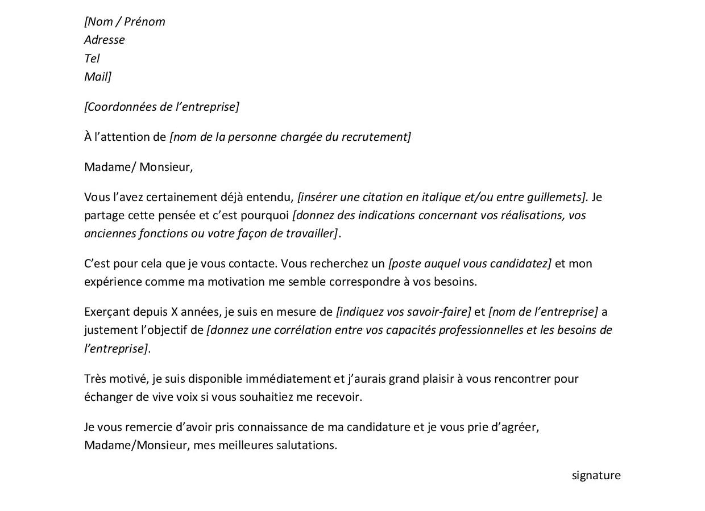

# Constitution du corpus

__Objectifs du chapitre : __


La constitution d'un corpus est la première étape d'un projet NLP. Il se définit d'abord par la constitution d'une collection de textes dont la provenance est la nature peut être diverse. Dans ce chapitre on va examiner plusieurs techniques de collecte.

 * L'exploitation de bases textuelles
 * Les méthodes de scrapping
 * Le recours aux APIs
 * La collection de document pas que textuels
 * Les sources orales

Un corpus reste un échantillon. Dans ce chapitre nous avons appris comment faire la cueillette dans les sources de textes et constituer matériellement un corpus.  Il reste à traiter la question de la représentativité. La collecte doit rester raisonnée.

Les unités de texte. Une unité de texte : un chaine de caractère intégrée dans un document. Celui ci peut être un livre un article, une note, une transcription, 

 * Un document
 * Un ou des auteurs du document
 * Une date
 * Un endroit
 * Un contexte : les unités précedente, et subséquentes. 

Unités de production et de reception, Un texte est produit et puis il est lu, peut-être.Analyser le texte peut se faire dans deux perspectives, celle de la production et celle de la réception. Les corpus doivent être construit en fonction de ce critère. 

Examiner la question de l'engagement dans ce cadre est essentiel, certains acteurs sur un sujet donnée sont amenés à parler plus que les autres et développent un surcroit de voix. la question du biais de selection

Un corpus est un ensemble de documents.  Ils peuvent être courts, les tweets, pas trop long - abstract articles court - long ( article de recherche, ou très long (livres).

La collecte peut se faire d'abord sur des matériaux primaires, numérisé sous forme d'images, et dans lesquels en analysant les pixels on peut reconnaitre un texte. 


## L'exploitation de base de données textuelles

On commence par un exemple simple en utilisant la base europresse. l'objectif est de constituer un fichier de références bibliographiques, exploitable via r. Dans europresse , nous avons fait une recherche sur les articles comprenant le terme " vaccination" dans la presse nationale françaises, constituées de 14 titres. On retient les 150 derniers articles au 16 Juillet.

https://revtools.net/data.html#importing-to-r)

```{r 201, fig.cap='', out.width='80%',caption= "le traitement de la vaccination dans la presse nationale française", fig.asp=1, fig.align='center'}
#library(revtools)
df <- read_bibliography("./data/20210716042105.ris")
head(df,3)
df<-df%>%
  mutate(jour=substring(DA,1,2))

g21<-ggplot(df, aes(x=journal))+
  geom_bar()+
  coord_flip()+labs(x=NULL,y="Fréquence")
g22<-ggplot(df, aes(x=jour))+
  geom_bar()+labs(x=NULL,y="Fréquence")+
  geom_vline(xintercept=12, linetype="dashed", color = "red")

plot_grid(g21, g22, labels = c('A', 'B'), label_size = 12,ncol=1)


```


Prenons l'exemple de factiva

https://github.com/koheiw/newspapers


## Scrapping

De ces deux approches on pourra considérer que la première correspond à un internet sauvage où la collecte d’information se traduit par une technique de chasseurs-cueilleurs, le glanage. Le recours aux APIs est civilisé, ne serait-ce parce qu'on introduit une sorte d’étiquette, des règles de courtoisie, un système de reconnaissance réciproque et d’attribution de droits. 
Le scraping est l’activité qui consiste à moissonner les informations disponibles sur le net en simulant et en automatisant la lecture par un butineur. Elle consiste à construire un robot capable de lire et d’enregistrer les informations disponibles sous forme html puis à les distribuer (parsing) dans des tableaux structurés, selon une stratégie d’exploration du web préalablement définie.
De nombreuses ressources sont disponibles, mais pour en rester à r , le package rvest permet de réaliser des extractions simples mais suffisantes pour de nombreux usages. 

Les caractéristiques clés du scraping :
 * La nécessité de programmer de manière ad hoc, en fonction des spécificités de chaque site. 
 * Des stratégies mécaniques, en boule de neige. 
    

Le langage html est un langage à balise

Les balises sont la cible du scrapping

une application rvest 

https://www.r-bloggers.com/2018/10/first-release-and-update-dates-of-r-packages-statistics/


### des problèmes pratiques, juridiques et éthiques

La pratique du scrapping se heurte à différents problèmes éthiques et juridique. Si elle n'est pas interdite en tant que telle, elle se confronte à différents droits et principes éthiques

En termes pratiques

 * Le risque de deny of service, c’est à dire de saturer ou de parasiter un système et de s’exposer à ses contre-mesures.
 * Le risque d'information parcellaires, tronquées, inexactes qui résultent de ces contre-mesures. Les producteurs développent des stratégies moins naives. L'exemple des pages numérotée par ordre de production auxquels on substitue un nombre au hasard pour annihilier l'information temporelle.

En termes de droits Les conditions légales ne sont pas homogènes et relèvent de différents droits : 

 * de la propriété intellectuelle, 
 * du respect de la vie privée, 
 * du droit de la concurrence. 

Cependant des facilités et tolérances sont souvent accordées quand c’est dans un objectif de recherche et que des précautions minimales d’anonymisation ou de pseudonymisation sont prises, et que les règles de conservation et de destruction des données sont précisées. 
    
En termes éthiques

 * Un principe éthique essentiel dans la recherche, et ailleurs, et de ne pas nuire à la socité dans son ensemble, hors cette technique participe à la “robotisation” du web (plus de 50% du trafic résulterait de la circulation des spiders , scrapers, sniffers et autres bots). 
 * Elle contribue à la complexification du web, et implique une consommation excessive de ressources energétiques.  

### rvest avec r

le package rvest est générique

https://community.rstudio.com/t/scraping-messages-in-forum-using-rvest/27846/2

```{r 202, fig.cap='', out.width='80%', fig.asp=1, fig.align='center', fig.width=9}

library(rvest)

# Scrape thread titles, thread links, authors and number of views

start <- "https://uberzone.fr/threads/si-la-vaccination-devient-obligatoire-vous-feriez-vous-vacciner-ou-changeriez-vous-de-corps-de-metier.17425"

x<-c("/page-2", "/page-3", "/page-4")

for (val in x){
  url<-paste0(start,val)
  h <- read_html(url)

post <- h %>%
  html_nodes(".bbWrapper") %>%
  html_text()%>%
      str_replace_all(pattern = "\t|\r|\n", replacement = "")
post
#authors <- h %>%
#  html_nodes(".username--style2 ") %>%
#  html_text() %>%
#  str_replace_all(pattern = "\t|\r|\n", replacement = "")

# Create master dataset (and scrape messages in each thread in process)

master_data <- 
  tibble(post)
rds_name<-paste0("./data/df_",substr(val,2,6),".rds")
saveRDS(master_data,rds_name)
}

head(master_data)

```


## les API

Les API doivent être considérées comme la voie normale d'accès à l'information, du moins en droit. Elles relèvent du contrat. 

Sur le plan méthodologique elles présentent d'avantage de donner aux requêtes un caractère reproductible , mêmes si les bases visées peuvent varier. Elles asurent une grande fiabilité des données.

L’utilisation d’API lève l'ambiguïté légale qui accompagne le scraping et peut ainsi paraître comme plus "civilisée". Elle nécessite naturellement que le gestionnaire de la base de données fournisse les moyens de s’identifier et de requêter, elle peut avoir l'inconvénient d’être coûteuse quand l’accès est payant, ce qui sera de plus en plus le cas.


### Un tour d'horizon des API

La plus part des grandes plateformes offrent des API plus ou moins ouvertes, examinons-en quelques une pour comprendre plus clairement leur intérêt méthodologique. On va se concentrer sur trois exemples : le firehose de tweeter, l'api de google maps, la Crunchbase.

Twitter n'est pas qu'un réseau social, c'est une gigantesque base de données qui enregistre les engagements et les humeurs de 500 millions d'humains à travers la planète et les centres d'intérêt. Elle permet potentiellement de saisir les opinions à différentes échelles géeographique et temporelle, y compris les plus locales et les plus courtes. Elle a le défaut de souffrir fortement de biais de sélection, le premier étant le biais d'engagement. Les passionnés d'un sujets parlent plus que les autres, une parôle mieux contrôlée. 

Le cas de Google maps est passionnant à plus d'un égard. le premier d'entre eux est que dans l'effort d'indicer chaque objet de la planête, la base de données devient un référentiel universel, plus qu'une représentation intéressée du monde. Quand l'utilisateur communs cherche un chemin optimal, l'analyste de donnée trouve un socle pour ordonner le monde.

La Crunchbase construite par le média Techcrunch repertorie les créations de start-up et les levées de fonds qu'elles ont obtenues. Elle recence les dirigeants, les acquisitions, décrit les business model. 

intégrité des bases de données, universalité des élément, interopérabilité, disponibilité

Les problèmes posés :

 * justesse , précision et représentativité. leur constitution n'est pas aléatoire, leurs couverture reste partielle. 
 * accessibilité, la privatisation du commun. Si pour le chercheur les APIS sont sur un plan de principe une merveille sur un plan plus social elle instaure des inégalités d'accès énormes aux données qui permettent de valoriser la connaissance. Ce mécanisme opère via deux canaux. Le premier est celui de la tarification qui ségrège les chercheurs en fonctions des ressources dont ils disposent. Le second passe par la couverture du champs, les données les plus précises et les plus denses se trouvent dans les régions les plus riches. 
 * des catégorisations peu délibérées
 
### un point de vue plus technique

https://www.dataquest.io/blog/r-api-tutorial/


### Un exemple avec Rtweet

https://cran.r-project.org/web/packages/rtweet/vignettes/intro.html


Plusieurs packages de r permettent d'interroger le firehose ( la bouche d'incendie!) de twitter.

https://www.rdocumentation.org/packages/rtweet/versions/0.7.0

L'authentification ne nécesssite par de clé API, il suffit d'avoir son compte twitter ouvert. Cependant la fonction lookup_coords requiert d'avoir une clé d'api ou google cloud map. Elle permet de selectionner sur un critère géographique. 

https://developer.twitter.com/en/docs/tutorials/getting-started-with-r-and-v2-of-the-twitter-api


```{r 203, fig.cap='', out.width='80%', fig.asp=1, fig.align='center', fig.width=9, eval=FALSE }
#une boucle pour multiplier les hashtag 

x<-c("#getaround","#Uber", "#heetch")

for (val in x) {
  tweets <- search_tweets(val,n=20000,retryonratelimit = TRUE)%>% #geocode = lookup_coords("france")
      mutate(search=val)
  write_rds(tweets,paste0("tweets_",substring(val,2),".rds"))
}

df_blablacar<-readRDS("./data/tweets_blablacar.rds")
df_uber<-readRDS("./data/tweets_uber.rds")
df_heetch<-readRDS("./data/tweets_heetch.rds")

df<-rbind(df_blablacar,df_uber )

ls(df_blablacar)

foo<-df %>% select(account_lang, geo_coords,country_code, country, account_lang,place_name)

```

On laisse le lecteur explorer les différentes fonctionnalités du package. On aime cependant celle-ci qui sample le flux courrant au taux annoncé de 1%. Voici l'extraction de ce qui se dit en france pendant 10 mn (600s). La procédure peut donner une sorte de benchmark auquel on peut comparer une recherche plus spécifique. 


```{r 210, fig.cap='', out.width='80%', fig.asp=1, fig.align='center', fig.width=9, eval=FALSE}


rt <- stream_tweets(lookup_coords("france"), timeout = 600)


```


## La gestion des documents

voir aussi 

https://cran.r-project.org/web/packages/fulltext/fulltext.pdf


### Extraire du texte des pdf

Le package [pdftools](https://ropensci.org/blog/2016/03/01/pdftools-and-jeroen/
) est parfaitement adapté à la tâche. Des fonctions simples extraient différents éléments du pdf :
 * les information relative au document pdf lui-même
 * La liste des polices employées
 * Les attachements
 * La table des matières ( si elle a été encodée)
 * et naturellement le texte dans un ordre de droite à gauche et de ligne à ligne, reconnaissant cependant les retrour chariot, et sauts de lignes.
 
 

Chaque page est contenue dans une ligne. 

```{r 211, fig.cap='', out.width='80%', fig.asp=1, fig.align='center', fig.width=9}
library(pdftools)

info <- pdf_info("./pdf/2021neoliberalismegouverner_Meunier_Esprit.pdf")
info

fonts <- pdf_fonts("./pdf/2021neoliberalismegouverner_Meunier_Esprit.pdf")

files <- pdf_attachments("./pdf/2021neoliberalismegouverner_Meunier_Esprit.pdf")

toc <- pdf_toc("./pdf/2021neoliberalismegouverner_Meunier_Esprit.pdf") #il n'y a pas de table des matière dans ce texte

text <- pdf_text("./pdf/2021neoliberalismegouverner_Meunier_Esprit.pdf")
cat(text[[1]]) # pour afficher le texte de la page 1


```


Il va falloir traiter ce texte en analysant précisément sa composition. Et en définissant une séquence d'opérations logiques qui permette un premier nettoyage du texte. Dans l'exemple on va de plus essayer de respecter la structure en paragraphe du texte.

 * Suprimer haut et bas de pages
 * Supprimer les sauts de ligne
 * Identifier les sauts de paragraphe
 * Enlever les notes de bas de page
 * Corriger l'hyphénation ()
 * regrouper les document en un seul bloc de texte
 * le splitter en autant de paragraphes. 

On va utiliser des fonctions de traitement de chaines de caractère avec Stringret le recours à l'art ( ici simple) des regex auxquels on consacre un développement dans le chapitres X. 


```{r 212, fig.cap='', out.width='80%', fig.asp=1, fig.align='center', fig.width=9}
tex<- as.data.frame(text)
tex[1,]
t_reg<-str_replace(tex$text,"[\\s+].*Meunier[\n]+", " ") # entete droite
## on selectionne tout bloc de texte qui commence par un nombre indéterminée de blanc qui s'achève par n'importe quel caractère répétés mais terimé par la séquence Meunier suivie de sauts de ligne.
t_reg<-str_replace(t_reg,"[\\s+].*gouverner[\n]+", " ") # entete gauche
t_reg<-str_replace_all(t_reg,"[\\s+].*2021[\n]", " ") # bas de page  gauche
t_reg<-str_replace_all(t_reg,"ESPRIT.*[\n]", " ") # bas de page droit

#on marque les paragraphes avec la chaine XXX pour les splitter dans un second temps


t_reg<-str_replace_all(t_reg,"\n\n\n", "XXX") 

# On supprime les saut de ligne en les remplaçant par un espace

t_reg<-str_replace_all(t_reg,"[\n]", " ")

#on enlève les notes de bas de page
t_reg<-str_replace_all(t_reg,"\\d\\s[\\-].*XXX", "XXX")

#on regroupe les pages

t<-paste(unlist(t(t_reg)), collapse=" ")


#on enlève les notes dans le texte

t<-str_replace_all(t,"[A-Z|a-z]+\\d\\s[\\-]", " ")

t<-str_replace_all(t,"\\d\\d\\s[\\-]", " ")

#hyphenation

t<-str_replace_all(t,"[A-Z|a-z]+[\\-]\\s", "")

#pour enlever les espaces excedentaires

t<-str_squish(t)
t

#On découpe en paragraphes
t<- str_split(t, "XXX",simplify = TRUE)
t2<-as.data.frame(t(t))

```


Plus les textes sont standardisés et plus simple est le processus d'importation des pdf. Si l'on souhaite aller plus loin on recommande par exemple https://ropensci.org/blog/2018/12/14/pdftools-20/ pour extraire un tableau. ( à développer en 4 ou 5 lignes avec des références)


### la numérisation et l'OCR

D'immenses archives sont numérisées, ce qui signifie qu'on en a prise une image. L'information est contenu dans les pixels, et l'enjeu est de reconnaitre parmis eux des formes caractéristiques : alphabet, ponctuation à travers de multiples variations. Les plus fortes sont celles manuscrites, mais l'écriture typographique est aussi très variables dans ses formes. C'est un enjeu industriel anciens. La reconnaissance optique des caractère a cependant fait d'immense progrès et atteint des niveau de performance élevé.

Le traitement des adresses a sans doute été le problème principal qui a stimulé les technologies de l'OCR. La qualité du matériaux est essentiel, et s'assurer que les expéditeurs choisissent un modèle conventiel et normé de rédaction de la l'adresse est une condition de leur succcès. La situation idéale ressemble à ceci.


La réalité ressemble souvent à celà


Dans un environnement en science sociale la situation est moins complexe, les documents analysés ne seront le plus souvent pas des documents mansuscrits ( sauf pour les médiévistes), mais le scan de document plus structurés. Par exemple les jpg


Une solution pour r est [tesseract](https://cran.r-project.org/web/packages/tesseract/vignettes/intro.html
). C'est un package qui permet d'accéder au programme du même nom,développé à l'origine Chez Hewlett-Packard Laboratories entre 1985 et 1994, avec quelques modifications supplémentaires apportées en 1996 pour le portage sur Windows, et sur C en 1998.Tesseract a été mis en open Source par HP  En 2005. Et de 2006 à novembre 2018, Google a continué a le développer.Il s'appuie sur des réseaux neuronaux de type LSTM. C'est une petite mais puissante intelligence artificielle qui supporte plus d'une centaine de langues.

Testons-le sans attendre avec le texte suivant. 



https://gabriben.github.io/NLP.html#introduction


```{r 214, fig.cap='', out.width='80%', fig.asp=1, fig.align='center', fig.width=9}

library(tesseract)

#library(magick)#pour pré-traiter l'image et améliorer la reconnaissance

tesseract_download("fra") #pour télécharger le modèle de langage

t1<-Sys.time()
text <- tesseract::ocr("./images/LettreMotivation.jpg", engine = "fra")
t2<-Sys.time()
t<- t2-t1
cat(text)


#tesseract_info() #voir les langues disponibles

```

Pour améliorer la performance qui peut se mesurer au niveau des lettres mais doit surtout l'être au niveau des mots, deux stratégies sont possibles, la première de préprocessing, la seconde de postprocessing avec un mécanisme de détection et de correction d'erreur. 

Le preprocessing consiste à traiter l'image en renforçant les contrastes , en éliminant le bruit, on en rend les pixels mieux digestes pour tesseract. C'est ce à quoi s'attache le pakage magick qui offre un bouquet de fonctions à cette fin. Nous laissons le lecteur le tester seul.

Le post-processing un introduire des mécanismes de correction d'erreurs au niveau des mots.Pour une idée de ce type de développement voir [Gabriel, Yadir, Xiaojie, Mingyu](https://gabriben.github.io/NLP.html)

Naturellement, un paramètre important est la vitesse de traitement des images. Dans un projet complet on peut être amener à traiter des centaines images en boucle. Dans notre exemple la durée est de ```t``` secondes, autrement dit 6 images à la minute ou 360 à l'heure...  


## Les contenus vocaux

La tradition méthodologique de la sociologie est celle de l'entretien, avec toute sorte d'acteur. Elle aboutit à la production de transcriptions, plus ou moins détaillées et précise. Mais des textes

On peut désormais enregistré des réaction par des interfaces vocales. le speech to text est de plus en plus efficace, voir l'API de google.


Il existe déja des package sur r


## Conclusion

Dans ce chapitre nous aurons égratigné des sujets techniques de constitution de corpus en envisageant différents moyens d'acccès

 * Scrapping
 * API
 * Pdf
 * texte dans les images
 * une ouverture à l'oral
 
 On soulignera la technicité
 
 On observera l'étendue des domaines à exploiter.
 
 

