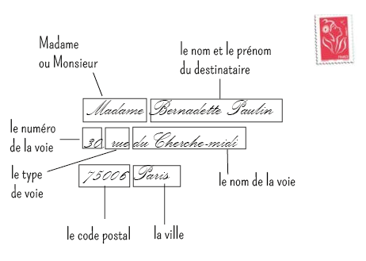

# Constitution du corpus

__Objectifs du chapitre : __ ** explorer différente techniques de collectes de données : exploitation de bases textuelles, méthodes de scrapping, APIS, extraction de document pdf, extration de texte dans des images, et une perspective orale avec les techniques de speech2 tex.**


La constitution du corpus est la première étape d'un projet NLP. Il se définit d'abord par la constitution d'une collection de textes dont la provenance est la nature peut être diverse. Dans ce chapitre on va examiner plusieurs techniques de collecte : 

 * L'exploitation de bases textuelles
 * Les méthodes de scrapping
 * Le recours aux APIs
 * La collection de document pas que textuels
 * Les sources orales

On conclue avec quelques réflexions sur la question de la constitution de l'échantillon.


## L'exploitation de base de données textuelles

On commence par un exemple simple en utilisant la base [Europresse](http://www.europresse.com/fr/). l'objectif est de constituer un fichier de références bibliographiques, exploitable via r. 

Dans Europresse , nous avons fait une recherche sur les articles comprenant le terme " vaccination" dans la presse nationale françaises, constituées de 14 titres. On retient les 150 derniers articles au 16 Juillet 2021.

On utilise [revtools](https://revtools.net/data.html#importing-to-r) pour sa fonction d'importation des fichiers `*.RIS` et de sa transformation en dataframe.  

```{r 201, fig.cap='', out.width='80%',caption= "le traitement de la vaccination dans la presse nationale française", fig.asp=1, fig.align='center'}
#library(revtools)

df <- read_bibliography(iconv("./data/20210719013820.ris"))

flextable(head(df,3))
df<-df%>%
  mutate(jour=substring(DA,1,2))

g22<-ggplot(df, aes(x=jour))+
  geom_bar()+labs(x=NULL,y="Fréquence")+
  geom_vline(xintercept=12, linetype="dashed", color = "red")+
  facet_grid(vars(journal))
g22

#screen_topics() #fonction de digramme interactif 


```


`revtools` n'est pas fait que pour importer des données au format bibliographique .ris, ou au format .bib, et de les transformer un tableau observations/variables. Il a des fonctions de visualisations rapides fort efficaces. La plus spectaculaire est un outil de visualisation qui s'appuie sur deux modèles de détections de topics (ce sujet sera l'objet du chapitre 8), paramétrables de manière interactive en quelques minutes, et conçu avec `shiny`, le package star des graphes interactifs. 

C'est un super outil pour avoir un premier coup d'oeil sur les données de manière interactive. On l'applique sur nos données.  L'allure de l'interface est donnée dans la copie d'écran suivante.


L'interface n'étant pas programmatique, on exporte quelques images en jpeg (un bouton dans l'interface permet de faire celà sans effort) et on les récupère avec `cowplot`, le package qui permet d'assembler des graphes et que nous utiliserons systématiquement dans ce cours. 


```{r 202, fig.cap='', out.width='80%',caption= "Disctribution des topics et des document dans leur espace (ACP)", fig.asp=1, fig.align='center'}
p1 <- ggdraw() + draw_image("./images/topic_espace.png")
p2 <- ggdraw() + draw_image("./images/topic_topic.png")
p3 <- ggdraw() + draw_image("./images/topic1.png")
p4 <- ggdraw() + draw_image("./images/topic5.png")

plot_grid(p1, p2 , ncol=2)

```

Et pour illustrer les graphiques des termes les plus proches du topic 1 et du topic 5. L'un est relatif à l'actualité australienne, l'autre à l'actualité anglaise. 

```{r 203, fig.cap='', out.width='80%',caption= "La description des topic 1 et 5", fig.asp=1, fig.align='center'}

plot_grid(p3, p4 , ncol=1)

```

La méthode est sympa, rapide, sur le pouce, mais pas suffisante pour aller audelà et noatmment comparer les lignes éditoriales des deux titres que nous avons choisis. A ce stade de l'analyse c'est déjà beaucoup.

On peut aller plus loin, et interroger les grandes bases bibliographiques avec [fulltext](https://books.ropensci.org/fulltext/data-sources.html) pour en extraire les références, les résumés ou encore les fulltext. Il faudra cependant obtenir le plus souvent une clé d'API, et surtout faire partie d'une organisation qui en à l'accès ( Universités, Centres de recherches ...). ces bases ne sont pas complètement ouvertes.

## Scrapping

Le scrapping correspond à un internet sauvage où la collecte d’information se traduit par une technique de chasseurs-cueilleurs, le glanage. c'est l’activité qui consiste à moissonner les informations disponibles sur le net en simulant et en automatisant la lecture par un navigateur ( on préfère l'expression des quebecois : des butinuers). 

Elle consiste à construire un robot capable de lire et d’enregistrer les informations disponibles sous forme html puis à les distribuer (parsing) dans des tableaux structurés, selon une stratégie d’exploration du web préalablement définie. En réalité le scrapping pose deux problèmes :

 * celui de la structure de recherche. C'est le problème que relève les spiders, des robots qui recherchent dans les pages des liens, et vont de proche en proche, de lien en lien, pour explorer un domaine.Ils peuvent être plus systématique et prendre avantage de l'organisation d'un site web pour enummérer les pages. 
 * celui de la collecte de l'information sur chacune des pages. Il s'appuie sur le principe que le langage html est un langage à balise où le contenu et le contenant sont clairement séparés. Par exemple,  dans le corps de texte d'une page on définira un titre par la balise <h1> dont l'instruction s'achève par la balise </h1>. On sépare ainsi clairement le contenu de la forme.

`<body>

  <h1>Un titre de niveau 1 (un gros titre)</h1>
    <p>Un paragraphe.</p>

    <h2>Un titre de niveau 2 (un sous titre)</h2>
      <p>Un paragraphe.</p>

      <h3>Un titre de niveau 3 (un sous-sous titre)</h3>
        <p>Etc.</p>

</body>
`

Ultérieurement on pourra définir les propriétés graphiques d'une balise par des CSS. par exemple avec ceci les paragraphes seront publiés en caractère bleu. 

`p{
    color: blue;
}
`

Ce qui nous intéresse n'est pas la décoration, mais le fait que les développeurs définissent des balises spécifiques pour chacun des éléments de leurs page web, et que si nous savons les repérer, nous avons le moyen de mieux lire le texte. Les balises sont la cible du scrapping.

### rvest avec r


Pour scrapper avec r , le package de référence est `rvest` permet de réaliser des extractions simples mais suffisantes pour de nombreux usages. 

une application rvest 

https://www.r-bloggers.com/2018/10/first-release-and-update-dates-of-r-packages-statistics/
```{r 204, fig.cap='', out.width='80%', fig.asp=1, fig.align='center'}
library(rvest)

url = 'https://cran.r-project.org/web/packages/available_packages_by_date.html'

CRANpage <- read_html(url) 
tbls <- html_nodes(CRANpage, "table") # since HTML is in table; no need to scrape td/tr elements
table1 <- html_table(tbls[1], fill = TRUE)
dd <- data.frame(table1[1])

#house cleaning
dd$Date <- as.Date(dd$Date)

library(lubridate)

# updates by year
dd_y <- dd %>%
mutate( PYear= year(Date)) %>%
select (PYear) %>%
group_by(PYear) %>%
summarise(
  nof = n()
)


### simple graph
ggplot(dd_y, aes(x=PYear, y=nof)) +geom_bar(stat="identity") + labs(x = NULL, y = "Nombre de packages par année de dernière mise à jour") +geom_smooth()
```


Voici un deuxième petit exemple qui cible un forum :  [Uberzone](https://community.rstudio.com/t/scraping-messages-in-forum-using-rvest/27846/2)

Ici pour identifier les balises on emploie un utilitaire [selectorgadget](https://rvest.tidyverse.org/articles/selectorgadget.html) qui permet de manière interactive, de selectionner les balises cibles. 


```{r 204b, fig.cap='Distribution des date de révision des packages du CRAN', out.width='80%', fig.asp=1, fig.align='center', fig.width=9}

library(rvest)

# Scrape thread titles, thread links, authors and number of views

start <- "https://uberzone.fr/threads/si-la-vaccination-devient-obligatoire-vous-feriez-vous-vacciner-ou-changeriez-vous-de-corps-de-metier.17425"

x<-c("/page-2", "/page-3", "/page-4")

for (val in x){
  url<-paste0(start,val)
  h <- read_html(url)

post <- h %>%
  html_nodes(".bbWrapper") %>%
  html_text()%>%
      str_replace_all(pattern = "\t|\r|\n", replacement = "")
post
#authors <- h %>%
#  html_nodes(".username--style2 ") %>%
#  html_text() %>%
#  str_replace_all(pattern = "\t|\r|\n", replacement = "")

# Create master dataset (and scrape messages in each thread in process)

master_data <- 
  tibble(post)
rds_name<-paste0("./data/df_",substr(val,2,6),".rds")
saveRDS(master_data,rds_name)
}

flextable(head(master_data,2))

```

### Des problèmes pratiques, juridiques et éthiques

La pratique du scrapping se heurte d'abord à une question technique. ce n'est pas un excercice facile, et il doit être confier à des spécialistes. Il se heurte aussi à différents problèmes d'ordre éthique et juridique. Si la pratique n'est pas interdite en tant que telle, elle se confronte à différents droits et principes éthiques

En termes pratiques, le scrapping crée des risques pour les sites :

 * Le risque de deny of service, c’est à dire de saturer ou de parasiter un système et de s’exposer à ses contre-mesures.
 * Il contribue à la complexification du web, et implique une consommation excessive de ressources energétiques.  

Et des risques pour la qualité dU recueil de données
 
 * Le risque d'information parcellaires, tronquées, inexactes qui résultent de ces contre-mesures. Les producteurs développent des stratégies moins naives. L'exemple des pages numérotée par ordre de production auxquels on substitue un nombre au hasard pour annihilier l'information temporelle.
 * le risque matériel de mal lire les informations, pour des raison d'encodage approximatifs.

En termes de droits même les conditions légales relèvent de différents droits : 

 * De la propriété intellectuelle, 
 * Du respect de la vie privée, 
 * Du droit de la concurrence qui sans l'interdire, condamne la copie laissant espérer qu'une transformation des données fasse qu'il y échappeR. 

Cependant des facilités et tolérances sont souvent accordées quand c’est dans un objectif de recherche et que des précautions minimales d’anonymisation ou de pseudonymisation sont prises, et que les règles de conservation et de destruction des données sont précisées. 
    
En termes éthiques

 * Un principe éthique essentiel dans la recherche, et ailleurs, et de ne pas nuire à la soci2té dans son ensemble, hors cette technique participe à la “robotisation” du web (plus de 50% du trafic résulterait de la circulation des spi.ders , scrapers, sniffers et autres bots, comme dans la forêt une éthique écologique revient à préveler le minimal nécessaire pour l'étude entreprise
 

## les API

Les API doivent être considérées comme la voie normale d'accès à l'information, du moins en droit. Elles relèvent du contrat. Le recours aux APIs est civilisé, ne serait-ce parce qu'on introduit une sorte d’étiquette, des règles de courtoisie, un système de reconnaissance réciproque et d’attribution de droits. 

Sur le plan méthodologique elles présentent d'avantage de donner aux requêtes un caractère reproductible , mêmes si les bases visées peuvent varier. Elles asurent une grande fiabilité des données.

L’utilisation d’API lève l'ambiguïté légale qui accompagne le scraping et peut ainsi paraître comme plus "civilisée". Elle nécessite naturellement que le gestionnaire de la base de données fournisse les moyens de s’identifier et de requêter, elle peut avoir l'inconvénient d’être coûteuse quand l’accès est payant, ce qui sera de plus en plus le cas.


### Un tour d'horizon des API

La plus part des grandes plateformes offrent des API plus ou moins ouvertes, examinons-en quelques une pour comprendre plus clairement leur intérêt méthodologique. On va se concentrer sur trois exemples : le firehose de tweeter, l'api de google maps, la Crunchbase.

Twitter n'est pas qu'un réseau social, c'est une gigantesque base de données qui enregistre les engagements et les humeurs de 500 millions d'humains à travers la planète et les centres d'intérêt. Elle permet potentiellement de saisir les opinions à différentes échelles géeographique et temporelle, y compris les plus locales et les plus courtes. Elle a le défaut de souffrir fortement de biais de sélection, le premier étant le biais d'engagement. Les passionnés d'un sujets parlent plus que les autres, une parôle mieux contrôlée. 

Le cas de Google maps est passionnant à plus d'un égard. le premier d'entre eux est que dans l'effort d'indicer chaque objet de la planête, la base de données devient un référentiel universel, plus qu'une représentation intéressée du monde. Quand l'utilisateur communs cherche un chemin optimal, l'analyste de donnée trouve un socle pour ordonner le monde.

intégrité des bases de données, universalité des élément, interopérabilité, disponibilité

Les problèmes posés :

 * justesse , précision et représentativité. leur constitution n'est pas aléatoire, leurs couverture reste partielle. 
 * accessibilité, la privatisation du commun. Si pour le chercheur les APIS sont sur un plan de principe une merveille sur un plan plus social elle instaure des inégalités d'accès énormes aux données qui permettent de valoriser la connaissance. Ce mécanisme opère via deux canaux. Le premier est celui de la tarification qui ségrège les chercheurs en fonctions des ressources dont ils disposent. Le second passe par la couverture du champs, les données les plus précises et les plus denses se trouvent dans les régions les plus riches. 
 * des catégorisations peu délibérées
 
### un point de vue plus technique

https://www.dataquest.io/blog/r-api-tutorial/


### Un exemple avec Rtweet

https://cran.r-project.org/web/packages/rtweet/vignettes/intro.html


Plusieurs packages de r permettent d'interroger le firehose ( la bouche d'incendie!) de twitter.

https://www.rdocumentation.org/packages/rtweet/versions/0.7.0

L'authentification ne nécesssite par de clé API, il suffit d'avoir son compte twitter ouvert. Cependant la fonction lookup_coords requiert d'avoir une clé d'api ou google cloud map. Elle permet de selectionner sur un critère géographique. 

https://developer.twitter.com/en/docs/tutorials/getting-started-with-r-and-v2-of-the-twitter-api


```{r 205, fig.cap='', out.width='80%', fig.asp=1, fig.align='center', fig.width=9, eval=FALSE }
#une boucle pour multiplier les hashtag 

x<-c("#getaround","#Uber", "#heetch")

for (val in x) {
  tweets <- search_tweets(val,n=20000,retryonratelimit = TRUE)%>% #geocode = lookup_coords("france")
      mutate(search=val)
  write_rds(tweets,paste0("tweets_",substring(val,2),".rds"))
}

df_blablacar<-readRDS("./data/tweets_blablacar.rds")
df_uber<-readRDS("./data/tweets_uber.rds")
df_heetch<-readRDS("./data/tweets_heetch.rds")

df<-rbind(df_blablacar,df_uber )

ls(df_blablacar)

foo<-df %>% select(account_lang, geo_coords,country_code, country, account_lang,place_name)

```

On laisse le lecteur explorer les différentes fonctionnalités du package. On aime cependant celle-ci qui sample le flux courant au taux annoncé de 1%. Voici l'extraction de ce qui se dit en france pendant 10 mn (600s). La procédure peut donner une sorte de benchmark auquel on peut comparer une recherche plus spécifique. 


```{r 206, fig.cap='', out.width='80%', fig.asp=1, fig.align='center', fig.width=9, eval=FALSE}


rt <- stream_tweets(lookup_coords("france"), timeout = 600)


```


### Quelques apis et packages intéressants :

 * le très récent [genius](https://github.com/josiahparry/genius) pour accéder aux lyrics de Genius est à tester pour des études de culture populaires.
 * Google maps
 * La [Crunchbase]() construite par le média Techcrunch repertorie les créations de start-up et les levées de fonds qu'elles ont obtenues. Elle recence les dirigeants, les acquisitions, décrit les business model. 

 
## La gestion des documents

Les documents qui constituent le corpus peuvent se présenter de plusieurs manière. La question de la gestion des format est souvent importante mais laborieuse

### tidy data, json

L'approche tidy data est générique mais est mise en oeuvre parfaitement avec l'universel tidyverse. Tidy, signifie en anglais, propre ou rangé, celà donne l'esprit. Des données propres répondent à des caractéristiques précises

voir : https://r4ds.had.co.nz/tidy-data.html


Il existe trois règles interdépendantes qui permettent de mettre en ordre un ensemble de données :

 * Chaque variable doit avoir sa propre colonne.
 * Chaque observation doit avoir sa propre ligne.
 * Chaque valeur doit avoir sa propre cellule.

Pourquoi s'assurer que vos données sont ordonnées ? Il y a deux avantages principaux :

 * Il y a un avantage général à choisir une façon cohérente de stocker les données. Si vous disposez d'une structure de données cohérente, il est plus facile d'apprendre les outils qui fonctionnent avec elle, car ils ont une uniformité sous-jacente.

 * Il y a un avantage spécifique à placer les variables dans des colonnes car cela permet à la nature vectorielle de R de briller. Comme vous l'avez appris dans les fonctions mutate et summary, la plupart des fonctions R intégrées fonctionnent avec des vecteurs de valeurs. Cela rend la transformation de données ordonnées particulièrement naturelle.

```{r 207, fig.cap='', out.width='80%', fig.asp=1, fig.align='center', fig.width=9, eval=FALSE}
#en attendant
```
Mettez chaque ensemble de données dans un tibble.
Mettez chaque variable dans une colonne.
Dans cet exemple, seul le tableau 1 est ordonné. C'est la seule représentation où chaque colonne est une variable.


c'est le langage général des apis, il répond à une contrainte : dans un champs c'est une liste de valeur qui peut être contenue, On peut avoir ainsi des listes de liste. Prenons un livre, il a un ou plusieurs auteurs, un seul titre, le titre de plusieurs chapitres. Et on souhaite mettre en oeuvre dans un seul format. 

permet de construire des structures aborescentes. 


Jsonlite 

https://cran.r-project.org/web/packages/jsonlite/vignettes/json-aaquickstart.html

voir aussi 

https://paldhous.github.io/NICAR/2019/r-text-analysis.html

http://zevross.com/blog/2015/02/12/using-r-to-download-and-parse-json-an-example-using-data-from-an-open-data-portal/

https://www.r-bloggers.com/2020/09/reading-json-file-from-web-and-preparing-data-for-analysis/


https://cran.r-project.org/web/packages/fulltext/fulltext.pdf


### Extraire du texte des pdf

Le package [pdftools](https://ropensci.org/blog/2016/03/01/pdftools-and-jeroen/
) est parfaitement adapté à la tâche. 

Des fonctions simples extraient différents éléments du pdf :

 * les information relative au document pdf lui-même 
 * La liste des polices employées
 * Les attachements
 * La table des matières ( si elle a été encodée)
 * et naturellement le texte dans un ordre de droite à gauche et de ligne à ligne, reconnaissant cependant les retrour chariot, et sauts de lignes.
 
Chaque page est contenue dans une ligne. On comprendra que l'extraction va nous donner un texte en vrac!

```{r 208, fig.cap='', out.width='80%', fig.asp=1, fig.align='center', fig.width=9}
library(pdftools)

info <- pdf_info("./pdf/2021neoliberalismegouverner_Meunier_Esprit.pdf") #les meta donnée du fichier

fonts <- pdf_fonts("./pdf/2021neoliberalismegouverner_Meunier_Esprit.pdf") # les polices utilisée dans le fichier

files <- pdf_attachments("./pdf/2021neoliberalismegouverner_Meunier_Esprit.pdf") # les attachements

toc <- pdf_toc("./pdf/2021neoliberalismegouverner_Meunier_Esprit.pdf") #il n'y a pas de table des matières dans ce texte
#mais ce pourrait être utile

text <- pdf_text("./pdf/2021neoliberalismegouverner_Meunier_Esprit.pdf") #extraire le texte, avec ses éléments de mise en page

cat(text[[1]]) # pour afficher le texte de la première page


```


Le texte extrait n'est pas directement utilisable, Il va falloir le traiter en analysant précisément sa composition, et en définissant une séquence d'opérations logiques qui permettent un premier nettoyage du texte. Dans l'exemple,  on va de plus essayer de respecter la structure en paragraphes du texte. L'ordre des opérations est le suivant

 * Suprimer haut et bas de pages
 * Supprimer les sauts de ligne
 * Identifier les sauts de paragraphe
 * Enlever les notes de bas de page
 * Corriger l'hyphénation ()
 * Grouper les document en un seul bloc de texte
 * le splitter en autant de paragraphes. 

On va utiliser des fonctions de traitement de chaines de caractère avec Stringret le recours à l'art (ici simple, voire minimal) des regex auxquels on consacre un développement dans le chapitre X. (il va falloir gérer les réferences internes !!!!) 


```{r 209, fig.cap='', out.width='80%', fig.asp=1, fig.align='center', fig.width=9}
tex<- as.data.frame(text)
tex[1,]
t_reg<-str_replace(tex$text,"[\\s+].*Meunier[\n]+", " ") # entete droite : on selectionne tout bloc de texte qui commence par un nombre indéterminée de blanc qui s'achève par n'importe quel caractère répétés mais terminé par la séquence Meunier suivie de sauts de ligne.
t_reg<-str_replace(t_reg,"[\\s+].*gouverner[\n]+", " ") # entete gauche
t_reg<-str_replace_all(t_reg,"[\\s+].*2021[\n]", " ") # bas de page  gauche
t_reg<-str_replace_all(t_reg,"ESPRIT.*[\n]", " ") # bas de page droit

#on marque les paragraphes avec la chaine XXX pour les splitter dans un second temps
t_reg<-str_replace_all(t_reg,"\n\n\n", "XXX") 

# On supprime les saut de ligne en les remplaçant par un espace
t_reg<-str_replace_all(t_reg,"[\n]", " ")

#on enlève les notes de bas de page
t_reg<-str_replace_all(t_reg,"\\d\\s[\\-].*XXX", "XXX")

#on regroupe les pages

t<-paste(unlist(t(t_reg)), collapse=" ")

#on enlève les notes dans le texte

t<-str_replace_all(t,"[A-Z|a-z]+\\d\\s[\\-]", " ")
t<-str_replace_all(t,"\\d\\d\\s[\\-]", " ")

#hyphenation

t<-str_replace_all(t,"[A-Z|a-z]+[\\-]\\s", "")

#pour enlever les espaces excedentaires

t<-str_squish(t)
t

#On découpe en paragraphes
t<- str_split(t, "XXX",simplify = TRUE)
t2<-as.data.frame(t(t))

```


Plus les textes sont standardisés et plus facile est le processus d'importation des pdf. 

Si l'on souhaite aller plus loin on recommande par exemple https://ropensci.org/blog/2018/12/14/pdftools-20/ pour extraire un tableau. ( à développer en 4 ou 5 lignes avec des références)


### la numérisation et l'OCR :  La solution tesseract

D'immenses archives sont numérisées, ce qui signifie qu'on en a prise une image. L'information est contenu dans les pixels, et l'enjeu est de reconnaitre parmis eux des formes caractéristiques : alphabet, ponctuation à travers de multiples variations. Les plus fortes sont celles manuscrites, mais l'écriture typographique est aussi très variables dans ses formes. C'est un enjeu industriel anciens. La reconnaissance optique des caractère a cependant fait d'immense progrès et atteint des niveau de performance élevé.( ref)

Le traitement des adresses a été le problème qui a stimulé le developpement des technologies de la reconnaissance optique de caractères (OCR) ne serait-ce que pour les problèmes de tri postaux ce [petit film](https://www.youtube.com/watch?v=V4LJs2ZoDR4) en donne une très bonne idée. 

La qualité du matériau est essentielle, et s'assurer que les expéditeurs choisissent un modèle conventionnel et standardisé de rédaction de l'adresse est une condition de leur succcès. La situation idéale ressemble à ceci.



Mais la réalité ressemble souvent à celà :


Dans un environnement en sciences sociales la situation est moins complexe, les documents analysés ne seront le plus souvent pas des documents manuscrits (sauf pour les médiévistes), mais le scan de documents plus structurés. Par exemple les jpg


Une solution pour r est [tesseract](https://cran.r-project.org/web/packages/tesseract/vignettes/intro.html
). C'est un package qui permet d'accéder au programme du même nom, développé à l'origine chez Hewlett-Packard Laboratories entre 1985 et 1994, avec quelques modifications supplémentaires apportées en 1996 pour le portage sur Windows, et sur C en 1998.Tesseract a été mis en open Source par HP en 2005. Et de 2006 à novembre 2018, Google a continué a le développer. Il s'appuie sur des réseaux neuronaux de type LSTM (voir chpitre  deep for langage) . C'est une petite mais puissante intelligence artificielle qui supporte plus d'une centaine de langues.

Testons-le sans attendre avec le texte suivant : une lettre de motivation empruntée sur le net. C'est un fichier .jpeg de x ko.


```{r 210, fig.cap='', out.width='80%', fig.asp=1, fig.align='center', fig.width=9}

library(tesseract)

#library(magick)#pour pré-traiter l'image et améliorer la reconnaissance

tesseract_download("fra") #pour télécharger le modèle de langage

t1<-Sys.time()
text <- tesseract::ocr("./images/LettreMotivation.jpg", engine = "fra")
t2<-Sys.time()
t<- t2-t1
cat(text)

#tesseract_info() #voir les langues disponibles

```

Pour améliorer la performance qui peut se mesurer au niveau des lettres mais doit surtout l'être au niveau des mots, deux stratégies sont possibles, la première de préprocessing, la seconde de postprocessing avec un mécanisme de détection et de correction d'erreur. Le preprocessing consiste à traiter l'image en renforçant les contrastes ou en éliminant le bruit, on en rend ainsi nles pixels mieux digestes pour `tesseract`. C'est ce à quoi s'attache le pakage `magick` qui offre un bouquet de fonctions à cette fin. Nous laissons le lecteur le tester par lui-même.

Le post-processing consiste à un introduire des mécanismes de correction d'erreurs au niveau des mots.Pour une idée de ce type de développement voir [Gabriel, Yadir, Xiaojie, Mingyu](https://gabriben.github.io/NLP.html) 

Naturellement, un paramètre important est la vitesse de traitement des images. Dans un projet complet on peut être amener à traiter des centaines images en boucle. Dans notre exemple la durée est de ```r print(t)``` secondes, autrement dit 6 images à la minute ou 360 à l'heure...  

Si le chercheur était face à des document manuscrits, il faudra sans doute se pencher sur des services plus industriels et sans doute des trainings beacoups plus spécifiques. Nous avons tester tesseract sur ce manuscrit, et avouons le , il a été totalement désemparé par la graphie de voltaire.

 


## Les contenus vocaux (speech-to-text)

La tradition méthodologique de la sociologie est celle de l'entretien, avec toute sorte d'acteurs. Elle aboutit à la production de transcriptions, plus ou moins détaillées et précises. Mais généralement opérées manuellement, ce qui est coûteux. Le rêve de tout enquêteur est d'aller du microphone au texte. Il rêve d'un système qui reconnaise la voix, même plusieurs, et puisse retranscrire ce qui se dit de manière plus ou moins structurée : identifier des locuteurs, leur attribuer une parole, noter les silences, les interjection, les borborygmes. 

Dans cette direction les technologies évoluent rapidement dans une direction souhaitable.Google devient un des principaux fournisseur de ces solutions. Elles sont coûteuses. La bonne nouvelle c'est qu'il existe déja des packages sur r qui permettent d'accéder aux solutions de google langage :  [`googleLangageR`](https://cran.r-project.org/web/packages/googleLanguageR/vignettes/setup.html). Ils nécessitent une clé d'API payante. 

Nous ne les avons pas testées, fidèle au principle de n'explorer dans ce manuel que des solutions ouvertes et gratuites.Il aurait été cependant regrettable de ne pas signaler cette perspective. Espérons que vite des solutions open soient proposées.

En évoquant cette voie, profitons en pour signaler une dimension fondamentale du langage. Le texte qui se dit apporte au texte qui se lit une autre dimension, celle de la prosodie dont les éléments clés sont :

 * L’accent
 * Le ton
 * L’intonation
 * La jointure
 * La pause
 * Le rythme
 * Le tempo et le débit
 
 Elle peut être utile pour saisir des éléments paratextuels et plus émotionnels ou pour annoter le texte de ces éléments. 

.https://hal.archives-ouvertes.fr/hal-02181469/document

https://hal.archives-ouvertes.fr/hal-01821214/document


https://rdrr.io/github/usagi5886/intonation/man/intonation.html


https://ips-lmu.github.io/The-EMU-SDMS-Manual/


## Echantillonner les textes

Un corpus reste un échantillon. Dans ce chapitre nous avons appris comment faire la cueillette dans les sources de textes et constituer matériellement un corpus.  Il reste à traiter la question de la représentativité.  

La collecte doit rester raisonnée.

Les unités de texte. Une unité de texte : un chaine de caractères intégrée dans un document. Celui ci peut être un livre un article, une note, une transcription, 

 * Un document
 * Un ou des auteurs du document
 * Une date
 * Un endroit
 * Un contexte : les unités précedentes, et subséquentes. 

Unités de production et de reception, Un texte est produit et puis il est lu, peut-être. Analyser le texte peut se faire dans deux perspectives, celle de la production et celle de la réception. Les corpus doivent être construits en fonction de ce critère. 

Examiner la question de l'engagement dans ce cadre est essentiel, certains acteurs sur un sujet donné sont amenés à parler plus que les autres et développent un surcroit de voix. la question du biais de selection

Un corpus est un ensemble de documents.  Ils peuvent être courts, les tweets par exemples, pas trop long - abstract articles court - long ( article de recherche, ou très longs (livres). 

Le moyen le plus simple d'analyser ce problème est de s'appuyer sur une typologie de méthode d'analyse

 * comparer le discours d 'acteurs distincts
 * examiner les évolutions du discours au cours du temps
 * Analyser un dialogue
 * Etudier une narration
 
### approche intra-discursive.

Un seul auteur, ou groupe d'auteurs et une production discursive relative à une période donnée. Deux grands problèmes d'analyses :

 *  interne : il s'agit identifier des thématiques et la manière dont elles s'articulent.

 * externe : il s'agit de relier les éléments précédents à son environnement. 
 
### approche comparative

L'approche comparative est la plus simple, 


### approche temporelle
 
 Une grande masse de textes se distribue dans le temps : les posts des réseaux sociaux, les dépêches d'agence de presse en sont un autre exemple. Ce type de donnée présente l'avantage que sa fréquence par période permet des mesures précises. 
 


### approche dialogique

Le discours dialogique se produit dès lors que plusieurs locuteurs interagissent. Il se noue dans différente situations

 * chat bot : un agent électronique répond à des questions naturelles.
 * théatre : des acteurs échangent des assertions
 * entretien
 * table ronde
 * ...

### approche narrative


## Conclusion

Dans ce chapitre nous aurons égratigné des sujets techniques de constitution de corpus en envisageant différents moyens d'acccès

 * Scrapping
 * API
 * Pdf
 * texte dans les images
 * une ouverture à l'oral
 
 On soulignera la technicité
 
 On observera l'étendue des domaines à exploiter.
 
 
# Visualiser et réduire le corpus

Maintenant que nous disposons de l'ensemble du corpus, il est intéressant, de s'en donner un aperçu général. On examine ici quelques outils :

 * corpora explorer
 * les fonctions keyness et kwicks
 * text réduction : avec textrank
 


## Explorer le corpus
 
(attention, c'est un chapitre qui doit être par la suite détaché)
 
Avant de procéder aux analyses du corpus, il est souvent utile de le représenter. On va utiliser le package Corpora explore à cette fin. Il permet de préparer un corpus et de le visualiser de manière interactive avec la génération d'une app shiny. Malheureusement nous ne savons pas rendre compte de la dynamique de l'outil. On peut naviguer aisément dans l'ensemble de texte.

On va utiliser une collection de données préparée avec Manel Benzarafa de l'Université Paris Nanterre, et qui comprend l'intégralité des résumés, auteurs etc.. relatifs aux articles publiés par la revue [Politiques et Management] public () PMP. Une base bibliographique intégrale composée de 1025 articles.


```{r 213, fig.cap='', out.width='80%', fig.asp=1, fig.align='center', fig.width=9}
#install.packages("corporaexplorer")
library(corporaexplorer)


PMP <- read_csv("data/PMPLast.csv")

PMP<-PMP %>% 
  select(Key, Author, Title, Issue, 3, 11)
PMP<-PMP%>% rename(Text=6, Annee=5) %>% 
  filter(Text!="Null" & !is.na(Annee))


corpus <- prepare_data(PMP,
    date_based_corpus =FALSE,
    grouping_variable = "Annee",                # change grouping variable
 within_group_identifier = "Title",
 columns_doc_info =
        colnames(df)[1:4],
 tile_length_range = c(2, 10),
    use_matrix = FALSE
)
#explore(corpus) #on n'execute pas car diagramme interactif.


```

Dans la photo d'écran suivante, on teste les termes " politique" et "management". Chaque tuile ( tile) représente un des 1025 abstracts qui composent le corpus. Les couleurs correspondent à la fréquence des deux termes. 


Un autre exemple avec David  Bowie ( Nous aurons l'occasion d'exploiter ces corpus dans les chapitres suivants, alors donnons nous un second panorama de corpus). C'est un corpus constitué par Elisa Benavent pour un mémoire d'histoire contemporaine dans l'idée simple d'étudier comment la novation se définit dans le temps.

```{r 214, fig.cap='', out.width='80%', fig.asp=1, fig.align='center', fig.width=9}
library(tidyverse)
library(shiny)
df <- read_csv("data/bowie_txt_analysis.csv")
df<-df %>% mutate(Annee=substr(date,7,8))%>%
  rename(Text=texte, Data=date)%>%
  filter(!is.na(Text))

library(corporaexplorer)

corpus <- prepare_data(df,
    date_based_corpus =FALSE,
    grouping_variable = "Annee",      # change grouping variable
 within_group_identifier = "titre",
 columns_doc_info =
        colnames(df)[2:3],
 tile_length_range = c(1,4),
    use_matrix = TRUE
)
explore(corpus) #la fonction lance une app interactive
```

## Keyness index

C'est un des outils les plus basiques et fondamentaux. Il est destiné à identifier rapidement les mots clés qui distinguent une partie du corpus des autres parties.


Quanteda fournit une solution https://quanteda.io/reference/textstat_keyness.html avec quanteda statistics. 

https://www.researchgate.net/publication/319208347_Keyness_analysis_Nature_metrics_and_techniques

### quick index


### keyness index

```{r 215, fig.cap='', out.width='80%', fig.asp=1, fig.align='center', fig.width=9}

df$Annee<-as.numeric(df$Annee)


df<-df %>%
  mutate(group=ifelse(Annee >90,"cible","index" ))

corpus <- corpus(df, text_field = "Text")

toks <- tokens(corpus,remove_punct = TRUE, remove_numbers = TRUE)%>% 
    tokens_remove(pattern = stopwords("en"))

dfm<-dfm(toks) 

dfm1 <- dfm_group(dfm, groups = group) 

tstat <- textstat_keyness(dfm1)

foo <- tstat %>% filter(n_target+n_reference>50) %>%
  as.data.frame() %>%
  select(-p)

ft<-flextable(foo) %>%
  theme_vanilla()%>%
  add_footer_lines("La période cible se caractèrise ")
ft <- color(ft, part = "footer", color = "#666666")
ft <- set_caption(ft, caption = "Keyness index ( chi²>10")
ft
ggplot(foo, aes(x=n_target, y=n_reference))+geom_point(aes(size=chi2))+geom_text(aes(label=feature))+
  #scale_y_log10()+
  #scale_x_log10()+
  geom_abline(intercept = 0, slope=1)
```


## Textrank

Quand le corpus de texte est important et que la taille des textes l'est aussi. Par exemple des compte-rendus d'entretiens de trente pages, ou des rapports d'activités d'entreprises, on peut souhaiter les réduire à des documents d'une page dans laquelles les arguments principaux sont résumés. 

Dans le projet d'aller à la découverte du contenu du corpus, un tel outil est un rêve.

Une solution est proposée depuis XXX avec l'algorithme Textrank


