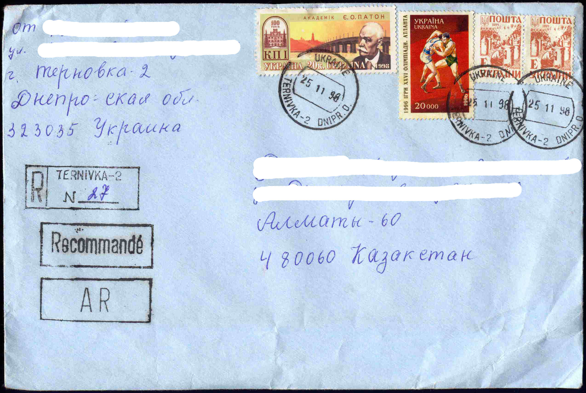
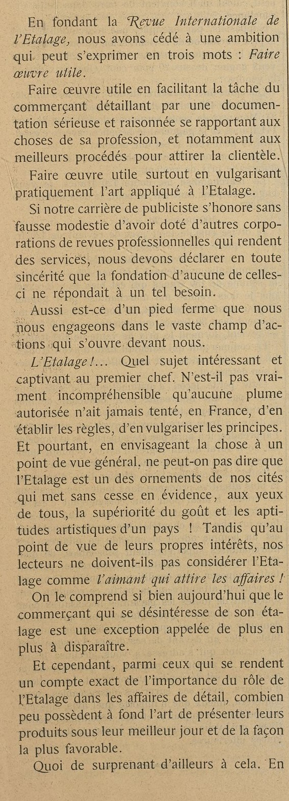

# Constitution du corpus

**Objectifs du chapitre :**

-   <div>

    -   Explorer différentes techniques de collectes de données : exploitation de bases textuelles, méthodes de scrapping, APIs, extraction de document pdf, extraction de textes dans des images, et une perspective oral avec les techniques de speech2tex.

    </div>

La constitution d'un corpus est la première étape d'un projet NLP. Il se définit d'abord par la constitution d'une collection de textes dont la provenance est la nature peut être diverse. Dans ce chapitre on va examiner plusieurs techniques de collecte, puis conclure avec quelques réflexions sur la question de la constitution de l'échantillon.

-   L'exploitation de bases textuelles
-   Les méthodes de scrapping
-   Le recours aux APIs
-   La collection de documents pas uniquement textuelle
-   Les sources orales

## La gestion des documents numériques

Dans certains cas le matériau se présentera sous forme de documents numériques tels qu'un pdf, ou même de simples images.

voir aussi

<https://cran.r-project.org/web/packages/fulltext/fulltext.pdf>

### Extraire du texte des pdf

Le package [pdftools](https://ropensci.org/blog/2016/03/01/pdftools-and-jeroen/) est parfaitement adapté à la tâche. Des fonctions simples extraient différents éléments du pdf :

-   Les information relatives au document pdf lui-même

-   La liste des polices employées

-   Les attachements

-   La table des matières (si elle a été encodée)

-   Les chaînes de caractères constituant le texte dans un ordre de droite à gauche et ligne à ligne, reconnaissant cependant les retours chariot, et autres sauts de lignes séparant les paragraphes

Chaque page est contenue dans une ligne.

```{r 207, fig.cap='', out.width='80%', fig.asp=1, fig.align='center', fig.width=9}
library(pdftools)

info <- pdf_info("./pdf/2021neoliberalismegouverner_Meunier_Esprit.pdf")
info

fonts <- pdf_fonts("./pdf/2021neoliberalismegouverner_Meunier_Esprit.pdf")

files <- pdf_attachments("./pdf/2021neoliberalismegouverner_Meunier_Esprit.pdf")

toc <- pdf_toc("./pdf/2021neoliberalismegouverner_Meunier_Esprit.pdf") #il n'y a pas de table des matière dans ce texte

text <- pdf_text("./pdf/2021neoliberalismegouverner_Meunier_Esprit.pdf")
cat(text[[1]]) # pour afficher le texte de la page 1


```

Il va falloir traiter ce texte en analysant précisément sa composition. Pour ce faire, il s'agîra de définir une séquence d'opérations logiques qui permette un premier nettoyage du texte. Dans l'exemple nous allons de plus essayer de conserver la structure des paragraphes du texte.

-   Suprimer haut et bas de pages
-   Supprimer les sauts de ligne
-   Identifier les sauts de paragraphes
-   Enlever les notes de bas de page
-   Corriger l'hyphénation ()
-   regrouper les document en un seul bloc de texte
-   le splitter en autant de paragraphes.

On va utiliser des fonctions de traitement de chaines de caractère avec Stringret le recours à l'art ( ici simple) des regex auxquels on consacre un développement dans le chapitres X.

```{r 208, fig.cap='', out.width='80%', fig.asp=1, fig.align='center', fig.width=9}
tex<- as.data.frame(text)
tex[1,]
t_reg<-str_replace(tex$text,"[\\s+].*Meunier[\n]+", " ") # entete droite
## on selectionne tout bloc de texte qui commence par un nombre indéterminée de blanc qui s'achève par n'importe quel caractère répétés mais terimé par la séquence Meunier suivie de sauts de ligne.
t_reg<-str_replace(t_reg,"[\\s+].*gouverner[\n]+", " ") # entete gauche
t_reg<-str_replace_all(t_reg,"[\\s+].*2021[\n]", " ") # bas de page  gauche
t_reg<-str_replace_all(t_reg,"ESPRIT.*[\n]", " ") # bas de page droit

#on marque les paragraphes avec la chaine XXX pour les splitter dans un second temps


t_reg<-str_replace_all(t_reg,"\n\n\n", "XXX") 

# On supprime les saut de ligne en les remplaçant par un espace

t_reg<-str_replace_all(t_reg,"[\n]", " ")

#on enlève les notes de bas de page
t_reg<-str_replace_all(t_reg,"\\d\\s[\\-].*XXX", "XXX")

#on regroupe les pages

t<-paste(unlist(t(t_reg)), collapse=" ")


#on enlève les notes dans le texte

t<-str_replace_all(t,"[A-Z|a-z]+\\d\\s[\\-]", " ")

t<-str_replace_all(t,"\\d\\d\\s[\\-]", " ")

#hyphenation

t<-str_replace_all(t,"[A-Z|a-z]+[\\-]\\s", "")

#pour enlever les espaces excedentaires

t<-str_squish(t)
t

#On découpe en paragraphes
t<- str_split(t, "XXX",simplify = TRUE)
t2<-as.data.frame(t(t))

```

Plus les textes sont standardisés et plus simple est le processus d'importation des pdf. Si l'on souhaite aller plus loin on recommande par exemple <https://ropensci.org/blog/2018/12/14/pdftools-20/> pour extraire un tableau. ( à développer en 4 ou 5 lignes avec des références)

### La numérisation et l'OCR

D'immenses archives sont numérisées, ce qui signifie qu'elles sont stockées sous forme d'image. L'information est contenu dans les pixels, et l'enjeu est d'y reconnaitre des formes caractéristiques : alphabet, ponctuation à travers de multiples variations. Les plus fortes sont celles manuscrites, mais l'écriture typographique est aussi très variables dans ses formes. C'est un enjeu industriel ancien. La reconnaissance optique des caractères a cependant fait d'immense progrès et atteint des niveaux de performance élevés.

Le traitement des adresses a sans doute été le problème principal qui a stimulé les technologies de l'OCR. La qualité du matériau est essentiel, et s'assurer que les expéditeurs choisissent un modèle conventiel et normé de rédaction de l'adresse est une condition de leur succcès. La situation idéale ressemble à ceci.


La réalité ressemble souvent à celà



Dans un environnement en science sociale la situation est moins complexe, les documents analysés ne seront le plus souvent pas des documents mansuscrits ( sauf pour les médiévistes), mais un scan de document plus structuré. Par exemple les jpg

Une solution pour R est [tesseract](https://cran.r-project.org/web/packages/tesseract/vignettes/intro.html). C'est un package qui permet d'accéder au programme du même nom, développé à l'origine chez Hewlett-Packard Laboratories entre 1985 et 1994, avec quelques modifications supplémentaires apportées en 1996 pour le portage sur Windows, et sur C en 1998. Tesseract a été mis en open Source par HP, en 2005, puis de 2006 à novembre 2018, a continué d'être développé par Google. Il s'appuie sur des réseaux neuronaux de type LSTM. C'est une petite, mais puissante intelligence artificielle qui supporte plus d'une centaine de langues.

Testons-le sans attendre avec le texte suivant. Extrait du premier article du premier numéro de la revue " Etalages" Publiée en France de 1909 à 1938. L'image est un extrait du document numérisé fournit par la BNF.



<https://gabriben.github.io/NLP.html#introduction>

```{r 209, fig.cap='', out.width='80%', fig.asp=1, fig.align='center', fig.width=9}
#library(tesseract)
tesseract_download("fra") #pour télécharger le modèle de langage

t1<-Sys.time()
text <- tesseract::ocr("./images/N1_avril1909b.jpeg", engine = "fra")
t2<-Sys.time()
t<- t2-t1 #pour compter le temps de calcul
cat(text) #pour afficher le texte avec sa mise en page

#tesseract_info() #voir les langues disponibles
t
```

Pour améliorer la performance qui peut se mesurer au niveau des lettres, mais doit surtout l'être au niveau des mots, deux stratégies sont possibles. La première de préprocessing, la seconde de postprocessing avec un mécanisme de détection et de correction d'erreurs. Le preprocessing consiste à traiter l'image en renforçant les contrastes , en éliminant le bruit, on en rend les pixels mieux digestes pour tesseract. C'est ce à quoi s'attache le pakage magick qui offre un bouquet de fonctions à cette fin. Nous laissons le lecteur le tester seul.

Le post-processing sert à introduire des mécanismes de correction d'erreurs au niveau des mots. Pour une idée de ce type de développement voir [Gabriel, Yadir, Xiaojie, Mingyu](https://gabriben.github.io/NLP.html)

Naturellement, un paramètre important est la vitesse de traitement des images. Dans un projet complet on peut être amener à traiter des centaines images en boucle. Dans notre exemple la durée est de `t` secondes, autrement dit 6 images à la minute ou 360 à l'heure...

### Du speech au texte

La tradition méthodologique de la sociologie est celle de l'entretien, avec toute sorte d'acteurs. Elle aboutit à la production de transcriptions, plus ou moins détaillées et précises. Mais des textes

On peut désormais enregistrer la paroles des interfaces vocales. Le speech to text est de plus en plus efficace, voir l'API de google.

Il existe déja des packages sur R qui permettent d'accéder aux solutions de google langage qui necéssite une clé d'API.

<https://cran.r-project.org/web/packages/googleLanguageR/vignettes/setup.html>

On ne fait qu'entre-ouvrir le sujet, mais il est certainement un des futurs du NLP.

## L'exploitation de base de données textuelles

### le cas europresse

On commence par un exemple simple en utilisant la base [europresse](http://www.europresse.com/fr/). L'objectif est de constituer un fichier de références bibliographiques, exploitable via R.

Dans europresse , nous avons fait une recherche sur les articles comprenant le terme " vaccination" dans la presse nationale françaises, constituées de 14 titres. On retient les 150 derniers articles au 16 Juillet 2021.

On utilise [revtools](https://revtools.net/data.html#importing-to-r) pour sa fonction d'importation des fichiers au format .ris et de transformation en data frame structuré

```{r 201, fig.cap='', out.width='80%',caption= "le traitement de la vaccination dans la presse nationale française", fig.asp=1, fig.align='center'}
library(revtools)


df <- read_bibliography(iconv("./data/20210719013820.ris"))

flextable(head(df,3))
df<-df%>%
  mutate(jour=substring(DA,1,2))

g22<-ggplot(df, aes(x=jour))+
  geom_bar()+labs(x=NULL,y="Fréquence")+
  geom_vline(xintercept=12, linetype="dashed", color = "red")+
  facet_grid(vars(journal))
g22

# screen_topics()


```

`revtools` n'est pas fait que pour importer des données au format bibliographique .ris, ou .bib, et de les transformer un tableau observations - variables. Il a des fonctions de visualisations rapides fort efficaces. La plus spectaculaire est un outil de visualisation conçu avec `shiny`, le package star des graphes interactifs. Il s'appuie sur deux modèles de détections de topics (ce sujet sera l'objet du chapitre 8), paramétrables de manière interactive en quelques minutes.

C'est un outil fantastique pour jeter un premier coup d'oeil sur les données, un plug in très pratique pour une première approche exploratoire.

On l'applique sur nos données. L'allure de l'interface est la suivante.


L'interface n'étant pas programmatique, on exporte quelques images en jpeg (un bouton dans l'interface permet de faire celà sans effort) et on les récupère avec `cowplot`, le package qui permet d'assembler des visualisations et que nous utiliserons systématiquement dans ce cours.

```{r 202, fig.cap='', out.width='80%',caption= "Disctribution des topics et des document dans leur espace (ACP)", fig.asp=1, fig.align='center'}
p1 <- ggdraw() + draw_image("./images/topic_espace.png")
p2 <- ggdraw() + draw_image("./images/topic_topic.png")
p3 <- ggdraw() + draw_image("./images/topic1.png")
p4 <- ggdraw() + draw_image("./images/topic5.png")

plot_grid(p1, p2 , ncol=2)
```

Pour illustrer les graphiques des termes les plus proches du topic 1 et du topic 5. L'un est relatif à l'actualité australienne, l'autre à l'actualité anglaise.

```{r 203, fig.cap='', out.width='80%',caption= "La description des topic 1 et 5", fig.asp=1, fig.align='center'}

plot_grid(p3, p4 , ncol=1)

```

La méthode est sympa, rapide, sur le pouce, mais pas suffisante pour aller au-delà et notamment comparer les lignes éditoriales des deux titres que nous avons choisis. A ce stade préliminaire de l'analyse c'est déjà beaucoup.

### Jouer avec les bases bibliographiques

Fulltext

<https://books.ropensci.org/fulltext/data-sources.html>

## Lire le web : Scrapping

Le scrapping correspond à un internet sauvage où la collecte d'informations se traduit par une technique de chasseurs-cueilleurs, le glanage. C'est l'activité qui consiste à moissonner les informations disponibles sur le net en simulant et en automatisant la lecture par un navigateur ( on préfère l'expression des quebecois : des butineurs).

Elle consiste à construire un robot capable de lire et d'enregistrer les informations disponibles sous forme html puis à les distribuer (parsing) dans des tableaux structurés, selon une stratégie d'exploration du web préalablement définie. En réalité le scrapping pose deux problèmes :

-   Celui de la structure de recherche. C'est le problème que relève les spiders, des robots qui recherchent dans les pages des liens, et vont de proche en proche, de lien en lien, pour explorer un domaine. Ils peuvent être plus systématiques et prendre davantage de l'organisation et structure d'un site web pour énumérer les pages.

-   Celui de la collecte de l'information sur chacune des pages. Il s'appuie sur le principe que le langage html est un langage à balise où le contenu et le contenant sont clairement séparés. Par exemple, dans le corps de texte d'une page on définira un titre par la balise

    <h1>

    dont l'instruction s'achève par la balise

    </h1>

    . On sépare ainsi clairement le contenu de la forme.

\`

<body>

<h1>

Un titre de niveau 1 (un gros titre)

</h1>

    <p>Un paragraphe.</p>

    <h2>Un titre de niveau 2 (un sous titre)</h2>
      <p>Un paragraphe.</p>

      <h3>Un titre de niveau 3 (un sous-sous titre)</h3>
        <p>Etc.</p>

</body>

\`

Ultérieurement on pourra définire les propriétés graphiques d'une balise par des CSS. Par exemple avec ceci, les paragraphes seront publiés en caractère bleu.

`p{     color: blue; }`

Ce qui nous intéresse n'est pas la décoration, mais le fait que les développeurs définissent des balises spécifiques pour chacun des éléments de leurs pages web, et que si nous savons les repérer , nous avons le moyen de mieux lire le texte. Les balises sont la cible du scrapping. Ces dernières peuvent néanmoins être protégées par les développeurs et encapsulées par d'autres langages informatique rendant leur butinage impossible. L'information n'est alors plus contenue dans la balise et le code source d'une page web.

### rvest avec r

De nombreuses ressources sont disponibles, mais pour en rester à R , le package rvest permet de réaliser des extractions simples mais suffisantes pour de nombreux usages.

Une application rvest :

<https://www.r-bloggers.com/2018/10/first-release-and-update-dates-of-r-packages-statistics/>

Le package rvest est générique :

<https://community.rstudio.com/t/scraping-messages-in-forum-using-rvest/27846/2>

```{r 204, fig.cap='', out.width='80%', fig.asp=1, fig.align='center', fig.width=9}

library(rvest)

# Scrape thread titles, thread links, authors and number of views

start <- "https://uberzone.fr/threads/si-la-vaccination-devient-obligatoire-vous-feriez-vous-vacciner-ou-changeriez-vous-de-corps-de-metier.17425"

x<-c("/page-2", "/page-3", "/page-4")

for (val in x){
  url<-paste0(start,val)
  h <- read_html(url)

post <- h %>%
  html_nodes(".bbWrapper") %>%
  html_text()%>%
      str_replace_all(pattern = "\t|\r|\n", replacement = "")
post
#authors <- h %>%
#  html_nodes(".username--style2 ") %>%
#  html_text() %>%
#  str_replace_all(pattern = "\t|\r|\n", replacement = "")

# Create master dataset (and scrape messages in each thread in process)

master_data <- 
  tibble(post)
rds_name<-paste0("./data/df_",substr(val,2,6),".rds")
saveRDS(master_data,rds_name)
}

head(master_data)

```

### Des problèmes pratiques, juridiques et éthiques

La pratique du scrapping se heurte d'abord à une question technique. Ce n'est pas un excercice facile, et il doit être confier à des spécialistes. Il se heurte aussi à différents problèmes d'ordre éthique et juridique. Si la pratique n'est pas interdite en tant que telle, elle se confronte à différents droits et principes éthiques

En termes pratiques, le scrapping crée des risques pour les sites :

-   Le risque de deny of service, c'est à dire de saturer ou de parasiter un système et de s'exposer à ses contre-mesures, comme par exemple, des protections.
-   Il contribue à la complexification du web, et implique une consommation excessive de ressources énergétiques.

Et des risques pour la qualité du recueil de données

-   Le risque d'information parcellaires, tronquées, inexactes qui résultent de ces contre-mesures. Les producteurs développent des stratégies moins naives. L'exemple des pages numérotée par ordre de production auxquels on substitue un nombre au hasard pour annihilier l'information temporelle.
-   Le risque matériel de mal lire les informations, pour des raisons d'encodage approximatifs.

En termes de droits même les conditions légales relèvent de différents droits :

-   De la propriété intellectuelle,
-   Du respect de la vie privée,
-   Du droit de la concurrence qui sans l'interdire, condamne la copie laissant espérer qu'une transformation des données fasse qu'il y échappe.

Cependant des facilités et tolérances sont souvent accordées quand c'est dans un objectif de recherche et que des précautions minimales d'anonymisation ou de pseudonymisation sont prises, que les règles de conservation et de destruction des données sont précisées.

En termes éthiques

-   Un principe éthique essentiel dans la recherche, et ailleurs, et de ne pas nuire à la société dans son ensemble, hors cette technique participe à la "robotisation" du web (plus de 50% du trafic résulterait de la circulation des spiders , scrapers, sniffers et autres bots, comme dans la forêt une éthique écologique revient à préveler le minimal nécessaire pour l'étude entreprise

## L'importance croissante des API

Les API doivent être considérées comme la voie normale d'accès à l'information, du moins en droit. Elles relèvent du contrat. Le recours aux APIs est civilisé, ne serait-ce parce qu'on introduit une sorte d'étiquette, des règles de courtoisie, un système de reconnaissance réciproque et d'attribution de droits.

Sur le plan méthodologique elles présentent l'avantage de donner aux requêtes un caractère reproductible , mêmes si les bases visées peuvent varier. Elles asurent une grande fiabilité des données.

L'utilisation d'API lève l'ambiguïté légale qui accompagne le scraping et peut ainsi paraître comme plus "civilisée". Elle nécessite naturellement que le gestionnaire de la base de données fournisse les moyens de s'identifier et de requêter, elle peut avoir l'inconvénient d'être coûteuse quand l'accès est payant, ce qui sera de plus en plus le cas.

### Un tour d'horizon

La plus part des grandes plateformes offrent des API plus ou moins ouvertes, examinons-en quelques une pour comprendre plus clairement leur intérêt méthodologique. On va se concentrer sur trois exemples : le firehose de tweeter, l'API de google maps, la Crunchbase.

Twitter n'est pas qu'un réseau social, c'est une gigantesque base de données qui enregistre les engagements et les humeurs de 500 millions d'humains à travers la planète et les centres d'intérêts. Elle permet potentiellement de saisir les opinions à différentes échelles géographiques et temporelles, y compris les plus locales et les plus courtes. Elle a le défaut de souffrir fortement de biais de sélection, le premier étant le biais d'engagement. Les passionnés d'un sujet parlent plus que les autres, d'une parole mieux contrôlée.

Le cas de Google maps est passionnant à plus d'un égard. le premier d'entre eux est que dans l'effort d'indicer chaque objet de la planête, la base de données devient un référentiel universel, plus qu'une représentation intéressée du monde. Quand l'utilisateur commun cherche un chemin optimal, l'analyste de données y trouve un socle pour ordonner le monde.

La Crunchbase construite par le média Techcrunch repertorie les créations de start-up et les levées de fonds qu'elles ont obtenues. Elle recense les dirigeants, les acquisitions, décrit les business model.

intégrité des bases de données, universalité des élément, interopérabilité, disponibilité

Les problèmes posés :

-   Justesse , précision et représentativité. Leur constitution n'est pas aléatoire, leurs couvertures restent partielle.
-   Accessibilité, la privatisation du commun. Si pour le chercheur les APIs sont sur un plan de principe une merveille, elles instaurent sur un plan plus social des inégalités d'accès énormes aux données qui permettent de valoriser la connaissance. Ce mécanisme opère via deux canaux. Le premier est celui de la tarification; qui ségrège les chercheurs en fonction des ressources dont ils disposent. Le second passe par la couverture du champ, les données les plus précises et les plus denses se trouvent dans les régions les plus riches.
-   Des catégorisations peu délibérées

### un point de vue plus technique

<https://www.dataquest.io/blog/r-api-tutorial/>

### Un exemple avec Rtweet

<https://cran.r-project.org/web/packages/rtweet/vignettes/intro.html>

Plusieurs packages de R permettent d'interroger le firehose ( la bouche d'incendie!) de twitter.

<https://www.rdocumentation.org/packages/rtweet/versions/0.7.0>

L'authentification ne nécesssite pas de clé d'API, il suffit d'avoir son compte twitter ouvert. Cependant la fonction lookup_coords requiert d'avoir une clé d'API ou google cloud map. Elle permet de sélectionner et conditionner l'extraction sur un critère géographique.

<https://developer.twitter.com/en/docs/tutorials/getting-started-with-r-and-v2-of-the-twitter-api>

```{r 205, fig.cap='', out.width='80%', fig.asp=1, fig.align='center', fig.width=9, eval=FALSE }
#une boucle pour multiplier les hashtag 

x<-c("#getaround","#Uber", "#heetch")

for (val in x) {
  tweets <- search_tweets(val,n=20000,retryonratelimit = TRUE)%>% #geocode = lookup_coords("france")
      mutate(search=val)
  write_rds(tweets,paste0("tweets_",substring(val,2),".rds"))
}

df_blablacar<-readRDS("./data/tweets_blablacar.rds")
df_uber<-readRDS("./data/tweets_uber.rds")
df_heetch<-readRDS("./data/tweets_heetch.rds")

df<-rbind(df_blablacar,df_uber )

ls(df_blablacar)

foo<-df %>% select(account_lang, geo_coords,country_code, country, account_lang,place_name)

```

On laisse le lecteur explorer les différentes fonctionnalités du package. On aime cependant celle-ci qui échantillone le flux courant au taux annoncé de 1%. Voici l'extraction de ce qui se dit en France pendant 10 mn (600s). La procédure peut s'apparenter à une sorte de benchmark auquel on peut comparer une recherche plus spécifique.

```{r 206, fig.cap='', out.width='80%', fig.asp=1, fig.align='center', fig.width=9, eval=FALSE}


rt <- stream_tweets(lookup_coords("france"), timeout = 600)


```

### Un autre exemple

google map serait bien mais leur API fermée, il en faut une ouverte. IMDB ?

## Conclusion

Dans ce chapitre nous aurons égratigné des sujets techniques de constitution de corpus en envisageant différents moyens d'acccès

-   Scrapping
-   API
-   Pdf
-   texte dans les images
-   Une ouverture à l'oral

On soulignera la technicité croissante et spécifique de chacun ces moyens de collecte.

On observera l'étendue des domaines à exploiter.
