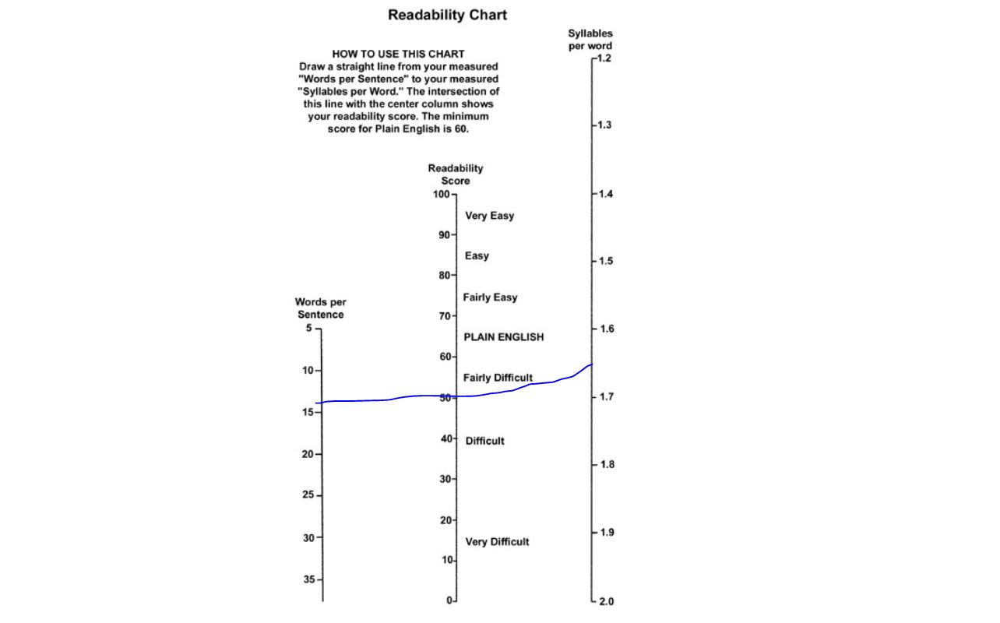

# Une première analyse quantitative

Une première manière d'aborder un texte ou un corpus est volumétrique. Quel volume de texte? Quelle longueur ? Combien de mots ? quelles variations? A cette fin on utilise le cas des tweets de Donald Trump. Des premiers aux derniers, jusqu'au moment de son banissement en Janvier 2021, après sa défaite aux élections présidentielles. Chargeons le fichier de données. 

```{r 601}

df <- read_csv("./data/TrumpTwitterArchive01-08-2021.csv")
nrow<-nrow(df) #nombre de ligne
ncol<-ncol(df) #nombre de colonne

```

## Comptons les mots

Il y `r nrow` tweets et `r ncol` variables. On peut vouloir compter le nombre de mots. A cette fin on emploie une fonction de stringr :  `str_count`. (On reviendra sur la question de la manipulation des chaines de caractères dans un chapitre ad hoc)


```{r 602, fig.cap='Distribution du nombre de mots par post', out.width='80%', fig.asp=.75, fig.align='center'}

df$nb_mots<-str_count(df$text, " ")+1 # l'astuce : compter les espaces et ajouter 1, pour compter les mots
sum_mots<-sum(df$nb_mots)             #ON COMPTE LE NOMBRE DE MOTS
ggplot(df, aes(x=nb_mots))+
  geom_histogram(fill="deepskyblue3")+
  labs(title=paste0("Nombre total de mots du corpus : ",sum_mots), x="Nombre de mots par post", y="Fréquence")

```

La bimodalité provient surement du changement de taille maximum effectué en septembre 2017, le passage de 180 caractères max à 280. On peut le vérifier en examinant cette même distribution - par les courbes de densité - pour chacune des années, avec cette technique rendue fameuse par la pochette de l'album de Joy Division : un graphique en crêtes (ridges plot) avec [ggridges](https://cran.r-project.org/web/packages/ggridges/vignettes/introduction.html).

Le résultat remarquable est que si Trump dans un premier temps exploite cette nouvel fonctionnalité, il en revient avec un phrasé de 20 mots en moyenne, gardant cependant à l'occasion d'autre contenu en 50 mots environ.


```{r 603, fig.cap=' Evolution de la distribution du nombre de mots', out.width='80%', fig.asp=.75, fig.align='center'}

df$Year<-format(df$date, format = "%Y") #on extrait l'année de la date
foo<- df %>% 
  filter(Year!="2021")

  ggplot(foo,aes(x = nb_mots, y = Year, group = Year)) +
  geom_density_ridges(scale = 3, fill="peachpuff")+
  theme_ridges() +
  scale_x_continuous(limits = c(1, 70), expand = c(0, 0)) +
  coord_cartesian(clip = "off")+
    labs(x="Nombre de mots par post", y=NULL)
```

## la production dans le temps

Concluons en examinant le nombre de tweets produit au cours du temps.

La fonction `ts_plot` employée viens de `rtweet` que nous avons employée au chapitre 2. Elle emploie ggplot, et permet de représenter les évolutions selon différentes échelles de temps. On se rapplera qu'après une carrrière immobilière menée dans les casinos, le golf et les hôtels, l'appétit médiatique de trump s'est réalisé dans the apprenctice, de 2004 à 2015. C'est un pro de la TV, il a une formation de popstar. Il sera élu en Décembre 2016 pour prendre le pouvoir en Janvier. 

```{r 604, fig.cap='Evolution de la production mensuelle des tweets de Trump', out.width='80%', fig.asp=.75, fig.align='center'}

## plot time series of tweets
ts_plot( foo, "1 month", color="darkblue", size=1.1) + 
  theme(plot.title = element_text(face = "bold")) + 
  labs( x = NULL, y = "Nombre de tweets par mois",title = "Fréquence des posts twitters Donald Trump")+
  scale_x_datetime(date_breaks = "1 year", labels = scales::label_date_short())

#raf : labeliser avec les dates clés
```


## Lisibilité et complexité lexicale

Pour aller un peu plus loin - nous savons désormais que trump aime une forme courte en 21 mots, et que son expérience de twtitter est longue, on peut s'intéresser à des paramètres clés relatifs aux conditions de la reception: les textes sont-ils aisés à lire ? sont-ils sophistiqués ?

Introduisons deux quantifications utiles du texte : la lisibilité et la complexité lexicale. Ce sont des classiques, les critères initiaux de l'analyse quantitative du texte. Ils sont toujours utiles. 

### Les indices de lisibilité

La lisibilité est une notion aussi ancienne que sa mesure (par exemple @coleman_computer_1975). Elle répond à la question du degré de maitrise requis pour lire un texte en s'appyant sur les caractéristique objective du texte plutôt que sur sa perception. Il s'agissait  donc d'évaluer la complexité d'un texte. Deux critères principaux sont généralement considérés : la complexité des mots capturée par le nombre moyen de syllabes par mot, et la complexité des phrases mesurée par le nombre de mots. 

Le nombre d'indicateurs est considérable et le package compagnon de quanteda , [`quanteda.textstats`](https://quanteda.io/reference/textstat_readability.html) , en fournit des dizaines. Dans l'exemple suivant, on se contente d'un grand classique, le plus ancien, l'indice de Flesch [@flesch_new_1948] et de ses constituants: le nombre moyen de syllabes par mot et le nombre moyen de mots par phrase.  

```{r 605, fig.cap='Evolution de la lisibilité moyenne des tweets de Trump', out.width='80%', fig.asp=.75, fig.align='center'}

foo<-df %>% filter(isRetweet==FALSE) # on ne prend pas en compte les RT

readability<-textstat_readability(foo$text, measure = c("Flesch","meanSentenceLength", "meanWordSyllables"),
                                  min_sentence_length = 3,max_sentence_length = 1000) #la fonction de calcul de lisibilité

foo<-cbind(foo,readability[,2:4])
foo1<-foo %>% 
  group_by(Year) %>%
  summarise(Flesch=mean(Flesch, na.rm=TRUE), 
            SentenceLength= mean(meanSentenceLength, na.rm=TRUE),
            WordSyllables= mean(meanWordSyllables, na.rm=TRUE)) %>%
  gather(variable, value, -Year)

ggplot(foo1,aes(x=Year, y=value, group=variable))+
  geom_line(size=1.2, aes(color=variable), stat="identity")+
  facet_wrap(vars(variable), scale="free", ncol=1)+
  labs(title = "Evolution de la lisibilité des tweets de Trump", x=NULL, y=NULL)
```

Pour aider le lecteur à donner un sens, voici l'abaque proposée par [Flesch](http://www.appstate.edu/~steelekm/classes/psy2664/Flesch.htm) lui-même. 




On peut aussi prendre pour références les éléments suivants: "All Plain English examples in this book score at least 60. Here are the scores of some reading materials I've tested. These are average scores of random samples." ( source ?)

Comics                      92
Consumer ads in magazines   82
Reader's Digest             65
Time                        52
Wall Street Journal         43
Harvard Business Review     43
Harvard Law Review          32
Auto insurance policy       10

Trump ne parait pas être sa caricature, non niveau de lisibilité correspond à la Licence. Reader's Digest est beaucoup plus simple, il se situe au dessus de la Harvard Business Review !  

### Les indices de complexité lexicale

La complexité lexicale rend compte de la diversité du vocabulaire, elle consiste à rapporter le nombre de mot uniques sur le nombre total de mots. La difficulté est que la taille des corpus joue fortement sur cette mesure et que lorsque cette taille est hétérogène, l'indicateur marque plus cette variété que les variations de complexité lexicale.[@tweedie_how_1998] 

Dans notre univers trumpesque, ce n'est pas trop sensible, d'autant plus que nous allons moyenner les tweets par période.Notons au passage que si nous moyennons la diversité lexicale de chaque tweet, une autre approche pourrait être de concatener l'ensemble des tweets d'une période (un jour, une semaine) pour approcher cette variable à une autre échelle, qui couvre l'ensemble des sujets d'intérêt de trump, que les tweets fractionnent nécessairement. Ce qui en en question dans la mise en pratique n'est pas seulement la question du choix de l'indice mais aussi la définition de l'unité de calcul. La diversité lexicale concerne sans doute plus le discours que la phrase. 

On poursuite avec quanteda https://quanteda.io/reference/textstat_lexdiv.html

On choisit de ne travailler sur deux des multiples indicateurs disponibles : 

 * le CTTR de caroll qui rapporte le nombre de mots distincts ( V) sur le nombre de mots exprimés. Avec ce critère la diversité maximale est obtenue quand le nombre de mot différents est égal au nombre de mots exprimés. 

$$
CTTR = \frac{V}{\sqrt{2N}}
$$

 * le Mass supposé être moins sensible à la longueur des textes. (voir Torruella et Capsada 2013 ou )

$$
M = \frac{log(n) - log(t)}{log² (n)}
$$

 * Le problème de la longueur de text a confuit à des approches segmentées, où la mesure de diversité est une moyenne des moyenne pour chacun des segments. On emploie ici le MATTR, dont le MA signifie moyenne mobile (moving average), et le TTR le token/type ratio.

Pour la mise en oeuvre on passe par quanteda. 

( attention un pb de log dans le calcul)

```{r 607, fig.cap='Evolution de la diversité lexicale des tweets de Trump', out.width='80%', fig.asp=.75, fig.align='center'}
#on retient les tweets de plus de 5 mots
foo<-foo %>%filter(nb_mots>5)

#la fonction de calcul de diversité
t1=Sys.time()
lexdiv<-tokens(foo$text)%>%
  textstat_lexdiv(foo$text, measure = c("CTTR", "Maas"),  log.base = 10,
                  remove_numbers = TRUE,  
                  remove_punct = TRUE,  
                  remove_symbols = TRUE,
                  remove_hyphens = TRUE) 
t2=Sys.time()
t<- t2-t1
t
#On combine les données et on aggrège sur l'année
foo<-cbind(foo,lexdiv[,2:3])
foo1<-foo %>% 
  group_by(Year) %>%
  summarise(CTTR=mean(CTTR, na.rm=TRUE), 
            Maas=mean(Maas, na.rm=TRUE)) %>%
  gather(variable, value, -Year)

ggplot(foo1,aes(x=Year, y=value, group=variable))+
  geom_line(size=1.2, aes(color=variable), stat="identity")+
  facet_wrap(vars(variable), scale="free", ncol=1)+
  labs(title = "Evolution de la diversité lexicale des tweets de Trump", x=NULL, y=NULL)
```

## Comptons les mots

Il est temps de compter les mots, chacun d'entre eux, de se faire une idée une idée de leurs fréquences, de leur distribution. 

Souvent on éliminera ceux qui apparaissent de manière occasionnelle, mais aussi ceux qui apparaissent systématiquement dans tous les textes. Une fois ces deux filtrages effectués, le lexique est généralement de l'ordre de 500 à 10000 mots. 

Deux outils sont disponibles: les nuages de mots et les lollyplots. Les premiers donnent une idée immédiates, les seconds se prêtent mieux à une analyse systématique

### Les nuages de mots

Ils sont devenus extrêmement populaires même si l'effet esthétique est plus important que leur utilité analytique.


[`ggwordcloud`](https://cran.r-project.org/web/packages/ggwordcloud/vignettes/ggwordcloud.html)

Pour l'application on prépare les données avec quanteda : on tokenise et on construit le dfm ( pour le détail voir chapitre tokenization), ce qui nous permets notamment d'éliminer la ponctuation et les mots courants (articles, déterminant etc) qui apportent peu de signification. 


```{r 608, fig.cap='Nuage de mots - Trump 2016, 2018, 2020', out.width='80%', fig.asp=.75, fig.align='center'}

foo<-df %>% filter(isRetweet==FALSE) %>%
  filter( Year %in% c("2016","2018","2020"))# on ne prend pas en compte les RT

toks<- tokens(foo$text) %>% 
  dfm(remove_punct = TRUE,  remove = stopwords("english"))

docvars(toks,"Year")<-foo$Year

toks

#on se concentre du les termes utilisés 300 fois.  

foo<-toks %>% 
    dfm_trim(min_termfreq = 300, verbose = FALSE)

freq <- textstat_frequency(foo)


library(ggwordcloud)
ggplot(freq, aes(label = feature)) +
  geom_text_wordcloud(aes(size=frequency, color=rank)) +
  theme_minimal() +  scale_size_area(max_size = 10) + 
  scale_color_gradient(low = "darkblue", high = "red")

ggsave("./Images/g0.jpg", plot=last_plot(), width = 27, height = 19, units = "cm")


```

Et pour faire des comparaisons, entre l'année 2016 qui le conduit à être élu, 2018 une année de mid term et 2020 année de sa défaite, on utilise la même procédure mais on distingue un comptage de fréquence de mot par période. Le ggplot est identique aux précédents mais comprend en plus une géométrie "facet_wrap" qui éclate le nuages de mot selon les 3 périodes étudiées.


```{r 609, fig.cap='Nuage de mots - Trump 2016, 2018, 2020', out.width='80%', fig.asp=.75, fig.align='center'}


foo<-toks %>% 
  dfm_group(groups = Year) %>%
    dfm_trim(min_termfreq = 250, verbose = FALSE)

#pour compter la fréquence des mots par année
freq <- textstat_frequency(foo, group =Year)

set.seed(42)
library(ggwordcloud)
ggplot(freq, aes(label = feature)) +
  geom_text_wordcloud(aes(size=frequency, color=rank)) +
  theme_minimal()+facet_wrap(vars(group)) +  scale_size_area(max_size = 10) + 
  scale_color_gradient(low = "darkblue", high = "red")


ggsave("./Images/g1.jpg", plot=last_plot(), width = 27, height = 19, units = "cm")

```

### Des lollyplots

Plus utile sont des diagrammes d'un format loliplot qui quantifie de manière plus précise la fréquence des termes.

la notion de densité, quelle échelle? 

### La mesure de la concentration des termes


https://www.tidytextmining.com/tfidf.html


Le langage d'un point de vue quantitatif a été caractérisé depuis bien longtemps et zipf est un des premier à avoir proposé la loi de distribution qui porte son nom mais aussi celle de mandelbrot qui en a proposé un affinement. 

Celle-ci s'exprime de la manière suivante : si on classe les termes par ordre de fréquence r

$$f(r)=\frac{K}{r} $$
Mandelbrot la généralise

les études empiriques

On peut encore débattre de sa signification. Une économie cognitive? Une conséquence de la théorie de l'information ? Un signature pour identifier un discours

Zipf distribution 1949

On reprend la procédure de comptage des mots par groupe, mais sans filtrer sur la fréquence de ces mots. On en obtient  ```n_w``` mots distincts. 
En examinant avec plus de détail il y a 5 élément d'information  : a ) le trait ( feature), c'est à dire ici le mot étudié, 2) le nombre de fois où il apparait dans le corpus, 3)le rank qui lui correspond, 4)le nombre de document dans lesquel il apparait, et enfin 5) la période du corpus. 


```{r 611, fig.cap=' ', out.width='80%', fig.asp=.75, fig.align='center'}
foo<-toks

freq <- textstat_frequency(foo)

freq <- textstat_frequency(foo, group =Year)
head(freq)
n_w<-dim(freq)
#ft<-flextable(head(freq)) ## pb affichage


freq<-freq %>% 
  group_by(group)%>%
  mutate(rank_rel=rank/max(rank), #on normalise le classement de 0 , mauvais classement à 1, bon classement. 
         freq_prop=frequency/sum(frequency),
         freq_density=docfreq/sum(docfreq))

ggplot(freq, aes(x=rank_rel, fill = group)) +
  geom_histogram(show.legend = FALSE, binwidth = 0.05) +
  facet_wrap(~group, ncol = 3, scales = "fixed")


ggplot(freq, aes(x=freq_prop, fill = group)) +
  geom_histogram(show.legend = FALSE, binwidth = 0.0001) +
  facet_wrap(~group, ncol = 3, scales = "fixed")+ scale_y_log10()


g<-freq %>% 
  ggplot(aes(rank_rel, freq_prop,color = group)) + 
  geom_line(size = 1, alpha = 1, show.legend = FALSE) + 
  scale_y_log10()+  geom_smooth(method="lm", alpha=0.5, color="grey80")+ scale_x_continuous(labels = scales::percent_format(accuracy = 1))
g


```

On essaye d'ajuster avec deux fonctions linéaires, et on s'aperçoit de suite que l'ajustement est largement meilleure. Une première loi régit les 3000 mots les plus fréquents, une autre, beaucoup plus pentue régit les mots les moins fréquents, essentiellement ce qui n'apparaissent qu'une seul fois. 


```{r 612, fig.cap=' ', out.width='80%', fig.asp=.75, fig.align='center'}
#on coup à .1 car c'est là où se trouve le " coude"

foo1<-freq %>%
  filter(rank_rel<0.1)


fit1<- lm(log10(freq_prop+0.0001)~log10(rank_rel+0.0000001),data= foo1)
a<-fit1$coefficients
g<-g+ geom_abline(intercept=a[1], slope=a[2], color="grey80")
g

foo2<-freq %>%
  filter(rank_rel>0.09999999)


fit2<- lm(log10(freq_prop+0.0000001)~log10(rank_rel+0.0000001),data= foo2)
b<-fit2$coefficients
g<-g+ geom_abline(intercept=b[1], slope=b[2], color="grey80")
g
```


## Conclusion

Nous aurons appris à 

 * Compter le nombre de documents et leurs longueurs
 * Mesurer la complexité du langage
 * Mesurer la diversité de son vocabulaire.
 * A évaluer la concentration des sources
 * A se donner une première idée de la lexicographie
 

Ces mesures n'ont ne sens que si elles peuvent être l'objet de comparaison :

 * De manière interne la comparaison se fait dans dans le temps et à travers des segments. On s'intéresse moins au niveau, qu'aux différences entre les niveaux.
 * De manière externe elle requiert un étalonnage. Comparer par rapport au français courant, à un niveau de langue soutenu, ou relâché. L'étalonnage revient à caractériser des types de corpus : presses, écriture savante, réseaux sociaux, publications officielles etc. On ne peut que souhaiter que des comparaisons systèmatiques soient engagées et compilées pour donner des points de repère précis quand on étudie un corpus particulier. 
 
Elles participent à un premier niveau d'analyse du texte, en surface, visant à apprécier la dynamique de sa production, à établir les échelles d'analyse, à repérer les éléments structurels.

Le texte est une matière qui a un poids (le nombre de mot), une variété (le nombre d'expressions), une complexité (les règles qui l'organisent). nous venons de nous doter des premiers outils d'analyse, il est temps de passer à la suite. 
 

