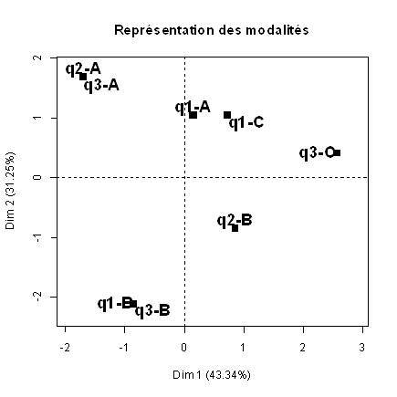
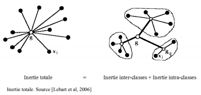

# Le retour des méthodes factorielles

## *Objectifs du chapitre*

L'objectif de cette partie est de revenir sur des méthodes traditionnelles mais toujours efficace d'analyse lexicale souvent combiné à des méthode de classification. 

comprendre le fonctionnement des différentes techniques de réduction de grands ensembles de données. Leur principe reste de réussir à exprimer sous forme de facteur(s), un ou plusieurs concepts non observés, latents, ou d'intérêt. Ces méthodes de calculs feront l'objet d'une description générale, abordant les sous-bassements statistiques utilisées dans un cas pratique avec un dataset de tweets obtenu par rtweet ( voir chapitre 3).

Trois algorithmes utilisés en analyse factorielle seront abordés :

-   Analyse par Composante Principale (PCA)
-   Analyse Factorielle des Correspondances (AFC)
-   La Classification Hiérarchique (CHA/CHD)
-   Introduction à Reinette
-   Introduction à Wordfish

## Les outils

Les packages permettant de mener les analyses ci-dessous sont [`FactoMineR`](https://cran.r-project.org/web/packages/FactoMineR/index.html) et [`factoextra`](https://cran.r-project.org/web/packages/factoextra/index.html). Les heat map utilisées pour parvenir au clustering de l'analyse des correspondances sont issues du package [`NMF`](https://cran.r-project.org/web/packages/NMF/index.html) ou encore [`quanteda`](https://cran.r-project.org/web/packages/quanteda/index.html)

## Introduction

Si les méthodes factorielles ont été développées dès 1904 par le psychologue Charles Spearman pour comprendre comment les variables dans une ambition plus confirmatoire et hiérarchique, les méthodes factorielles se sont popularisées sous les travaux de Benzecri, permettant un élargissement de son usage. [@beaudouin2016]

Elles se sont progressivement diluées dans la "boîte à outils" des différentes disciplines académiques. Ces principes de fonctionnement et autres calculs originels ont été confrontés à diverses sources et structures de données, que notre environnement de plus en plus numérique à amener à générer. @benzecri2006



L'interaction avec ces interfaces mathématiques sont aujourd'hui largement informatisées, et le travail de l'analyste se complète également par le devoir de savoir expliciter ces "sorties logicielles".

## Méthodes & Données

### Principes généraux

L'idée essentielle est qu'un objet peut-être décrit par un ensemble d'attributs observables et en ce sens, mesurables. Des relations peuvent exister entre les $p$ variables précitées, entre chaque individu $n$ observé, dans une base de données.


Mathématiquement parlant, le développement accru des travaux de recherche repose sur des questions comme :

-   Le caractère unique ou multiple des facteurs / concepts sous jacents que l'on souhaite utiliser pour résumer les données, ou bien encore sur les modalités de calculs, liéaires ou non, des combinaisons factorielles souhaitées.[@fodor2002a] Les Lois de distribution utilisées pour approcher ces différentes sources de données diffèrent et sont à l'origine de la diversification des algorithmes. [@buntine2002]

L'idée principale est de trouver $k$ combinaisons linéaires des $p$ variables qui capturent succéssivement une part maximale de la variance, ce qui minimise réciproquement l'écart total d'erreurs, d'un effectif $n$ d'observations, tel que $k << p$. Cette mécanique de synthèse repose sur le théorème de la Décomposition en Valeurs Singulières des matrices (SVD), tels que pour toute $X_{(n,p)}$ :


$$
X=\mathbf{U}\mathbf{D} \mathbf{V}^\top 
$$

$U_{n}$ Une matrice carrée tel que : $U=n$ x $n$ ; $v=p$ x $p$ et ; $D$ de dimensions $k$ x $k$, dont la diagonale $D_{(i,i)}$ comporte les valeurs des *eigenvectors* $\lambda_{n}$ calculés par les algorithmes factoriels.

Dans le domaine de l'analyse d'éléments textuels ce tableau correspond au *document-term-matrix* (dtm) et *document-feature-matrix* (dfm), où les "individus" sont alors considérés en tant que *documents* (tweets, reviews, litteratures...) auxquels nous rattachons en colonne, les termes, afin d'en compter chaque occurence.

### Données

Nous avons scrappé via le package `rtweets` un ensemble de 4 hashtags : javascript, Cobol, Python, Java, selon les méthodologies robustes de construction de corpus déjà éprouvées[@balech2019]

> On peut supposer a priori que les communications autour des langages de programmation soient similaires et uniformes, dans une première proposition relevant du marketing des technologies N/TIC.[@benavent]


```{r 1102, out.width='80%', fig.asp=.75, fig.align='center'}
###LECTURE DES FICHIERS
df <- readRDS("data/Data_info.rds")
df <-df %>% mutate(filtre =ifelse(str_detect(text,"cocaine|shit"), 1, 0))
table(df$filtre)
df<-df%>% filter(filtre==0)
```

{width="175"}

La répartition des tweets primaires pour chaque langage varie de 70% à 15%. Cette première observation peut justifier que l'on souhaite étudier plus en détails le rôles de certaines variables dans les effets de diffusion.

Une première idée est que les communautés et les modes d'apparitions de ces langages étudiés sur Twitter semblent, sur l'échantillon donné, singuliers.

## Analyse par Composantes Principales (ACP/PCA)

L'ACP et ses dérivées appliquées à des données de comptage comme l'AFCM sous l'influence de J. Benzecri, ont longtemps étés les méthodes "reines", et restent aujourd'hui, toujours les plus fréquemment utilisées.

Historiquement elle a été développée pour analyser des matrices de corrélations multiples où, $X$ est une matrice de $n$ d'individus et $p$ de variables suivant une loi de distribution Gausienne.

Notre travail ici est donc de chercher à savoir si les caractéristiques des comptes (Nombres de Tweets,followers,posts,Maturité,amis,Caractères produits) traduisent une éventuelle présence différenciée.

On sélectionne un sous ensemble de données quantitatives et l'on calcule volontairement ici deux nouvelles variables dépendantes : le volume total de caractères produit sur la plateforme pour un internaute ainsi que la somme de ses tweets.

```{r 1103, fig.cap='Données quantitatives pour ACP', out.width='80%', fig.asp=.75, fig.align='center'}
###On crée un sous ensemble de données quantitatives, que l'on regroupe par Marque et Screen name
df_pca <- df %>%
  select(Marque,screen_name,DureeV,retweet_count,followers_count,friends_count,statuses_count,display_text_width)
df_pca$score <- 1

###On Crée deux nouvelles variables naturellement auto-corrélées : Total de caractère et total tweets sur la période.
df_pca <- df_pca%>%
  group_by(Marque,screen_name)%>%
  summarise(DureeV,followers_count,friends_count,statuses_count,Totalcr=sum(display_text_width),Totaltwt=sum(score),retweet_count)

foo <- flextable(df_pca[sample(nrow(df_pca), 20), ])
foo <- add_footer_lines(foo, "Exemple de 20 lignes échantillonnées au hasard")
foo
```

Nous nous concentrons sur la population de comptes ayant produit des tweets retweetés au moins 19 fois. Cela représente un tableau de 2975 individus. On signale à l'ACP que la première colonne est qualitative afin qu'elle soit prise en compte dans les calculs

```{r 1104, fig.cap='Pourcentage de variance exprimée par les dimensions', out.width='80%', fig.asp=.75, fig.align='center'}
###MODEL PCA
df_pca_uf <- df_pca#%>%filter(retweet_count>0)
df_pca_uf$Marque <- as.factor(df_pca_uf$Marque)
###On execute le modèle
res.pca <- PCA(df_pca_uf,quali.sup = 1:2,scale.unit = TRUE, graph = FALSE,ncp =7)

###Pour les corrplot
var <- get_pca_var(res.pca = res.pca)

###Extraction des variances exprimées
fviz_eig(res.pca, 
         addlabels = TRUE, 
         ylim = c(0, 40),
         main = "Pourcentage de variance exprimée selon k dimensions",
         xlab = "K dimensions",
         ylab = "% de variance")
```

Sur cette représentation l'on voit que la somme des variances reste toujours égale à 100 %, lorsque $k=p$.

L'intérêt est donc de savoir quels facteurs extraire. L'on souhaite donc voir plus en détails leurs évolutions au sein de l'échantillon. On décide de réaliser des matrices de covariance, corrélation et contribution.

```{r 1105, fig.cap='Directions, Corrélations et Contribution des Variables aux dimensions', out.width='80%', fig.asp=.75, fig.align='center'}
par(mfrow=c(1,3))
corrplot(var$cos2, is.corr=FALSE,order = "hclust",sig.level = 0.01,insig = "blank")
corrplot(var$cor, is.corr=TRUE,order = "hclust",sig.level = 0.01,insig = "blank")
corrplot(var$contrib, is.corr=FALSE,order = "hclust",sig.level = 0.01,insig = "blank")

```

```{r 1106,fig.cap='Représenter les variables', out.width='80%', fig.asp=.75, fig.align='center'}
my.cont.var <- rnorm (7)
my.cont.var.fact <- as.factor(my.cont.var)
fviz_pca_var(res.pca,
             col.var = my.cont.var,
             gradient.cols = c("#00AFBB", "#E7B800", "#FC4E07"),
             title="Représenter l'influence des colonnes aux deux premières dimensions",
             legend.title="Contrib"
             )
```

Les contributions des $p$ variables aux $k$ dimensions factorielles sont différenciées. A première vue, les deux variables auto-corrélées sont bien co-évolutives et presque orthogonales aux autres variables du set. On se concentre alors sur la ventilation des $n$ individus.

```{r 1107,fig.cap='Représenter les individus', out.width='80%', fig.asp=.75, fig.align='center'}
my.cont.var <- rnorm (7)
my.cont.var.fact <- as.factor(my.cont.var)

fviz_pca_ind(res.pca,
             geom.ind = "point", # Montre les points seulement (mais pas le "text")
             col.ind = df_pca_uf$Marque, # colorer by groups
             palette = c("Dark2"),
             addEllipses = TRUE, # Ellipses de concentration
             legend.title = "Langages",
             title="Représenter une population de n individus par rapport aux deux premières dimensions" 
             )

```

Quatre populations émergent mais restent très inégales dans leurs effectifs. En effet, les comptes mentionnant "cobol" sont nettement plus réduits.On représente alors le couple variables/individus ensemble :

```{r 1108, fig.cap='Représenter les individus et variables', out.width='80%', fig.asp=.75, fig.align='center'}

fviz_pca_biplot(res.pca,label = "var",
                addEllipses=TRUE,
                ellipse.level=0.95,
                ggtheme = theme_minimal(),
                col.var = my.cont.var.fact,
                title = "Individus & Dimensions",
                legend.title="Coefs.Liné")

```

Les coefficients ici visualisés peuvent être utilisés dans un modèle confirmatoire en tant que coefficients $\alpha_{ii}$ de régression. Ce sont les éléments présentés par ordre décroissant de la diagonale de la matrice $D$.

## Analyse des Correspondances

Les bases de données Twitter étant pauvre en variable qualitatives, on travaille alors nouvellement sur les mots. Les tableaux sont dits croisés, se sont des tables de contingence entre différentes variables catégorielles.

### Table de contingence

Le corpus est composé de 2147 tweets français et après annotation, fournit 60 360 adjectifs, noms et verbes différents. L'annotation a été réalisée selon les procédures détaillées dans le chapitre précédent.

On utilise quanteda pour regrouper les mots et produisons une *document-feature-matrix* que l'on transpose en *term-document-matrix*, considérant que les langages de programmation sont nos $p$ variables catégorielles et les mots, nos $n$observations. Différentes étapes de filtrage sont nécessaire ici : suppression de la ponctuation et des liens internet.

```{r 1109, fig.cap='Table de Contingence Mots/Langages', out.width='80%', fig.asp=.75, fig.align='center'}

###On charge l'annotation car nous avons utiliser un filtrage POS sur ADJ,NOM,VERB
df_trt_annot <- readRDS("data/annot_lsa_nmf.rds")

###On crée une dfm, groupant par langage et supprimant les stopwaords
dfm <- dfm(df_trt_annot$lemma,
           tolower = TRUE,
           what = "word",
           groups=df_trt_annot$Marque,
           remove=stopwords("fr"))

###On transforme l'objet afin d'obtenir une table de contingence : Mots/Langages
tdm <- as.data.frame(t(dfm))
colnames(tdm)[1] <- "Mots"

###La ponctuation est encore présente, on compte les charactères pour filtrage
tdm$char <- nchar(tdm$Mots)

###Les liens sont égalements trops présents
tdm <- tdm%>%
  mutate(Off_Acc=ifelse(str_detect(Mots,"http.")==TRUE,"TRUE",
                                "FALSE"))

###On filtre pour éliminer la ponctuation et les liens
tdm <- tdm%>%
  filter(char>1,Off_Acc=="FALSE")%>%
  select(Mots,Cobol,Java,javascript,Python)

###Mnipulations pour filter et représenter les mots les plus cités pour cobol
foo <- tdm%>%
  mutate(Sum=Cobol+javascript+Java+Python)%>%arrange(desc(Cobol))%>%head(20)

###Edition de la table de contingence
foo <- flextable(foo)
foo <- set_caption(foo,"Mots triés par ordre croissant sur Cobol")
foo
```

On peut être amener à penser que deux mondes s'ignorent, et que des usages situés des langages s'apprécient ici via différents contextes qui leurs sont propres.

### Modèle

A l'aide de l'analyse factorielle des correspondances, nous allons réussir à obtenir et spécifier :

-   La relation qu'il existe entre les individus (Mots) et les dimensions

-   La relation qu'il existe entre les variables (Langages) et les dimensions

-   La relation qu'il existe entre les individus (Mots) et les variables (Langages).

On utilise maintenant l'analyse des correspondances sur notre table de contingence :

```{r 1110, fig.cap='Analyse des Correspondances : Biplot Individus/variables', out.width='80%', fig.asp=.75, fig.align='center'}
###On utilise les mots enn étiquettes des lignes
tdm2 <- tdm[,-1]
rownames(tdm2) <- tdm$Mots

###Modèle CA
res.ca <- CA(tdm2, ncp = 7, graph = FALSE)

###Extraction des n individus
row <- res.ca$row

###Extraction des p variables
col <- res.ca$col

```

### explor

L'accès aux vocabulaires reste limité par une visualisation statique. Afin de pouvoir explorer dynamiquement le corpus, on privilégie la solution fournie par le package présenté ci-dessous.

```{r 1111, fig.cap='Analyse des Correspondances : Biplot Individus/variables', out.width='80%', fig.asp=.75, fig.align='center'}
###On récupère les mots de notre tdm2, filtrée et nettoyée
fviz_ca_biplot(res.ca, repel = TRUE,title = "Biplot des n Mots et  p Langages")

#explor::explor(res.ca)
```

[`explor`](https://cran.r-project.org/web/packages/explor/explor.pdf) qui permet d'accélerer l'analyse exploratoire d'une fouille de données. Afin d'être représenté dans le livre, nous mettons l'éxécution dynamique de cette application [`shiny`](https://cran.r-project.org/web/packages/shiny/shiny.pdf) en commentaire.

On peut alors représenter les dimensions souhaitées, ainsi que disposer du nuage de points :


La multitude de mots ne facilite pas la lecture graphique, tout comme pour le cas des résultats pour l'ACP. Les disparités des effectifs recensés ne nous permet pas de réduire leur échantillonage, tout en conservant les spécificités de chacun. On propose donc d'utiliser des techniques de clustering, que sont les classifications hiérarchiques de types acsendantes et descendantes :

## Classification Hiérarchique

Afin de répondre à ces problèmes de saturation, et pour permettre la création de \*typologies\* des techniques de clustering permettent de subdiviser l'ensemble de données étudié. Ces dernières se basent sur différentes techniques de détermination. [@quijano2008] Les individus d'un même groupe sont supposés avoir une variance intra-faible et une variance inter-forte avec les autres groupes, de la sorte :



### Classification Hiérarchique Ascendante

```{r 1112, fig.cap='Classification Hiérarchique Ascendante des tweets', out.width='80%', fig.asp=.75, fig.align='center'}
cha <- HCPC(res.ca,graph = FALSE)
plot(cha,main=NULL)

```

Une synthèse plus lisible des clusters est présentée ici :


```{r 1113, fig.cap='Représentation des groupes', out.width='80%', fig.asp=.75, fig.align='center'}
# Individus
fviz_cluster(cha, geom = "point", main = "Positionnement des groupes")
```

### Classification Hiérarchique Ascendante Double

#### Théorème généralisé de la décomposition en valeurs singulières

Si l'on y regarde de plus près, le résultat de l'analyse des correspondances contient deux matrices de résultats qui nous intéressent. La première, est celle des mots, associés aux dimensions.

```{r 1114, fig.cap='Heatmap des relations & contributions', out.width='80%', fig.asp=.75, fig.align='center'}
aheatmap(row$cos2,labRow = "",main ="Heatmap des corrélation des Mots")
```

On observe que les mots semblent bien reliés de manière différenciés aux facteurs. Les contributions varient et contrastent :

-   Les dimensions 2 et 1 semblent avoir le plus de mots corrélés dans des dimensions similaires.

-   La dimension 3 semble assez spécifique, et bien quelle soit corrélée de manière fabile avec les autres, une petite proportion de mots semble la refléter largement.

Une seconde matrice suscitant alors notre intérêt, est celle des Langages, associés aux dimensions :

```{r 1115, fig.cap='Heatmap des langages corrélés aux dimensions', out.width='80%', fig.asp=.75, fig.align='center'}
aheatmap(col$cos2,main = "Heatmap des corrélations des Langages")
```

Sans surprise, le petit groupe de mots identifiés préalablement correspond à une corrélation forte entre Cobol et la deuxième dimension.

```{r 1116, fig.cap='Heatmap des contribution des langages', out.width='80%', fig.asp=.75, fig.align='center'}
aheatmap(col$contrib)
```

Cobol est effectivement le langage qui semble le plus contribuer à la dimension 2, elle même représentée très fortement par un très petit nombre de Mots. Les matrices que nous manipulons sont rectangulaires. Dans ce cas précis, les deux matrices sont liées par $k=3$ dimensions. On peut donc retrouver, dans une généralisation de la théorie de la décomposition en valeur singulière, cette matrice "probable" nommée $S$, comme énoncé dans son théorème généralisé *GSVD*:

```{=tex}
\begin{align*}
S=\mathbf{U}\mathbf{D} \mathbf{V}^\top   
\end{align*} 
```
avec, $U_{n}$ une matrice carrée tel que : $U=n$ x $k$ ; $v=k$ x $p$ cette fois...

```{r 1117, fig.cap='Double Clustering des lignes et colonnes', out.width='80%', fig.asp=.75, fig.align='center'}
###On cherche 
u <- as.matrix(row$cos2)
v <- as.matrix(col$cos2)
###Par application du SVD, on transpose h afin de pouvoir faire le produit matriciel/croisé des matrices individus/dimensions & dimensions/variables
v <- t(v)
res <- as.data.frame(u%*%v)

###On visualise les mots croisés avec les variables
aheatmap(res,labRow = "")

foo <- as.data.frame(res)
foo <- foo[1:3594,]

foocob <- foo%>%arrange(desc(Cobol))%>%head(30)
foo_synth <- rownames(foocob)
foo_synth <- as.data.frame(foo_synth)
colnames(foo_synth) <- "Cobol"

foojav <- foo%>%arrange(desc(javascript))%>%head(30)
foo_synth$javascript <- rownames(foojav)

fooJava <- foo%>%arrange(desc(Java))%>%head(30)
foo_synth$Java <- rownames(fooJava)

fooPyth <- foo%>%arrange(desc(Python))%>%head(30)
foo_synth$Python <- rownames(fooPyth)
foo_synth <- flextable(foo_synth)

foo_synth <- set_caption(foo_synth,"Mots les plus associés aux langages")
foo_synth
```

A cette étape, le double clustering ne nous renseigne que très peu. Il faut manipuler et filtrer les variables afin de récupérer les mots qui sont les plus représentatifs de chacun des langages. Le résultat épouse bien la réalité.

#### Le Modèle Rainette ou la méthode Reinert

[`Rainette`](https://cran.r-project.org/web/packages/rainette/rainette.pdf) est un package reposant sur le même principe qu'[`explor`](https://cran.r-project.org/web/packages/explor/explor.pdf) ou encore [`LDAvis`](https://cran.r-project.org/web/packages/LDAvis/LDAvis.pdf) et permet d'accélerer l'analyse exploratoire d'une fouille de texte. Afin d'être représenté dans le livre, nous mettons execution dynamique de cette application [`shiny`](https://cran.r-project.org/web/packages/shiny/shiny.pdf)

La méthode Reinert...

```{r 1118, fig.cap='Double Clustering des lignes et colonnes', out.width='80%', fig.asp=.75, fig.align='center'}
###On récupère les mots de notre tdm2, filtrée et nettoyée
vect_flt <- rownames(tdm2)
vect_mrq <- c("Cobol","javascript")
###On crée un sous ensemble composante les marques et les mots compris dand tdm2
df_corp <- df_trt_annot%>%select(lemma,Marque)%>%filter(lemma%in%vect_flt,Marque%in%vect_mrq)

###On crée un corpus pour pouvoir visualiser les données avec une seule docvars
foo <- corpus(df_corp, text_field = "lemma")

###On crée un corpus pour pouvoir visualiser les données avec une seule docvars
tok <- tokens(foo, remove_punct = TRUE)

###On crée un corpus pour pouvoir visualiser les données avec une seule docvars
dtm <- dfm(tok, tolower = TRUE)

res <- rainette(dtm, k = 4)
#rainette_explor(res, dtm, foo)
```


## Classification Hiérarchique Descendante : Wordfish
