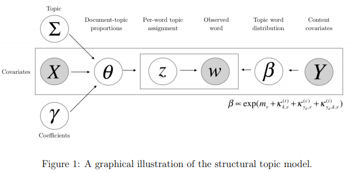

# Topic Analysis

L'analyse thématique s'attache à résumer de grands ensembles plus ou moins structurés de données textuelles en principaux thèmes probables. Les données d'entrées sont des éléments textuels constituant une *collection* de *documents*, eux-mêmes composés de mots, le tout est alors à considérer comme une *mélange*, ou un *mélange* de thèmes à identifier. 

Ces algorithmes entraînés reposent sur des méthodes de calculs empruntent aux domaines du machine learning et de l'intelligence artificielle. Les différentes variantes de sa mise en oeuvre tiennent compte :

-   Du plongement lexical

-   Du rôle de potentielles métadonnées à intégrer


Les packages, [[`Word2Vec`](https://CRAN.R-project.org/package=word2vec)] et [[`stm`](https://cran.r-project.org/web/packages/stm/index.html)] seront utilisés ci-dessous afin de mener les analyses.

## LDA

### Le modèle original de Blei

Le rôle de cet algorithme est donc, à un corpus donné, établir un modèle possible de mélange thématique, en lisant et reliant successivement les mots entre eux. Cela est rendu possible quand les variables sont dîtes interchangeables.[@blei]

Nous avons donc, au sens de Blei :

-   Un vocabulaire $V$ indexant tous les mots,
-   De documents composés d'une séquence de $n$ mots
-   Un Corpus $D$, collection $m$ de documents
-   Un ensemble $Z$ de topics potentiels
-   Définir un réel $k$ égal au nombre de topic souhaité

Chaque mot $w$ se voit donc associer des coefficients $\beta_{i,j}$ et $\alpha_{i}$ dans un espace $\theta_{i}$ de distribution au sein des documents, obtenu par une allocation de Dirichlet. Ainsi, on a successivement :

$$
 p(\theta|\alpha) = \frac{\Gamma(\sum_{i=1}^k \alpha_{i}}{\prod_{i = 1}^{k}\Gamma(\alpha_{i})}\theta_{1}^{\alpha_{1}-1}...\theta_{k}^{\alpha_{k}-1}
$$

et l'ensemble des éléments prédéfinis reliés de la manière suivante :

$$
p(\theta,z,w|\alpha,\beta)=p(\theta\|\alpha)\prod_{n=1}^{N}p(z_{n}|\theta)p(w_{n}|z_{n},{\beta})
$$


Un schéma explicatif est proposé par [H. Naushan](https://towardsdatascience.com/topic-modeling-with-latent-dirichlet-allocation-e7ff75290f8), en 2020.


D'après le théorème de Finetti, lorsque les variables sont échangeables, il est possible de les visualiser selon une infinité de mélanges. La probabilité d'une séquence de mots/topics peut donc s'exprimer de la sorte :

$$
p(w|z)=\int{} p(\theta) (\prod_{n=1}^{N}p(z_{n}|\theta)p(w_{n}|z_{n})d\theta
$$

Cela se considère comme une mélang continu d'unigrammes ou la probabilité de rencontrer un mot se résume à sa distribution $p(w|\theta,\beta)$ :

$$
p(w|\theta,\beta)=\sum_{z}p(w|z,\beta)p(z|\theta)
$$

La distribution marginale $p(w|\alpha,\beta)$ de chaque document, est donc intrinsèque à cette idée de mélange de thématique, et s'obtient ainsi :

$$
p(w|\alpha,\beta)= \int p(\theta,\alpha)(\prod_{n=1}^{N}p(w_{n}|\theta,\beta))d\theta
$$


### Une application aux commentaires trip advisor

Le cas qu'on analyse est celui des commentaires déposés par les clients des hôtels de polynésie au cours des années 2019 et 2020. Avant d'appliquer une analyse LDA, la stratégie va être le filtrer le vocabulaire pour se concenter sur les objets dont on parle et les qualités qu'on leurs accorde. 

```{r 1101}
df<-readRDS("./data/Polynesie2020.rds")

#library(cleanNLP)

text<-paste0(df$Titre,". ",df$Commetaire)
#initialisation du modèle de langue
cnlp_init_udpipe(model_name = "french")
#annotation
obj <- cnlp_annotate(text, verbose=1000)

#on extrait la table des tokens
tok <- obj$token 

Table <- table(tok$upos) %>% 
  as.data.frame()
g1<-ggplot(Table,aes(x=reorder(Var1,Freq),y=Freq))+
  geom_bar(stat="identity",fill="darkgreen")+
  coord_flip()+
  labs(title = "Fréquence des catégories morpho-syntaxiques",x="UPOS",y="nombre de tokens")
g1
```

De multiple solutions sont proposée dans r pour le modèle LDA, nous choississons ici le package tex2vec qui offre d'autres modèles ( glove, lsa) mais dans un premier temps on filtre les tokens en fonction des UPOS, puis en écartant les termes fréquents dans plus de 95% des documents ou dans moins de 5% des documents. Le sens est toujours dans les termes médians, pas trop rares et pas trop génériques.  

```{r 1102}
tf <- obj$token %>%
  filter(upos %in% c("ADJ", "NOUN","VERB")) %>%
  cnlp_utils_tfidf(min_df = 0.05, max_df = 0.95, tf_weight = "raw")
```


```{r 1103}
#on commence par définir le modèle avec trois hyperparamètres
## le nombre de topics
## la probabilité a priori qu'un document appartienne à un document
## la probabilité qu'un mot d'un document appartienne à un topic donné
library(text2vec)
lda_model = LDA$new(n_topics = 8, doc_topic_prior = 0.1, topic_word_prior = 0.01)


set.seed(67)
# on définit les paramètres du p^rocessus d'estimation : le nombre d'itérations, le seuil de convergence
doc_topic_distr = 
  lda_model$fit_transform(x = tf, n_iter = 1000, 
                          convergence_tol = 0.001, 
                          n_check_convergence = 25, 
                          progressbar = FALSE)
```

description


```{r 1104}

#description des topic en fonction d'un degré de pertinence de lamba ( lambda =1 probabilités)
lda_res<-as.data.frame(lda_model$get_top_words())

lda_res<-as.data.frame(lda_model$get_top_words(n = 15, lambda = 0.30))
lda_res$rank<-as.numeric(row.names(lda_res))

lda_res<-lda_res%>% gather(variable, value, -rank)


ggplot(lda_res, aes(x=variable, y= rank, group =  value , label = value)) + 
  scale_y_reverse() + 
  geom_text(aes(color=variable,size=sqrt(26-rank)))+scale_color_hue()+
  guides(color=FALSE,size=FALSE)+
  labs(x="topics", y="par ordre de pertinence")
```

L'analyse n'est pâs toujours évidente et le travail interprétatif est faciliter par des graphes interactif. LDAvis est un bon compagnon. Il fouunit deux outils précieux. d'abord il projette les topic dans un espace à deux dimensions qui permet de représenter les distances des porfils de topic. Ensuite il n'utilise pas que la probabailité qu'un terme soit associée à un sujet donnée, il prend on compte le caractère distinctifs du terme. Même s'il est peut fréquent et peu probable qu'il appartiennent au topic K, mais qu'il ne se retrpouve qua dans le topic . C'est la potion de saillance

La pertienence pondète la probabilité et la saillance :


```{r 1105}

library(LDAvis)
lda_model$plot()

```

On reintègre les topics dans le fichier géneral et on en profite pour leur donner des noms explicites. 

```{r lda2, fig.width=8, fig.height=4.5, caption ="Topic LDA"}

topic<- as.data.frame(doc_topic_distr)
df<-cbind(df,topic)

df$MerPiscine<-df$V1
df$Interaction<-df$V2
df$Paradis<-df$V3
df$Motulife<-df$V4
df$Ballade<-df$V5
df$Transit<-df$V6
df$Pension<-df$V7
df$Prix<-df$V8


```

### la determination du nombre optimal de topics

perplexité (text2vec)

d'autres indices

Etudier la plage 

## STM

La Modélisation Thématique Structurelle est un prolongement du modèle LDA développé ci-dessus. Permettant de parvenir aux mêmes types de résultats de regroupements thématiques par plongement lexical, cette dernière se distingue dans le sens où elle permet d'associer d'autres variables, ou méta-données, au corpus traité afin de prendre en compte les relations de leurs modalités au contenu. Ainsi, elle crée la notion de prévalence d'un topic, qui permet de prendre en compte sa fluctuation en fonction de la propre évolution de la covariance des éléments d'une même mélange. [@roberts2016]




## Implementation avec wor2vec ( regarder la place de la vectorisation)

Ces techniques se sont développées sous l'angle de l'hypothèse, ou contrainte de Harris, dont le postulat propose que les mots apparaissants dans des contextes similaires soient de sens identiques. Le développement des techniques d'analyses traitant le mot comme un vecteur avec un ensemble de coordonnées dans un reprère propre à un corpus entièrement vectorisé permet de tester cette hypothèse originelle en sémantique distributionnelle.

En ce sens, l'approche par l'intégration des mots permet de réinduire une certaine dépendance, contrainte, linéarité et ordonnancement naturel du corpus au sein d'une mélange, donc le principe même temps à avoir une infinité de représentation.


La structure de cette approche s'appuie sur différentes couches de réseaux de neurones venant travailler réciproquement sur des obervations et des prédictions :

-   Les mots observés, dont on peut prédire le contexte (Skip-gram)

-   Les éléments du contexte observés, dont on peut prédire le mot (CBOW)

L'idée de plongement lexical tient alors dans cette dynamique double d'identification et de rattachament des éléments textuels ensembles, selon différentes méthodes de vraisemblance/mesure.

#### Skip-gram

#### Continus Bag-Of-Words

### Représentation graphique
