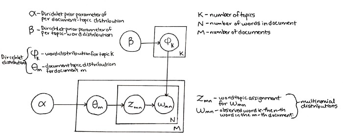
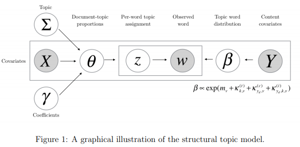

# Topic Analysis {#topic}

## _Objectifs du chapitre_
  
  * Découper un corpus en _topics_ à l'aide du modèle LDA
  * Utiliser différentes méthodes pour identifier le nombre optimal de _topics_ dans un corpus
  * Découper un coprus en _topics_ à l'aide du modèle STM


## Les outils

  * Jeux de données : le corpus des commentaires laissés sur TripAdvisor concernant les hôtels polynésiens et les publications de la revue Politique et Management Public
  * Packages utilisés : [[`text2Vec`](https://CRAN.R-project.org/package=text2vec)] ; [[`LDAvis`](https://cran.r-project.org/web/packages/LDAvis/index.html)] ; [[`topicmodels`](https://cran.r-project.org/web/packages/topicmodels/index.html)] ; [[`ldatuning`](https://cran.r-project.org/web/packages/ldatuning/index.html)] ; [[`stm`](https://cran.r-project.org/web/packages/stm/index.html)]

## Introduction 

L'analyse thématique s'attache à résumer de grands ensembles plus ou moins structurés de données textuelles en principaux thèmes probables. Les données d'entrées sont des éléments textuels constituant une *collection* de *documents*, eux-mêmes composés de mots, le tout est alors à considérer comme un *mélange* de thèmes à identifier.

Ces algorithmes entraînés reposent sur des méthodes de calculs qui empruntent aux domaines du machine learning et de l'intelligence artificielle. Les différentes variantes de sa mise en œuvre tiennent compte :

-   Du plongement lexical ;

-   Du rôle de potentielles métadonnées à intégrer.


### Latent Dirichlet Allocation : Le modèle original de Blei

 L'idée principale est que chaque texte aborde un ou plusieurs sujets (_topics_) et que ces _topics_ sont décrits par des mots du corpus. Chaque mot a alors une probabilité plus ou moins élevé d'appartenir à un _topic_ et chaque _topic_ une probabilté d'être présent dans un document. C'est ce que résume le schéma ci-dessous repris de [@blei] :


Le rôle de cet algorithme est donc, pour un corpus donné, d'établir un modèle possible de mélange thématique, en lisant et reliant successivement les mots entre eux. Cela est rendu possible quand les variables sont dîtes interchangeables.[@blei]

Nous avons donc :

-   Un corpus $D$, composé d'une collection de $m$ documents, composés eux-mêmes d'une séquence de $n$ mots ;
-   Un vocabulaire $V$ indexant tous les mots $w$ ;
-   Un ensemble $Z$ de topics potentiels.

Pour résoudre l'algorithme, il faut définir un réel $k$ égal au nombre de topics souhaité.

Chaque mot $w$ se voit donc associer des coefficients $\beta_{i,j}$ et $\alpha_{i}$ dans un espace de distribution au sein des documents $\theta_{i}$, obtenu par une allocation de Dirichlet. Ainsi, on a successivement :

$$
 p(\theta|\alpha) = \frac{\Gamma(\sum_{i=1}^k \alpha_{i})}{\prod_{i = 1}^{k}\Gamma(\alpha_{i})}\theta_{1}^{\alpha_{1}-1}...\theta_{k}^{\alpha_{k}-1}
$$

et l'ensemble des éléments prédéfinis reliés de la manière suivante :

$$
p(\theta,z,w|\alpha,\beta)=p(\theta|\alpha)\prod_{n=1}^{N}p(z_{n}|\theta)p(w_{n}|z_{n},{\beta})
$$


Un schéma explicatif est proposé par [H. Naushan](https://towardsdatascience.com/topic-modeling-with-latent-dirichlet-allocation-e7ff75290f8), en 2020.



D'après le théorème de Finetti, lorsque les variables sont échangeables, il est possible de les visualiser selon une infinité de mélanges. La probabilité d'une séquence de mots sachant les _topics_ peut donc s'exprimer de la sorte :

$$
p(w|z)=\int{p(\theta) (\prod_{n=1}^{N}p(z_{n}|\theta)p(w_{n}|z_{n})d\theta)}
$$

Cela se considère comme un mélange continu d'unigrammes où la probabilité de rencontrer un mot se résume à sa distribution $p(w|\theta,\beta)$ :

$$
p(w|\theta,\beta)=\sum_{z}p(w|z,\beta)p(z|\theta)
$$

La distribution marginale $p(w|\alpha,\beta)$ de chaque document, est donc intrinsèque à cette idée de mélange de thématiques, et s'obtient ainsi :

$$
p(w|\alpha,\beta)= \int p(\theta,\alpha)(\prod_{n=1}^{N}p(w_{n}|\theta,\beta))d\theta
$$

### Structural Topic Modeling

La Modélisation Thématique Structurelle est un prolongement du modèle LDA développé ci-dessus. Permettant de parvenir aux mêmes types de résultats de regroupements thématiques par plongement lexical, cette dernière se distingue dans le sens où elle permet d'associer d'autres variables, ou méta-données, au corpus traité afin de prendre en compte les relations de leurs modalités au contenu. Ainsi, elle crée la notion de prévalence d'un topic, qui permet de prendre en compte sa fluctuation en fonction de la propre évolution de la covariance des éléments d'un même mélange. [@roberts2016]



## LDA : Une application aux commentaires trip advisor

Le cas qu'on analyse est celui des commentaires déposés par les clients des hôtels de Polynésie au cours des années 2019 et 2020. Avant d'appliquer une analyse LDA, il convient de réduire le corpus aux termes pertinents, tant pour des raisons de performance de l'algorithme que pour réduire les temps de calcul. La stratégie que nous suivons ici va être de filtrer le vocabulaire pour se concentrer sur les objets dont on parle et les qualités qu'on leurs accorde.

On commence par charger le corpus, puis par l'annoter de ses formes morpho-syntaxiques, dont on visualise la distribution :

```{r 1101}
df<-readRDS("./data/Polynesie2020.rds")

#library(cleanNLP)

text<-paste0(df$Titre,". ",df$Commetaire)
#initialisation du modèle de langue
cnlp_init_udpipe(model_name = "french")
#annotation
obj <- cnlp_annotate(text, verbose=1000)

#on extrait la table des tokens
tok <- obj$token 

Table <- table(tok$upos) %>% 
  as.data.frame()
g1<-ggplot(Table,aes(x=reorder(Var1,Freq),y=Freq))+
  geom_bar(stat="identity",fill="darkgreen")+
  coord_flip()+
  labs(title = "Fréquence des catégories morpho-syntaxiques",x="UPOS",y="nombre de tokens")
g1
```

On filtre les _tokens_ en fonction des UPOS "noms", "adjectifs" et "verbes", puis on écarte les termes les plus ou les moins fréquents (apparaissent dans plus de 95% des documents ou dans moins de 5% des documents). Le sens est toujours dans les termes médians, pas trop rares et pas trop génériques.  

```{r 1102}
tf <- obj$token %>%
  filter(upos %in% c("ADJ", "NOUN","VERB")) %>%
  cnlp_utils_tfidf(min_df = 0.05, max_df = 0.95, tf_weight = "raw")
```

De multiple solutions sont proposée dans r pour le modèle LDA, nous choisissons ici le package tex2vec qui offre d'autres modèles (glove, lsa). On commence par définir le modèle (nombre de _topics_ à estimer, les probabilités d'appartenance), puis on applique le modèle à notre corpus en précisant les paramètres d'estimation (nombre d'itérations, seuil de convergence). On applique ensuite le modèle à notre corpus.


```{r 1103}
#on commence par définir le modèle avec trois hyperparamètres :
##n_topics = le nombre de topics
##doc_topic_prior = la probabilité a priori qu'un document appartienne à un document
## topic_word_prior = la probabilité qu'un mot d'un document appartienne à un topic donné
library(text2vec)
lda_model = LDA$new(n_topics = 8, doc_topic_prior = 0.1, topic_word_prior = 0.01)


set.seed(67) #pour la reproductibilité des résultats

#On définit les paramètres du processus d'estimation : 
##n_iter = le nombre d'itérations
##convergence_tol =le seuil de convergence
doc_topic_distr = 
  lda_model$fit_transform(x = tf, n_iter = 1000, 
                          convergence_tol = 0.001, 
                          n_check_convergence = 25, 
                          progressbar = FALSE)
```
On fait une représentation des _topics_ pour pouvoir les analyser et les renommer si on le souhaite.


```{r 1104}

#description des topics en fonction d'un degré de pertinence = lamba ( lambda =1 probabilité d'obtenir le terme sachant le topic)

lda_res<-as.data.frame(lda_model$get_top_words(n = 15, lambda = 0.30))
lda_res$rank<-as.numeric(row.names(lda_res))

lda_res<-lda_res%>% gather(variable, value, -rank)


ggplot(lda_res, aes(x=variable, y= rank, group =  value , label = value)) + 
  scale_y_reverse() + 
  geom_text(aes(color=variable,size=sqrt(26-rank)))+scale_color_hue()+
  guides(color="none",size="none")+
  labs(x="topics", y="par ordre de pertinence")+
  theme_light()
```

L'analyse n'est pas toujours évidente et le travail interprétatif est facilité par des graphes interactif. LDAvis est un bon compagnon. Il fouunit deux outils précieux : d'abord, il projette les _topics_ dans un espace à deux dimensions qui permet de représenter les distances des profils des _topics_. Ensuite il n'utilise pas que la probabailité qu'un terme soit associée à un sujet donné, il prend on compte le caractère distinctif du terme. Même s'il est peut fréquent et peu probable qu'il appartienne au _topic_ $K$, mais qu'il ne se retrouve que dans ce _topic_, ce terme est caractéristique du _topic_. C'est la notion de saillance

La pertinence pondère la probabilité et la saillance. Voici un exemple :

```{r 1105}

library(LDAvis)
lda_model$plot()

```

On réintègre les _topics_ dans le fichier géneral et on pourra en profiter pour leur donner des noms explicites (avec la fonction *'rename()'*) afin de faciliter de prochaines analyses. 

```{r 1106}

topic<- as.data.frame(doc_topic_distr)
df<-cbind(df,topic)


```

### La détermination du nombre optimal de topics

Dans l'exemple que l'on a pu voir avec le package 'tex2vec', le nombre de _topics_ pour estimer le modèle LDA doit être fixer à l'avance. La question qui se pose évidemment est de savoir comment déterminer ce nombre optimal. Le processus d'essais-erreurs, qui consistent à tester un certain $K$, à essayer d'interpréter les résultats, puis à fixer un autre $K$, tenter l'interprétation et ainsi de suite, jusqu'à satisfaction peut sembler adéquat, mais ne permettra pas forcément au chercheur de tester un suffisamment grand nombre de _topics_ pour s'assurer de la pertinence du $K$ choisi. Aussi, différents chercheurs se sont intéressés à ce problème et ont développé différentes métriques pour donner des indices sur la qualité d'ajustement du modèle LDA pour un nombre $K$ de _topics_ donné.

#### Approche par la perplexité

Une première approche, implémentée dans le package 'text2vec' est de s'intéresser la perplexité du modèle : la perplexité mesure le pouvoir de généralisation du modèle. Formellement :
$$

Perplexité=\exp(\frac{-1}{N_{B}}\sum_{d=i}^{D}logP(w))

$$
Avec
- $N_B=\sum_{d=1}^{M}N_d$, $N_B$ la longueur des N documents, $M$ l'ensemble des termes, $N_d$ le nombre de mots contenus dans le document $d$
- $P(w)$ est la vraisemblance que le modèle génératif assigne à un document $d$ un terme $w$.

L'objectif est ici de minimiser la perplexité :

```{r 1107}
lda_model3 = LDA$new(n_topics = 3, doc_topic_prior = 0.1, topic_word_prior = 0.01)
doc_topic_distr3 = 
  lda_model3$fit_transform(x = tf, n_iter = 1000, 
                          convergence_tol = 0.001, 
                          n_check_convergence = 25, 
                          progressbar = FALSE)
topic_word_distr3 = lda_model3$topic_word_distribution


lda_model8 = LDA$new(n_topics = 8, doc_topic_prior = 0.1, topic_word_prior = 0.01)
doc_topic_distr8 = 
  lda_model8$fit_transform(x = tf, n_iter = 1000, 
                          convergence_tol = 0.001, 
                          n_check_convergence = 25, 
                          progressbar = FALSE)
topic_word_distr8 = lda_model8$topic_word_distribution


lda_model10 = LDA$new(n_topics = 10, doc_topic_prior = 0.1, topic_word_prior = 0.01)
doc_topic_distr10 = 
  lda_model10$fit_transform(x = tf, n_iter = 1000, 
                          convergence_tol = 0.001, 
                          n_check_convergence = 25, 
                          progressbar = FALSE)
topic_word_distr10 = lda_model10$topic_word_distribution

lda_model15 = LDA$new(n_topics = 15, doc_topic_prior = 0.1, topic_word_prior = 0.01)
doc_topic_distr15 = 
  lda_model15$fit_transform(x = tf, n_iter = 1000, 
                          convergence_tol = 0.001, 
                          n_check_convergence = 25, 
                          progressbar = FALSE)
topic_word_distr15 = lda_model15$topic_word_distribution

lda_model100 = LDA$new(n_topics = 100, doc_topic_prior = 0.1, topic_word_prior = 0.01)
doc_topic_distr100 = 
  lda_model100$fit_transform(x = tf, n_iter = 1000, 
                          convergence_tol = 0.001, 
                          n_check_convergence = 25, 
                          progressbar = FALSE)
topic_word_distr100 = lda_model100$topic_word_distribution


perpl<-tibble(n_topic=as.factor(c(3,8,10,15,100)), perplexite=c(perplexity(tf, topic_word_distr3,doc_topic_distr3),perplexity(tf, topic_word_distr8,doc_topic_distr8),perplexity(tf, topic_word_distr10,doc_topic_distr10),perplexity(tf, topic_word_distr15,doc_topic_distr15),perplexity(tf, topic_word_distr100,doc_topic_distr100)))

ggplot(perpl,aes(n_topic, y=perplexite))+
  geom_col(aes(fill=n_topic), show.legend = F)+
  theme_light()

```
Comme on peut le voir, il est très fréquent que plus on ajoute de _topics_, plus la perplexité est faible. Cependant, un grand nombre de _topics_ ne permet pas toujours une interprétation optimale pour le chercheur. On choisira donc la solution qui a le meilleur gain en perplexité et un nombre de _topics_ minimal (ici 8).

#### Approche par les métriques du package *'ldatuning'*

Un autre moyen de trouver un nombre de _topics_ optimal pour l'analyse est de combiner différentes métriques, afin de faire une préselection des solutions à observer plus attentivement.

L'idée est donc de calculer les modèles pour un grand nombre de _topics_, et de choisir environ 5 solutions à étudier de plus près. Pour cela, on utilise les packages 'topicmodels' et 'ldatuning', qui vont nous permettre d'observer différents indicateurs que l'on va chercher soit à maximiser, soit à minimiser.
Tout d'abord, il faut créer un jeu de données qui sera interprétable par 'topicmodels'. On utilise la procédure habituel via 'quanteda', on élimine les termes trop et pas assez fréquents, puis on convertit au format DocumentTermMatrix nécessaire à 'topicmodels'.

```{r 1108}

text2<-tok%>%filter(upos %in% c("ADJ","VERB","NOUN"))%>%group_by(doc_id)%>%summarise(text=paste(lemma , collapse = " "))

corpus<-corpus(text2)

tok<-tokens(corpus, remove_punct = TRUE, remove_numbers = TRUE, remove_symbols = TRUE)%>%
  tokens_remove(stopwords("fr"))

colloc<-textstat_collocations(tok, min_count = 10, tolower = TRUE)

tok<-tokens_compound(tok, pattern = colloc[colloc$z>3])


dfm<-dfm(tok)

news_dfm <- dfm %>%
  dfm_trim(min_docfreq = 0.01, max_docfreq = 0.99, docfreq_type = "prop")

#On supprime les entrées vides
news_dfm <- news_dfm[ntoken(news_dfm) > 0,]

#On transforme en dtm, un format compris par le package topicsmodel
dtm <- convert(news_dfm, to = "topicmodels")


```

Maintenant, on généralise à un grand nombre de _topics_ dans l'objectif de :

  * minimiser les métriques Arun2010 et CaoJuan2009
  * maximiser Deveaud2014 et Griffiths2004 (cf. [[`vignette`](https://cran.r-project.org/web/packages/ldatuning/vignettes/topics.html)])
  

```{r 1109}
library(topicmodels)
library(ldatuning)

result <- FindTopicsNumber(dtm, #le jeu de données
                           topics = c(seq(from = 2, to = 9, by = 1), seq(10, 25, 5)), #les nombres de topics à tester : tous entre 2 et 9, tous les 5 entre 10 et 25, soit 12 modèles
                           metrics = c("Griffiths2004", "CaoJuan2009", "Arun2010", "Deveaud2014"), #les métriques à calculer
                           method = "Gibbs", #méthode pour LDA
                           control = list(seed = 0:4,
                                          nstart = 5,
                                          best = TRUE), #les paramètres de contrôle
                           mc.cores = NA, #pour la parallélisation
                           verbose = TRUE
                           )

FindTopicsNumber_plot(result)

```

On peut voir qu'une solution à 8, 9 ou 10 topics semblent assez optimale. On compare donc les résultats de la liste réduite de modèles, pour déterminer lequel a la meilleure distribution des topics entre les documents. La distribution recherchée est celle qui distingue le plus les documents en fonction des topics, tout en étant à droite de l’estimation d’une répartition uniforme des documents entre les topics. Le critère de parcimonie nous invite à choisir la solution avec le moins grand nombre de topics, en cas de résultats comparables.

```{r 1110}

para <- tibble(k = c(7,3,8,9,10)) #les nombres de topics retenus


#On calcule les trois modèles
lemma_tm <- para %>%
    mutate(lda = map(k,
                     function(k) LDA(
                       k=k,
                       x=dtm,
                       method="Gibbs",
                       control=list(seed = 0:4,
                                    nstart = 5,
                                    best = TRUE)
                       )
                     )
           )

#on extrait la répartition entre les documents (gamma)
lemma_tm <- lemma_tm %>%
  mutate(lda_gamma = map(.x=lda,
                         .f=tidytext::tidy,
                         matrix="gamma"))
# library(magrittr)
#on fait une représentation graphique de la distribution des topics dans les documents
lemma_tm %>%
  unnest(lda_gamma) %>%
  group_by(k, document) %>%
  arrange(desc(gamma)) %>%
  slice(1) %>%
  #top_n(1, gamma) %>%
  ungroup() %>%
  ggplot(aes(x=gamma, fill=factor(k))) +
  geom_histogram(bins = 20) +
  scale_fill_discrete(name = "Number of\nTopics") +
  xlab("maximum gamma per document") +
  facet_wrap(~k) +
  geom_vline(aes(xintercept = 1/k),
             tibble(k=lemma_tm %$% unique(k)),
             color="darkred")

```

On arrive ici a une solution optimale à 9 _topics_, ce qui mérite une représentation graphique :

```{r 1111}

lda <- LDA(dtm, k = 9) #le modèle optimal

lda_res<-as.data.frame(terms(lda, 25))
lda_res$rank<-as.numeric(row.names(lda_res))
lda_res<-melt(lda_res,id.vars = c("rank"))

ggplot(lda_res, aes(x=variable, y= rank, group =  value , label = value)) + 
  scale_y_reverse() +
  geom_text(aes(color=variable,size=8/log(rank)))+
  theme_minimal()+
  scale_color_hue()+
  guides(color="none",size="none")

```

### LDA *theory driven*

L'idée est ici de conduire une analyse LDA mais d'un point de vue semi-supervisé, c'est-à-dire que le chercheur a déjà une idée des _topics_ contenus dans le corpus. On a besoin d'un dictionnaire de termes qui décrivent les _topics_ recherchés (non exhaustif) et l'on utilise le package ['seededlda'](https://github.com/koheiw/seededlda) développé dans l'univers de quanteda.

On commence par rédiger un dictionnaire :

```{r 1112}

dict <- dictionary(list(repas = c("restaurant", "petit_déjeuner", "cuisine","plat"),
                          paradis = c("paradis","motu", "paradi*", "vue","lagon","rêve"),
                          accueil = c("accueil*","personnel","conseil*","équipe"),
                          matérialité =c("chambre","sal*","propre*"),
                          activité = c("vélo*","kayak","nage*","piscine"),
                          prix=c("rapport*","qual*","prix","cher")))


print(dict)

head(dfm_lookup(dfm,dict))
```

Ensuite, il ne nous reste plus qu'à faire tourner le modèle sur notre dfm travaillée, en prenant en compte nos _topics_ prédéfinis par le dictionnaire, et on en fait une représentation graphique :

```{r 1113}
# devtools::install_github("koheiw/seededlda") 
library(seededlda)
set.seed(1234)
slda <- textmodel_seededlda(news_dfm, dict, residual = TRUE)
print(terms(slda, 20))

lda_res<-as.data.frame(terms(slda, 25))%>%
  mutate(rank=as.numeric(row.names(.)))%>%
  melt(id.vars=c("rank"))

ggplot(lda_res, aes(x=variable, y= rank, group =  value , label = value)) + 
  scale_y_reverse() +
  geom_text(aes(color=variable,size=8/log(rank)))+
  theme_minimal()+
  scale_color_hue()+
  guides(color="none",size="none")

```


## STM

On va utiliser ici le corpus PMP, qui regroupe tous les *abstracts* de la revue Politiques et Management Public sur la période 1983-2019. Tout d'abord, on le charge, et on prépare les données pour qu'elles soient au format utilisé par le package 'stm'. Notre variable explicative de l'évolution des *topics* dans le corpus sera ici l'année de publication. On pourra se référer au [papier de référence de Roberts, Stewart et Tingley](https://raw.githubusercontent.com/bstewart/stm/master/vignettes/stmVignette.pdf) pour plus de précision.

### Préparation des données

Comme toujours, on commence par charger les données, puis on les prépare (annotations POS, reconstitution des textes, transformations en corpus, *tokens* avec collocations, puis en dfm) et on les transforme au format utilisé par le package 'stm'.

```{r 1114}
data<-read_csv("data/PMPLast.csv")
pmp<-data%>%
  rename(year=`Publication Year`)%>%
  filter(!is.na(year))%>%
  mutate(doc_id=paste("text",row.names(.)),
         abstract=paste(Title,`Abstract Note`),
         title=paste(doc_id,":", Title))%>%
  select(doc_id,year,abstract, title)
    

cnlp_init_udpipe(model_name = "french")
obj<-cnlp_annotate(pmp,text_name = "abstract", verbose=100)

tok <- obj$token 

Table <- table(tok$upos) %>% 
  as.data.frame()
ggplot(Table,aes(x=reorder(Var1,Freq),y=Freq))+
  geom_bar(stat="identity",fill="darkgreen")+
  coord_flip()+
  labs(title = "Fréquence des catégories morpho-syntaxiques",x="UPOS",y="nombre de tokens")

text2<-tok%>%filter(upos %in% c("ADJ","VERB","NOUN","PROPN"))%>%mutate(ncar=nchar(lemma))%>%filter(ncar>2)%>%group_by(doc_id)%>%summarise(text=paste(lemma , collapse = " "))
pmp<-inner_join(pmp,text2)%>%select(-abstract)

corp<-corpus(pmp)

toks<-tokens(corp, remove_punct = TRUE, remove_numbers = TRUE, remove_symbols = TRUE, remove_url = TRUE, remove_separators = TRUE)%>%
  tokens_remove(stopwords("fr"))

#colloc noms propres
toks3 <- tokens_select(toks, pattern = "^([A-Z][a-z\\-]{2,})", valuetype = "regex",
                       case_insensitive = FALSE, padding = TRUE)
tstat <- textstat_collocations(toks3, size = 2:3, tolower = FALSE)

toks<-tokens_compound(toks, pattern = tstat[tstat$z>5])


#Colloc du reste
toks4 <- tokens_select(toks, pattern = "^([a-z][a-z\\-]{2,})", valuetype = "regex",
                       case_insensitive = FALSE, padding = TRUE)

colloc<-textstat_collocations(toks4, min_count = 10, size=2:3, tolower = FALSE)
ggplot(colloc, aes(z))+geom_boxplot()


toks<-tokens_compound(toks, pattern = colloc[colloc$z>7])


dfm<-dfm(toks)

dfm_stm <- convert(dfm, to = "stm")

library(stm)

```

### Identification du nombre de *topics* optimal

Le package 'stm' propose la fonction 'searchK' et deux manières d'estimer le nombre de *topics* optimal :
  * utiliser les *words embedding* via 'Rtsne' pour trouver une solution optimale (solution pouvant varier selon le seed)
  * calculer plusieurs modèles et comparer leurs résultats sur différentes métriques
  
#### Approche par les *words embedding*

Ici, on utilise la fonction 'searchK' en fixant le paramètre K à 0 pour recourir à l'algorithme de 'Rtsne'. L'initialisation du modèle doit être 'Spectral' (implémenté par défaut dans le modèle).

```{r 1115}
kresult <- searchK(dfm_stm$documents, dfm_stm$vocab, K = 0, prevalence =~ s(year), data = dfm_stm$meta)

plot(kresult)

```
Ici, il semble qu'une solution à 122 *topics* soit la plus optimale.

#### Approche par comparaison de modèles

Tout d'abord, on teste plusieurs modèles pour découvrir le nombre de _topics_ optimal. 4 métriques sont calculés :
  * _held-out likelihood_ : la probabilité d'apparition des mots au sein d'un document après avoir enlevé ces mots du document lors de l'étape d'estimation (à maximiser) ;
  * _residuals_ : test de la sur-dispersion des résidus ; si les résidus sont sur-dispersés, il est possible qu'il existe une meilleure solution à plus de *topics*  (à minimiser) ;
  * _semantic coherence_ : la cohérence sémantique est maximisée quand les mots les plus probables d'un *topic* apparaissent fréquemment ensemble (o-occurrences)  (à maximiser) ;
  * _lower bound_ : permet de suivre la convergence du modèle  (à minimiser).
  
  
On lance l'estimation sur 3 modèles différents, puis on compare les métriques.

```{r 1116}

#test de différents modèles
kresult2 <- searchK(dfm_stm$documents, dfm_stm$vocab, K = c(25,100,122), prevalence =~ s(year), data = dfm_stm$meta)


#afficher les paramètres calculés
plot(kresult2)

```
L'analyse ici nous fait tendre vers une solution à au moins 100 *topics*.

## Interprétation du modèle retenu

Une fois le nombre de *topics* choisi, il ne reste plus qu'à lancer le modèle et interpréter ses résultats. L'interprétation passe par 3 étapes:
  * interpréter les *topics*,
  * regarder la prévalence des *topics* en fonction des variables de prévalence retenues,
  * analyser la corrélation entre les *topics*

### Le modèle retenu

Pour des raisons pédagogiques, nous testons ici une solution à 15 *topics*. Tout d'abord, nous lançons le modèle et nous regardons la distribution des *topics* en fonction de leur cohérence sémantique et de leur exclusivité (à partir de la mesure FREX, voir \@ref(int_topic)).

```{r 1117}

#nb de topics retenu
k=15
# la spécification du modèle
set.seed(2020)
model.stm <- stm(dfm_stm$documents, 
                 dfm_stm$vocab, 
                 K = k, max.em.its = 25,
                 data = dfm_stm$meta, 
                 init.type = "Spectral", 
                 prevalence =~ year,
                 interactions = FALSE,
                 verbose = TRUE) # this is the actual stm call

#la qualité des topic
topicQuality(model.stm , dfm_stm$documents, xlab = "Semantic Coherence",  ylab = "Exclusivity", M = k)


```
### Interpréter les *topics* {#int_topic}

La première étape de l'exploration consiste à analyser les mots les plus associés à chaque *topics*. Il existe 4 métriques d'association différentes :
  * *Highest Prob* : les mots avec la plus forte probabilité ;
  * *FREX* : pondération des mots selon leur fréquence d'apparition globale et leur appartenance à des documents spécifiques ;
  * *Lift* : pondération par l'occurrence des mots dans les autres *topics*, ce qui donne plus d'importance aux mots spécifiques au *topic* examiné ;
  * *Score* : transformation de *Lift* par le log.
  
Ici, on affiche les résultats pour les *topics* 1, 8 et 13 et on représente les différentes métriques graphiquement :

```{r 1118}
labelTopics(model.stm, c(1,8,13))
#les 4 scores
plot(model.stm, type = "summary", labeltype="prob",text.cex = 0.7,n=7)
plot(model.stm, type = "summary", labeltype="score",text.cex = 0.7,n=5)
plot(model.stm, type = "summary", labeltype="lift",text.cex = 0.7,n=5)
plot(model.stm, type = "summary", labeltype="frex",text.cex = 0.7,n=5)

```

On peut également représenter les *topics* sous forme de nuage de mots. La première proposition, ci-dessous en bleu, repose sur la probabilité d'appartenance des termes aux *topics*, la seconde, en rouge, représente les mots en fonction de l'occurrence des *topics* dans les documents.  

```{r 1119}
par(mfrow = c(3,5) , mar = c(0,0,0,0))
for (i in seq_along((1:k)))
{
  cloud(model.stm,scale=c(2,.25) ,topic = i, type ="model", max.words = 50, colors="darkblue", random.order=FALSE, )
  text(x=0.5, y=1, paste0("topic",i))
}


par(mfrow = c(3,5) , mar = c(0,0,0,0))
for (i in seq_along((1:k)))
{
cloud(model.stm, topic = i,scale=c(2,.25) ,type = c("model","documents"), dfm,thresh = 0.1, max.words = 50, colors="firebrick")
   text(x=0.5, y=1, paste0("topic",i))
}

```

On peut aussi s'intéresser à représenter les contrastes dans les *topics* :

```{r 1120}

plot(model.stm, type="perspectives", topics=c(10,13))

```
Enfin, on peut s'intéresser aux documents qui contribuent aux *topics*, à travers la fonction 'findThoughts', et à les représenter graphiquement. Pour cela, on a besoin d'un vecteur contenant les textes, dans le même ordre que celui fournit au modèle STM. Ici, on utilise le vecteur 'title' créé dans les premières manipulations des données.


```{r 1123}

thoughts3 <- findThoughts(model.stm,texts=pmp$title ,n = 4,
 topics = 6)$docs[[1]]
thoughts20 <- findThoughts(model.stm, texts = pmp$title, n = 4,
topics = 15)$docs[[1]]


par(mfrow = c(1, 2), mar = c(0.5, 0.5, 1, 0.5))
plotQuote(thoughts3, width = 50,text.cex = 0.8, main = "Topic 6")
plotQuote(thoughts20, width = 50,text.cex = 0.8, main = "Topic 15")

```
### Evolution en fonction de la variable de prévalence

Ici, on représente l'évolution de la présence des *topics* en fonction de notre variable de prévalence, l'année de parution. D'abord, on calcule l'effet de l'année pour chaque *topic*, et ensuite on fait notre représentation graphique.

```{r 1122}

model.stm.labels <- labelTopics(model.stm, 1:k) #on récupère la description des topics pour les titres des graphiques
dfm_stm$meta$datum <- as.numeric(dfm_stm$meta$year) #on transforme l'année en variable continue
model.stm.ee <- estimateEffect(1:k ~ s(`datum`), model.stm, meta = dfm_stm$meta) #on estime l'effet de l'année pour chaque topic

summary(model.stm.ee,topics=13) #résultat pour le topic 13


#représentation graphique
par(mfrow = c(3,5) , mar = c(1,0,2,0))
for (i in seq_along((1:k)))
{
  plot(model.stm.ee, "datum", method = "continuous", topics = i, main = paste0(model.stm.labels$score[i,1:4], collapse = "-"), printlegend = T)
}

```
On peut constater que le topic 13 perd en importance au cours du temps, à l'inverse du topic 10.

### Corrélation entre les *topics*

Pour finir, on s'intéresse à la corrélation entre les *topics*. 

```{r 1123}
#On crée les titres/noms des topics
b<-NULL
for (i in seq_along((1:k)))
{
  a<-paste0(model.stm.labels$score[i,1:3], collapse = " ")
  a<-paste("Topic",i,a)
b<-rbind(b,a)
}
label<-as.data.frame(b)
label

topicor<-topicCorr(model.stm, method = "simple",verbose = TRUE) # calcul des corrélations
adjmatrix <-topicor[[3]] #on récupère les corrélations

#calcul des theta moyens par topic
theta <-model.stm[[7]]
thetat<-melt(theta)
thetat<-thetat %>%group_by(Var2)%>%summarise(mean=mean(value))


#création du graphe des corrélations
g<-graph_from_adjacency_matrix(adjmatrix, mode = "lower", weighted = TRUE, diag = FALSE)
g <- delete.edges(g, E(g)[ abs(weight) < 0.05])
curve_multiple(g)
set.seed(2021)
plot(g,layout=layout_with_fr,  margin = c(0, 0, 0, 0),
     edge.width=abs(E(g)$weight)*15,
     edge.color=ifelse(E(g)$weight > 0, "grey60","red"),
     vertex.label=label$V1,
     vertex.color = adjustcolor("pink2", alpha.f = .2),vertex.label.cex=0.7, vertex.size=400*thetat$mean, vertex.frame.color= "white"
     )

```

Et en bonus, un petit graphique pour représenter les mots les plus contributifs aux *topics* :

```{r 1124}
td_beta <- tidy(model.stm,log=FALSE)

td_beta<-td_beta%>%mutate(topic=as.factor(topic))%>%
  mutate(topic=`levels<-.factor`(td$topic,label$V1))

td_beta %>%
    group_by(topic) %>%
    top_n(15, beta) %>%
    ungroup() %>%
    ggplot(aes(reorder(term,beta), beta)) +
    geom_col(fill="firebrick") +theme_minimal()+
    facet_wrap(~ topic, scales = "free") + labs(x=NULL)+
    coord_flip()

```


## Conclusion

Dans ce chapitre, on s'est initié à la modélisation de *topics* latents au sein de corpus, à travers le modèle LDA et une de ses généralisations, le modèle STM.
