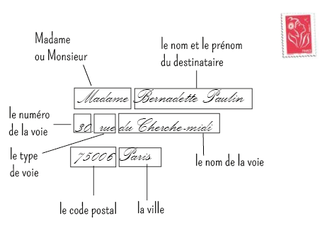

--- 
title: "NLP avec r et en français - un Manuel synthétique"
author: "Sophie Balech et Christophe Benavent et al"
date: "`r Sys.Date()`"
site: bookdown::bookdown_site
output: bookdown::gitbook
documentclass: book
bibliography: [book.bib, packages.bib]
biblio-style: apalike
link-citations: yes
github-repo: rstudio/bookdown-demo
description: "This is a minimal example of using the bookdown package to write a book. The output format for this example is bookdown::gitbook."
---

# Préface


^[Incantation for 6 voices Scott helmes, 2001. [Museum of Minessota](https://medium.com/minneapolis-institute-of-art/painting-a-picture-with-words-a0a3fef3cf63)]


L'eco système r s'est enrichi ces dernière année à grande vitesse dans le domaine du traitement du langage naturels, l'objet de ce manuel a pour but de donnner une synthèses des ressources de r en matière de NLP. Sa vocation est pratique. La bibliographie synthétique en fait un essai d'état de l'art essentiel. 

On ouvrira cependant chaque fois que c'est possibles aux questions théoriques et éthiques de ces méthodes. Leur réalisation computationnelle est le fruit souvent d'une longue histoire, au cours de laquelle les linguistes ont semé des idées essentielles qu'ont systématisés les informaticiens.


Il a pour but d'être reproductible, c'est pourquoi le choix de ce support et des jeux de données associés. 

Il sera dynamique, modifié à mesure de nos cours, séminaires et ateliers. 


# Plan et outils du manuel

## La structure du livre

L' analyse NLP peut être analysée comme un processus qui va de la production jusqu' à la diffusion des analyses. Elle est aussi traversée par des évolutions profondes de méthodes qui ont complexifié au sens formels les modèles initiaux. L'apprentissage submerge le comptage,et les catégorisations....

Rappelons nous que les modèles de langages désormais distribués par les grands acteurs, comprennent des dizaines, voir des centaines de milliards de paramètres. 

Le plan suit une logique du simple au compliqué, de l'acquition au traitement.


 * acquisition des données : directe, api et scrapping
 * corpus dtm et cooccurence
 * AFC et typologie
 * l'annotation syntaxique et lexicale
 * analyse du sentiment et sa généralisation
 * word embedness
 * factorial models
 * Topic analysis
 * ML
 * deep learning
 * translation
 * génératives

## Les jeux de données 

Au cours du développement, plusieurs cas pratiques - souvent réduit en volume pour rester exemplaires, seront employés. Les donées seront partagées.

En voici la présentation  systématique.

 * [Trump Twitter Archive](https://www.thetrumparchive.com/) : L'intégralité des tweets de Trump jusqu'à son banissement le 8 Janvier 2021.
 * Confinement Jour J
 * Citations : un recueil de citations littéraires pour de petits exemples et ponctuer le texte aride d'un peu de littérature et de poésie.
 * Trip advisor Polynésie, un extrait d'un corpus établi par Pierre Ghewy et Sebastien de l'UPF
 * Airbnb
 * Covid

disponibles dans le [repositery](https://benaventc.github.io/NLPBook/) avec le code du book. Les amendements et améliorations sont souhaitées et attendues. 

## Le cadre technique

Ce  _livre_ est écrit en **Markdown** [@allaire_rmarkdown_2021] et  avec le package **Bookdown** [@R-bookdown]

Le code s'appuie très largement sur **tidyverse** et emploie largement les ressources de **ggplot** . Les packages seront introduits au fur et à mesure. En voici la liste complète.


```{r pack, echo = TRUE, message=FALSE,warning=FALSE}
knitr::opts_chunk$set(echo = TRUE, message=FALSE,warning=FALSE)

#boite à outils et viz
library(tidyverse) # inclut ggplot pour la viz, readr et 
library(cowplot) #pour créer des graphiques composés
library(ggridges) # le joy division touch
library(citr)

#networks
library(igraph)
library(ggraph)

# Accéder aux données
library(rtweet)  # une interface efficace pour interroger l'api de Twitter

# NLP
library(tokenizers)
library(quanteda)
library(quanteda.textstats)
library(udpipe) #annotation syntaxique
library(tidytext)
library(cleanNLP) #annotation syntaxique

#sentiment
library(syuzhet)             #analyse du sentimeent
#mise en page des tableaux
library(flextable)


#statistiques et modèles
library(lme4)
library(jtools)
library(interactions)

#ML
library(caret)

#graphismes
theme_set(theme_bw())


#palettes
library(colorspace) #pour les couleurs

# chapitre II
library(revtools)
library(rvest)


```

L'ensemble du code est disponible [sur github](https://github.com/BenaventC/NLPBook). A ce stade c'est encore très embryonnaire. Les proches pourrons cependant y voir l'évolution du projet et de la [progression](https://benaventc.github.io/NLPBook/)

Quelques conventions d'écriture du code r

 * On appele les dataframes  de manière générale `df`, les tableaux intermédiaires sont appelé systématiquement `foo`
 * Gestion des palettes de couleurs
  ** une couleur :" royalblue"
  ** deux couleurs
  ** 3 à 7 couleurs
 * On emploie autant que possible le dialecte tidy.
 * Les chunks sont notés X, le chapitre, 01 à n, les jeux. 502 est le second chunk du chapitre 4.
 * On commente au maximum les lignes de code pour épargner le corps du texte et le rendre lisible


## A faire

todo list :

* insérer un compteur google analytics ( voir https://stackoverflow.com/questions/41376989/how-to-include-google-analytics-in-an-rmarkdown-generated-github-page)
* modifier le titre en haut à gauche
* vérifier le système de références voir ( https://doc.isara.fr/tuto-zothero-5-bibtex-rmarkdown-zotero/)
* Vérifier la publication en pdf
 

<!--chapter:end:index.Rmd-->

# Introduction {#intro}


Le texte connaît une double révolution. la première est celle de son système de production, il se produit désormais tant de textes que personne ne peut plus tous les lire, même en réduisant son effort à sa propre sphère d’intérêt et de compétence, la seconde est celle de sa lecture, c'est une lecture conditionnée et recommandée.. 

La production primaire de texte voit son volume croître exponentiellement. Prenons quelques exemples :

 * le contenu écrit des réseaux sociaux
 * les rapports d'activités des entreprises,
 * les compte-rendu archivé de réunion
 * Les avis des consommateurs sur les catalogues de produit
 * Les articles et les revues scientifiques
 * Même les livres


La production se soumet ensuite à ceux qui en contrôlent les flux et en exploitent les contenus, qui les mettent en avant ou les écartent, définissant la composition de ce que chacun va lire. La diffusion de cette production suit des loi puissances, c'est ainsi que la révolution de la lecture est venue avec les moteurs de recherche, et les pratiques de curations (ref), c’est une lecture sélectionnée et digérée par les moteurs de recommandation. (ref). 

S’il ne fallait qu’un exemple on pourrait évoquer la transformation radicale de la littérature dite scientifique sur le plan technique. La recherche par mots clés est complétée de plus en plus par des outils de veille, l’indexation a donné naissance à l’immatriculation de la moindre note, les fichiers ont adopté des standards, l’interopérabilité est de mise, le réseau des co-citation est maintenu en temps réel. Les scores qualifient autant les articles que leurs auteurs et les revues qui les accueillent. 

Elle risque de ce poursuivre par la production de résumé par exemple, la transcription automatique (speech2tex) etc.

Le NLP est au coeur de ces technologies, il se nourrit de plus en plus d'intelligence artificielle. 

Mais le NLP est aussi une nouvelle ressource pour les chercheurs en sciences sociales à la fois par les matériaux empiriquement, l'emballement de la production de texte génère une nouvelle matière d'étude pour le sociologues, le gestionnaire, l'économiste, le psychologue pour n'évoquer que quelques disciplines, mais aussi de nouvellle techniques d'analyses. 


## Un nouveau champ méthodologique

Pour le chercheur qui étudie les organisations, cette révolution textuelle offre de nouvelles opportunités d’obtenir et d’analyser des données pour vérifier ses hypothèses. La production abondante d’avis de consommateurs, de discours de dirigeants, de compte-rendus de conseils, d’articles techniques, rencontre une multiplication des techniques, provenant de la linguistique computationnelle, de la fouille de données, des moteurs de recommandation, de la traduction automatique, et des ressources nouvelles et précieuses pour traiter l’abondance des données. Un nouveau paradigme méthodologique se construit à la croisée de données abondantes et de techniques de traitement intelligentes. Il permet d’aller plus loin que l’analyse lexicale traditionnelle en incorporant des éléments syntaxiques, sémantiques, et pragmatiques, proposés par l’ensemble des outils des techniques de traitement du langage naturel.

Il se dessine surtout une nouvelle approche méthodologique qui prend place entre l’analyse qualitative, et les traditionnelles enquêtes par questionnaires capables de traiter des corpus d’une taille inédite. Le travail de [@humphreys_automated_2018] en donne une première synthèse dans le cadre d’un processus qui s’articule autour des différentes phases d’une recherche : la formulation de la question de recherche, la définition des construits, la récolte des données, l’opérationnalisation des construits, et enfin l'interprétation, l’analyse et la validation des résultats obtenus. 

Dans le champ du management, on trouvera des synthèses pour la recherche en éthique [@lock_quantitative_2015], en comportement du consommateur @humphreys_automated_2018  en management public [@anastasopoulos_computational_2017] ou en organisation [@kobayashi_text_2018] , en sociologie [@kozlowski_geometry_2019].

## Les facteurs de développement

Ces développements sont favorisés par un environnement fertile dont trois facteurs se renforcent mutuellement.

### Une lingua franca

Le premier est l’expansion de deux langages, proprement statistique pour r et plus généraliste pour Python. Le propre de ces langages est, prenons le cas de r, de permettre d’élaborer des fonctions, dont un ensemble cohérent pour réaliser certaines tâches peut être rassemblé dans une bibliothèque appelée package (et chargé par library(nomdupackage)). On dispose désormais de milliers de packages (17 788 sur le CRAN) destinés à résoudre un nombre incalculable de tâches. 


Coder une analyse revient ainsi à jouer avec un immense jeu de lego, dont de nombreuses pièces sont déjà pré-assemblées. D’un point de vue pratique, les lignes d’écriture sont fortement simplifiées permettant à un chercheur sans grande compétence de codage d’effectuer simplement des opérations complexes.  En retour, cette facilitation de l'analyse abonde le stock de solutions.

### Une communauté

Le second facteur , intimement lié au premier, est la constitution d’une large communauté de développeurs et d’utilisateurs qui se retrouvent aujourd’hui dans des plateformes de dépots (Github, Gitlab), de plateformes de type quora (StalkOverFlow), de tutoriaux, de blogs (BloggeR), de journaux (Journal of Statistical Software) et de bookdown.

Des ressources abondantes sont ainsi disponibles et facilitent la formation des chercheurs et des data scientists. Toutes les conditions sont réunies pour  engendrer une effervescence créative. 

### La multiplication des sources de données.

Le troisième est la multiplication des sources de données et leur facilité d’accès. Les données privées, et en particulier celles des réseaux sociaux,  même si un péage doit être payé pour accéder aux APIs, popularisent le traitement de données massives. Le mouvement des données ouvertes (open data) proposent et facilitent l’accès à des milliers de corps de données : retards de la SNCF, grand débat, le formidable travail de l’Insee, european survey etc.
 
 
## Des racines anciennes

Si dans ce manuel, on choisit de présenter les différentes facettes de ce qui s'appelle TAl, NPL, Text Mining,  dans une approche procédurale qui suit les principales étapes du traitement des données. On rendra compte à chaque étape des techniques disponibles, et on illustre d’exemples. Nous suivrons ici une approche plus fidèle au processus de traitement des données, lequel peut connaître une stratégie inférentielle et exploratoire - quelles informations sont utiles au sein d’un corpus de texte -, tout aussi bien qu’une stratégie hypothético-déductive. Nous resterons agnostique sur cette question, restant délibérément à un niveau technique et procédural.

Cependant on se doit pas se faire aveugler par l'éclat de la nouveautés, les techniques d'aujourd'hui dépendent d'idées semée depuis longtemps dans au moins deux champs disciplinaire


la convergence de deux grands mouvements. Sans en faire l'histoire minutieuse que ce domaine réclame, nous pouvons au moins rappeler un certains nombre d'étapes clés.

### Linguistique

Tesnière et les dépendances syntaxiques

Zipf et 

fisth pour l'approche distributionnnelle. 

Chomsky et la grammaire générative


### Informatique


ngram et théorie du signal


information retrieval

### la psychologie

Très tôt la psychogie s'est intéressée au langage, pas seulement comme produit des processus psychologique, mais comme expression de ceux-ci. 

Une partie du domaine du nlp se dénomme linguistique psycho computationnelle. 


Dans le champs de la psychologie de l'éducation et avec une forte motivation scientiste, dès les années 60 s'est posée la question de la mesure de la difficulté d'un texte pour un niveau d'éducation donné. La mesure de la lisibilité des texte s'est développée profitant à d'autre secteurs tels que ceux de la propagande. Dans cette même êrspective la richesse lexicographique comme représenant les compétences a a son tour développé de nouvelles instrumentation. 

James W. Pennebaker a développé son approche à partir de l'étude des traumas; donnant une grande importance à la production discursive des patients. Sa contribution majeure est l'établissement d'un ensemble de dictionnaires destinés à mesurer des caractéristiques du discours. Un instrument qu'on présentatera dans les chapitre 7 ( à vérifier). Auteur en 2011 d'un livre s'intéressant à l'usage des petits mots.  Son approche se poursuit en psychiatrie avec l'analyse des troubles du langage, et a connu des coup d'éclat avec la demonstration que l'analyse des messages sur les réseaux sociaux comme facebook permet de detecter des risques de depression.


### D'autres champs aussi

la biologie et en particulier la génétique

la finance et l'analyse du sentiment

La sociologie. Peut emploie l'analyse du langage. On citera cependant jean-baptiste Coulmont et son obstination à étudier les entités nommées, prénoms et autres marqueurs culturels de l'identité et des classes.


<!--chapter:end:01-intro.Rmd-->

# Constitution du corpus

La constitution d'un corpus est la première étape d'un projet NLP. Il se définit d'abord par la constitution d'une collection de textes dont la provenance est la nature peut être diverse. Dans ce chapitre on va examiner plusieurs techniques de collecte.

 * L'exploitation de bases textuelles
 * Les méthodes de scrapping
 * Le recours aux APIs
 * La collection de document pas que textuels
 * Les sources orales

Un corpus reste un échantillon. Dans ce chapitre nous avons appris comment faire la cueillette dans les sources de textes et constituer matériellement un corpus.  Il reste à traiter la question de la représentativité. La collecte doit rester raisonnée.

Les unités de texte. Une unité de texte : un chaine de caractère intégrée dans un document. Celui ci peut être un livre un article, une note, une transcription, 

 * Un document
 * Un ou des auteurs du document
 * Une date
 * Un endroit
 * Un contexte : les unités précedente, et subséquentes. 

Unités de production et de reception, Un texte est produit et puis il est lu, peut-être.Analyser le texte peut se faire dans deux perspectives, celle de la production et celle de la réception. Les corpus doivent être construit en fonction de ce critère. 

Examiner la question de l'engagement dans ce cadre est essentiel, certains acteurs sur un sujet donnée sont amenés à parler plus que les autres et développent un surcroit de voix. la question du biais de selection

Un corpus est un ensemble de documents.  Ils peuvent être courts, les tweets, pas trop long - abstract articles court - long ( article de recherche, ou très long (livres).

La collecte peut se faire d'abord sur des matériaux primaires, numérisé sous forme d'images, et dans lesquels en analysant les pixels on peut reconnaitre un texte. 


## L'exploitation de base de données textuelles

On commence par un exemple simple en utilisant la base europresse. l'objectif est de constituer un fichier de références bibliographiques, exploitable via r. Dans europresse , nous avons fait une recherche sur les articles comprenant le terme " vaccination" dans la presse nationale françaises, constituées de 14 titres. On retient les 150 derniers articles au 16 Juillet.

https://revtools.net/data.html#importing-to-r)

```{r 201, fig.cap='', out.width='80%',caption= "le traitement de la vaccination dans la presse nationale française", fig.asp=1, fig.align='center'}
#library(revtools)
df <- read_bibliography("20210716042105.ris")
head(df,3)
df<-df%>%
  mutate(jour=substring(DA,1,2))

g21<-ggplot(df, aes(x=journal))+
  geom_bar()+
  coord_flip()+labs(x=NULL,y="Fréquence")
g22<-ggplot(df, aes(x=jour))+
  geom_bar()+labs(x=NULL,y="Fréquence")+
  geom_vline(xintercept=12, linetype="dashed", color = "red")

plot_grid(g21, g22, labels = c('A', 'B'), label_size = 12,ncol=1)


```


Prenons l'exemple de factiva

https://github.com/koheiw/newspapers


## Scrapping

De ces deux approches on pourra considérer que la première correspond à un internet sauvage où la collecte d’information se traduit par une technique de chasseurs-cueilleurs, le glanage. Le recours aux APIs est civilisé, ne serait-ce parce qu'on introduit une sorte d’étiquette, des règles de courtoisie, un système de reconnaissance réciproque et d’attribution de droits. 
Le scraping est l’activité qui consiste à moissonner les informations disponibles sur le net en simulant et en automatisant la lecture par un butineur. Elle consiste à construire un robot capable de lire et d’enregistrer les informations disponibles sous forme html puis à les distribuer (parsing) dans des tableaux structurés, selon une stratégie d’exploration du web préalablement définie.
De nombreuses ressources sont disponibles, mais pour en rester à r , le package rvest permet de réaliser des extractions simples mais suffisantes pour de nombreux usages. 

Les caractéristiques clés du scraping :
 * La nécessité de programmer de manière ad hoc, en fonction des spécificités de chaque site. 
 * Des stratégies mécaniques, en boule de neige. 
    

Le langage html est un langage à balise

Les balises sont la cible du scrapping

une application rvest 

https://www.r-bloggers.com/2018/10/first-release-and-update-dates-of-r-packages-statistics/


### des problèmes pratiques, juridiques et éthiques

La pratique du scrapping se heurte à différents problèmes éthiques et juridique. Si elle n'est pas interdite en tant que telle, elle se confronte à différents droits et principes éthiques

En termes pratiques

 * Le risque de deny of service, c’est à dire de saturer ou de parasiter un système et de s’exposer à ses contre-mesures.
 * Le risque d'information parcellaires, tronquées, inexactes qui résultent de ces contre-mesures. Les producteurs développent des stratégies moins naives. L'exemple des pages numérotée par ordre de production auxquels on substitue un nombre au hasard pour annihilier l'information temporelle.

En termes de droits Les conditions légales ne sont pas homogènes et relèvent de différents droits : 

 * de la propriété intellectuelle, 
 * du respect de la vie privée, 
 * du droit de la concurrence. 

Cependant des facilités et tolérances sont souvent accordées quand c’est dans un objectif de recherche et que des précautions minimales d’anonymisation ou de pseudonymisation sont prises, et que les règles de conservation et de destruction des données sont précisées. 
    
En termes éthiques

 * Un principe éthique essentiel dans la recherche, et ailleurs, et de ne pas nuire à la socité dans son ensemble, hors cette technique participe à la “robotisation” du web (plus de 50% du trafic résulterait de la circulation des spiders , scrapers, sniffers et autres bots). 
 * Elle contribue à la complexification du web, et implique une consommation excessive de ressources energétiques.  

### rvest avec r

le package rvest est générique

https://community.rstudio.com/t/scraping-messages-in-forum-using-rvest/27846/2

```{r 202, fig.cap='', out.width='80%', fig.asp=1, fig.align='center', fig.width=9}

library(rvest)

# Scrape thread titles, thread links, authors and number of views

url <- "https://uberzone.fr/threads/si-la-vaccination-devient-obligatoire-vous-feriez-vous-vacciner-ou-changeriez-vous-de-corps-de-metier.17425"

#x<-c("","/page-2", "/page-3", "/page-4")

for val in x{
  h <- read_html(url)

post <- h %>%
  html_nodes(".js-messageContent") %>%
  html_text()%>%
      str_replace_all(pattern = "\t|\r|\n", replacement = "")

authors <- h %>%
  html_nodes(".username--style2 ") %>%
  html_text() %>%
  str_replace_all(pattern = "\t|\r|\n", replacement = "")

# Create master dataset (and scrape messages in each thread in process)

master_data <- 
  tibble(post, authors)
saveRDS(paste0("df",val))
}

head(master_data)

```


## les API

Les API doivent être considérées comme la voie normale d'accès à l'information: les requêtes sont reproductibles au moins par les requêtes, les bases visée peuvent varier.

Parmi les contre-mesures, le développement des APIs qui permet un accès contrôlé par le détenteur des informations en échange d’une facilitation de l’accès, et d’une plus grande fiabilité des données.

L’utilisation d’API lève l'ambiguïté légale qui accompagne le scraping est peut ainsi paraître comme plus civilisée. Elle nécessite naturellement que le gestionnaire de la base de données fournissent les moyens de s’identifier et de requêter, elle peut avoir l'inconvénient d’être coûteuse quand l’accès est payant. Elle affirme aussi le pouvoir de ceux qui contrôlent les données. Ces dernières ne sont pas, insuffisamment pour le chercheur, un bien commun.


### Un tour d'horizon des API

La plus part des grande plateformes offrent des API plus ou moins ouvertes

- twitter est celle qu'on utilise dans cet ouvrage
- facebook
- crunchbase

https://www.dataquest.io/blog/r-api-tutorial/


### Un exemple avec Rtweet

https://cran.r-project.org/web/packages/rtweet/vignettes/intro.html


Plusieurs packages de r permettent d'interroger le firehose ( la bouche d'incendie!) de twitter.

https://www.rdocumentation.org/packages/rtweet/versions/0.7.0

L'authentification ne nécesssite par de clé API, il suffit d'avoir son compte twitter ouvert. Cependant la fonction lookup_coords requiert d'avoir une clé d'api ou google cloud map. Elle permet de selectionner sur un critère géographique. 

https://developer.twitter.com/en/docs/tutorials/getting-started-with-r-and-v2-of-the-twitter-api


```{r 203, fig.cap='', out.width='80%', fig.asp=1, fig.align='center', fig.width=9}
#une boucle pour multiplier les hashtag 

x<-c("#Blablacar","#Uber", "#heetch")

for (val in x) {
  tweets <- search_tweets(val,n=20000,retryonratelimit = TRUE, geocode = lookup_coords("france"))%>%
      mutate(search=val)
  write_rds(tweets,paste0("tweets_",substring(val,2),".rds"))
}

df_blablacar<-readRDS("tweets_blablacar.rds")
df_uber<-readRDS("tweets_uber.rds")
df_heetch<-readRDS("tweets_heetch.rds")

df<-rbind(df_blablacar,df_uber )

ls(df_blablacar)

foo<-df %>% select(account_lang, geo_coords,country_code, country, account_lang,place_name)

```

On laisse le lecteur explorer les différentes fonctionnalités du package. On aime cependant celle-ci qui sample le flux courrant au taux annoncé de 1%. Voici l'extraction de ce qui se dit en france pendant 10 mn (600s). La procédure peut donner une sorte de benchmark auquel on peut comparer une recherche plus spécifique. 


```{r 210, fig.cap='', out.width='80%', fig.asp=1, fig.align='center', fig.width=9}


rt <- stream_tweets(lookup_coords("france"), timeout = 600)


```


## La gestion des documents

voir aussi 

https://cran.r-project.org/web/packages/fulltext/fulltext.pdf


### Extraire du texte des pdf

https://ropensci.org/blog/2016/03/01/pdftools-and-jeroen/

Chaque page est contenue dans une ligne. 

```{r 211, fig.cap='', out.width='80%', fig.asp=1, fig.align='center', fig.width=9}
library(pdftools)

info <- pdf_info("./pdf/2021neoliberalismegouverner_Meunier_Esprit.pdf")
info
text
fonts <- pdf_fonts("./pdf/2021neoliberalismegouverner_Meunier_Esprit.pdf")
fonts
files <- pdf_attachments("./pdf/2021neoliberalismegouverner_Meunier_Esprit.pdf")
files
toc <- pdf_toc("./pdf/2021neoliberalismegouverner_Meunier_Esprit.pdf")
toc
text <- pdf_text("./pdf/2021neoliberalismegouverner_Meunier_Esprit.pdf")
cat(text[[1]])


```
Il va falloir traiter ce texte 

* Suprimer haut et bas de pages

* Supprimer les sauts de ligne
* Identifier les sauts de paragraphe
* Enlever les citations ()

On va utiliser des fonctions de traitement de chaines de caractère. avec Stringr


```{r 212, fig.cap='', out.width='80%', fig.asp=1, fig.align='center', fig.width=9}
tex<- as.data.frame(text)
tex[1,]
t_reg<-str_replace(tex$text,"[\\s+].*Meunier[\n]+", " ") # entete droite
t_reg<-str_replace(t_reg,"[\\s+].*gouverner[\n]+", " ") # entete gauche

t_reg[4]

t_reg<-str_replace_all(t_reg,"[\\s+].*2021[\n]", " ") # bas de page  gauche
t_reg<-str_replace_all(t_reg,"ESPRIT.*[\n]", " ") # bas de page droit
t_reg[3]

#on marque les paragraphe pour les splitter dans un second temps()
t_reg<-str_replace_all(t_reg,"\n\n\n", "XXX") # bas de page droit
t_reg[3]
t_reg<-str_replace_all(t_reg,"[\n]", " ") # bas de page droit
t_reg[3]
#pour enlever les espaces excedentaires
t_reg<-str_squish(t_reg)

#hyphenation
#note de bas de page

#on regroupe les pages

t<-paste(unlist(t(t_reg)), collapse=" ")

#on identifie les reférences et on les supprime
t_reg2<-str_replace_all(t_reg,"[0-9]+", "")
t_reg2<-str_replace_all(t_reg2,"[\\(].*[\\)]", " auteur")

```

voir aussi : https://programminghistorian.org/en/lessons/basic-text-processing-in-r


Un autre exemple


```{r 213, fig.cap='', out.width='80%', fig.asp=1, fig.align='center', fig.width=9}


download.file("http://arxiv.org/pdf/1403.2805.pdf", "1403.2805.pdf", mode = "wb")
txt <- pdf_text("1403.2805.pdf")

# first page text
cat(txt[1])
txt
# second page text
cat(txt[2])

toc <- pdf_toc("1403.2805.pdf")

```

https://ropensci.org/blog/2018/12/14/pdftools-20/ pour extraire un tableau


### la numérisation et l'OCR


The tesseract package provides R bindings to the Google Tesseract OCR C++ library. This allows for detecting text from scanned images.


D'immenses archives sont numérisées, quand du texte est dans les images il faut le détecter. l'Ocr a fait d'immense progrès et prédit avec un erreur du demi pourt cent de qui est vrai.

Le traitement des adresses est ainsi l'obsession de nombreux métiers depuis quarante ans : les banques , la vad par exemple.  Le problème matériel est que si l'idéal est que les les scripteurs suivent des conventions indicatives comme la suivante :



La réalité ressemble souvent 


Une solution popur r est tesseract de google 

https://cran.r-project.org/web/packages/tesseract/vignettes/intro.html

```{r 214, fig.cap='', out.width='80%', fig.asp=1, fig.align='center', fig.width=9}

library(tesseract)
#library(magick)

tesseract_download("fra")

eng <- tesseract("fra")
text <- tesseract::ocr("voltaire.jpg", engine = "fra")
cat(text)

text <- tesseract::ocr("LOL-est-aussi-un-palindrome.jpg", engine = "fra")

cat(text)


tesseract_info()

```


## Les techniques de recueil direct

La tradition méthodologique de la sociologie est celle de l'entretien, avec toute sorte d'acteur. Elle aboutit à la production de transcriptions, plus ou moins détaillées et précise. Mais des textes

On peut désormais enregistré des réaction par des interfaces vocales. le speech to text est de plus en plus effiace


<!--chapter:end:02-constitution-de-corpus.Rmd-->

# Préparation des données

Avant de se lancer dans l'analyse, il est nécessaire de préparer le texte, de le pré-traiter. Son format fondamental est celui d'une chaine de caractères, sans signification particulière mais composé à partir d'un alphbat, c'un jeux de signes déterminés et démobralement. 1/0 pour lelangage bianre, AGCP pour l'adan, 26 caractère de base pour l'alphabet, sans compter les accents.  

Ces variations sont l'objet de convention en informatique. et de certaines opérations. 


traiter du texte c'est avant tout disposer d'opérateurs pour manipuler ces éléments élémentaire.  la base est d'avoir des outils pour les manipuler.

Le langage avant d'être signifiant est signifié, littéralement produit comme une chaine de signes qui dans l'usage suit certaine convention. Par exemple la satisfaction peut s'exprimé par mmmm, une forte satisfaction par un mmmmmmmmmmmmmmmmmmmmm. Pour distinguer les significations, il faut d'abord compter. les mmm sont sans doute courants car conventionnels (ce mot est à deux doigts d'être incorporé au dictionnaire de l'Académie Française, s'il n'était qu'une onomatopée), les "mmmmmmmmmmmmmmmmmmmmm" sont sans doute beaucoups plus rares. De plus on trouvera des "hum" des "hummm", des 'mmmmhummmm". On comprend qu'à la nuance de l'intensité que le locuteur veut exprimer, toute ces morphologies se rapportent à une même idée. 

Comment le rammener à une même formes est une question essentielle même si elle semble excessivement technique.


## Manipuler des chaines de caractères

Il faut donc traiter le texte, avant même de s'engager dans des modèles compliqués. Il faut savoir traiter des chaines de caractères pour en réduire la diversité, et en produire des chaines grammaticalement exacte. C'est un travail d'artisan, celui des des imprimeurs et de leurs coorecteur. Et en particulier d'un métier celui du [compositeur](http://www.textesrares.com/dupon/d376.htm), ou ouvrier de la casse,  qui distribue des caractères de plomb en séquences dans des casiers de bois. 

[cmpositeur](compositeur.jpg)

L'artisan n'avait pas de choix, la précision était essentielle pour éviter la coquille. Le texte moderne, numérique, est l'objet de plus d'aller et retours. Les mots qu'on pianotent sont corrigés avant même d'être frappés. Les gestes techniques sont différents mais s'articulent sur une même idée : la langue écrite, du moins les langues alphabétiques sont des chaines de caractères dont la formation suit des règles fluctuantes à travers l'histoire mais contraignante à chaque moments. Les conventiosn peuvent changer, mais dans son temps elle s'imposent définitivement. Personne n'écrirait "deffert", pour dire "dessert". Et pourtant la graphie du s était un f jusqu'au XVI ème siècle (trouver la source)!
https://www.cairn.info/revue-la-linguistique-2003-1-page-3.htm

De nombreuses ressources sont disponibles pour traiter ces chaines de caractères.

On utilisera surtout [Stringer](https://stringr.tidyverse.org/) qui est est un des composants essentiels de tidyverse. D'autres packages sont équivalents : stringi par exemple. 


### Les opérations sur les chaînes de caractères


 * mettre en minuscule. L'alphabet se présente au moins en deux versions : des majuscules et des minuscules, il est souvent nécessaire de réduire le texte à une seule casse pour en réduire la variété, sauf si les majuscules signalent une information spécifique et socialement conventionnelle. Un mot qui débute par une majuscule signale un nom commun, désormais conceptualisé comme une entité nommée appartenant à différentes catégories : noms de lieux, noms de personnes, noms d'organisation ...ou l'expression d'un sentiment, au sein des chats, la majuscule en série signale un niveau de langage "loud", un cri , une engueulade, la véhémence.  
 * rechercher une chaine de caractères;
 * remplacer une chaine de caractères
 * extraire une chaine de caractère d'un emplacement à l'autre
 * supprimer une chaine de caractères. Les nombres, 
 * concaténer des chaines de caractères. Le texte peut être divisés en unités. Un paragraphe par exemple, ou un titre.  
 
Si la manipulation deslaquelle ? vaccin ?

### La technique des expressions régulières (regex)

Il ne suffit pas de chercher une chaine de caractère particulière, il faut souvent saisir un ensemble de variations qui suivent un motif determiné et qui répond à une sorte de loi générale.

Par exemple si je veux retrouvrer dans un corpus l'ensemble des mots relatif au monde de l'hôpital, nous chercherions aussi le mot "hopital". Nombreux seront les locuteur qui omeetent l'accent circonflexe. Une formule pour trouver ces deux varietés serait d'utiliser un opérateur, "(), pour définir une option . soit l'un soit l'autre :
h(ô,o)pital

Une expression régulière est un masque qui permet d'identifier des formes principales et leurs variétés. Il s'appuit sur une codification dont quelques éléments clés permettent de se donner une bonne idée de la logique générale

  * le ^, indique que la forme commence par le caractère qui suit "^A"
  * le . signifie n'importe quel caractère. le regex "^a." signifiera ainsi n'importe quelle chaine de caractère qui commence par a est est suivi de n'importe quel caractère.
  
  * le * la répétition indéfinie du caractère . 

D'un point de vue linguistique les regex travaillent sur la morphologie et ses variations, indépendemment des règles de grammaires mais profitant de leur régularité. 

Les mots sont généralement composés d'une racine, de suffixe et de préfixe qui contiennent les flexions grammaticales et sémantiques.

des exemples :

 * la négation : visible et in-visible. 
 * la conjugaison : aime et aim-ât
 * la numération : fraise et fraise-s
 * le genre : épicier et épicière-s. 
 
 grepl
 

### Un fondement profond et ancien

Le langage des regex a répondu d'abord aux besoin des informaticiens, et s'appuie sur une construction mathématique sophistiquée : les automatates finis
https://swtch.com/~rsc/regexp/regexp1.html don t un des contributeurs essentiels à été 

doi.org/10.1145/363347.363387 Ken Thompson

fondateur de Grepl

a method for locating specific character strings embedded in character text is described and an implementation of this method in the form of a compiler is discussed. The compiler accepts a regular expression as source language and produces an IBM 7094 program as object language. The object program then accepts the text to be searched as input and produces a signal every time an embedded string in the text matches the given regular expression. Examples, problems, and solutions are also presented.

https://swtch.com/~rsc/regexp/regexp1.html

### Des applications très pratiques

et à ceux qui face à des questions de métier, par exemple les professionnel de marketing direct ou des services postaux, ont été amené à traiter de jeux de données textuels limités tel qu'une adresse postale. 

 * dectecter une entité nommée : la majuscule

 * détecter une adresse

 * détecter une date

 * détecter un compte

 * détecter une url


## Nettoyer le texte


 * enlever les mentions
 * enlever les url
 * enlever ou recoder les emojis
 * enlever la ponctuation
 * enlever les nombres
 

## Corriger le texte

Si certains corpus sont par les conditions de leur production presque parfait du point de vue grammatical et lexical, c'est le cas en principe des articles de presse et des documents officiels, d'autres qui s'appuient sur une langue vernaculaire on des graphies plus incertaines et des syntaxes approximatives. Dans un tiers des cas le mot " opinion" s'orthographie "opignons". Chaque mot du lexique s'évanouit dans des morphologies  nombreuses et approximatives. 

C'est un obstacle à l'analyse car la variété morphologique est aléatoire. 

plusieurs stratégies sont possibles. La première est de corriger le texte notamment en employant des outils de corrections efficaces. 

### La correction orthographique automatique

voir hunspell

https://cran.r-project.org/web/packages/hunspell/vignettes/intro.html#Custom_Dictionaries


### Analyse ciblée par les regex

Une application des regex est l'analyse ciblée d'un certain nombre de termes. LA corection est partielle mais couvre les cibles essentielles

exemple des gestes barières dans le flux twitter

## Identifier les sources

Dans l'analyse des contenus sociaux, les textes viennent de sources multiples et confuses. Elles peuvent être aisément multilingue. Analyser un corpus d'entretien, une collection de discours, posent peu la questions des locuteurs car ils sont bien identifiés. Ce n'est pas le cas dans les réseaux sociaux où les buts sont multiples et plus ou moins avoués. 

Les acteurs :

- des professionnels de la politiques et les institutions qu'ils dirigent
- Journaliste et professionnels de la communication
- Experts et universitaires
- les marques et leur community manager
- les bots
- les trolls
- les activistes

### Identifier la langue

Dans les points précedents on suppose que la langue est homogène, mais les corpus peuvent être multi-langues. Par exemple, dans les corpus d'avis d'hôtes sur Airbnb, les avis sont formulés dans une large variété de langues. Il va falloir en tenir compte et une tâche préliminaire sera de détecter les langues pour séparer les corpus.

Le package textcat offre une solution basée sur la fréquence des ngrams (voir chapitre x). et compare la distribution du texte ciblée avec les distributions typiques des langues. Google propose un algo cpd3(https://github.com/google/cld3) plus sophistiqués dans la mesure où c'est un réseau de neurones qui fait le travail. Comparons les. 

On utilise un jeu de donnée Airbnb sur Bruxelles qui accueillant les institutions européennnes est une des villes les plus cosmopolite qui soit avec des fonctionnaires venant de toutes l'europe et s'exprimant dans une large varité de langue, sans compter les représentations des autres pays du monde. 

En terme de durée de calcul, la différence en temps de calcul est faramineuse 7 secondes contre 7 minutes, ce qui s'explique car texcat s'appuyant sur la distribution des ngrams doit les calculer pour les 36000 observations que nous avons retenues. 

Faisons un test sur un extrait du corpus Airbnb.


```{r 301, fig.cap='', out.width='80%', fig.asp=1, fig.align='center'}
BXL2021 <- read_csv("reviewsBXL2021.csv")
BXL2021$Year<- as.numeric(format(as.Date(BXL2021$date, format="%Y-%m-%d"),"%Y"))

BXL2021<- BXL2021 %>% filter(Year>2019) # on filtre sur la période de confinement

library(cld3)

t1<-Sys.time()

cld3<-as.data.frame(detect_language(BXL2021$comments))%>%rename(cld3=1)
t2<-Sys.time()

t_cld3<-t2-t1 #on calcule la durée de l'opération en faisant la différence du temps de départ et d'arrivée

library(textcat)
t1<-Sys.time()
textcat<-textcat(BXL2021$comments)
t2<-Sys.time()
t_texcat<-t2-t1
foo<-cbind(cld3, textcat)

```

Examinons les résultats et la distribution des langues identifées par les deux systèmes. Si l'ordre est respecté. Des différences s'observent, cld3 identifie du chinois qui ne fait pas partie du répertoire de texcat. 


```{r 302, fig.cap='', out.width='80%', fig.asp=1, fig.align='center'}

g1<-foo%>%mutate(n=1)%>%group_by(textcat)%>%summarise(n=sum(n))%>%
  ggplot(aes(x=reorder(textcat,n), y=n))+geom_bar(stat="identity")+coord_flip()+scale_y_log10()

g2<-foo%>%mutate(n=1)%>%
  group_by(cld3)%>%
  summarise(n=sum(n))%>%
  ggplot(aes(x=reorder(cld3,n), y=n))+ geom_bar(stat="identity")+coord_flip()+scale_y_log10()

plot_grid(g1, g2, labels = c('Texcat','Cld3'), label_size = 12)
```

Examions maintenant la convergence des méthodes en représentant la répartition du résultat d'un système dans les langue de l'autre. Si la convergence est parfaite 1000% des textes classé en Français par Textact devrait se retrouver dans 100% de ces textes classé par cld3 et réciproquement.

```{r 303, fig.cap='', out.width='80%', fig.asp=1, fig.align='center', fig.width=9}

foo1 <-foo %>% mutate(n=1)%>%group_by(textcat) %>%summarise(n=sum(n))
foo1<-foo%>% left_join(foo1) %>% filter(n>10)

table<-table(foo1$cld3,foo1$textcat)
foo1<-as.data.frame(prop.table(table,2))


ggplot(foo1, aes(reorder(Var2, Freq),Var1)) + 
  geom_tile(aes(fill = Freq)) + 
  scale_fill_gradient(low = "White",high = "Blue")+
  theme_bw()+ theme(axis.text.x=element_text(angle = 45, hjust =1))+coord_flip()


foo1 <-foo %>% mutate(n=1)%>%group_by(cld3) %>%summarise(n=sum(n))
foo1<-foo%>% left_join(foo1)%>%filter(n>10)

table<-table(foo1$cld3,foo1$textcat)
foo1<-as.data.frame(prop.table(table,1))

ggplot(foo1, aes(reorder(Var1, Freq),Var2)) + 
  geom_tile(aes(fill = Freq, label=Freq)) + 
  scale_fill_gradient(low = "White",high = "Red")+
  theme_bw()+ theme(axis.text.x=element_text(angle = 45, hjust =1))+coord_flip()
```

```{r 304, fig.cap='', out.width='80%', fig.asp=1, fig.align='center', fig.width=9}

library(pheatmap)
library(viridis)

table2<-as.data.frame(table) %>%
  mutate(Freq=log10(Freq+1))  %>% 
  pivot_wider(names_from = Var1, values_from = Freq) %>%
  column_to_rownames( var = "Var2")
pheatmap(table2 , color = inferno(10))

chi2<- chisq.test(table)
chi2<- as.data.frame(chi2$residual)

table2<-chi2 %>% mutate(Freq=Freq^2)%>%
  pivot_wider(names_from = Var1, values_from = Freq) %>%
  column_to_rownames( var = "Var2")
pheatmap(table2 , color = inferno(20, direction=1))

```

### Identifier les plagiats et réutilisations

Dans la définition du corpus il peut être utile de se concentrer sur les contenus originaux 


Une autre question est de detection les contenus riginaux des contenu réutilisés ou carrément plagiés.

https://github.com/ropensci/textreuse

https://journal.r-project.org/archive/2020/RJ-2020-017/index.html


### Identifier les fakes

https://github.com/sherylWM/Fake-News-Detection-using-Twitter


### Identifier les trolls


http://golovchenko.github.io/tutorials/snatrolls

### Identifier les bots

botometer
botchecks

pour un benchmark

https://rpubs.com/xil865/528096


detecter les fakes https://blogs.rstudio.com/ai/posts/2020-08-18-deepfake/


<!--chapter:end:03-preparation-des-donnees.Rmd-->

# Une première analyse quantitative

Avant tout un texte doit être analyser de manière volumétrique. Comment de texte? Quelle longueur ? combien de mots ? quelles variations? 

Dans ce chapitre nous allons analyser le flux des tweets produit par donald Trump, jusqu'au moment de son banissement en Janvier 2021, àprès sa défaite.

Chargeons le fichier de données. On en profite pour compter le nombre de posts et de variables

```{r chap01_00}

df <- read_csv("TrumpTwitterArchive01-08-2021.csv")
nrow<-nrow(df) #nombre de ligne
ncol<-ncol(df) #nombre de colonne

```

## Comptons les mots

Il y `r nrow` tweets et `r ncol` variables. On peut vouloir compter le nombre de mots. A cette fin on emploie une fonction de `stringr :  `str_count`. ( On reviendra sur la question de la manipulation des chaines de caractères dans un chapitre ad hoc)


```{r 1, fig.cap='Distribution du nombre de mots par post', out.width='80%', fig.asp=.75, fig.align='center'}

df$nb_mots<-str_count(df$text, " ")+1 # l'astuce : compter les espaces et ajouter 1, pour compter les mots
sum_mots<-sum(df$nb_mots)             #ON COMPTE LE NOMBRE DE MOTS
ggplot(df, aes(x=nb_mots))+
  geom_histogram(fill="deepskyblue3")+
  labs(title=paste0("Nombre total de mots du corpus : ",sum_mots), x="Nombre de mots par post", y="Fréquence")

```

La bimodalité provient surement du changement de taille maximum effectué en septembre 2017, le passage de 180 caractères max à 280. On peut le vérifier en examinant cette même distribution - par les courbes de densité - pour chacune des années, avec cette technique rendue fameuse par la pochette de l'album de Joy Division : un graphique en crêtes (ridges plot) avec [ggridges](https://cran.r-project.org/web/packages/ggridges/vignettes/introduction.html)

```{r 2, fig.cap=' Evolution de la distribution du nombre de mots', out.width='80%', fig.asp=.75, fig.align='center'}

df$Year<-format(df$date, format = "%Y") #on extrait l'année de la date

ggplot(df,aes(x = nb_mots, y = Year, group = Year)) +
  geom_density_ridges(scale = 3, fill="peachpuff")+
  theme_ridges() +
  scale_x_continuous(limits = c(1, 70), expand = c(0, 0)) +
  coord_cartesian(clip = "off")+labs(x="Nombre de mots par post", y=NULL)
```

## la production dans le temps


Le résultat remarquable est que si Trump dans un premier temps exploite cette nouvel fonctionnalité, il en revient avec un phrasé de 20 mots en moyenne, gardant cependant à l'occasion d'autre contenu en 50 mots environ.

Concluons en examiner le nombre de tweets produit au cours du temps

```{r 3, fig.cap='Evolution de la production mensuelle des tweets de Trump', out.width='80%', fig.asp=.75, fig.align='center'}

## plot time series of tweets
ts_plot(df, "1 month", color="darkblue") + theme(plot.title = element_text(face = "bold")) + 
  labs( x = NULL, y = "Nombre de tweets par mois",title = "Fréquence des posts twitters Donald Trump")+
  scale_x_datetime(date_breaks = "1 year", labels = scales::label_date_short())
#raf : labeliser avec les dates clés
```


## Lisibilité et complexité lexicale

Pour aller un peu plus loin, dans les comptages, introduisons deux quantifications utiles du texte : la lisibilité et la complexité lexicale. On gardera le principe d'une analyse longitudinale

https://fr.wikipedia.org/wiki/Covfefe

### Les indices de lisibilité

La lisibilité est une vieille notion autant que sa mesure (par exemple @coleman_computer_1975). Il s'agit d'évaluer la complexité d'un texte à partir de deux critères : la complexité des mots capturée par le nombre moyen de syllabes par mot, et la complexité des phrases mesurée par le nombre de mots. 

Le nombre d'indicateurs est considérable et le package compagnon de quanteda , `[quanteda.textstats](https://quanteda.io/reference/textstat_readability.html)` , en fournit au moins des dizaines. Dans l'exemple suivant, on se contente d'un grand classique, le plus ancien, l'indice de Flesch [@flesch_new_1948] et de ses constituants: le nombre moyen de syllabes par mot et le nombre moyen de mots par phrase.  

```{r 404, fig.cap='Evolution de la lisibilité moyenne des tweets de Trump', out.width='80%', fig.asp=.75, fig.align='center'}

foo<-df %>% filter(isRetweet==FALSE) # on ne prend pas en compte les RT

readability<-textstat_readability(foo$text, measure = c("Flesch","meanSentenceLength", "meanWordSyllables"),
                                  min_sentence_length = 3,max_sentence_length = 1000) #la fonction de calcul de lisibilité

foo<-cbind(foo,readability[,2:4])
foo1<-foo %>% 
  group_by(Year) %>%
  summarise(Flesch=mean(Flesch, na.rm=TRUE), 
            SentenceLength= mean(meanSentenceLength, na.rm=TRUE),
            WordSyllables= mean(meanWordSyllables, na.rm=TRUE)) %>%
  gather(variable, value, -Year)

ggplot(foo1,aes(x=Year, y=value, group=variable))+
  geom_line(size=1.2, aes(color=variable), stat="identity")+
  facet_wrap(vars(variable), scale="free", ncol=1)+
  labs(title = "Evolution de la lisibilité des tweets de Trump", x=NULL, y=NULL)
```

Pour aider le lecteur à donner un sens, voici l'abaque proposée par [Flesch](http://www.appstate.edu/~steelekm/classes/psy2664/Flesch.htm)lui-même. [Flesch](ReadabilityFlesch.JPG). On peut aussi prendre pour références les éléments suivants: "All Plain English examples in this book score at least 60. Here are the scores of some reading materials I've tested. These are average scores of random samples."

Comics                      92
Consumer ads in magazines   82
Reader's Digest             65
Time                        52
Wall Street Journal         43
Harvard Business Review     43
Harvard Law Review          32
Auto insurance policy       10

Trump ne parait pas être sa caricature, non niveau de lisibilité correspond à la Licence. Il est moins simple que le Reader's Digest mais plus compliqué à lire que la Harvard Business Review !  

### Les indices de complexité lexicale

La complexité lexicale rend compte de la diversité du vocabulaire, elle consiste à rapporter le nombre de mot uniques sur le nombre total de mots. La difficulté est que la taille des corpus joue fortement sur cette mesure et que l'orsque cette taille est hétérogène, l'indicateur marque plus cette variété que les variations de complexité lexicale.[@tweedie_how_1998] 

https://quanteda.io/reference/textstat_lexdiv.html

Une manière plus fine sera de considérer chaque période comme un texte, 

un pb est que l'allongement des tweets peut expliquer l'accroissement de diversité

Dans notre univers trumpesque, ce n'est pas trop sensible, d'autant plus que nous allons moyenner les tweets par période.Notons au passage que si nous moyennons la diversité lexicale de chaque tweets , une autre approche pourrait être de concatener l'ensemble des tweets d'une période ( un jour, une semaine) pour approcher cette variable à une autre échelle, qui couvrent l'ensemble des sujets d'intérêt de trump, que les tweets fractionnenet nécessairement. Ce qui en en question dans la mise en pratique n'est pas seulement la question du choix de l'indice mais aussi la définition de l'unité de calcul. La diversité lexical concerne sans doute plus le discours que la phrase. 


là, encore la nécessité d'avoir des points de repère, des échelles.


```{r 4, fig.cap='Evolution de la lisibilité moyenne des tweets de Trump', out.width='80%', fig.asp=.75, fig.align='center'}


lexdiv<-tokens(foo$text) %>% 
  textstat_lexdiv(foo$text, measure = c("CTTR"),remove_numbers = TRUE,
  remove_punct = TRUE,
  remove_symbols = TRUE,
  remove_hyphens = FALSE) #la fonction de calcul de diversité

foo<-cbind(foo,lexdiv[,2])
foo1<-foo %>% 
  group_by(Year) %>%
  summarise(CTTR=mean(CTTR, na.rm=TRUE)) %>%
  gather(variable, value, -Year)

ggplot(foo1,aes(x=Year, y=value, group=variable))+
  geom_line(size=1.2, aes(color=variable), stat="identity")+
  facet_wrap(vars(variable), scale="free", ncol=1)+
  labs(title = "Evolution de la diversité lexicale des tweets de Trump", x=NULL, y=NULL)
```

## Conclusion

Nous aurons appris à 

* compter le nombre de document
* mesurer la complexité du langage
* mesurer la diversité de son vocabulaire.

Ces mesures n'ont ne sens que si elles peuvent être comparées

de manière interne

de manière externe


<!--chapter:end:04-Analyse-quantitative-du-corpus.Rmd-->

# Tokenisation

L'étape intiale de toute analyse textuelle est de découper le texte en unités d'analyse. Les _tokenizers_ sont les outils indispensables à cette tâche. 


## Le principe

Découper un texte en unités qui peuvent être

 * Des lettres
 * Des syllabes
 * Des mots
 * Des phrases
 * Des paragraphes
 * Des sections
 * Des chapitres
 * Des livres

## Les outils

Pour les exemples on se concentre sur le package [`tokenizer`](https://cran.r-project.org/web/packages/tokenizers/vignettes/introduction-to-tokenizers.html). Commençons par un tout petit exemple, une citation réputée de Max Weber. 


```{r 501, fig.cap='Distribution du nombre de lettres', out.width='80%', fig.asp=.75, fig.align='center'}
#Les données
MaxWeber <- paste0("Bureaucratie: le moyen le plus rationnel que l’on connaisse pour exercer un contrôle impératif sur des êtres humains")

#On tokenise, plus on transforme en dataframe le résultat.
toc_maxweber<-tokenize_characters(MaxWeber)%>%
        as.data.frame()%>%
        rename(tokens=1)
#On compte pour chaque token sa fréquence d'apparition
foo<-toc_maxweber %>%mutate(n=1) %>% 
        group_by(tokens)%>% 
        summarise(n=sum(n))%>%filter(n>0)
#On représente par un diagramme en barre cette distribution des occuences d'apparition, en classant les tokens par fréquence
ggplot(foo, aes(x=reorder(tokens,n), y=n))+
               geom_bar(stat="identity", fill="royalblue")+
               coord_flip()+labs(title = "unigram, bigram et trigram", x="ngram", y="nombre d'occurences", caption =" 'Bureaucratie: le moyen le plus rationnel que l’on connaisse pour exercer un contrôle impératif sur des êtres humains' ")
```


## Ngrams

Les ngrams sont des séquences de n tokens.

Il peuvent être consécutifs, ou être 

### Les lettres

```{r 502, fig.cap='Distribution du nombre de mots par post', out.width='80%', fig.asp=.75, fig.align='center'}
toc_maxweber<-tokenize_character_shingles(MaxWeber,n=3, n_min=1) %>%
        as.data.frame()%>%rename(tokens=1)
ft<-flextable(head(toc_maxweber))
ft
foo<-toc_maxweber %>%mutate(n=1) %>% 
        group_by(tokens)%>% 
        summarise(n=sum(n))%>%filter(n>1)

ggplot(foo, aes(x=reorder(tokens,n), y=n))+
               geom_bar(stat="identity", fill="royalblue")+
               coord_flip()+labs(title = "unigram, bigram et trigram", x="ngram", y="nombre d'occurences")

```

le principe de textcat est fondée sur ces ngram de lettre. Chaque langue se charactérise par une distribution particulière des ngrams. Pour décider de l'appartenance d'un text à une langue, si on dispose des profils de distribution, on comparera la distribution des ngrams du texte à ces références. On pourra ainsi calculer une distance et attribuer le texte à la langue dont il est le plus proche.

### Les mots


On refait la même opération, mais avec un texte complété. Il y a bien moins de mots que de lettres!

```{r 503, fig.cap='Distribution du nombre de mots', out.width='80%', fig.asp=.75, fig.align='center'}
#Les données

MaxWeber <- paste0("Bureaucratie: le moyen le plus rationnel que l’on connaisse pour exercer un contrôle impératif sur des êtres humains. la bureaucratie est une forme d'organisation générale caractérisée par la prépondérance des règles et de procédures qui sont appliquées de façon impersonnelle par des agents spécialisés. Ces agents appliquent les règles sans discuter des objectifs ou des raisons qui les fondent. Ils doivent faire preuve de neutralité et oublier leurs propres intérêts personnels au profit de l’intérêt général")

#On tokenise, plus on transforme en dataframe le résultat.
toc_maxweber<-tokenize_words(MaxWeber)%>%
        as.data.frame()%>%
        rename(tokens=1)

#On compte pour chaque token sa fréquence d'apparition
foo<-toc_maxweber %>%mutate(n=1) %>% 
        group_by(tokens)%>% 
        summarise(n=sum(n))%>%filter(n>0)

#On représente par un diagramme en barre cette distribution des occurrences, en classant les tokens par fréquence
ggplot(foo, aes(x=reorder(tokens,n), y=n))+
               geom_bar(stat="identity", fill="royalblue")+
               coord_flip()+labs(title = "unigram, bigram et trigram", x="ngram", y="nombre d'occurences", caption =" 'Bureaucratie: le moyen le plus rationnel que l’on connaisse pour exercer un contrôle impératif sur des êtres humains' ")
```

## Choisir des n grams pertinents

Dans ce livre l'unité principales d'analyse restera le mot. Mais nous savons, au moins intuitivement que certaines combinaisons de mots représentent des expressions qui ont la valeur d'un mot, une valuer sémantique. Par exemple, l'expression " Assemblée Nationale". Ces deux mots réunis constituent un syntagme. Donc une unité de sens.

Comment les identifier dans le flot des caractères? 

La technique est simple : si deux mots se retrouvent dans un ordre donné plus fréquemment que ce que le produit de leurs probabilités d'apparition laisse espérer, c'est qu'ils constituent une expression. On peut imaginer faire un test du chi² pour décider si un couple de mots constitue une unité sémantique ou non. 

Le package quanteda propose une bonne solution à ce problème avec la fonction collocation.

## Propriétés statistiques des ngrams

Sur d'un base d'un corpus importants on peut calculer les probabilité d'apparitions d'un ngram. C'est une ressource de fournit google
 avec son [Books Ngram Viewer](https://books.google.com/ngrams/).
 
 
[Processus de markov](https://fr.wikipedia.org/wiki/N-gramme)

application à la correction

<!--chapter:end:05-tokenisation.Rmd-->

# Analyse du sentiment

liu ping est le fondateur de l'analyse du sentiment et dès 2012 en donne une synthèse complète [@liu_sentiment_2012] . Depuis des développement considérables ont été apportée par des méthodes de deep learning, et notamment les modèles transformer et renouvvelent consirablement le domaine. On restra ici à un niveau classique ou compositionnel.

On travaillera sur un corpus d'avis trip advisor, sur la période avant co

```{r 61, echo=TRUE}
df<-readRDS("AvisTripadvisor.rds")
```

## Un exemple avec syuzhet

On utilise le package [syuzhet](https://www.rdocumentation.org/packages/syuzhet/versions/1.0.4) et en particulier le dictionnaire  "nrc" developpé et traduit par @mohammad_crowdsourcing_2013 ( Index Feel)

Le même outil fournit un autre systéme d'annotation qui compte les mentions d'éléments positifs ou négatifs, ainsi que d'émotions définies sur la base de l'inventaire de @plutchik_psychoevolutionary_1982 on utilise simplement la fonction `get_nrc_sentiment`, en précisant le dictionnaire adéquat. L'échelle comprend en fait deux éléments : les 8 émotion de base *au sens de pluchik, et deux indicateurs de polarité.
L'opérationnalisation réalisée par @mohammad_crowdsourcing_2013 s'inscrit dans une tradition de la recherche en marketing, se souvenir de @havlena_varieties_1986 et de @westbrook_dimensionality_1991.


```{r 62, echo=TRUE}
library(syuzhet)             #analyse du sentimeent

#paramétres
method <- "nrc"
lang <- "french"
phrase<-as.character(paste0(df$Titre," ",df$Commetaire))
#extraction

emotions <- get_nrc_sentiment(phrase,language = "french")
polarity<-subset(emotions,select=c(positive, negative))
df<-cbind(df,polarity)

```

On s'intéresse surtout aux mentions positives et négatives (les émotions c'est pour plus tard. (la mesure permet ainsi une dissymétrie des deux polarités, il y a le bien, le mal, le mal et le bien, mais aussi si qui n'est ni mal ni bien). 
Les textes étant inégaux en taille on va ramener l'indicateur de polarité au nombre de caractéres (sur une base de 500 c) de chaque contribution. En effet l'algo compte les valence et leur intensité est proportionnel à la longueur du texte. Ce qui est clairement démontré par la seconde figure. 

A partir de ces deux mesures,  4 indicateurs peuvent étre construits
 *  Positivité : nombre de termes positifs pour 500 signes.
 *  Négativitivé : nombre de termes négatifs pour 500 signes.
 *  Valence : rapport du nombre de termes positifs sur les négatifs.
 *  Expressivité : nombre de termes positifs et négatifs.
le dernier graphe nous apprend que les jugements plutôt positifs sont aussi les plus expressifs. La "froideur" des avis les plus négatifs refléte-t-elle une crainte de la désaprobation sociale. C'est une piste de recherche à poursuivre, on pourrait s'attendre à ce que les avis les plus négatifs surgissent plus facilement si la densité des négatives est plus importante et observer une sorte d'autocorrélation.

```{r 63}

G1<-ggplot(df, aes(x=positive))+geom_histogram(binwidth = 1, fill="darkred")+theme_minimal()
G1
G2<-ggplot(df, aes(x=negative))+geom_histogram(binwidth = 1,fill="Royalblue")+theme_minimal()
G2

```


### Valence et expression

la linguistique donne aux mots une valence : elle peut être positive (bonheur), négative (malheur) ou neutre ( tranquité).

C'est un régime ternaire. Chaque mot d'une phrase est neutre, positif ou négatif. 

On peut doser les effets

On a des dictionnaires

```{r 64}
df$text<-as.character(paste0(df$Titre," ",df$Commetaire))
df$WC<-str_count(df$text, "\\S+")

df$positivity<-(df$positive)/(df$WC)
df$negativity<-(df$negative)/(df$WC)
df$valence<-df$positivity-df$negativity
df$expressivity<-df$positivity+df$negativity

G11<-ggplot(df, aes(x=valence,y=expressivity ))+geom_point(color="grey")+geom_smooth(method = "gam", formula = y ~ s(x, bs = "cs"))+theme_minimal()
G12<-ggplot(df, aes(x=negativity,y=positivity ))+geom_point(color="grey")+geom_smooth(method = "gam", formula = y ~ s(x, bs = "cs"))+theme_minimal()
G13<-ggplot(df, aes(x=negativity,y= expressivity))+geom_point(color="grey")+geom_smooth(method = "gam", formula = y ~ s(x, bs = "cs"))+theme_minimal()
G14<-ggplot(df, aes(x=positivity,y= expressivity))+geom_point(color="grey")+geom_smooth(method = "gam", formula = y ~ s(x, bs = "cs"))+theme_minimal()

plot_grid(G11, G12, G13,G14, labels = c('A', 'B', 'C','D'))

```


## La généralisation par le Liwc

Le liwc vient de l'idée simple d'un psychiatre qui a souhaité faire des diagnoistics de trauma craniens à partir des entretiens menés avec lmes patients atteints. [@tausczik_psychological_2010]

Le LIWC permet d'obtenir d'autres indicateurs du sentiment, une partie des 80 indicateurs proposés est relatif à des dimensions topicales dont trois groupes vont retenir notre attention dans la mesure où ils décrivent une partie de l'expérience relatée dans les commentaires. 
* La sensorialité ( voir, entendre, sentir)
* L'orientation temporelle ( passé, présent, futur)
* les émotions négatives (tristesse, colére, )

La procédure pour extraire ces notions est fort simple . On utilise l'infrasturure de quanteda et une version francophone du dictionnaire [@piolat_version_2011]

```{r 65, fig.width=8, fig.height=4.5, caption =""}
# the devtools package needs to be installed for this to work
#devtools::install_github("kbenoit/quanteda.dictionaries")
library(cleanNLP)
library("quanteda.dictionaries")
dict_liwc_french <- dictionary(file = "FrenchLIWCDictionary.dic",
                             format = "LIWC")
test<-liwcalike(df$Commetaire,dictionary = dict_liwc_french)
df<-cbind(df,test)
```


## Encore d'autres généralisations

L'approche par dictionnaire s'est déplacée vers l'identification d'autre catégorie

 * les valeurs morales
 
 
## construire son propre dictionnaire


faire des listes de lmots


<!--chapter:end:06-Analyse-du-sentiment.Rmd-->

# Annotations lexicales et syntaxiques

Pour aller au-delà de l'analyse du seul lexique et de l'analyse de la cooccurence des termes à travers les textes, comme le font les méthodes de typologie et d'analyse factorielle des correspondance depuis longtemps, il est néçessaire d'analyser le texte en tenant compte de ses propriétés syntaxiques. Depuis une dizaine d'années, des outils puissants, les annotateurs, sont proposés de manière accessible.

Les plus connus sont Spacy, Stanford NLP et désormais UDpipe.

Dans l'environnement r différentes ressources sont disponibles : Quanteda, clean_nlp, Udpipe, ...

Ils sont disponibles désormais dans de nombreuses langues même si la richesse et la précision obtenues varient d'une langue à l'autres

Ils s'appuient sur des corpus plus ou moins étendus et spécialisés d'annotations manuelle : les Treebanks.

Ils réalisent souvent plusieurs tâches dont les principales sont les suivantes :

- Tokeniser
- Lemmatiser
- Identifier les parts of speech
- Identifier les dépendances syntaxiques
- Identifier les entités nommées. 
- identifier les co-reférence


## Tokenization


### Les niveaux de tokenisation

Un token est une unité d'analyse dont la granularité est plus ou moins fine

 * Le paragraphe est sans l'unité l'unité la plus générale, quand un texte est correctement rédigé, un paragraphe développe une idée.
 * La phrase est l'unité de langage, lui correpond un argument, une proposition. L'usage du point suivi d'un espace est assez général pour les identifier. C'est l'objet de tokenizers qui feront mieux en analysant le contexte de la phrase pour décider plus précisément si le point sépare bien deux phrase distinctes. Cette unité de phrase elle essentielle.
 * Le mot est la fois le niveau le plus évident et le plus courant.
 * On peut aussi souhaiter extraire d'un mot les suffixe et préfixe 
 * On peut pour certains problème descendre au niveau de la syllabe et donc du phonème. 
 * La lettre reste l'unité insécable. 
 
### Un exemple en tidytext

## Stemmatisation,  lemmatisation et synonymisation

Les mots prennent des formes variées, il peut être intéressant dans certains cas de réduire cette variété et ne considérer que l'idée des mots. Deux techniques sont disponibles

### la stemmatisation

c'est un

### la lemmatisation

Un lemme est un mot racine, sans inflexions de genre, de nombre ou de conjugaison. C'est généralement celui qu'on trouve dans les dictionnaire.

### Synonymisation

le cas de wordnet et l'invention des synset

synonymes, antonymes, hipponyne, hyperonymes.....

https://cran.r-project.org/web/packages/wordnet/vignettes/wordnet.pdf


## Part of Speech (POS)

Dans une phrase les mots n'on pas la même valeur. Certains sont des nombres propres, ils se réfèrent à ce que nous venons de voir, c'est à dire des entitées nommées, d'autres désignent des catégories d'objet. Ce sont les noms communs qui se rapportent à des catégories de choses. Un marteau - si j'en avais un - peut être n'importe quel marteau, la masse qui casse la pierre, ou ce petit marteau qui me permet d'enfoncer un clou dans le cadre du tableau. 

Des typologies universelles ont été construites, elles recouvrent des typologies plus spécifiques à certaines langues. Les désinences du latin ont par exemple disparu du français. Cette forme est spécifiques au latin, on la retrouvera en allemand. La notion de morphosntaxique désigne présisément que les variations de formes des mots dépendent d'une règle syntaxique. Prenons le verbe, et sa forme,  "être", dont la forme au passé simple est "était". La forme des mots change, mais l'idée reste.

Une catégorisation en 17 éléments est proposée. En voici les [éléments et les définitions](https://universaldependencies.org/u/pos/)

Un petit exemple avec le package `UDpipe`. 

```{r 71, fig.cap='p', out.width='80%', fig.asp=.75, fig.align='center'}

library(udpipe)
fr <- udpipe_download_model(language = "french")
udmodel_french <- udpipe_load_model(file = "french-gsd-ud-2.5-191206.udpipe")
Citations <- read_csv("Citations.csv")

Flaubert<-Citations %>%
  filter(doc==1)

UD <- udpipe_annotate(udmodel_french, x=Flaubert$text)
x <- as.data.frame(UD)
foo<-x %>% 
  select(doc_id,paragraph_id, sentence_id, token_id,token,lemma,head_token_id, upos,feats)%>%filter(sentence_id==1)
flextable(foo)

```


Les trois première colonnes identifient le document, les phrases et les mots. Des lemmes sont proposées. La colonne UPOS donne les part of Speech universel.


## Dépendances syntaxiques

C'est à [Lucien Tesnière](https://www.ac-sciences-lettres-montpellier.fr/academie_edition/fichiers_conf/VERDELHAN-BOURGADE-2020.pdf) que l'on doit l'idée de la grammaire de la dépendance qui est au coeur du NLP moderne. L'idée est de déterminer au niveau de la phrase les relations entre ses termes de manière hierarchisée selon un principe de gouvernant à subordonné. 

@verdelhan-bourgade_lucien_2020 résume son analyse de manière précise et concise :

 * "Tous les mots n’ont pas le même statut. Les mots pleins, qui « expriment directement la pensée » (p. 59), relèvent de quatre catégories structurales : les substantifs (notés par O), les adjectifs (A), les verbes (I), les adverbes (E). Les mots dits vides (souvent désigné de manière pratique par les stopwords aujourdh'ui) précisent le sens des autres, ou servent à marquer des relations.La connexion établit la relation entre mot régissant et mot subordonné. Lorsqu’un régissant commande un subordonné, cela constitue un nœud, qui peut se faire à partir d’une des quatre espèces de mots pleins".
 
 Il en donne l’exemple suivant : « Très souvent mon vieil ami chante cette fort jolie chanson à ma fille » où l'on peut repèrer:
 
- un nœud verbal, central, qui commande des actants (ami, chanson, fille) et des circonstants (souvent). La valence est « le nombre de crochets par lesquels un verbe peut attraper des actants », à peu près équivalente à « voix ».
- les nœud substantivaux (ami, chanson, fille), qui commandent des compléments (mon, vieil, cette, jolie, ma)
- le nœud adjectival (jolie) qui commande ici le subordonné ‘fort’
- le nœud adverbial, très' étant subordonné à ‘souvent’.  "


### Arbre syntaxique

L'arbre syntaxique est obtenue en analysant les relations entre les termes. Nous poursuivons avec UPpipe, l'annovation précédente a déjà fait le travail. A chaque mot deux informations sont associée : la première est l'index du mot auxquel il se rapporte, la seconde est la nature de la relation.

Onn utilise ici une fonction écrite par (bnosac](http://www.bnosac.be/index.php/blog/93-dependency-parsing-with-udpipe) pour donner une représentation graphique de l'arbre.

```{r 72, fig.cap='arbre de dépendance', out.width='80%', fig.asp=.75, fig.align='center'}

plot_annotation <- function(x, size = 3){
  stopifnot(is.data.frame(x) & all(c("doc_id","paragraph_id", "sentence_id", "token_id","token","lemma","head_token_id", "upos","feats", "dep_rel") %in% colnames(x)))
  x <- x[!is.na(x$head_token_id), ]
  x <- x[x$sentence_id %in% min(x$sentence_id), ]
  edges <- x[x$head_token_id != 0, c("token_id", "head_token_id", "dep_rel")]
  edges$label <- edges$dep_rel
  g <- graph_from_data_frame(edges,
                             vertices = x[, c("token_id", "token", "lemma", "upos", "xpos", "feats")],
                             directed = TRUE)
  ggraph(g, layout = "linear") +
    geom_edge_arc(ggplot2::aes(label = dep_rel, vjust = -0.20),
                  arrow = grid::arrow(length = unit(4, 'mm'), ends = "last", type = "closed"),
                  end_cap = ggraph::label_rect("wordswordswords"),
                  label_colour = "red", check_overlap = TRUE, label_size = size) +
    geom_node_label(ggplot2::aes(label = token), col = "darkgreen", size = size, fontface = "bold") +
    geom_node_text(ggplot2::aes(label = upos), nudge_y = -0.35, size = size)  +
    labs(title = "Tokenisation, PoS & dependency relations")
}

plot_annotation(x, size = 3)

```

### Vers des application plus générale

Dans la phrase precédente on note que funèbre est l'adjectif de journée. On peut être tenté de retrouver ces relations qui caractérisent des choses (les "nouns" ou noms choses) à des adjectifs. On souhaite faire une liste de ces paires.

L'exemple va être court : un poème de Maupassant
 
```{r 73, fig.cap='p', out.width='80%', fig.asp=.75, fig.align='center'}

Maupassant<-Citations %>%
  dplyr::filter(doc==2)

UD <- udpipe_annotate(udmodel_french, x=Maupassant$text)
foo <- as.data.frame(UD)
foo<- foo %>% select(paragraph_id,sentence_id, token_id,lemma,upos,head_token_id,dep_rel)%>%
  mutate(key1=paste0(paragraph_id,sentence_id, token_id),key2=paste0(paragraph_id,sentence_id, head_token_id) )

```


On va donc construires un tableau lemme_cible x lemmes_associés, les premiers risqueront d'êtres les noms communs, les seconds leurs adjectifs. 

```{r 74}
# selection de la relation.
res <- foo %>% filter(dep_rel == "amod")
#on y joint les dependences
dep<-res %>% left_join(foo, by = c("key2" = "key1"))

#on construit la tables des relations lemmes cibles -adjectifs
table<-as.data.frame.matrix(table(dep$lemma.x, dep$lemma.y)) 
#table$n<-rowSums(table)
#table$adj<-rownames(table)
#row.names(table) <- table$adj

```

le tableau obtenu est en fait la structure d'un graphe bipartite. la représentation passe par un  de `igraph` avec pour paramètres importants : 
* Taille des arcs (edge) : est proportionnelle à la force du lien ( nombre de relations)
* Taille des noeud : proportiennel au rangs du noeud.
* Couleur et forme des noeuds : lemme et lemme cible. 
* Un algorithme de force de @fruchterman_graph_1991 est employé pour représenter les positions relatives des mots et minimiser les superpositions.
 
Dessiner le réseau

```{r 75, fig.width=8, fig.height=7, caption ="Réseaux sémantiques"}
bg <-graph_from_incidence_matrix(table, weighted=TRUE)
summary(bg)

#E(bg)$weight# See the vertex attributes 
#V(bg)$type 
#V(bg)$name

# Plot the network
shape = ifelse(V(bg)$type, "circle", "square") # assign shape by node type
col = ifelse(V(bg)$type, "peachpuff", "darkolivegreen1") # assign color by node type
plot(bg, vertex.shape = shape, vertex.label.cex=.9,vertex.label.color="black",vertex.color = col,edge.color="azure2",vertex.frame.color=col,vertex.label.family="TT Arial", vertex.size=0.5*igraph::degree(bg),layout=layout_with_fr,edge.width=1*E(bg)$weight,edge.curved=0.5)
```

 
## reconnaissance d'entités nommées

En français courant les entités nommées correspondent largement à l'idée de noms propres. Un nom propre à une entité. Une chose qui est est indépendemment des catégories qui peuvent l'étiqueter. John Dupont, né le 19 février 1898 à Glasgow et abattu à Verdun  le 8 août 1917, est un personnage unique. John Dupont ne désigne par une catégorie, mais bien une personne singulière. La designation peut cependant être ambigüe, il y a un "Paris, Texas.", et un Paris sur Seine. La morphologie ne ressout pas l'ambiguité.

les entités nommées appartiennent à différentes catégories d'objets : des noms de lieux, des noms de personnes, des noms de marques, des acronymes d'organisation, 

Elles ne représentent jamais une catégorie mais une unité singulière.

https://cran.r-project.org/web/packages/nametagger/nametagger.pdf


## co-reférence


<!--chapter:end:07-Annotation-syntaxique.Rmd-->

# Le retour des méthodes factorielles

D'un point de vue historique l'analyse factorielle est une idées de psychologue. D'ailleur un des meilleurs packages jamais développé est sans doute psych

L'école française a choisit l'ACP, et ses dérivée appliquées à des données de comptage comme l'AFCM.

Ces méthodes s'appuient sur des techniques de décomposition de matrice, et vise à réduire leur rang. Le problèmes qu'elle cherchent à résoudre est de réduire l'espace d'information. 


## Retour sur l'ACP

L'ACP a été longtemps la méthode reine, elle est toujours fréquemmment utilisées.Elle vise à un but simple : représenter un ensemble de donnée comportant k variable à un petit nombre de combinaisons de ces variables qui représentent une grandes part de l'information.

Historiquement elle a été développée pour analyser des matrices de corrélations multiples où X est une matrice de n individus et k variables ou mesure. Dans le domain textuel ce tableau correspond au dtm où les individus sont les documents et les colonnes les termes.  

$\Sigma=X*X^\top$

L'idée principale est de trouver des combinaisons linéaires des variables qui capture succéssivement une part maximale de la variance. La solution à ce problème revient à décomposer cette matrice en fonction d'un matrice de poids qui est determinée comme la matrice des valeur propre de $\Sigma$.

$\Sigma=F*V*F^\top$


https://fr.wikipedia.org/wiki/Jean-Paul_Benz%C3%A9cri

https://www.math3ma.com/blog/understanding-entanglement-with-svd

X=FSF

## SVD

quelle différence avec PCA

https://stats.stackexchange.com/questions/134282/relationship-between-svd-and-pca-how-to-use-svd-to-perform-pca

## LSA


## NLM


<!--chapter:end:08-LSA-NMF.Rmd-->

# Vectorisation du corpus


## Word2vec


### vectorisation pipe

### closest2

### map with tsne


## paragraph2vec


## l'avenir des modèles pré-entrainés


<!--chapter:end:09-Vectorisation.Rmd-->

# Topic  Analysis


## LDA

### le modèle de blei

### implementation avec wor2vec

### Représentation graphique

### La 


## STM

###

###


<!--chapter:end:10-Topic-analysis.Rmd-->

# Machine learning with text

## simples models


### Naives bayes

### elastic net

### RF

## art of featuring

utiliser les plongements


<!--chapter:end:11-ML-with-text.Rmd-->

# Deep Learning

Pour l'utilisateur en sciences sociales même si le deep learning est accessible dans un environnement r, et nous examinerons les possibilités offerte par kera, constuire son modèle de langage est sans doute hors de portée. Il s'agira donc le plus souvent d'employer des modèles pré-entrainés, et éventuellement de les réentrainer sur nos coprus de données.


## L'environnement keras

l'interface de r pour [Keras](https://keras.rstudio.com/)


### Les fonctions principales

 * cpu et gpu
 * 

### Un premier exemple

lequel?

### Un deuxième exemple

Lequel?


## Les architectures du texte : RNN, LTSM, Transformer et reformer

Les évolutions de ces 10 dernières années se caractèreisent par la recherche d'architectures qui prennent en comptent la structure du texte : il y a un ordre séquentiel : les mots font sens quand on les lis ou les entends après une succision d'ordre mots dont on connait les règles de composition. 


### rnn

Il était logique que les rnn soient la première architecture qui a rendu des résultats intéressants. Leur acaractère autorégressif

### ltsm

Les ltsm on apportant une amélioration en prenant en compte des coorélations immédiates mais aussi plus lointaine dans le régl&age de l'oubli et de la mémoire


### transformer

L'innovation des transformer, fondée sur des modèles a trou.....


### reformer

Les reformer étendent l'échelle des corrélations possibles. Parfois ce qui donne le sens d'un texte après 500 mots est peut _être le premier, même si nous ne l'ons pas perçu, il devient le contexte de la chute par exemple.

exemple?


## Les cas d'applications remarquables

### Detection d'intention

quand la théorie des actes de langages rencontre l'informatique

### détection de toxicité des contenus


### la detection des trolls

### détection des sophismes et autres fallacies

la lutte anti fake

### La détection du sarcasme et de l'ironie


### L'extraction d'argumennts
triplet 


<!--chapter:end:12-deep-Learning-with-text.Rmd-->

# Translation

## simples models


### Naives bayes

### elastic net

### RF

## art of featuring

utiliser les plongements


<!--chapter:end:13-Translation.Rmd-->

# Modèles génératifs

## simples models


### Naives bayes

### elastic net

### RF

## art of featuring

utiliser les plongements


<!--chapter:end:14-Generative-model.Rmd-->

`r if (knitr:::is_html_output()) '
# References {-}
'`

<!--chapter:end:15-References.Rmd-->

