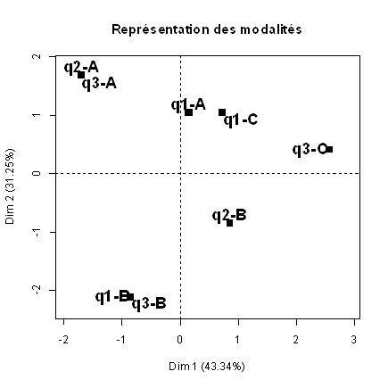
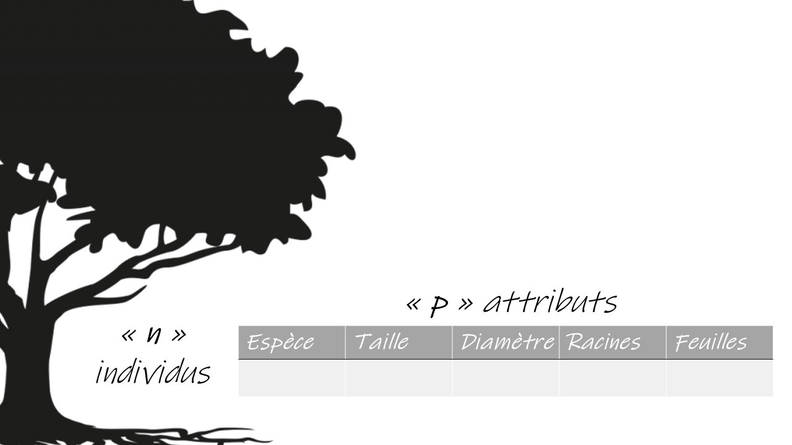
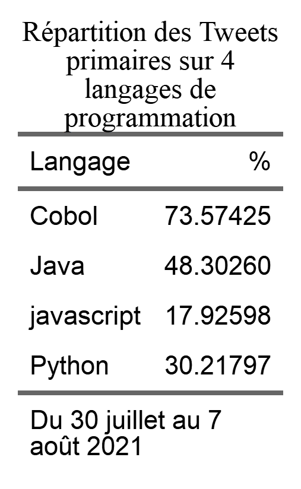
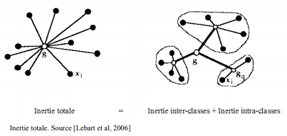

--- 
title: "NLP avec r et en français - un Manuel synthétique"
author: "Sophie Balech, Julien Monnot, Christophe Benavent"
date: "`r Sys.Date()`"
site: bookdown::bookdown_site
output: bookdown::gitbook
documentclass: book
bibliography: [book.bib, packages.bib]
biblio-style: apalike
link-citations: yes
github-repo: rstudio/bookdown-demo
description: " Un manuel pratique de NLP en français"
---

# Préambule


^[Incantation for 6 voices Scott helmes, 2001. [Museum of Minessota](https://medium.com/minneapolis-institute-of-art/painting-a-picture-with-words-a0a3fef3cf63)]


L'écosystème r s'est enrichi ces dernières années à grande vitesse dans le domaine du traitement du langage naturel. 

Le but de ce manuel est de donner une synthèse des méthodes et des modèles disponibles à chacune des étapes de traitement des données textuelles : collecte, pré-processing, modélisation, visualisation.  

Sa vocation est pratique, on s'appuie sur des corpus caractéristiques, et les scripts sont totalement reproductible. 

On y laissera germer quelques considérations plus méthodologiques, voire épistémologiques. On ouvrira chaque fois que c'est possible et nécessaire la discussion aux questions théoriques et éthiques de ces méthodes. Leur réalisation computationnelle est le fruit souvent d'une longue histoire, au cours de laquelle les linguistes ont semé des idées essentielles qu'ont systématisées les informaticiens. Si ce champs est désormais désigné par l'acronyme NLP, pour "Natural Langage Processing" auquel correspond en français le TAL (Traitement Dutomatique du Langage naturel), l'expression de linguistique computationnelle convient peut-être mieux.

On soignera la bibliographie de manière synthétique pour en faire un état de l'art essentiel et actualisé. La rédaction de l'ouvrage est mené avec une règle de reproductibilité et de transparence, c'est le pourquoi le choix de ce support et des jeux de données associés. Il sera dynamique, modifié à mesure de nos cours, séminaires, ateliers et observations des lecteurs.

## Cours et séminaires

La liste des cours et séminaires où il sera présenté et utilisé en 2021-2022.

 * [Colloque Marketing digital 2-3 septembre 2021](https://www.colloquemarketingdigital.com/) : "NLP : un panorama"
 * [AFM 1er Décembre 2021](https://www.afm-marketing.org/fr/content/rencontres-2021) : 
 * Ecole Doctorale de Gestion à la Sorbonne - février 2022, "cours : NLP pour la recherche en gestion"
 * [Dauphine master 204](https://dauphine.psl.eu/formations/masters/marketing-et-strategie/m2-chef-de-produit-et-etudes-marketing) - Cours ["Text Analytics"](https://dauphine.psl.eu/formations/masters/marketing-et-strategie/m2-chef-de-produit-et-etudes-marketing/formation), Novembre 2021
 * [Master Siren - Dauphine](https://dauphine.psl.eu/formations/masters/systemes-information-reseaux-et-numerique) : intoduction aux Datasciences - mai 2022
 * Lille Master Data Science
 * [Ecole Doctorals EOS Nanterre]() : intoduction aux méthodes NLP 


## La structure du livre

L analyse NLP peut être analysée comme un processus qui va de la production jusqu'à la diffusion des analyses. Elle est aussi traversée par des évolutions profondes de méthodes qui ont complexifié au sens formel les modèles initiaux. Ce sont ces techniques que nous introduisons ici. 

Cependant, l'apprentissage automatique appliqué à des milliards de données submerge la statistique. Les modèles de langage distribués par les grands acteurs du gidital, comprennent des dizaines, voir des centaines de milliards de paramètres. On les évoquerons dans les derniers chapîtres.

Le plan suit une logique progresse qui va du simple au très compliqué, et de l'acquisition des données à leur traitement et leur modélisation. 


 * Acquisition des données : directe, api et scrapping
 * Corpus dtm et cooccurence
 * AFC et typologie
 * l'annotation syntaxique et lexicale
 * analyse du sentiment et sa généralisation
 * Word embedness
 * Factorial models
 * Topic analysis
 * ML classique
 * deep learning et transformer
 * méthodes génératives : parce que la prochaine étape c'est quand on appliquera ces méthode sur la productions textuelles des bots.

## Les jeux de données 

Au cours du développement, plusieurs cas pratiques - souvent réduits en volume pour rester exemplaires, seront employés. Les données sont partagées dans le répertoire `.\data\` du repository ``

En voici la présentation  systématique.

 * [Trump Twitter Archive](https://www.thetrumparchive.com/) : L'intégralité des tweets de Trump jusqu'à son banissement le 8 Janvier 2021.
 * Confinement Jour J
 * Citations : un recueil de citations littéraires pour de petits exemples et ponctuer le texte aride d'un peu de littérature et de poésie.
 * Trip advisor Polynésie, un extrait d'un corpus établi par Pierre Ghewy et Sebastien de l'UPF
 * Airbnb : paris 2019, bruxelles 2020 à partir de [InsideAirbnb - adding data to the debate](http://insideairbnb.com/get-the-data.html)
 * Covid : le corpus confinement jour, ainsi que celui de Banda.
 * PMP : titre et abstract de tout les article de la revue "Politique et Management Public" de 1982 à 2020. Le corpus a été constitué à l'inititive de Manel Benzarafa avec le soutien de la revue et des ses éditeurs.
 * David Bowie : Les articles des magazines musicaux relatif à ,la sortie des 23 album de l'artiste. Constitué par Elias Benavent.
 
 * Appli de fitness
 * Langages / Julien

L'ensemble des codes et données sont disponibles dans le [repositery NLP Book](https://benaventc.github.io/NLPBook/) pour la reproductibilités). Les amendements et améliorations sont souhaitées et attendues. 

## Les ressources

Ce  _livre_ est écrit en **Markdown** [@allaire_rmarkdown_2021] et construit avec le package **Bookdown** [@R-bookdown].

Le code s'appuie très largement sur **tidyverse** et emploie largement les ressources de [**`ggplot`**](https://ggplot2.tidyverse.org/reference/index.html) et de [**`dplyr`**](https://dplyr.tidyverse.org/) . On recommande d'étudier ces deux ressources en parallèle.

Une mention particulière doit être faite sur la question du traitement du texte dont [`stringr`](https://stringr.tidyverse.org/articles/stringr.html) est un des outils fondamentaux, même si ardu. Il propose une multitude de fonctions pour traiter les chaînes de caractères. Son étude est recommandée de concert avec la connaissance des [regex](https://stringr.tidyverse.org/articles/regular-expressions.html). 

D'autres outils transersaux sont utilisés dans le manuel. Pour les tableaux, nous opterons la plus part du temps pour les solutions de `flextable`. 

On supposera que les lecteurs ont une connaissance satisfaisante de ces outils génériques, mais à chaque fois qu'on les introduira, on les expliquera.

### Les packages 

Les data sciences sont devenue un jeu de lego. Les briques de base sont les bibliothèques, des packages qui rassemblent un jeu plus ou moins étendu et cohérent de fonctions. On en utilise dans ce manuel un grand nombre. Les packages seront introduits au fur et à mesure de leur première utilisation. On le signale par un commentaire `#library(lib) `. En voici la liste complète, pour reproduire les exemples il est recommandé des les installer tous.


```{r pack, echo = TRUE, message=FALSE, warning=FALSE}
knitr::opts_chunk$set(echo = TRUE, message=FALSE,warning=FALSE)

#boite à outils et viz
library(tidyverse) # inclut ggplot pour la viz, readr et 
library(readr) #lecture de fichier csv
library(scales) # pour affiner les échelles de ggplot

#Vizualisation souvent en développement de ggplot ( inclus dans tidyverse)
library(cowplot) #pour créer des graphiques composés
library(ggridges) # le joy division touch de ggplot
library(pheatmap) #carte de chaleur
library(flextable) #mise en forme de tableaux

#networks
library(igraph) #le standard pour les représentations de réseaux
library(ggraph) #un complément compatible ggplot du précédent

# Accéder aux données
library(rtweet)  # une interface efficace pour interroger l'api de Twitter
library(revtools) #acces aux bases bibliographiques
library(rvest) #pour le scrapping

# OCR et pdf
library(tesseract) #reconnaissance de caractère
library(pdftools) #gérer la lecture des pdf

# Analyse de donnée
library(FactoMineR) #le classique de l'AF et ses variantes
library(factoextra)

# NLP
library(tokenizers)

library(quanteda)
library(quanteda.textmodels)
library(quanteda.textplots)
library(quanteda.textstats)
library(udpipe) #annotation syntaxique
library(tidytext) #lda glove et autres
library(cleanNLP) #annotation syntaxique

library(syuzhet) #analyse du sentiment

#install.packages("remotes")
#remotes::install_github("bmschmidt/wordVectors") 
library(wordVectors)

library(ade4)
library(ExPosition)
library(Biobase)
library(BiocManager)
library(NMF) #non negative factoring

##reconnaissance de langue
library(cld3) # c'est google qui gère
library(textcat) #ngram based

#Analyse du sentiment
library(syuzhet)   #des sentiments , des émotions         

#mise en page des tableaux
library(flextable) # 

#Statistiques et modèles
library(lme4)
library(jtools)
library(interactions)
library("corrplot")

#ML
library(caret)
library(vip)
library(plotROC)
library(MLeval)


#Palettes
library(colorspace) #pour les couleurs
library(viridis)
library(viridisLite)

#utilitaires
library(citr) # un outil interactif pour insérer des références 
library(doParallel)


#Template pour ggplot
theme_set(theme_bw())

```


## Disponibilité

L'ensemble du code est disponible [sur github](https://github.com/BenaventC/NLPBook).

Sous licence creative common ( comment met-on le badge ?)

citation. ( un doi serait bien, au mini un bib)


<!--chapter:end:index.Rmd-->

---
editor_options: 
  markdown: 
    wrap: 72
---

# Introduction {#intro}

Depuis quelques temps déjà, le texte connaît une double révolution. La
première concerne tout d'abord son système de production : il se produit
désormais tant de textes que personne ne peut plus tous les lire, cela
même en réduisant son effort à sa propre sphère d'intérêt et de
compétence. La seconde, est quant à elle, plus propre aux
transformations relatives à sa lecture, qui se retrouve être de plus en
plus conditionnée et recommandée.

La production primaire de textes voit aujourd'hui son volume croître
exponentiellement. Elle se compare à la transition moderne, où le texte
était d'abord copié manuscritement, avant de connaître une recopie plus
standardisée, associée à l'invention et l'essor de l'imprimerie. Ce qui
était alors avant destiné à être reproduit, était le résultats d'un
processus long et exigeant, qui permettait à un petit groupe de lettrés
et d'imprimeurs de contrôler l'essentiel de ce qui pouvait être lu. En
ce sens, la "révolution digitale" permet à un ensemble encore plus
élargi d'individus, via des interfaces numériques simples, de confier
sous forme d'écrits, leurs états d'âme, réflexions et autres opinions.
Cette production se soumet donc à ceux qui en contrôlent les flux et en
exploitent les contenus, les mettant en avant ou les écartant,
définissant ainsi la composition de ce que chacun va pouvoir lire. La
diffusion de cette production suit des lois puissances, c'est ainsi que
la révolution de la lecture est venue avec les moteurs de recherche, et
les pratiques de curations (ref) : une lecture sélectionnée et digérée
par les divers moteurs et algorithmes de recommandations. (ref).

S'il ne fallait citer qu'un exemple, on pourrait évoquer la
transformation radicale de la littérature scientifique, dont le niveau
de production double aujourd'hui presque tous les dix ans.
.http://blogs.nature.com/news/2014/05/global-scientific-output-doubles-every-nine-years.html

A cette production exponentiellement croissante, s'ajoute un effort
d'inventaire. Des standards sont proposés, l'indexation a donné
naissance à l'immatriculation systématique de la moindre note,
l'interopérabilité est de mise, le réseau des co-citations se maintient
en temps réel. Différents scores qualifient autant les articles que
leurs auteurs, comme les revues qui les accueillent. Le monde de la
recherche, processus par nature plus exploratoire, allant vers
l'inconnu, est désormais totalement balisé et quantifié. Le volume
généré est si grand, que la production automatique de résumés, revues
bibliographiques et autres synthèses, se généralise avec un caractère de
plus en plus indispensable.

Le Natural Langage Processing (en français Traitement Automatique du
Langage) est au coeur de ces technologies, et se nourrit de plus en plus
de l'intelligence artificielle. Nous en verrons de nombreux exemples à
tous les stades du traitement : identifier la langue, mesurer le
sentiment, isoler des sujets, calculer une relation syntaxique, évaluer
une intention, détecter une tonalité...

Le NLP est aussi une ressource pour les chercheurs en sciences sociales,
tant par les matériaux empiriques nouvellement mis à disposition, que
par les méthodes d'analyse proposées. C'est une mouvemennt qui affecte
toutes les sciences humaines. L'emballement de la production de texte
génère une nouvelle matière d'étude pour les sociologues, gestionnaires,
économistes, et psychologues.

Si dans ce manuel, on choisit de présenter les différentes facettes de
ce qui s'appelle le "TAL", le "NLP", le "Text Mining", dans une approche
procédurale qui suit les principales étapes du traitement des données,
nous rendrons compte à chaque étape des techniques disponibles, que l'on
illustrera d'exemples. Nous suivrons ici une approche plus fidèle au
processus de traitement des données, lequel peut connaître tant une
stratégie inférentielle et exploratoire (Quelles informations sont
utiles au sein d'un corpus de texte ?), qu'une stratégie plus
hypothético-déductive. Sur ces questions portant sur son usage, nous
choisissons d'être délibéremment agnostiques, préférant présentement de
rester au niveau plus technique et procédural de ces outils de
recherche.

## Une réflexion ancienne et un nouveau champ méthodologique

On ne doit pas se faire aveugler par l'éclat d'une apparente nouveauté
de ces méthodes. Les techniques d'aujourd'hui dépendent d'idées semées
depuis longtemps dans au moins deux champs de recherche académiques : la
linguistique et l'informatique. On peut alors en synthétiser l'idée avec
cette figure annotée. elle en exprime deux veines principales. La
première, est une tension du champs entre la langue comme structure,
quand la seconde considère le langage en tant que capacité et usage.


Les pratiques et techniques que nous allons étudier ne tombent pas de
Mars, mais résultent de plusieurs flux de pensées qui se croisent, se
confortent et amènent l'énergie pour créer un nouveau courant dans le
champs étendu de l'étude de la langue et du langage.

Penser la langue est un effort constant qui a commencé il y a de
nombreuses années, certainement avec les sophistes, et l'idée qu'en
maniant le langage, il est possible de convaincre, en construisant une
logique propre (protagoras, Diogène...). Pour les sophistes : plier le
langage à ses intérêt est une première sciences du langage qui témoigne
d'une connaissance des dispositifs les plus efficaces. Pas sûr que cette
discipline ait trouvé un "episteme" reconnu, mais elle n'en reste pas
moins commune et contemporaine : c'est l'art de la publicité. La
rhétorique n'est pas une discipline morte, elle se développe de manière
concrète dans toute les agences publicitaires.

Donnons quelques points de repère en commençant par quelques définitions
préliminaires, avant de se concentrer sur trois idées essentielles qui
vont prospérer avec le développement de la linguistique computationnelle
et de l'intelligence artificielle. Ces trois idées sont relatives aux
principales branches de la linguistique : à savoir la syntaxe, la
sémantique et la pragmatique. Nous resterons ici silencieux sur la
phonologie (étude de la formation des sons et de la phonétique) dont
l'importance est considérable quand il s'agit de traiter la production
et les interactions orales. Pour ne donner qu'un exemple, la prosodie
(le rythme données aux phrases) est un objet d'étude essentiel dans les
courants de recherches en informatique affective.

### Langue, langage et texte parole

La langue se définit comme un ensemble de règles plus ou moins formelles
que constitue une parole : ce qui se dit de l'un à l'autre ou de l'un
aux autres. Le langage est la capacité à produire cette parole. La
constitution de cette parole par l'écriture constitue le texte. Le
miracle du passage de la parole au signe est celui du symbole.

Parmi les distinctions terminologiques proposées par Ferdinand de
Saussure au début de siècle dernier, autour de la langue, du langage et
de la parole se sont révélées particulièrement pertinentes et restent
toujours utilisées de nos jours.

Le **Langage** : faculté inhérente et universelle de l'humain de
construire des langues (des codes) pour communiquer. (Leclerc 1989:15)
Le langage réfère à des facultés psychologiques permettant de
communiquer à l'aide d'un système de communication quelconque. Le
langage est inné.

La **Langue** : système de communication conventionnel particulier. Par
« système », il faut comprendre que ce n'est pas seulement une
collection d'éléments mais bien un ensemble structuré composé d'éléments
et de règles permettant de décrire un comportement régulier (Pensez à la
conjugaison de verbes en français par exemple). La langue est acquise.

Le langage et la langue s'opposent donc par le fait que la langue est la
manifestation d'une faculté propre à l'humain, qui n'est autre que le
langage.

La **Parole**: une des deux composantes du langage qui consiste en
l'utilisation de la langue. La parole est en fait le résultat de
l'utilisation de la langue et du langage, et constitue ce qui est
produit lorsque l'on communique avec nos pairs.

Le **texte** : Il est la transcription de la parole, même si le plus
souvent, sa production est directe sans étape intermédiaire de
traduction du langage oral.

### Syntaxe et grammaire générative

Nous nous réfèrerons ici à Chomsky et sa grammaire générative. En dépit
de leur très grande diversité, le projet s'appuit sur l'idée qu'un
nombre fini de règles doit produire une infinité d'énoncés. Une
grammaire est générative dans la mesure où elle possède cette propriété.
L'analyse est ainsi tournée vers la compétence, et le linguiste
s'intérresse à l'idéal qu'un locuteur qui, en connaissant ces règles,
serait en mesure de produire une pluralité de discours.

Observant que les enfants apprennent, enracinant le phénomène
linguistique dans la cortalisation du langage, il apporte une idée forte
et structuraliste d'une équivalence entre les langues.

Sous la lumière deTesnière et de ses arbres syntaxiques, les treebanks
contemporains s'inscrivent dans cette perspective et nourrissent les
analyseurs (parser) syntaxiques du langage naturel qui constituent
désormais la première couche d'un traitement de données textuelles.

La grammaire générative a conduit la linguistique dans un tournant
formel où la langue est étudiée indépendemment de ses locuteurs. On
pourra méditer sur le "pourquoi" des algorithmes génératifs
contemporains de deep learning (le fameux GPT3) qui réussissent à former
des phrases syntaxiquement correctes mais absurdes.

### Sémantique : La conception distributionnelle

La tradition lexicologique file le lexique comme une affaire ancienne.
Le français est aidé par des institutions fondamentales : le littré,
l'académie française et les premiers dictionnaires des éditeurs. Pour
étudier un langage il faut se rapporter à des formes stables, les
dictionnaires les documentent et renseignent ces normes pour les coder.

Un moment clé a été de penser le signe, Saussure apporte alors cette
idée fondamentale que dans le symbole, le signe et le signifiant sont
les deux faces d'une même monnaie, qu'il existe une relation entre
l'artefact et l'idée. En d'autres termes; il est possible qu'un signe
particulier puisse signifier une idée : c'est un penseur de la
correspondance.

Selon Saussure, la langue est le résultat d'une convention sociale
transmise par la société à l'individu et sur laquelle ce dernier n'a
qu'un rôle accessoire. Par opposition, la parole est l'utilisation
personnelle de la langue (toutes les variantes personnelles possibles:
style, rythme, syntaxe, prononciation, etc.). Le changement de la langue
relève d'un individu mais son acceptation relève de la communauté et des
institutions. ex.: le verbe « jouer » conjugué «jousent » est pour
l'instant à considérer comme une variante individuelle (parole), une
exception, et il le demeurera tant qu'il ne sera pas accepté dans la
communauté (les locuteurs du français dans ce cas-ci). Sa conception du
signe répond à cette approche conventionnelle : la dualité du signe
comme signifiant et signifié est opérée.

Dans le traitement des données textuelles le "signifié" est le terme
cible de l'analyse, pour en découvrir son signifié on se tourne vers son
contexte : l'ensemble des signifiés. C'est une idée ancienne qu'a
proposé Firth dans les années 30. [@firth_synopsis_1957] construisant
ainsi la genèse du paradigme distributionnel. Un mot trouve son sens
dans ceux qui lui sont le plus associés. C'est, dans cette veine, le
contexte qui donne alors le sens.

(Zipf) L'idée de quantifier le langage n'est pas particulièrement
innovante, et ce, moins encore s'il s'agît d'en compter les occurences
et les cooccurences des mots. Un vaste mouvement s'est formé dans les
années soixante autour de la lexicologue, stimulé par l'école française
de l'analyse de données. Le descendant de ce mouvement se retrouve dans
l'excellent iramuteq de l'équipe de Toulouse, précédé par le fameux
Alceste, et maintenant durablement intégré dans le package R Rainette.

Nous y consacrerons un chapitre complet sur le plan technique. Il reste
important de souligner que cette école française de l'analyse textuelle
ne se limite pas au comptage d'entités. Un logiciel comme trope qui
d'ailleurs ne connait aucun équivalent dans l'écosystème que nous allons
explorer, manifeste aussi cette inventivité, où s'exprime pleinement la
logique distributionnelle.

### L'approche pragmatique : les fonctions et acte du langage

Si la grammaire générative se tourne délibéremment plutôt vers la
compétence et ignore la performance, c'est à dire la production
d'énoncés par les humains en situation d'interaction plus que sur les
effets de l'énoncé lui-même, un autre courant de la linguistique s'est
emparé de la question, le courant dît de la pragmatique du langage.

Le grand classique de ce courant est la théorie des fonctions du
language, qui sous-tendent la production d'un message : l'acte de
parole, proposée par Jakobson. Inspiré par la cybernétique, la structure
de son modèle est celle d'un acte de communication. Jackobson identifie
les éléments de l'évènement discursif (speech event) et les fonctions
qui lui sont associées. Pour le paraphraser, un LOCUTEUR envoie un
MESSAGE à un ou plusieurs INTERLOCUTEUR(S) qui, afin d'être compris,
requiert un CONTEXTE dont les acteurs de l'évènement discursif sont
capables de saisir et de verbaliser, ce qui suppose l'existence d'un
CODE au moins partiellement commun et d'un CONTACT, canal physique ainsi
que d'une connection psychologique. On listera alors, au sens du
théoriocien [@jakobson_linguistics_1981][àlire
ici](https://pure.mpg.de/rest/items/item_2350615/component/file_2350614/content)

-   La fonction référentielle ou représentative (aussi dénommée
    sémiotique ou symbolique), où l'énoncé donne l'état des choses , où
    le message dénote un contexte. Jakobson emploie aussi les termes de
    dénotatif ou cognitif.
-   La fonction expressive (émotive), où le sujet exprime son attitude
    propre à l'égard de ce dont il parle.
-   La fonction conative, lorsque l'énoncé vise à agir sur le
    destinataire : elle s'exprime grammaticalement par l'impératif ou le
    vocatif.
-   La fonction phatique, empruntée à Malinoswki où l'énoncé révèle les
    liens ou maintient les contacts entre le locuteur et l'interlocuteur
    ;
-   La fonction métalinguistique ou métacommunicative, qui fait
    référence au code linguistique lui-même, qu'il soit théorisé ou
    internalisé par le locuteur, comme la prose de Monsieur Jourdain.
-   La fonction poétique, lorsque l'énoncé est doté d'une valeur en tant
    que tel, valeur apportant un pouvoir créateur et dont Jakobson
    illustre avec l'exemple de la jeune fille qui a l'habitude de
    désigner Harry par "Horrible Harry" sans pouvoir expliquer pourquoi
    il ne serait pas l'odieux, le dégoûtant, ou le terrible Harry, alors
    que sans s'en rendre compte, elle emploie une
    paronomasie/alliteration : la ressemblance phonologique et
    prosodique des mots produit un puissant effet poétique.

John Langshaw Austin s'intéressant à la fonction conative développe le
concept d'acte de langage, introduisant l'idée fondamentale que les
actes de langage (la production d'un énoncé) ne sont pas uniquement
destinés à décrire le monde tel qu'il est, mais bien à agir sur le monde
par le biais du locuteur et du destinataire. Parler devient alors
également, faire. La théorie des actes de langage est d'abord une
catégorisation des différents actes. Il distingue trois types de
réalisations s'opérant au travers du langage :\
\
Le locutoire : cette dimension du langage est réalisée à partir du
moment où un énoncé, est juste grammaticalement, dans les règles de la
langue dans laquelle il est émis. Prononcer à table, la phrase :
"Est-ce-qu'il y a du sel ?", est une construction langagière correcte,
et se réalise dans sa première dimension. Cependant, dans la théorie
linguistique de John Langshaw Austin, le message convoyé par un énoncé
va au-delà de son sens immédiat, et s'intègre dans une seconde
fonction.\
\
L'illocutoire : L'exemple précédent n'a pas, du seul fait de sa
formulation, uniquement pour fonction de s'informer sur la présence de
sel dans la maison (ou dans le plat, contenu locutoire de l'énoncé). Il
exprime plutôt que l'on voudrait saler son plat (fonction illocutoire)
et se traduit généralement par le fait que l'un des convives réagisse,
par exemple en passant la salière au locuteur. Ce faisant, le langage
performe un troisième niveau de discours, qu'Austin nomme la dimension
perlocutoire.\
\
Le perlocutoire : Cette dimension finale se conjugue donc avec les deux
précédentes, mais son produit n'est pas commutatif, dans le sens où les
actions et interprétations sujettes de notre énoncé 1 dépendent des
fonctions plus basses de ces derniers, et s'enracinent également dans le
contexte de ceux-ci et d'éléments plus ou moins extra langagiers. Cette
idée est au cœur des sousbassements de la théorie des actes de langage
d'Austin, qui se détache donc fortement d'un langage uniquement
communicatif, au détriment d'une vision de ce dernier comme un outil
plus performatif que descriptif. Dire devient alors faire, car le
langage agit et transforme l'univers des interlocuteurs.\
\
Genette et l'intertextualité, le palimpseste. c'est une question de
sens, le sens d'un texte vient de ses prédecesseurs et de ceux à qui ils
se réfèrent. Les auteurs au travers des textes se répondent l'un
l'autre, et ce n'est pas dans leur contenu qu'on trouvera une vérité
mais dans le rapport qu'ils établissent avec leurs prédecesseurs, par
l'appareil des notes et des bibliographies, des références et mises en
perspectives. Cette approche vient questionner l'apparente et rassurante
téléologie naturelle que chacun est tenté de voir, dans la remise en
continuité d'éléments qui sont alors détachés de leurs contextes de
production.

-   La narrativité

### La linguistique computationnelle

Les points de contact entre linguistique et informatique se produisent
en rapport à diverses questions pratiques, portées sur le traitement et
la computation d'éléments langagiers recensés selon des sources tant
orales qu'écrites, pour diverses finalités opérationnelles.
(traductions, analyses, transcriptions, synthèses...)

Les apports de la fouille de données

les nomenclatures

une convergence nécessaire

Le monde des bibliothèques et celui de la GED.

## Les facteurs de développement de l'usage en science sociale

Ces développements sont favorisés par un environnement fertile où trois
facteurs se renforcent mutuellement. Ils conduisent à l'élaboration de
nouvelles méthodes.

-   La naissance et généralisation de langues informatiques universelles
-   L'emergence de vastes ensembles de données textuelles
-   La naissance d'une communauté épistémique, de pratique et de

### Une lingua franca

Le premier facteur de développement est l'expansion de la programmation
orientée objet (POO). Plus spécifiquement dans le cas de la manipulation
des données, deux langages de programmation se distinguent
particulièrement, dans un usage proprement statistique pour R et plus
généraliste en ce qui concerne Python. Le propre de ces langages est,
prenons le cas de R, de permettre d'accéder à des interfaces et
fonctions mathématiques, dont un ensemble cohérent pour réaliser
certaines tâches peut être rassemblé dans une bibliothèque appelée
"package" ou "librairie". Ces bibliothèques de fonctions se chargent en
mémoire facilement via la commande R suivante : library(nomdupackage).
On dispose désormais de milliers de packages (17 788 sur le CRAN)
destinés à résoudre un nombre incalculable de tâches. Une petite
représentation ci-dessous témoigne de l'évolution exponentielle des
outils mis à dispositions de la communauté R :


Développer et concevoir le code d'une analyse revient ainsi à jouer avec
un immense jeu de briques, similaires aux Lego de notre enfance, dont de
nombreuses pièces bas niveau sont déjà pré-moulées. D'un point de vue
pratique, les lignes d'écritures sont fortement simplifiées, permettant
à un chercheur non spécialisé en programmation d'effectuer simplement
des opérations complexes. En retour, cette facilitation de l'analyse
abonde le stock de solutions.

### La multiplication des sources de données.

Le second facteur d'évolution est la multiplication des sources de
données et leur facilité d'accès.

-   Le contenu écrit des réseaux sociaux,
-   Les rapports d'activités des entreprises,
-   Les compte-rendus archivés de réunion,
-   Les avis des consommateurs sur les catalogues de produits,
-   Les articles et les revues scientifiques,
-   Les livres numériques...

Les sources les plus évidentes sont proposées par les bases d'articles
de presse telles que presseurop ou factiva. Les bases de données
bibliographiques sont dans la même veine particulièrement intéressantes
et pensées pour ces usages.

Les données privées, et en particulier celles des réseaux sociaux, même
si un péage doit être payé pour accéder aux plateformes via différentes
APIs, popularisent le traitement de données massives.

Les forums et sites d'avis de consommateurs sont pour les sociologues de
la consommation et les spécialistes du comportement de consommation une
ressource directe et précieuse.

Le mouvement des données ouvertes (open data) proposent et facilitent
l'accès à des milliers de corpus de données : grand débat, European
Survey...

### Une communauté

Le troisème facteur de développement , intimement lié au premier, est la
constitution d'une large communauté de développeurs et d'utilisateurs
qui se retrouvent aujourd'hui dans des plateformes diverses. Le savoir,
autrement dit des codes commentés se trouvent dans une varété importante
de lieux :

-   Des plateformes de dépôts telles que Github, qui rassemblent une
    trentaine de millions de développeurs et data scientists.\
-   Des plateformes de Q&A (question et réponses) telles que [Stalk Over
    Flow](),
-   Des tutoriaux de toute sortes : cours, vidéos et autres Mook
-   Des blogs ou des fédérations de blogs (BloggeR),
-   Des revues (Journal of Statistical Software) et de bookdown.

Des ressources abondantes sont ainsi disponibles et facilitent
l'auto-formation des chercheurs et des data scientists, en proposant des
ressources pour la résolution de leurs problèmes pratiques. Quiconque
n'arrive pas à résoudre un problème a une bonne chance de trouver la
solution d'un autre, à un degré de circonstances près. Elles sont
d'autant plus utiles que certaines règles ou conventions s'imposent
progressivement pour fluidifier l'échange et les projets individuels :

La principale démarche est alors celle de l'exemple reproductible.

La seconde est le maintien d'une éthique du partage qui encourage à
partager le code, et dont une littérature importante étudie l'effet
positif sur les performances économiques et la durabilité [rauter]. Les
externalités de réseaux y sont fortes.

Toutes les conditions sont réunies pour engendrer une effervescence
créative. Python ou R, sont dans cet univers en rapide expansion, les
langues véhiculaires qui favorise une innovation constante. Les
statistiques de Github en témoigne : près de 50 millions d'utilisateurs,
128 millions de "repositories" et 23 millions de propriétaires.


voir aussi
<https://towardsdatascience.com/githubs-path-to-128m-public-repositories-f6f656ab56b1>

## De nouvelles méthodologies pour les sciences sociales

Pour les chercheurs en sciences sociales, et donc nécessairement, pour
les chercheurs en sciences de gestion, lieu de rencontre entre toutes
les sciences sociales, cette révolution textuelle offre de nouvelles
opportunités d'obtenir et d'analyser des données solides pour vérifier
leur hypothèses et mener leurs enquêtes. Ce sont de nouveaux terrains,
de nouvelles méthodes et un nouvel objet de recherche qui se dessine
dans le développement du champ scientfique contemporain.

### Nouveaux terrains :

La multiplication des sources de données précitées, associées à leur
progressive normalisation, permet une prolifération de techniques
provenant de multiples courants disciplinaires, convergeant toutes vers
un langage commun. En ce sens, la production abondante d'avis de
consommateurs, de discours de dirigeants, de compte-rendus de conseils
et colloques, d'articles techniques, de travaux en linguistique
computationnelle, de diverses fouilles de données, des moteurs de
recommandation, de la traduction automatique, offre des ressources
nouvelles et précieuses pour traiter l'abondance des données générées.

### Nouvelles méthodes :

Un nouveau paradigme méthodologique se construit à la croisée de données
abondantes et de techniques intelligentes de traitement . Il permet
d'aller plus loin que l'analyse lexicale traditionnelle en incorporant
des éléments syntaxiques, sémantiques, et pragmatiques, proposés par
l'ensemble des outils de traitement du langage naturel. Il se dessine
surtout une nouvelle approche méthodologique qui prend place entre
l'analyse qualitative, et les traditionnelles enquêtes par
questionnaires capables de traiter des corpus d'une taille inédite. Le
travail de [@humphreys_automated_2018] en donne une première synthèse
dans le cadre d'un processus qui s'articule autour de 6 différentes
phases d'une recherche :

-   La formulation de la question de recherche

-   La définition des construits,

-   La récolte des données

-   L'opérationnalisation des construits

-   L'interprétation et l'analyse,

-   La validation des résultats obtenus.

## Un nouvel objet :

On pourrait croire qu'avec des données massives et des techniques
"intelligentes" nous assistons à un retour du positivisme qui
bénéficierait enfin des instruments de mesures et de calculs ayant
permis à certains chercheurs au plus proche de la matière des succès
majeurs. Sans nul doute, l'administration de la preuve va être faciliter
par ces techniques et va encourager l'evidence based policy (REF) afin
de résoudre en partie la crise de la réplication et de la
reproductibilité des travaux de recherche.

Cependant, à mesure que se développe l'appareillage de méthode et de
données, moins l'on peut supposer que l'observateur reste neutre. En
effet, ni les téléscopes géants, ni les synchrotron, n'affectent les
galaxies lointaines ou les atomes proches. Le propre des données que
l'on est amené à étudier est de résulter de la confrontation d'un
système d'observation (certains préfèrent alors parler de surveillance),
à un agent, doué de buts, d'une connaissance, de biais, et de
ressources. Le dispositif de mesure est en lui-même performatif.
L'exemple le plus évident est celui des systèmes de notation, qui sous
prétexte de transparence donne la distribution des répondants
précédents. L'agent qui va noter choisit la valeur en fonction d'une
norme apparente - la note majoritaire- et de sa propre intention - se
manifester ou se confondre à la foule.

Pour se donner une idée plus précise de ce mouvement, examinons quelques
publications récentes dans les champs qui nous concernent.

### Sociologie et histoire

classes sociales avec word to vec en sociologie
[@kozlowski_geometry_2019].

L'article révolution française [PNAS)

On citera cependant jean-baptiste Coulmont et son obstination à étudier
les entités nommées, prénoms et autres marqueurs culturels de l'identité
et des classes.

et au luxembourg

### Psychologie

Très tôt la psychogie s'est intéressée au langage, pas seulement comme
produit des processus psychologiques, mais comme expression de ceux-ci.

Dès les années 1960 dans le champ de la psychologie de l'éducation, doué
d'une forte motivation positiviste, s'est posée la question de la mesure
de la difficulté d'un texte pour un niveau d'éducation donné. La mesure
de la lisibilité des textes s'est alors développée, profitant à d'autre
secteurs tels que ceux de la propagande. Dans cette même perspective,
l'approche scientifique de la richesse lexicographique comme concept
représentant les compétences a à son tour développé de nouvelles
instrumentations.

James W. Pennebaker a développé son approche à partir de l'étude des
traumas; donnant une grande importance à la production discursive des
patients. Sa contribution majeure est l'établissement d'un ensemble de
dictionnaires destinés à mesurer des caractéristiques du discours. Un
instrument qu'on présentera dans le chapitre 7 (à
vérifier)[@tausczik_psychological_2010].

Son approche se poursuit en psychiatrie avec l'analyse des troubles du
langage, et a connu un coup d'éclat avec la demonstration que l'analyse
des messages sur les réseaux sociaux comme facebook permet de détecter
des risques de dépression.[@eichstaedt_facebook_2018].

### Management

La finance et l'analyse du sentiment

Dans le champ du management, on trouvera des synthèses pour la recherche
en éthique [@lock_quantitative_2015], en comportement du consommateur
[@humphreys_automated_2018] en management public
[@anastasopoulos_computational_2017] ou en organisation
[@kobayashi_text_2018] ,

### Economie

economie des brevets intervention des institutions mesure de
l'innovation

## Des comptables à l'industrie de la langue

La situation nouvelle qui semble être la notre consiste dans le fait que
la parole qui disparaissait avant comme emportée par le vent, laisse
désormais des traces et s'enregistre. L'ironie est qu'au titre de la
protection de la vie privée, cet enregistrement systèmatique doit être
mis à notre disposition. On a le choix : rien n'en faire, les détruire,
ou bien encore les donner, afin de bénéficier de son potentiel de
connaissance. Nous sommes passé de la parole au texte. Si seule la
parole de Dieu et celle des chants étaient transcrites, c'est désormais
aussi celle du vulgum. Si sa précision reste incertaine, son volume
quant à lui a gagné de nombreuses échelles.

Cette matière ne s'organise plus dans les papyrus, tablettes d'argiles
et autres manuscrits, ni même dans les livres sués par les
callygraphieurs, elle s'incruste dans un édifice de plus en plus
complexe d'interfaces textuelles et vocales. La parole est comme
absorbée par les machines. Elle ne s'envolent plus avec le vent, elle se
sédimente dans des data center, nouveaux monolithes modernes. Le langage
a acquis une dimension matérielle qu'il n'a presque jamais connu. Il
gagne de l'autonomie avec les systèmes génératifs : chat bots,
transcriptions, traductions, résumés.

L'histoire se définit selon son écriture. [Daniel Gaxie, La raison
Graphique] L'écriture est le produit d'une société de procès-verbal, de
comptabilité et cela se poursuit. Voilà qui facilite le travail de
l'historien, du sociologue et de l'économiste.

Dans les années 90 s'est dessinée une société de l'information, sauvage
jusqu' à Napters, et le rêve du peer to peer, elle s'est socialisée dans
les années 2000, platformisée dans les années 2010, généralisée pour la
décennie qui nous concerne. Toute cette architecture s'appuie sur les
données qu'on y injecte, et au premier rang, y siège le texte, la
transcription automatique de la parole, dans une recodification
constante et des traitements de plus en plus hyperconcentrés.

## Conclusion

Le point d'entrée qu'est la technique est privilégié dans ce manuel.
Pour autant, l'on se donnera des espaces de réflexion, d'interrogation,
des espaces epistémologiques (Comment étudier le langage par le langage
?) ainsi que des espaces plus anthropologiques (quelle est l'origine et
la spécificité du langage humain en dépit de ses innombrables variétés
?).

Une première parenthèse est expérientielle, c'est en faisant que nous
avons découvert une autre écriture. L'expérience de ce livre, qu'on
partage avec de nombreux utilisateurs de ces nouveaux outils, est celle
d'une écriture programmatique, performative. Ecrire c'est faire, les
meta-langage transforment la transcription de la parole en une nouvelle
connaissance. On peut agir sur la parole, sur le texte, le tordre, le
presser, le décoder . On peut lire les foules.

Les langages tels que la linguistique classique étudie sont verbaux,
d'autres sont iconiques, architecturaux, graphiques, chorégraphiques,
musicaux. Elles se rencontre dans le flux d'une parole qui associe le
texte à l'image dans des rapports d'illustations et de commentaires,
jouant du contrepoint à travers les médias.

Par le texte, le sociologue, l'économiste ou le gestionnaire veulent
co-prendre, ou comprendre, la génèse et la détermination des choix.
Etudions donc le texte.

L'acte de parole se réalise dans un lieu à un moment, avec des
protagonistes, dans une atmosphère, avec une histoire, les mots qui s'en
échappent ne sont que des traces, autant que des photographies. Ces
données se sédimentent dans les grands bassins du cloud hybride et dans
les corpus constitués historiquement et méthodiquement.

<!--chapter:end:01-intro.Rmd-->

# La diversité et la nature des corpus

## Différents types de corpus

Les critères de classement :

-   Le nombre de documents

-   La taille des documents : courts vs documents longs : le twitt vs le livre

-   Le niveau de langue : texte vernaculaire - langue soutenue

-   La configuration : locuteur unique ou locuteurs multiples

-   interaction ou nom des locuteurs

-   Le degré de structuration : séquentielle, plan spatiale ( ex = le curriculum viate, la fiche de brevet,...)

## Problèmes d'échantillon

Un corpus reste un échantillon. Dans ce chapitre nous avons appris comment faire la cueillette dans les sources de textes et constituer matériellement un corpus. Il reste à traiter la question de la représentativité. La collecte doit rester raisonnée.

Les unités de texte. Une unité de texte se définit comme une chaine de caractères intégrée dans un document. Celui ci peut être de forme quelconque : un livre un article, une note, une transcription,

-   Un document
-   Un ou des auteurs du document
-   Une date
-   Un endroit
-   Un contexte : les unités précedente, et subséquentes.

Unités de production et de reception, Un texte est produit et puis, peut-être, lu. Analyser le texte peut se faire dans deux perspectives, celle de la production et celle de la réception. Les corpus doivent être construit en fonction de ce critère.

Examiner la question de l'engagement dans ce cadre est essentiel, certains acteurs sur un sujet donné sont amenés à produire plus que les autres, et participent donc de surcroit à une surreprésentation statistique. La question du biais de selection

Un corpus est un ensemble de documents. Ils peuvent être entendus comme :

-   Courts à l'image des tweets,

-   Modérés - abstract articles court -

-   Longs ( article de recherche, ou très long (livres).

La collecte peut également se faire sur des matériaux primaires et picturaux, numérisés sous forme d'images, dans lesquels il est possible de détecter automatiquement des éléments textuels, en analysant leurs pixels.

<!--chapter:end:02-nature-des-corpus.Rmd-->

# Constitution du corpus

**Objectifs du chapitre :**

-   <div>

    -   Explorer différentes techniques de collectes de données : exploitation de bases textuelles, méthodes de scrapping, APIs, extraction de document pdf, extraction de textes dans des images, et une perspective oral avec les techniques de speech2tex.

    </div>

La constitution d'un corpus est la première étape d'un projet NLP. Il se définit d'abord par la constitution d'une collection de textes dont la provenance est la nature peut être diverse. Dans ce chapitre on va examiner plusieurs techniques de collecte, puis conclure avec quelques réflexions sur la question de la constitution de l'échantillon.

-   L'exploitation de bases textuelles
-   Les méthodes de scrapping
-   Le recours aux APIs
-   La collection de documents pas uniquement textuelle
-   Les sources orales

## La gestion des documents numériques

Dans certains cas le matériau se présentera sous forme de documents numériques tels qu'un pdf, ou même de simples images.

voir aussi

<https://cran.r-project.org/web/packages/fulltext/fulltext.pdf>

### Extraire du texte des pdf

Le package [pdftools](https://ropensci.org/blog/2016/03/01/pdftools-and-jeroen/) est parfaitement adapté à la tâche. Des fonctions simples extraient différents éléments du pdf :

-   Les information relatives au document pdf lui-même

-   La liste des polices employées

-   Les attachements

-   La table des matières (si elle a été encodée)

-   Les chaînes de caractères constituant le texte dans un ordre de droite à gauche et ligne à ligne, reconnaissant cependant les retours chariot, et autres sauts de lignes séparant les paragraphes

Chaque page est contenue dans une ligne.

```{r 207, fig.cap='', out.width='80%', fig.asp=1, fig.align='center', fig.width=9}
library(pdftools)

info <- pdf_info("./pdf/2021neoliberalismegouverner_Meunier_Esprit.pdf")
info

fonts <- pdf_fonts("./pdf/2021neoliberalismegouverner_Meunier_Esprit.pdf")

files <- pdf_attachments("./pdf/2021neoliberalismegouverner_Meunier_Esprit.pdf")

toc <- pdf_toc("./pdf/2021neoliberalismegouverner_Meunier_Esprit.pdf") #il n'y a pas de table des matière dans ce texte

text <- pdf_text("./pdf/2021neoliberalismegouverner_Meunier_Esprit.pdf")
cat(text[[1]]) # pour afficher le texte de la page 1


```

Il va falloir traiter ce texte en analysant précisément sa composition. Pour ce faire, il s'agîra de définir une séquence d'opérations logiques qui permette un premier nettoyage du texte. Dans l'exemple nous allons de plus essayer de conserver la structure des paragraphes du texte.

-   Suprimer haut et bas de pages
-   Supprimer les sauts de ligne
-   Identifier les sauts de paragraphes
-   Enlever les notes de bas de page
-   Corriger l'hyphénation ()
-   regrouper les document en un seul bloc de texte
-   le splitter en autant de paragraphes.

On va utiliser des fonctions de traitement de chaines de caractère avec Stringret le recours à l'art ( ici simple) des regex auxquels on consacre un développement dans le chapitres X.

```{r 208, fig.cap='', out.width='80%', fig.asp=1, fig.align='center', fig.width=9}
tex<- as.data.frame(text)
tex[1,]
t_reg<-str_replace(tex$text,"[\\s+].*Meunier[\n]+", " ") # entete droite
## on selectionne tout bloc de texte qui commence par un nombre indéterminée de blanc qui s'achève par n'importe quel caractère répétés mais terimé par la séquence Meunier suivie de sauts de ligne.
t_reg<-str_replace(t_reg,"[\\s+].*gouverner[\n]+", " ") # entete gauche
t_reg<-str_replace_all(t_reg,"[\\s+].*2021[\n]", " ") # bas de page  gauche
t_reg<-str_replace_all(t_reg,"ESPRIT.*[\n]", " ") # bas de page droit

#on marque les paragraphes avec la chaine XXX pour les splitter dans un second temps


t_reg<-str_replace_all(t_reg,"\n\n\n", "XXX") 

# On supprime les saut de ligne en les remplaçant par un espace

t_reg<-str_replace_all(t_reg,"[\n]", " ")

#on enlève les notes de bas de page
t_reg<-str_replace_all(t_reg,"\\d\\s[\\-].*XXX", "XXX")

#on regroupe les pages

t<-paste(unlist(t(t_reg)), collapse=" ")


#on enlève les notes dans le texte

t<-str_replace_all(t,"[A-Z|a-z]+\\d\\s[\\-]", " ")

t<-str_replace_all(t,"\\d\\d\\s[\\-]", " ")

#hyphenation

t<-str_replace_all(t,"[A-Z|a-z]+[\\-]\\s", "")

#pour enlever les espaces excedentaires

t<-str_squish(t)
t

#On découpe en paragraphes
t<- str_split(t, "XXX",simplify = TRUE)
t2<-as.data.frame(t(t))

```

Plus les textes sont standardisés et plus simple est le processus d'importation des pdf. Si l'on souhaite aller plus loin on recommande par exemple <https://ropensci.org/blog/2018/12/14/pdftools-20/> pour extraire un tableau. ( à développer en 4 ou 5 lignes avec des références)

### La numérisation et l'OCR

D'immenses archives sont numérisées, ce qui signifie qu'elles sont stockées sous forme d'image. L'information est contenu dans les pixels, et l'enjeu est d'y reconnaitre des formes caractéristiques : alphabet, ponctuation à travers de multiples variations. Les plus fortes sont celles manuscrites, mais l'écriture typographique est aussi très variables dans ses formes. C'est un enjeu industriel ancien. La reconnaissance optique des caractères a cependant fait d'immense progrès et atteint des niveaux de performance élevés.

Le traitement des adresses a sans doute été le problème principal qui a stimulé les technologies de l'OCR. La qualité du matériau est essentiel, et s'assurer que les expéditeurs choisissent un modèle conventiel et normé de rédaction de l'adresse est une condition de leur succcès. La situation idéale ressemble à ceci.


La réalité ressemble souvent à celà


Dans un environnement en science sociale la situation est moins complexe, les documents analysés ne seront le plus souvent pas des documents mansuscrits ( sauf pour les médiévistes), mais un scan de document plus structuré. Par exemple les jpg

Une solution pour R est [tesseract](https://cran.r-project.org/web/packages/tesseract/vignettes/intro.html). C'est un package qui permet d'accéder au programme du même nom, développé à l'origine chez Hewlett-Packard Laboratories entre 1985 et 1994, avec quelques modifications supplémentaires apportées en 1996 pour le portage sur Windows, et sur C en 1998. Tesseract a été mis en open Source par HP, en 2005, puis de 2006 à novembre 2018, a continué d'être développé par Google. Il s'appuie sur des réseaux neuronaux de type LSTM. C'est une petite, mais puissante intelligence artificielle qui supporte plus d'une centaine de langues.

Testons-le sans attendre avec le texte suivant. Extrait du premier article du premier numéro de la revue " Etalages" Publiée en France de 1909 à 1938. L'image est un extrait du document numérisé fournit par la BNF.


<https://gabriben.github.io/NLP.html#introduction>

```{r 209, fig.cap='', out.width='80%', fig.asp=1, fig.align='center', fig.width=9}
#library(tesseract)
tesseract_download("fra") #pour télécharger le modèle de langage

t1<-Sys.time()
text <- tesseract::ocr("./images/N1_avril1909b.jpeg", engine = "fra")
t2<-Sys.time()
t<- t2-t1 #pour compter le temps de calcul
cat(text) #pour afficher le texte avec sa mise en page

#tesseract_info() #voir les langues disponibles
t
```

Pour améliorer la performance qui peut se mesurer au niveau des lettres, mais doit surtout l'être au niveau des mots, deux stratégies sont possibles. La première de préprocessing, la seconde de postprocessing avec un mécanisme de détection et de correction d'erreurs. Le preprocessing consiste à traiter l'image en renforçant les contrastes , en éliminant le bruit, on en rend les pixels mieux digestes pour tesseract. C'est ce à quoi s'attache le pakage magick qui offre un bouquet de fonctions à cette fin. Nous laissons le lecteur le tester seul.

Le post-processing sert à introduire des mécanismes de correction d'erreurs au niveau des mots. Pour une idée de ce type de développement voir [Gabriel, Yadir, Xiaojie, Mingyu](https://gabriben.github.io/NLP.html)

Naturellement, un paramètre important est la vitesse de traitement des images. Dans un projet complet on peut être amener à traiter des centaines images en boucle. Dans notre exemple la durée est de `t` secondes, autrement dit 6 images à la minute ou 360 à l'heure...

### Du speech au texte

La tradition méthodologique de la sociologie est celle de l'entretien, avec toute sorte d'acteurs. Elle aboutit à la production de transcriptions, plus ou moins détaillées et précises. Mais des textes

On peut désormais enregistrer la paroles des interfaces vocales. Le speech to text est de plus en plus efficace, voir l'API de google.

Il existe déja des packages sur R qui permettent d'accéder aux solutions de google langage qui necéssite une clé d'API.

<https://cran.r-project.org/web/packages/googleLanguageR/vignettes/setup.html>

On ne fait qu'entre-ouvrir le sujet, mais il est certainement un des futurs du NLP.

## L'exploitation de base de données textuelles

### le cas europresse

On commence par un exemple simple en utilisant la base [europresse](http://www.europresse.com/fr/). L'objectif est de constituer un fichier de références bibliographiques, exploitable via R.

Dans europresse , nous avons fait une recherche sur les articles comprenant le terme " vaccination" dans la presse nationale françaises, constituées de 14 titres. On retient les 150 derniers articles au 16 Juillet 2021.

On utilise [revtools](https://revtools.net/data.html#importing-to-r) pour sa fonction d'importation des fichiers au format .ris et de transformation en data frame structuré

```{r 201, fig.cap='', out.width='80%',caption= "le traitement de la vaccination dans la presse nationale française", fig.asp=1, fig.align='center'}
library(revtools)


df <- read_bibliography(iconv("./data/20210719013820.ris"))

flextable(head(df,3))
df<-df%>%
  mutate(jour=substring(DA,1,2))

g22<-ggplot(df, aes(x=jour))+
  geom_bar()+labs(x=NULL,y="Fréquence")+
  geom_vline(xintercept=12, linetype="dashed", color = "red")+
  facet_grid(vars(journal))
g22

# screen_topics()


```

`revtools` n'est pas fait que pour importer des données au format bibliographique .ris, ou .bib, et de les transformer un tableau observations - variables. Il a des fonctions de visualisations rapides fort efficaces. La plus spectaculaire est un outil de visualisation conçu avec `shiny`, le package star des graphes interactifs. Il s'appuie sur deux modèles de détections de topics (ce sujet sera l'objet du chapitre 8), paramétrables de manière interactive en quelques minutes.

C'est un outil fantastique pour jeter un premier coup d'oeil sur les données, un plug in très pratique pour une première approche exploratoire.

On l'applique sur nos données. L'allure de l'interface est la suivante.


L'interface n'étant pas programmatique, on exporte quelques images en jpeg (un bouton dans l'interface permet de faire celà sans effort) et on les récupère avec `cowplot`, le package qui permet d'assembler des visualisations et que nous utiliserons systématiquement dans ce cours.

```{r 202, fig.cap='', out.width='80%',caption= "Disctribution des topics et des document dans leur espace (ACP)", fig.asp=1, fig.align='center'}
p1 <- ggdraw() + draw_image("./images/topic_espace.png")
p2 <- ggdraw() + draw_image("./images/topic_topic.png")
p3 <- ggdraw() + draw_image("./images/topic1.png")
p4 <- ggdraw() + draw_image("./images/topic5.png")

plot_grid(p1, p2 , ncol=2)
```

Pour illustrer les graphiques des termes les plus proches du topic 1 et du topic 5. L'un est relatif à l'actualité australienne, l'autre à l'actualité anglaise.

```{r 203, fig.cap='', out.width='80%',caption= "La description des topic 1 et 5", fig.asp=1, fig.align='center'}

plot_grid(p3, p4 , ncol=1)

```

La méthode est sympa, rapide, sur le pouce, mais pas suffisante pour aller au-delà et notamment comparer les lignes éditoriales des deux titres que nous avons choisis. A ce stade préliminaire de l'analyse c'est déjà beaucoup.

### Jouer avec les bases bibliographiques

Fulltext

<https://books.ropensci.org/fulltext/data-sources.html>

## Lire le web : Scrapping

Le scrapping correspond à un internet sauvage où la collecte d'informations se traduit par une technique de chasseurs-cueilleurs, le glanage. C'est l'activité qui consiste à moissonner les informations disponibles sur le net en simulant et en automatisant la lecture par un navigateur ( on préfère l'expression des quebecois : des butineurs).

Elle consiste à construire un robot capable de lire et d'enregistrer les informations disponibles sous forme html puis à les distribuer (parsing) dans des tableaux structurés, selon une stratégie d'exploration du web préalablement définie. En réalité le scrapping pose deux problèmes :

-   Celui de la structure de recherche. C'est le problème que relève les spiders, des robots qui recherchent dans les pages des liens, et vont de proche en proche, de lien en lien, pour explorer un domaine. Ils peuvent être plus systématiques et prendre davantage de l'organisation et structure d'un site web pour énumérer les pages.

-   Celui de la collecte de l'information sur chacune des pages. Il s'appuie sur le principe que le langage html est un langage à balise où le contenu et le contenant sont clairement séparés. Par exemple, dans le corps de texte d'une page on définira un titre par la balise

    <h1>

    dont l'instruction s'achève par la balise

    </h1>

    . On sépare ainsi clairement le contenu de la forme.

\`

<body>

<h1>

Un titre de niveau 1 (un gros titre)

</h1>

    <p>Un paragraphe.</p>

    <h2>Un titre de niveau 2 (un sous titre)</h2>
      <p>Un paragraphe.</p>

      <h3>Un titre de niveau 3 (un sous-sous titre)</h3>
        <p>Etc.</p>

</body>

\`

Ultérieurement on pourra définire les propriétés graphiques d'une balise par des CSS. Par exemple avec ceci, les paragraphes seront publiés en caractère bleu.

`p{     color: blue; }`

Ce qui nous intéresse n'est pas la décoration, mais le fait que les développeurs définissent des balises spécifiques pour chacun des éléments de leurs pages web, et que si nous savons les repérer , nous avons le moyen de mieux lire le texte. Les balises sont la cible du scrapping. Ces dernières peuvent néanmoins être protégées par les développeurs et encapsulées par d'autres langages informatique rendant leur butinage impossible. L'information n'est alors plus contenue dans la balise et le code source d'une page web.

### rvest avec r

De nombreuses ressources sont disponibles, mais pour en rester à R , le package rvest permet de réaliser des extractions simples mais suffisantes pour de nombreux usages.

Une application rvest :

<https://www.r-bloggers.com/2018/10/first-release-and-update-dates-of-r-packages-statistics/>

Le package rvest est générique :

<https://community.rstudio.com/t/scraping-messages-in-forum-using-rvest/27846/2>

```{r 204, fig.cap='', out.width='80%', fig.asp=1, fig.align='center', fig.width=9}

library(rvest)

# Scrape thread titles, thread links, authors and number of views

start <- "https://uberzone.fr/threads/si-la-vaccination-devient-obligatoire-vous-feriez-vous-vacciner-ou-changeriez-vous-de-corps-de-metier.17425"

x<-c("/page-2", "/page-3", "/page-4")

for (val in x){
  url<-paste0(start,val)
  h <- read_html(url)

post <- h %>%
  html_nodes(".bbWrapper") %>%
  html_text()%>%
      str_replace_all(pattern = "\t|\r|\n", replacement = "")
post
#authors <- h %>%
#  html_nodes(".username--style2 ") %>%
#  html_text() %>%
#  str_replace_all(pattern = "\t|\r|\n", replacement = "")

# Create master dataset (and scrape messages in each thread in process)

master_data <- 
  tibble(post)
rds_name<-paste0("./data/df_",substr(val,2,6),".rds")
saveRDS(master_data,rds_name)
}

head(master_data)

```

### Des problèmes pratiques, juridiques et éthiques

La pratique du scrapping se heurte d'abord à une question technique. Ce n'est pas un excercice facile, et il doit être confier à des spécialistes. Il se heurte aussi à différents problèmes d'ordre éthique et juridique. Si la pratique n'est pas interdite en tant que telle, elle se confronte à différents droits et principes éthiques

En termes pratiques, le scrapping crée des risques pour les sites :

-   Le risque de deny of service, c'est à dire de saturer ou de parasiter un système et de s'exposer à ses contre-mesures, comme par exemple, des protections.
-   Il contribue à la complexification du web, et implique une consommation excessive de ressources énergétiques.

Et des risques pour la qualité du recueil de données

-   Le risque d'information parcellaires, tronquées, inexactes qui résultent de ces contre-mesures. Les producteurs développent des stratégies moins naives. L'exemple des pages numérotée par ordre de production auxquels on substitue un nombre au hasard pour annihilier l'information temporelle.
-   Le risque matériel de mal lire les informations, pour des raisons d'encodage approximatifs.

En termes de droits même les conditions légales relèvent de différents droits :

-   De la propriété intellectuelle,
-   Du respect de la vie privée,
-   Du droit de la concurrence qui sans l'interdire, condamne la copie laissant espérer qu'une transformation des données fasse qu'il y échappe.

Cependant des facilités et tolérances sont souvent accordées quand c'est dans un objectif de recherche et que des précautions minimales d'anonymisation ou de pseudonymisation sont prises, que les règles de conservation et de destruction des données sont précisées.

En termes éthiques

-   Un principe éthique essentiel dans la recherche, et ailleurs, et de ne pas nuire à la société dans son ensemble, hors cette technique participe à la "robotisation" du web (plus de 50% du trafic résulterait de la circulation des spiders , scrapers, sniffers et autres bots, comme dans la forêt une éthique écologique revient à préveler le minimal nécessaire pour l'étude entreprise

## L'importance croissante des API

Les API doivent être considérées comme la voie normale d'accès à l'information, du moins en droit. Elles relèvent du contrat. Le recours aux APIs est civilisé, ne serait-ce parce qu'on introduit une sorte d'étiquette, des règles de courtoisie, un système de reconnaissance réciproque et d'attribution de droits.

Sur le plan méthodologique elles présentent l'avantage de donner aux requêtes un caractère reproductible , mêmes si les bases visées peuvent varier. Elles asurent une grande fiabilité des données.

L'utilisation d'API lève l'ambiguïté légale qui accompagne le scraping et peut ainsi paraître comme plus "civilisée". Elle nécessite naturellement que le gestionnaire de la base de données fournisse les moyens de s'identifier et de requêter, elle peut avoir l'inconvénient d'être coûteuse quand l'accès est payant, ce qui sera de plus en plus le cas.

### Un tour d'horizon

La plus part des grandes plateformes offrent des API plus ou moins ouvertes, examinons-en quelques une pour comprendre plus clairement leur intérêt méthodologique. On va se concentrer sur trois exemples : le firehose de tweeter, l'API de google maps, la Crunchbase.

Twitter n'est pas qu'un réseau social, c'est une gigantesque base de données qui enregistre les engagements et les humeurs de 500 millions d'humains à travers la planète et les centres d'intérêts. Elle permet potentiellement de saisir les opinions à différentes échelles géographiques et temporelles, y compris les plus locales et les plus courtes. Elle a le défaut de souffrir fortement de biais de sélection, le premier étant le biais d'engagement. Les passionnés d'un sujet parlent plus que les autres, d'une parole mieux contrôlée.

Le cas de Google maps est passionnant à plus d'un égard. le premier d'entre eux est que dans l'effort d'indicer chaque objet de la planête, la base de données devient un référentiel universel, plus qu'une représentation intéressée du monde. Quand l'utilisateur commun cherche un chemin optimal, l'analyste de données y trouve un socle pour ordonner le monde.

La Crunchbase construite par le média Techcrunch repertorie les créations de start-up et les levées de fonds qu'elles ont obtenues. Elle recense les dirigeants, les acquisitions, décrit les business model.

intégrité des bases de données, universalité des élément, interopérabilité, disponibilité

Les problèmes posés :

-   Justesse , précision et représentativité. Leur constitution n'est pas aléatoire, leurs couvertures restent partielle.
-   Accessibilité, la privatisation du commun. Si pour le chercheur les APIs sont sur un plan de principe une merveille, elles instaurent sur un plan plus social des inégalités d'accès énormes aux données qui permettent de valoriser la connaissance. Ce mécanisme opère via deux canaux. Le premier est celui de la tarification; qui ségrège les chercheurs en fonction des ressources dont ils disposent. Le second passe par la couverture du champ, les données les plus précises et les plus denses se trouvent dans les régions les plus riches.
-   Des catégorisations peu délibérées

### un point de vue plus technique

<https://www.dataquest.io/blog/r-api-tutorial/>

### Un exemple avec Rtweet

<https://cran.r-project.org/web/packages/rtweet/vignettes/intro.html>

Plusieurs packages de R permettent d'interroger le firehose ( la bouche d'incendie!) de twitter.

<https://www.rdocumentation.org/packages/rtweet/versions/0.7.0>

L'authentification ne nécesssite pas de clé d'API, il suffit d'avoir son compte twitter ouvert. Cependant la fonction lookup_coords requiert d'avoir une clé d'API ou google cloud map. Elle permet de sélectionner et conditionner l'extraction sur un critère géographique.

<https://developer.twitter.com/en/docs/tutorials/getting-started-with-r-and-v2-of-the-twitter-api>

```{r 205, fig.cap='', out.width='80%', fig.asp=1, fig.align='center', fig.width=9, eval=FALSE }
#une boucle pour multiplier les hashtag 

x<-c("#getaround","#Uber", "#heetch")

for (val in x) {
  tweets <- search_tweets(val,n=20000,retryonratelimit = TRUE)%>% #geocode = lookup_coords("france")
      mutate(search=val)
  write_rds(tweets,paste0("tweets_",substring(val,2),".rds"))
}

df_blablacar<-readRDS("./data/tweets_blablacar.rds")
df_uber<-readRDS("./data/tweets_uber.rds")
df_heetch<-readRDS("./data/tweets_heetch.rds")

df<-rbind(df_blablacar,df_uber )

ls(df_blablacar)

foo<-df %>% select(account_lang, geo_coords,country_code, country, account_lang,place_name)

```

On laisse le lecteur explorer les différentes fonctionnalités du package. On aime cependant celle-ci qui échantillone le flux courant au taux annoncé de 1%. Voici l'extraction de ce qui se dit en France pendant 10 mn (600s). La procédure peut s'apparenter à une sorte de benchmark auquel on peut comparer une recherche plus spécifique.

```{r 206, fig.cap='', out.width='80%', fig.asp=1, fig.align='center', fig.width=9, eval=FALSE}


rt <- stream_tweets(lookup_coords("france"), timeout = 600)


```

### Un autre exemple

google map serait bien mais leur API fermée, il en faut une ouverte. IMDB ?

## Conclusion

Dans ce chapitre nous aurons égratigné des sujets techniques de constitution de corpus en envisageant différents moyens d'acccès

-   Scrapping
-   API
-   Pdf
-   texte dans les images
-   Une ouverture à l'oral

On soulignera la technicité croissante et spécifique de chacun ces moyens de collecte.

On observera l'étendue des domaines à exploiter.

<!--chapter:end:03-collecte-du-corpus.Rmd-->

#  Explorer  et visualiser le corpus

Un des meilleur conseils qu'on puisse donner, est de lire soi-même le texte avant de le confier aux machines.Comme dans le cas de grand corpus, il est difficile d'en lire l'ensemble, certains outils plus ou moins interactif, permettent de se donner rapidement une idée des contenus. 

## Kwic

Le premier réflexe dans la lecture d'un corpus est de chercher dans quels contextes sont utilisé des mots cibles. C'est l'objet d'une vieille technique les : Key word in context.

exemple

## Explorer le corpus
 

Avant de procéder aux analyses du corpus, il est souvent utile de le représenter. On va utiliser le package Corpora explore à cette fin. Il permet de préparer un corpus et de le visualiser de manière interactive avec la génération d'une app shiny. Malheuresuement nous ne savons pas rendre compte de la dynamique de l'outil. On peut naviguer aisement dans l'ensemble de texte.

On va utiliser une collection de donnée préparée avec Manel Benzarafa de l'Université paris Nanterre, et qui comprend l'intégralité des résumés, auteurs etc.. relatifs aux articles publiés dans PMP. Une base bibliographique intégrale. 1025 articles la compose.

```{r 212, fig.cap='', out.width='80%', fig.asp=1, fig.align='center', fig.width=9}
library(readr)
#install.packages("corporaexplorer")
library(corporaexplorer)


library(readr)
PMP <- read_csv("data/PMPLast.csv")

PMP<-PMP %>% 
  select(Key, Author, Title, Issue, 3, 11)
PMP<-PMP%>% rename(Text=6, Annee=5) %>% 
  filter(Text!="Null" & !is.na(Annee))


corpus <- prepare_data(PMP,
    date_based_corpus =FALSE,
    grouping_variable = "Annee",                # change grouping variable
 within_group_identifier = "Title",
 columns_doc_info =
        colnames(df)[1:4],
 tile_length_range = c(2, 10),
    use_matrix = FALSE
)
#explore(corpus)


```

Dans la photo d'écran suivante, on teste les termes " politique" et "management". Chaque tuile ( tile) représente un des 1025 abstracts qui composent le corpus. Les couleurs correspondent à la fréquence des deux termes. 


### reprendre le topic  de revtools


<!--chapter:end:04-explorer-visualiser.Rmd-->

# Préparation des données

Avant de se lancer dans l'analyse, il est nécessaire de préparer le texte, de le pré-traiter. Son format fondamental est celui d'une chaine de caractères, sans signification particulière mais composé à partir d'un alphbat, c'un jeux de signes déterminés et démobralement. 1/0 pour lelangage bianre, AGCP pour l'adan, 26 caractère de base pour l'alphabet, sans compter les accents.  

Ces variations sont l'objet de convention en informatique. et de certaines opérations. 


traiter du texte c'est avant tout disposer d'opérateurs pour manipuler ces éléments élémentaire.  la base est d'avoir des outils pour les manipuler.

Le langage avant d'être signifiant est signifié, littéralement produit comme une chaine de signes qui dans l'usage suit certaine convention. Par exemple la satisfaction peut s'exprimé par mmmm, une forte satisfaction par un mmmmmmmmmmmmmmmmmmmmm. Pour distinguer les significations, il faut d'abord compter. les mmm sont sans doute courants car conventionnels (ce mot est à deux doigts d'être incorporé au dictionnaire de l'Académie Française, s'il n'était qu'une onomatopée), les "mmmmmmmmmmmmmmmmmmmmm" sont sans doute beaucoups plus rares. De plus on trouvera des "hum" des "hummm", des 'mmmmhummmm". On comprend qu'à la nuance de l'intensité que le locuteur veut exprimer, toute ces morphologies se rapportent à une même idée. 

Comment le rammener à une même formes est une question essentielle même si elle semble excessivement technique.


## Manipuler des chaines de caractères

Il faut donc traiter le texte, avant même de s'engager dans des modèles compliqués. Il faut savoir traiter des chaines de caractères pour en réduire la diversité, et en produire des chaines grammaticalement exacte. C'est un travail d'artisan, celui des des imprimeurs et de leurs coorecteur. Et en particulier d'un métier celui du [compositeur](http://www.textesrares.com/dupon/d376.htm), ou ouvrier de la casse,  qui distribue des caractères de plomb en séquences dans des casiers de bois. 

[cmpositeur]("./data/compositeur.jpg")

L'artisan n'avait pas de choix, la précision était essentielle pour éviter la coquille. Le texte moderne, numérique, est l'objet de plus d'aller et retours. Les mots qu'on pianotent sont corrigés avant même d'être frappés. Les gestes techniques sont différents mais s'articulent sur une même idée : la langue écrite, du moins les langues alphabétiques sont des chaines de caractères dont la formation suit des règles fluctuantes à travers l'histoire mais contraignante à chaque moments. Les conventiosn peuvent changer, mais dans son temps elle s'imposent définitivement. Personne n'écrirait "deffert", pour dire "dessert". Et pourtant la graphie du s était un f jusqu'au XVI ème siècle (trouver la source)!
https://www.cairn.info/revue-la-linguistique-2003-1-page-3.htm

De nombreuses ressources sont disponibles pour traiter ces chaines de caractères.

On utilisera surtout [Stringer](https://stringr.tidyverse.org/) qui est est un des composants essentiels de tidyverse. D'autres packages sont équivalents : stringi par exemple. 


### Les opérations sur les chaînes de caractères


 * mettre en minuscule. L'alphabet se présente au moins en deux versions : des majuscules et des minuscules, il est souvent nécessaire de réduire le texte à une seule casse pour en réduire la variété, sauf si les majuscules signalent une information spécifique et socialement conventionnelle. Un mot qui débute par une majuscule signale un nom commun, désormais conceptualisé comme une entité nommée appartenant à différentes catégories : noms de lieux, noms de personnes, noms d'organisation ...ou l'expression d'un sentiment, au sein des chats, la majuscule en série signale un niveau de langage "loud", un cri , une engueulade, la véhémence.  
 * rechercher une chaine de caractères;
 * remplacer une chaine de caractères
 * extraire une chaine de caractère d'un emplacement à l'autre
 * supprimer une chaine de caractères. Les nombres, 
 * concaténer des chaines de caractères. Le texte peut être divisés en unités. Un paragraphe par exemple, ou un titre.  
 
Si la manipulation deslaquelle ? vaccin ?

### La technique des expressions régulières (regex)

Il ne suffit pas de chercher une chaine de caractère particulière, il faut souvent saisir un ensemble de variations qui suivent un motif determiné et qui répond à une sorte de loi générale.

Par exemple si je veux retrouvrer dans un corpus l'ensemble des mots relatif au monde de l'hôpital, nous chercherions aussi le mot "hopital". Nombreux seront les locuteur qui omeetent l'accent circonflexe. Une formule pour trouver ces deux varietés serait d'utiliser un opérateur, "(), pour définir une option . soit l'un soit l'autre :
h(ô,o)pital

Une expression régulière est un masque qui permet d'identifier des formes principales et leurs variétés. Il s'appuit sur une codification dont quelques éléments clés permettent de se donner une bonne idée de la logique générale

  * le ^, indique que la forme commence par le caractère qui suit "^A"
  * le . signifie n'importe quel caractère. le regex "^a." signifiera ainsi n'importe quelle chaine de caractère qui commence par a est est suivi de n'importe quel caractère.
  
  * le * la répétition indéfinie du caractère . 

D'un point de vue linguistique les regex travaillent sur la morphologie et ses variations, indépendemment des règles de grammaires mais profitant de leur régularité. 

Les mots sont généralement composés d'une racine, de suffixe et de préfixe qui contiennent les flexions grammaticales et sémantiques.

des exemples :

 * la négation : visible et in-visible. 
 * la conjugaison : aime et aim-ât
 * la numération : fraise et fraise-s
 * le genre : épicier et épicière-s. 
 


### Un fondement profond et ancien

Le langage des regex a répondu d'abord aux besoin des informaticiens, et s'appuie sur une construction mathématique sophistiquée : les automatates finis
https://swtch.com/~rsc/regexp/regexp1.html don t un des contributeurs essentiels à été 

doi.org/10.1145/363347.363387 Ken Thompson

fondateur de Grepl

a method for locating specific character strings embedded in character text is described and an implementation of this method in the form of a compiler is discussed. The compiler accepts a regular expression as source language and produces an IBM 7094 program as object language. The object program then accepts the text to be searched as input and produces a signal every time an embedded string in the text matches the given regular expression. Examples, problems, and solutions are also presented.

https://swtch.com/~rsc/regexp/regexp1.html

### Des applications très pratiques

et à ceux qui face à des questions de métier, par exemple les professionnel de marketing direct ou des services postaux, ont été amené à traiter de jeux de données textuels limités tel qu'une adresse postale. 

 * dectecter une entité nommée : la majuscule

 * détecter une adresse

 * détecter une date

 * détecter un compte

 * détecter une url


## Nettoyer le texte


 * enlever les mentions
 * enlever les url
 * enlever ou recoder les emojis
 * enlever la ponctuation
 * enlever les nombres
 

## Corriger le texte

Si certains corpus sont par les conditions de leur production presque parfait du point de vue grammatical et lexical, c'est le cas en principe des articles de presse et des documents officiels, d'autres qui s'appuient sur une langue vernaculaire on des graphies plus incertaines et des syntaxes approximatives. Dans un tiers des cas le mot " opinion" s'orthographie "opignons". Chaque mot du lexique s'évanouit dans des morphologies  nombreuses et approximatives. 

C'est un obstacle à l'analyse car la variété morphologique est aléatoire. 

plusieurs stratégies sont possibles. La première est de corriger le texte notamment en employant des outils de corrections efficaces. 

### La correction orthographique automatique

voir hunspell

https://cran.r-project.org/web/packages/hunspell/vignettes/intro.html#Custom_Dictionaries


### Analyse ciblée par les regex

Une application des regex est l'analyse ciblée d'un certain nombre de termes. LA corection est partielle mais couvre les cibles essentielles

exemple des gestes barières dans le flux twitter

## Identifier les sources

Les acteurs :

- Des professionnels de la politiques et les institutions qu'ils dirigent
- Journaliste et professionnels de la communication
- Experts et universitaires
- les marques et leur community manager
- les bots
- les trolls
- les activistes
- les acteurs de la vie politique


### Identifier la langue

Dans l'analyse des contenus sociaux, les textes viennent de sources multiples et confuses. Elles peuvent être aisément multilingue. Analyser un corpus d'entretien, une collection de discours, pose peu la questions des locuteurs car ils sont bien identifiés. Ce n'est pas le cas dans les réseaux sociaux où les buts sont multiples et plus ou moins avoués. Les corpus peuvent être multi-langues. Par exemple, dans les corpus d'avis d'hôtes sur Airbnb, les avis sont formulés dans une large variété de langues. Il va falloir en tenir compte et une tâche préliminaire sera de détecter les langues pour séparer les corpus.

Le package `textcat` offre une solution basée sur la fréquence des ngrams (des suites de 2, 3, ... n motsqu'on étudiera dans le Chapitre 4) et qui compare la distribution du texte ciblé avec celles des distributions typiques des langues. 

(insérer le schema)


Google propose un algo plus sophistiqué : [cld3](https://github.com/google/cld3),  car fondé sur un réseau de neurones assez profond. 

Comparons les. On utilise un jeu de donnée Airbnb à Bruxelles (été 2020), ville qui accueillant les institutions européennnes est une des plus cosmopolite qui soit avec des fonctionnaires venant de toute l'Europe, s'exprimant dans une large variété de langue, sans compter les représentations des autres pays du monde, publiques et privées. 

En terme de durée de calcul, la différence en temps de calcul est faramineuse :  7 secondes contre 7 minutes, ce qui s'explique car texcat s'appuyant sur la distribution des ngrammes doit les calculer pour les 36000 observations que nous avons retenues. 

```{r 301, fig.cap='', out.width='80%', fig.asp=1, fig.align='center'}
BXL2021 <- read_csv("./data/reviewsBXL2021.csv")
BXL2021$Year<- as.numeric(format(as.Date(BXL2021$date, format="%Y-%m-%d"),"%Y"))

BXL2021<- BXL2021 %>% filter(Year>2019) # on filtre sur la période de confinement

#library(cld3)

t1<-Sys.time()

cld3<-as.data.frame(detect_language(BXL2021$comments))%>%rename(cld3=1)
t2<-Sys.time()

t_cld3<-t2-t1 #on calcule la durée de l'opération en faisant la différence du temps de départ et d'arrivée

#library(textcat)
t1<-Sys.time()
textcat<-textcat(BXL2021$comments)
t2<-Sys.time()
t_texcat<-t2-t1
foo<-cbind(cld3, textcat)

```

Examinons les résultats et la distribution des langues identifiées par les deux systèmes. Si l'ordre est respecté, des différences s'observent, `cld3` identifie du chinois qui ne fait pas partie du répertoire de texcat. 


```{r 302, fig.cap='', out.width='80%', fig.asp=1, fig.align='center'}

g1<-foo%>%mutate(n=1)%>%group_by(textcat)%>%summarise(n=sum(n))%>%
  ggplot(aes(x=reorder(textcat,n), y=n))+geom_bar(stat="identity")+coord_flip()+scale_y_log10()

g2<-foo%>%mutate(n=1)%>%
  group_by(cld3)%>%
  summarise(n=sum(n))%>%
  ggplot(aes(x=reorder(cld3,n), y=n))+ geom_bar(stat="identity")+coord_flip()+scale_y_log10()

plot_grid(g1, g2, labels = c('Texcat','Cld3'), label_size = 12)
```

Examions maintenant la convergence des méthodes en représentant la répartition du résultat d'un système dans les langue de l'autre. Si la convergence est parfaite 1000% des textes classé en Français par Textact devrait se retrouver dans 100% de ces textes classé par cld3 et réciproquement.

```{r 303, fig.cap='', out.width='80%', fig.asp=1, fig.align='center', fig.width=9}

foo1 <-foo %>% mutate(n=1)%>%group_by(textcat) %>%summarise(n=sum(n))
foo1<-foo%>% left_join(foo1) %>% filter(n>10)

table<-table(foo1$cld3,foo1$textcat)
foo1<-as.data.frame(prop.table(table,2))


ggplot(foo1, aes(reorder(Var2, Freq),Var1)) + 
  geom_tile(aes(fill = Freq)) + 
  scale_fill_gradient(low = "White",high = "Blue")+
  theme_bw()+ theme(axis.text.x=element_text(angle = 45, hjust =1))+coord_flip()


foo1 <-foo %>% mutate(n=1)%>%group_by(cld3) %>%summarise(n=sum(n))
foo1<-foo%>% left_join(foo1)%>%filter(n>10)

table<-table(foo1$cld3,foo1$textcat)
foo1<-as.data.frame(prop.table(table,1))

ggplot(foo1, aes(reorder(Var1, Freq),Var2)) + 
  geom_tile(aes(fill = Freq, label=Freq)) + 
  scale_fill_gradient(low = "White",high = "Red")+
  theme_bw()+ theme(axis.text.x=element_text(angle = 45, hjust =1))+coord_flip()
```

```{r 304, fig.cap='', out.width='80%', fig.asp=1, fig.align='center', fig.width=9}


table2<-as.data.frame(table) %>%
  mutate(Freq=log10(Freq+1))  %>% 
  pivot_wider(names_from = Var1, values_from = Freq) %>%
  column_to_rownames( var = "Var2")
pheatmap(table2 , color = inferno(10))

chi2<- chisq.test(table)
chi2<- as.data.frame(chi2$residual)

table2<-chi2 %>% mutate(Freq=Freq^2)%>%
  pivot_wider(names_from = Var1, values_from = Freq) %>%
  column_to_rownames( var = "Var2")
pheatmap(table2 , color = inferno(20, direction=1))

```

### Identifier les plagiats et réutilisations

Dans la définition du corpus il peut être utile de se concentrer sur les contenus originaux 


Une autre question est de detection les contenus riginaux des contenu réutilisés ou carrément plagiés.

https://github.com/ropensci/textreuse

https://journal.r-project.org/archive/2020/RJ-2020-017/index.html


### Identifier les fakes

https://github.com/sherylWM/Fake-News-Detection-using-Twitter


### Identifier les trolls


http://golovchenko.github.io/tutorials/snatrolls

### Identifier les bots

botometer
botchecks

pour un benchmark

https://rpubs.com/xil865/528096


detecter les fakes https://blogs.rstudio.com/ai/posts/2020-08-18-deepfake/


<!--chapter:end:05-preparation-des-donnees.Rmd-->

# Une première analyse quantitative

Une première manière d'aborder un texte ou un corpus est volumétrique. Quel volume de texte? Quelle longueur ? Combien de mots ? quelles variations? A cette fin on utilise le cas des tweets de Donald Trump. Des premiers aux derniers, jusqu'au moment de son banissement en Janvier 2021, après sa défaite aux élections présidentielles. Chargeons le fichier de données. 

```{r 101}

df <- read_csv("./data/TrumpTwitterArchive01-08-2021.csv")
nrow<-nrow(df) #nombre de ligne
ncol<-ncol(df) #nombre de colonne

```

## Comptons les mots

Il y `r nrow` tweets et `r ncol` variables. On peut vouloir compter le nombre de mots. A cette fin on emploie une fonction de stringr :  `str_count`. (On reviendra sur la question de la manipulation des chaines de caractères dans un chapitre ad hoc)


```{r 1, fig.cap='Distribution du nombre de mots par post', out.width='80%', fig.asp=.75, fig.align='center'}

df$nb_mots<-str_count(df$text, " ")+1 # l'astuce : compter les espaces et ajouter 1, pour compter les mots
sum_mots<-sum(df$nb_mots)             #ON COMPTE LE NOMBRE DE MOTS
ggplot(df, aes(x=nb_mots))+
  geom_histogram(fill="deepskyblue3")+
  labs(title=paste0("Nombre total de mots du corpus : ",sum_mots), x="Nombre de mots par post", y="Fréquence")

```

La bimodalité provient surement du changement de taille maximum effectué en septembre 2017, le passage de 180 caractères max à 280. On peut le vérifier en examinant cette même distribution - par les courbes de densité - pour chacune des années, avec cette technique rendue fameuse par la pochette de l'album de Joy Division : un graphique en crêtes (ridges plot) avec [ggridges](https://cran.r-project.org/web/packages/ggridges/vignettes/introduction.html).

Le résultat remarquable est que si Trump dans un premier temps exploite cette nouvel fonctionnalité, il en revient avec un phrasé de 20 mots en moyenne, gardant cependant à l'occasion d'autre contenu en 50 mots environ.


```{r 2, fig.cap=' Evolution de la distribution du nombre de mots', out.width='80%', fig.asp=.75, fig.align='center'}

df$Year<-format(df$date, format = "%Y") #on extrait l'année de la date
foo<- df %>% 
  filter(Year!="2021")

  ggplot(foo,aes(x = nb_mots, y = Year, group = Year)) +
  geom_density_ridges(scale = 3, fill="peachpuff")+
  theme_ridges() +
  scale_x_continuous(limits = c(1, 70), expand = c(0, 0)) +
  coord_cartesian(clip = "off")+
    labs(x="Nombre de mots par post", y=NULL)
```

## la production dans le temps

Concluons en examinant le nombre de tweets produit au cours du temps.

La fonction `ts_plot` employée viens de `rtweet` que nous avons employée au chapitre 2. Elle emploie ggplot, et permet de représenter les évolutions selon différentes échelles de temps. On se rapplera qu'après une carrrière immobilière menée dans les casinos, le golf et les hôtels, l'appétit médiatique de trump s'est réalisé dans the apprenctice, de 2004 à 2015. C'est un pro de la TV, il a une formation de popstar. Il sera élu en Décembre 2016 pour prendre le pouvoir en Janvier. 

```{r 3, fig.cap='Evolution de la production mensuelle des tweets de Trump', out.width='80%', fig.asp=.75, fig.align='center'}

## plot time series of tweets
ts_plot( foo, "1 month", color="darkblue", size=1.1) + 
  theme(plot.title = element_text(face = "bold")) + 
  labs( x = NULL, y = "Nombre de tweets par mois",title = "Fréquence des posts twitters Donald Trump")+
  scale_x_datetime(date_breaks = "1 year", labels = scales::label_date_short())

#raf : labeliser avec les dates clés
```


## Lisibilité et complexité lexicale

Pour aller un peu plus loin - nous savons désormais que trump aime une forme courte en 21 mots, et que son expérience de twtitter est longue, on peut s'intéresser à des paramètres clés relatifs aux conditions de la reception: les textes sont-ils aisés à lire ? sont-ils sophistiqués ?

Introduisons deux quantifications utiles du texte : la lisibilité et la complexité lexicale. Ce sont des classiques, les critères initiaux de l'analyse quantitative du texte. Ils sont toujours utiles. 

### Les indices de lisibilité

La lisibilité est une notion aussi ancienne que sa mesure (par exemple @coleman_computer_1975). Elle répond à la question du degré de maitrise requis pour lire un texte en s'appyant sur les caractéristique objective du texte plutôt que sur sa perception. Il s'agissait  donc d'évaluer la complexité d'un texte. Deux critères principaux sont généralement considérés : la complexité des mots capturée par le nombre moyen de syllabes par mot, et la complexité des phrases mesurée par le nombre de mots. 

Le nombre d'indicateurs est considérable et le package compagnon de quanteda , [`quanteda.textstats`](https://quanteda.io/reference/textstat_readability.html) , en fournit des dizaines. Dans l'exemple suivant, on se contente d'un grand classique, le plus ancien, l'indice de Flesch [@flesch_new_1948] et de ses constituants: le nombre moyen de syllabes par mot et le nombre moyen de mots par phrase.  

```{r 404, fig.cap='Evolution de la lisibilité moyenne des tweets de Trump', out.width='80%', fig.asp=.75, fig.align='center'}

foo<-df %>% filter(isRetweet==FALSE) # on ne prend pas en compte les RT

readability<-textstat_readability(foo$text, measure = c("Flesch","meanSentenceLength", "meanWordSyllables"),
                                  min_sentence_length = 3,max_sentence_length = 1000) #la fonction de calcul de lisibilité

foo<-cbind(foo,readability[,2:4])
foo1<-foo %>% 
  group_by(Year) %>%
  summarise(Flesch=mean(Flesch, na.rm=TRUE), 
            SentenceLength= mean(meanSentenceLength, na.rm=TRUE),
            WordSyllables= mean(meanWordSyllables, na.rm=TRUE)) %>%
  gather(variable, value, -Year)

ggplot(foo1,aes(x=Year, y=value, group=variable))+
  geom_line(size=1.2, aes(color=variable), stat="identity")+
  facet_wrap(vars(variable), scale="free", ncol=1)+
  labs(title = "Evolution de la lisibilité des tweets de Trump", x=NULL, y=NULL)
```

Pour aider le lecteur à donner un sens, voici l'abaque proposée par [Flesch](http://www.appstate.edu/~steelekm/classes/psy2664/Flesch.htm) lui-même. 


On peut aussi prendre pour références les éléments suivants: "All Plain English examples in this book score at least 60. Here are the scores of some reading materials I've tested. These are average scores of random samples." ( source ?)

Comics                      92
Consumer ads in magazines   82
Reader's Digest             65
Time                        52
Wall Street Journal         43
Harvard Business Review     43
Harvard Law Review          32
Auto insurance policy       10

Trump ne parait pas être sa caricature, non niveau de lisibilité correspond à la Licence. Reader's Digest est beaucoup plus simple, il se situe au dessus de la Harvard Business Review !  

### Les indices de complexité lexicale

La complexité lexicale rend compte de la diversité du vocabulaire, elle consiste à rapporter le nombre de mot uniques sur le nombre total de mots. La difficulté est que la taille des corpus joue fortement sur cette mesure et que lorsque cette taille est hétérogène, l'indicateur marque plus cette variété que les variations de complexité lexicale.[@tweedie_how_1998] 

Dans notre univers trumpesque, ce n'est pas trop sensible, d'autant plus que nous allons moyenner les tweets par période.Notons au passage que si nous moyennons la diversité lexicale de chaque tweet, une autre approche pourrait être de concatener l'ensemble des tweets d'une période (un jour, une semaine) pour approcher cette variable à une autre échelle, qui couvre l'ensemble des sujets d'intérêt de trump, que les tweets fractionnent nécessairement. Ce qui en en question dans la mise en pratique n'est pas seulement la question du choix de l'indice mais aussi la définition de l'unité de calcul. La diversité lexicale concerne sans doute plus le discours que la phrase. 

On poursuite avec quanteda https://quanteda.io/reference/textstat_lexdiv.html

On choisit de ne travailler sur deux des multiples indicateurs disponibles : 

 * le CTTR de caroll qui rapporte le nombre de mots distincts ( V) sur le nombre de mots exprimés. Avec ce critère la diversité maximale est obtenue quand le nombre de mot différents est égal au nombre de mots exprimés. 

$$
CTTR = \frac{V}{\sqrt{2N}}
$$

 * le Mass supposé être moins sensible à la longueur des textes. (voir Torruella et Capsada 2013 ou )

$$
M = \frac{log(n) - log(t)}{log² (n)}
$$

 * Le problème de la longueur de text a confuit à des approches segmentées, où la mesure de diversité est une moyenne des moyenne pour chacun des segments. On emploie ici le MATTR, dont le MA signifie moyenne mobile (moving average), et le TTR le token/type ratio.

Pour la mise en oeuvre on passe par quanteda. 

( attention un pb de log dans le calcul)

```{r 405, fig.cap='Evolution de la diversité lexicale des tweets de Trump', out.width='80%', fig.asp=.75, fig.align='center'}
#on retient les tweets de plus de 5 mots
foo<-foo %>%filter(nb_mots>5)

#la fonction de calcul de diversité
t1=Sys.time()
lexdiv<-tokens(foo$text)%>%
  textstat_lexdiv(foo$text, measure = c("CTTR", "Maas"),  log.base = 10,
                  remove_numbers = TRUE,  
                  remove_punct = TRUE,  
                  remove_symbols = TRUE,
                  remove_hyphens = TRUE) 
t2=Sys.time()
t<- t2-t1
t
#On combine les données et on aggrège sur l'année
foo<-cbind(foo,lexdiv[,2:3])
foo1<-foo %>% 
  group_by(Year) %>%
  summarise(CTTR=mean(CTTR, na.rm=TRUE), 
            Maas=mean(Maas, na.rm=TRUE)) %>%
  gather(variable, value, -Year)

ggplot(foo1,aes(x=Year, y=value, group=variable))+
  geom_line(size=1.2, aes(color=variable), stat="identity")+
  facet_wrap(vars(variable), scale="free", ncol=1)+
  labs(title = "Evolution de la diversité lexicale des tweets de Trump", x=NULL, y=NULL)
```

## Comptons les mots

Il est temps de compter les mots, chacun d'entre eux, de se faire une idée une idée de leurs fréquences, de leur distribution. 

Souvent on éliminera ceux qui apparaissent de manière occasionnelle, mais aussi ceux qui apparaissent systématiquement dans tous les textes. Une fois ces deux filtrages effectués, le lexique est généralement de l'ordre de 500 à 10000 mots. 

Deux outils sont disponibles: les nuages de mots et les lollyplots. Les premiers donnent une idée immédiates, les seconds se prêtent mieux à une analyse systématique

### Les nuages de mots

Ils sont devenus extrêmement populaires même si l'effet esthétique est plus important que leur utilité analytique.


[`ggwordcloud`](https://cran.r-project.org/web/packages/ggwordcloud/vignettes/ggwordcloud.html)

Pour l'application on prépare les données avec quanteda : on tokenise et on construit le dfm ( pour le détail voir chapitre tokenization), ce qui nous permets notamment d'éliminer la ponctuation et les mots courants (articles, déterminant etc) qui apportent peu de signification. 


```{r 406, fig.cap='Nuage de mots - Trump 2016, 2018, 2020', out.width='80%', fig.asp=.75, fig.align='center'}

foo<-df %>% filter(isRetweet==FALSE) %>%
  filter( Year %in% c("2016","2018","2020"))# on ne prend pas en compte les RT

toks<- tokens(foo$text) %>% 
  dfm(remove_punct = TRUE,  remove = stopwords("english"))

docvars(toks,"Year")<-foo$Year

toks

#on se concentre du les termes utilisés 300 fois.  

foo<-toks %>% 
    dfm_trim(min_termfreq = 300, verbose = FALSE)

freq <- textstat_frequency(foo)


library(ggwordcloud)
ggplot(freq, aes(label = feature)) +
  geom_text_wordcloud(aes(size=frequency, color=rank)) +
  theme_minimal() +  scale_size_area(max_size = 10) + 
  scale_color_gradient(low = "darkblue", high = "red")

ggsave("./Images/g0.jpg", plot=last_plot(), width = 27, height = 19, units = "cm")


```

Et pour faire des comparaisons, entre l'année 2016 qui le conduit à être élu, 2018 une année de mid term et 2020 année de sa défaite, on utilise la même procédure mais on distingue un comptage de fréquence de mot par période. Le ggplot est identique aux précédents mais comprend en plus une géométrie "facet_wrap" qui éclate le nuages de mot selon les 3 périodes étudiées.


```{r 407, fig.cap='Nuage de mots - Trump 2016, 2018, 2020', out.width='80%', fig.asp=.75, fig.align='center'}


foo<-toks %>% 
  dfm_group(groups = Year) %>%
    dfm_trim(min_termfreq = 250, verbose = FALSE)

#pour compter la fréquence des mots par année
freq <- textstat_frequency(foo, group =Year)

set.seed(42)
library(ggwordcloud)
ggplot(freq, aes(label = feature)) +
  geom_text_wordcloud(aes(size=frequency, color=rank)) +
  theme_minimal()+facet_wrap(vars(group)) +  scale_size_area(max_size = 10) + 
  scale_color_gradient(low = "darkblue", high = "red")


ggsave("./Images/g1.jpg", plot=last_plot(), width = 27, height = 19, units = "cm")

```

### Des lollyplots

Plus utile sont des diagrammes d'un format loliplot qui quantifie de manière plus précise la fréquence des termes.

la notion de densité, quelle échelle? 

### La mesure de la concentration des termes


https://www.tidytextmining.com/tfidf.html


Le langage d'un point de vue quantitatif a été caractérisé depuis bien longtemps et zipf est un des premier à avoir proposé la loi de distribution qui porte son nom mais aussi celle de mandelbrot qui en a proposé un affinement. 

Celle-ci s'exprime de la manière suivante : si on classe les termes par ordre de fréquence r

$$f(r)=\frac{K}{r} $$
Mandelbrot la généralise

les études empiriques

On peut encore débattre de sa signification. Une économie cognitive? Une conséquence de la théorie de l'information ? Un signature pour identifier un discours

Zipf distribution 1949

On reprend la procédure de comptage des mots par groupe, mais sans filtrer sur la fréquence de ces mots. On en obtient  ```n_w``` mots distincts. 
En examinant avec plus de détail il y a 5 élément d'information  : a ) le trait ( feature), c'est à dire ici le mot étudié, 2) le nombre de fois où il apparait dans le corpus, 3)le rank qui lui correspond, 4)le nombre de document dans lesquel il apparait, et enfin 5) la période du corpus. 


```{r 408, fig.cap=' ', out.width='80%', fig.asp=.75, fig.align='center'}
foo<-toks

freq <- textstat_frequency(foo)

freq <- textstat_frequency(foo, group =Year)
head(freq)
n_w<-dim(freq)
#ft<-flextable(head(freq)) ## pb affichage
ft


freq<-freq %>% 
  group_by(group)%>%
  mutate(rank_rel=rank/max(rank), #on normalise le classement de 0 , mauvais classement à 1, bon classement. 
         freq_prop=frequency/sum(frequency),
         freq_density=docfreq/sum(docfreq))

ggplot(freq, aes(x=rank_rel, fill = group)) +
  geom_histogram(show.legend = FALSE, binwidth = 0.05) +
  facet_wrap(~group, ncol = 3, scales = "fixed")


ggplot(freq, aes(x=freq_prop, fill = group)) +
  geom_histogram(show.legend = FALSE, binwidth = 0.0001) +
  facet_wrap(~group, ncol = 3, scales = "fixed")+ scale_y_log10()


g<-freq %>% 
  ggplot(aes(rank_rel, freq_prop,color = group)) + 
  geom_line(size = 1, alpha = 1, show.legend = FALSE) + 
  scale_y_log10()+  geom_smooth(method="lm", alpha=0.5, color="grey80")+ scale_x_continuous(labels = scales::percent_format(accuracy = 1))
g


```

On essaye d'ajuster avec deux fonctions linéaires, et on s'aperçoit de suite que l'ajustement est largement meilleure. Une première loi régit les 3000 mots les plus fréquents, une autre, beaucoup plus pentue régit les mots les moins fréquents, essentiellement ce qui n'apparaissent qu'une seul fois. 


```{r 409, fig.cap=' ', out.width='80%', fig.asp=.75, fig.align='center'}
#on coup à .1 car c'est là où se trouve le " coude"

foo1<-freq %>%
  filter(rank_rel<0.1)


fit1<- lm(log10(freq_prop+0.0001)~log10(rank_rel+0.0000001),data= foo1)
a<-fit1$coefficients
g<-g+ geom_abline(intercept=a[1], slope=a[2], color="grey80")
g

foo2<-freq %>%
  filter(rank_rel>0.09999999)


fit2<- lm(log10(freq_prop+0.0000001)~log10(rank_rel+0.0000001),data= foo2)
b<-fit2$coefficients
g<-g+ geom_abline(intercept=b[1], slope=b[2], color="grey80")
g
```


## Conclusion

Nous aurons appris à 

 * Compter le nombre de documents et leurs longueurs
 * Mesurer la complexité du langage
 * Mesurer la diversité de son vocabulaire.
 * A évaluer la concentration des sources
 * A se donner une première idée de la lexicographie
 

Ces mesures n'ont ne sens que si elles peuvent être l'objet de comparaison :

 * De manière interne la comparaison se fait dans dans le temps et à travers des segments. On s'intéresse moins au niveau, qu'aux différences entre les niveaux.
 * De manière externe elle requiert un étalonnage. Comparer par rapport au français courant, à un niveau de langue soutenu, ou relâché. L'étalonnage revient à caractériser des types de corpus : presses, écriture savante, réseaux sociaux, publications officielles etc. On ne peut que souhaiter que des comparaisons systèmatiques soient engagées et compilées pour donner des points de repère précis quand on étudie un corpus particulier. 
 
Elles participent à un premier niveau d'analyse du texte, en surface, visant à apprécier la dynamique de sa production, à établir les échelles d'analyse, à repérer les éléments structurels.

Le texte est une matière qui a un poids (le nombre de mot), une variété (le nombre d'expressions), une complexité (les règles qui l'organisent). nous venons de nous doter des premiers outils d'analyse, il est temps de passer à la suite. 
 


<!--chapter:end:06-Analyse-quantitative-du-corpus.Rmd-->

# Analyse du sentiment

A vrai dire l'analyse du sentiment telle qu'on va la développer dans ce chapitre est une méthode d'annotation comme celle qu'on a examinée précèdemment. Son principe est simple : on compte la fréquence de mots qui appartiennent à un dictionnaire de réfrences. Les différentes méthodes dépendent de la constitution de ces dictionnaires. Dans certains cas on peut nuancer en prenant en compte les modificateurs (notamment les négation et double négation) qui pourront pondérer le sentiment primaire des mots.

liu ping est le fondateur de l'analyse du sentiment et dès 2012 en donne une synthèse complète [@liu_sentiment_2012] . Depuis des développement considérables ont été apportée par des méthodes de deep learning, et notamment les modèles transformer qui renouvelent consirablement le domaine. 

On restera ici à un niveau classique ou compositionnel et On travaillera sur un corpus d'avis trip advisor, sur la période avant covid. Un premier exemple se concentrera sur le comptage des termes positifs, négatifs et neutres. Dans un second on montre une généralisation avec le LIWC qui propose 80 catégories.

```{r 61, echo=TRUE}
df<-readRDS("./data/AvisTripadvisor.rds")
```

## Un exemple avec syuzhet

On utilise le package [syuzhet](https://www.rdocumentation.org/packages/syuzhet/versions/1.0.4) et en particulier le dictionnaire  "nrc" developpé et traduit par @mohammad_crowdsourcing_2013 ( Index Feel)

Le même outil fournit un autre systéme d'annotation qui compte les mentions d'éléments positifs ou négatifs, ainsi que d'émotions définies sur la base de l'inventaire de @plutchik_psychoevolutionary_1982 on utilise simplement la fonction `get_nrc_sentiment`, en précisant le dictionnaire adéquat. L'échelle comprend en fait deux éléments : les 8 émotion de base *au sens de pluchik, et deux indicateurs de polarité.
L'opérationnalisation réalisée par @mohammad_crowdsourcing_2013 s'inscrit dans une tradition de la recherche en marketing, se souvenir de @havlena_varieties_1986 et de @westbrook_dimensionality_1991.


```{r 62, echo=TRUE}
library(syuzhet)             #analyse du sentimeent

#paramétres
method <- "nrc"
lang <- "french"
phrase<-as.character(paste0(df$Titre," ",df$Commetaire))
#extraction

emotions <- get_nrc_sentiment(phrase,language = "french")
polarity<-subset(emotions,select=c(positive, negative))
df<-cbind(df,polarity)

```

On s'intéresse surtout aux mentions positives et négatives (les émotions c'est pour plus tard. (la mesure permet ainsi une dissymétrie des deux polarités, il y a le bien, le mal, le mal et le bien, mais aussi si qui n'est ni mal ni bien). 
Les textes étant inégaux en taille on va ramener l'indicateur de polarité au nombre de caractéres (sur une base de 500 c) de chaque contribution. En effet l'algo compte les valence et leur intensité est proportionnel à la longueur du texte. Ce qui est clairement démontré par la seconde figure. 

A partir de ces deux mesures,  4 indicateurs peuvent étre construits
 *  Positivité : nombre de termes positifs pour 500 signes.
 *  Négativitivé : nombre de termes négatifs pour 500 signes.
 *  Valence : rapport du nombre de termes positifs sur les négatifs.
 *  Expressivité : nombre de termes positifs et négatifs.
le dernier graphe nous apprend que les jugements plutôt positifs sont aussi les plus expressifs. La "froideur" des avis les plus négatifs refléte-t-elle une crainte de la désaprobation sociale. C'est une piste de recherche à poursuivre, on pourrait s'attendre à ce que les avis les plus négatifs surgissent plus facilement si la densité des négatives est plus importante et observer une sorte d'autocorrélation.

```{r 63}

G1<-ggplot(df, aes(x=positive))+geom_histogram(binwidth = 1, fill="darkred")+theme_minimal()
G1
G2<-ggplot(df, aes(x=negative))+geom_histogram(binwidth = 1,fill="Royalblue")+theme_minimal()
G2

```


### Valence et expression

la linguistique donne aux mots une valence : elle peut être positive (bonheur), négative (malheur) ou neutre ( tranquité).

C'est un régime ternaire. Chaque mot d'une phrase est neutre, positif ou négatif. 

On peut doser les effets

On a des dictionnaires

```{r 64}
df$text<-as.character(paste0(df$Titre," ",df$Commetaire))
df$WC<-str_count(df$text, "\\S+")

df$positivity<-(df$positive)/(df$WC)
df$negativity<-(df$negative)/(df$WC)
df$valence<-df$positivity-df$negativity
df$expressivity<-df$positivity+df$negativity

G11<-ggplot(df, aes(x=valence,y=expressivity ))+geom_point(color="grey")+geom_smooth(method = "gam", formula = y ~ s(x, bs = "cs"))+theme_minimal()
G12<-ggplot(df, aes(x=negativity,y=positivity ))+geom_point(color="grey")+geom_smooth(method = "gam", formula = y ~ s(x, bs = "cs"))+theme_minimal()
G13<-ggplot(df, aes(x=negativity,y= expressivity))+geom_point(color="grey")+geom_smooth(method = "gam", formula = y ~ s(x, bs = "cs"))+theme_minimal()
G14<-ggplot(df, aes(x=positivity,y= expressivity))+geom_point(color="grey")+geom_smooth(method = "gam", formula = y ~ s(x, bs = "cs"))+theme_minimal()

plot_grid(G11, G12, G13,G14, labels = c('A', 'B', 'C','D'))

```


## La généralisation par le Liwc

Le liwc vient de l'idée simple d'un psychiatre qui a souhaité faire des diagnoistics de trauma craniens à partir des entretiens menés avec lmes patients atteints. [@tausczik_psychological_2010]

Le LIWC permet d'obtenir d'autres indicateurs du sentiment, une partie des 80 indicateurs proposés est relatif à des dimensions topicales dont trois groupes vont retenir notre attention dans la mesure où ils décrivent une partie de l'expérience relatée dans les commentaires. 
* La sensorialité ( voir, entendre, sentir)
* L'orientation temporelle ( passé, présent, futur)
* les émotions négatives (tristesse, colére, )

La procédure pour extraire ces notions est fort simple . On utilise l'infrasturure de quanteda et une version francophone du dictionnaire [@piolat_version_2011]

```{r 65, fig.width=8, fig.height=4.5, caption =""}
# the devtools package needs to be installed for this to work
#devtools::install_github("kbenoit/quanteda.dictionaries")
library(cleanNLP)
library("quanteda.dictionaries")
dict_liwc_french <- dictionary(file = "FrenchLIWCDictionary.dic",
                             format = "LIWC")
test<-liwcalike(df$Commetaire,dictionary = dict_liwc_french)
df<-cbind(df,test)
```


## Encore d'autres généralisations

L'approche par dictionnaire s'est déplacée vers l'identification d'autre catégorie

 * les valeurs morales
 
 
## construire son propre dictionnaire


faire des listes de lmots


<!--chapter:end:07-Analyse-du-sentiment.Rmd-->

# Tokenisation {#token}

## _Objectifs du chapitre_

* Découper un texte en _tokens_
* Visualiser les n-grammes du texte
* Identifier les n-grammes pertinents et les transformer en _tokens_

## Les outils

* Jeu de données : une citation de Max Weber et le corpus des commentaires laissés sur TripAdvisor concernant les hôtels polynésiens.
* Packages utilisés : [`tokenizer`](https://cran.r-project.org/web/packages/tokenizers/vignettes/introduction-to-tokenizers.html) ; [`quanteda`](https://quanteda.io) ; ['stopwords'](https://github.com/quanteda/stopwords)

## Introduction

L'étape intiale de toute analyse textuelle est de découper le texte en unités d'analyse, les _tokens_, ce qui transforme le texte écrit pour la compréhension humaine en données interprétables par l'ordinateur. Les _tokens_ utilisés peuvent varier selon les objectifs de l'analyse et la nature du corpus, la granularité peut être plus ou moins fine. Les _tokens_ peuvent ainsi être :
 
 * des lettres : c'est l'unité insécable.
 * des syllabes : ça permet de s'intéresser aux phonèmes.mais aussi d'extraire d'un mot les suffixes et préfixes, ainsi que les radicaux ( la racine du mot, ex : dés-espéré-ment).
 * des mots : il s'agit du niveau le plus évident et le plus courant, que l'on privilégiera tout au long de ce livre
 * des phrases : c'est l'unité de langage, lui correpond un argument, une proposition ; l'usage du point suivi d'un espace et d'une majuscule est assez général pour les identifier.
 * des paragraphes : c'est une unité plus générale, qui souvent développe une idée.
 * des sections, des chapitres, ou des livres : selon la nature des documents, cela permet de découper le corpus en sous-unités.

Les _tokenizers_ sont les outils indispensables à cette tâche. Dans cet ouvrage, nous nous concentrons sur l'étude des mots. Lors de cette étude, un certain nombre de mots apparaissent de nombreuses fois, pour permettre de donner du sens au langage humain, mais ils ne portent pas en eux d'informations particulièrement pertinentes pour l'analyse : ce sont les _stopwords_, qu'il conviendra souvent d'éliminer.

Les n-grammes, quant à eux, représentent des suites de n _tokens_. Un unigramme est donc équivalent à un _token_, un bigramme est une suite de deux _tokens_, etc. L'identification des n-grammes permet de détecter des suites de _tokens_ qui reviennent plus souvent que leur probabilité d'occurrences. Si l'on se concentre sur les mots, nous sommes alors face à une unité sémantique, comme on le comprend facilement avec le bigramme 'Assemblée Nationale'.

## Tokeniser un corpus

### Les lettres

Commençons par un exemple simple, à l'aide d'une courte citation de Max Weber. On choisit les lettres pour unité de découpe, et l'on utilise le package 'tokenizer'. Automatiquement, 'tokenizer' met le texte en minuscule et élimine la ponctuation

```{r 501, fig.cap='Distribution du nombre de lettres', out.width='80%', fig.asp=.75, fig.align='center'}
#Les données
MaxWeber <- paste0("Bureaucratie: le moyen le plus rationnel que l’on connaisse pour exercer un contrôle impératif sur des êtres humains.")

#On tokenise, plus on transforme en dataframe le résultat.
toc_maxweber<-tokenize_characters(MaxWeber)%>%
        as.data.frame()%>%
        rename(tokens=1)
#On compte pour chaque token sa fréquence d'apparition
foo<-toc_maxweber %>%mutate(n=1) %>% 
        group_by(tokens)%>% 
        summarise(n=sum(n))%>%
        filter(n>0)
#On représente par un diagramme en barre cette distribution des occuences d'apparition, en classant les tokens par fréquence
ggplot(foo, aes(x=reorder(tokens,n), y=n))+
               geom_bar(stat="identity", fill="royalblue")+
        annotate("text", x=10,y=10, label=paste("nombre de tokens =", nrow(toc_maxweber)))+
               coord_flip()+
        labs(title = "Fréquence des tokens, unité = lettres", 
             x="tokens", 
             y="nombre d'occurences", 
             caption =" 'Bureaucratie: le moyen le plus rationnel que l’on connaisse pour exercer un contrôle impératif sur des êtres humains.' ")
```

### Les mots


On refait la même opération, mais avec un texte complété. Il y a bien moins de mots que de lettres !

```{r 502, fig.cap='Distribution du nombre de mots', out.width='80%', fig.asp=.75, fig.align='center'}
#Les données

MaxWeber <- paste0("Bureaucratie: le moyen le plus rationnel que l’on connaisse pour exercer un contrôle impératif sur des êtres humains. La bureaucratie est une forme d'organisation générale caractérisée par la prépondérance des règles et de procédures qui sont appliquées de façon impersonnelle par des agents spécialisés. Ces agents appliquent les règles sans discuter des objectifs ou des raisons qui les fondent. Ils doivent faire preuve de neutralité et oublier leurs propres intérêts personnels au profit de l’intérêt général.")

#On tokenise, plus on transforme en dataframe le résultat.
toc_maxweber<-tokenize_words(MaxWeber)%>%
        as.data.frame()%>%
        rename(tokens=1)

#On compte pour chaque token sa fréquence d'apparition
foo<-toc_maxweber %>%mutate(n=1) %>% 
        group_by(tokens)%>% 
        summarise(n=sum(n))

#On représente par un diagramme en barre cette distribution des occurrences, en classant les tokens par fréquence
ggplot(foo, aes(x=reorder(tokens,n), y=n))+
               geom_bar(stat="identity", fill="royalblue")+
        annotate("text", x=10,y=4, label=paste("nombre de tokens =", nrow(toc_maxweber)))+
               coord_flip()+labs(title = "Fréquence des tokens, unité = mots", x="tokens", y="nombre d'occurences", caption =" 'Bureaucratie: le moyen le plus rationnel que l’on connaisse pour exercer un contrôle impératif sur des êtres humains.' ")
```

On constate que les deux mots les plus fréquents de cette citation sont un article indéfini et une préposition. Ces mots sont souvent superflus pour les analyses menées, il convient alors de les supprimer. C'est ce qu'on fait par la suite, en utilisant le package 'stopwords' qui comprend des listes de stopwords dans différentes langues.


```{r 503, fig.cap='Distribution du nombre de mots, sans les stopwords', out.width='80%', fig.asp=.75, fig.align='center'}

#On tokenise et on enlève les stopwords, puis on transforme en dataframe le résultat.
toc_maxweber<-tokenize_words(MaxWeber, stopwords = stopwords("fr"))%>%
        as.data.frame()%>%
        rename(tokens=1)

#On compte pour chaque token sa fréquence d'apparition
foo<-toc_maxweber %>%mutate(n=1) %>% 
        group_by(tokens)%>% 
        summarise(n=sum(n))%>%filter(n>0)

#On représente par un diagramme en barre cette distribution des occurrences, en classant les tokens par fréquence
ggplot(foo, aes(x=reorder(tokens,n), y=n))+
               geom_bar(stat="identity", fill="royalblue")+
        annotate("text", x=10,y=1.5, label=paste("nombre de tokens =", nrow(toc_maxweber)))+
               coord_flip()+labs(title = "Fréquence des tokens, unité = mots, stopwords éliminés", x="tokens", y="nombre d'occurences", caption =" 'Bureaucratie: le moyen le plus rationnel que l’on connaisse pour exercer un contrôle impératif sur des êtres humains.' ")
```

On peut également constater que certains mots sont proches, par exemple les deux derniers sur le graphiques précédents qui sont des déclinaisons du verbe appliquer. Il peut alors être pertinent de regrouper ces différentes formes verbales (comme un mot au singulier et au pluriel, au féminin et au masculin, ou conjugué sous différentes formes), pour faciliter l'analyse. C'est ce qu'on fait avec les opérations de _stemming_ ou de lemmatisation, présentées au chapitre \@ref(annot).

### Les phrases

On reproduit les mêmes opérations, mais cette fois sur les phrases de l'exemple précédent.

```{r 504}
tokenize_sentences(MaxWeber)%>%as.data.frame()%>%rename(tokens=1)%>%flextable(cwidth = 5)

```

## N-grammes

Les n-grammes sont des séquences de n _tokens_, généralement consécutifs. Voici tout de suite un exemple sur les lettres^[Le principe de 'textcat' est fondée sur ces n-grammes de lettre. Chaque langue se caractérise par une distribution particulière des n-grammes. Pour décider de l'appartenance d'un texte à une langue, si on dispose des profils de distribution, on compare la distribution des n-grammes du texte à ces références. On peut ainsi calculer une distance et attribuer le texte à la langue dont il est le plus proche.], allant de bigramme au trigramme :


```{r 505, fig.cap='Bigrammes et trigrammes de lettres', out.width='80%', fig.asp=.75, fig.align='center'}
toc_maxweber<-tokenize_character_shingles(MaxWeber,n=3, n_min=2) %>%
        as.data.frame()%>%rename(tokens=1)
flextable(head(toc_maxweber, n=20))

foo<-toc_maxweber %>%mutate(n=1) %>% 
        group_by(tokens)%>% 
        summarise(n=sum(n))%>%filter(n>3)

ggplot(foo, aes(x=reorder(tokens,n), y=n))+
               geom_bar(stat="identity", fill="royalblue")+annotate("text", x=5,y=11, label=paste("nombre de tokens =", nrow(toc_maxweber)))+
               coord_flip()+labs(title = "Bigrammes et trigrammes des lettres", x="n-gramme", y="nombre d'occurences")

```


On peut faire la même chose sur les mots, en éliminant les _stopwords_ :


```{r 506 }
toc_maxweber<-tokenize_ngrams(MaxWeber,n=3, n_min=2, stopwords = stopwords('fr')) %>%
        as.data.frame()%>%rename(tokens=1)
qflextable(head(toc_maxweber, n=19))

```

On peut également s'intéresser aux n-grammes non directement consécutifs mais séparés par k _tokens_ :

```{r 507 }
toc_maxweber<-tokenize_skip_ngrams(MaxWeber,n=3, n_min=2, k=2, stopwords = stopwords('fr')) %>%
        as.data.frame()%>%rename(tokens=1)
qflextable(head(toc_maxweber, n=19))

```

Dans cet exemple, aucun n-gramme n'est répété, mais c'est rarement le cas avec des corpus plus importants. Dans ce cas, une forte répétition de n-grammes est un indice d'une unité sémantique composée de plusieurs _tokens_ que l'on peut alors regrouper en un seul et même _token_. C'est ce que l'on verra dans la section suivante, avec l'utilisation de 'quanteda'.

### Propriétés statistiques des n-grammes

Sur la d'un base d'un corpus important on peut calculer les probabilité d'apparitions d'un n-gramme. C'est une ressource que fournit Google
 avec son [Books Ngram Viewer](https://books.google.com/ngrams/).
 
 
[Processus de markov](https://fr.wikipedia.org/wiki/N-gramme)

application à la correction


## Choisir des n-grammes pertinents

Dans ce livre l'unité principales d'analyse restera le mot. Mais nous savons, au moins intuitivement que certaines combinaisons de mots représentent des expressions qui ont la valeur d'un mot, une valeur sémantique, par exemple, l'expression "Assemblée Nationale". Ces deux mots réunis constituent un syntagme, une unité de sens. La question qui se pose est alors de savoir comment les identifier dans le flot des n-grammes ? 

La technique est simple : si deux mots se retrouvent dans un ordre donné plus fréquemment que ce que le produit de leurs probabilités d'apparition laisse espérer, c'est qu'ils constituent une expression. On peut imaginer faire un test du chi² pour décider si un couple de mots constitue une unité sémantique ou non. 

Le package quanteda propose une bonne solution à ce problème avec la fonction collocation.

### Créer les _tokens_ avec 'quanteda'

À partir du corpus des commentaires de TripAdvisor concernant les hôtels de Polynésie Française, on crée un objet de format _token_, dans lequel on a enlevé les _stopwords_. Mais pour que les n-grammes très fréquents restent des syntagmes signifiants, on laisse apparent les positions des _stopwords_, avec l'option 'padding= TRUE'.

```{r 508, fig.cap='Mots les plus fréquents du corpus', out.width='80%', fig.asp=.75, fig.align='center'}
#les données
AvisTripadvisor<-read_rds("data/AvisTripadvisor.rds")
#création du corpus
corpus<-corpus(AvisTripadvisor,docid_field = "ID",text_field = "Commetaire")
head(corpus)
#transformation en objet token
tok<-tokens(corpus,remove_punct = TRUE, remove_symbols=TRUE, remove_numbers=TRUE)
head(tok)
#enlever les stopwords
tok<-tokens_remove(tok,stopwords('fr'),padding=TRUE)
head(tok)


#on transforme en document-features matrix pour des représentations graphiques
dfm<-dfm(tok,remove_padding=TRUE)
head(dfm)
#un nuage de mots rapide
textplot_wordcloud(dfm, max_words = 200, color = rev(RColorBrewer::brewer.pal(6, "RdBu")))

```

### Identifier les noms propres

On cherche ici à identifier les noms propres présents dans le corpus.

```{r 509}
#on sélectionne les mots commençant par une majuscule
toks_cap <- tokens_select(tok, 
                               pattern = "^[A-Z]",
                               valuetype = "regex",
                               case_insensitive = FALSE, 
                               padding = TRUE)

#on cherche les collocations
tstat_col_cap <- textstat_collocations(toks_cap, min_count = 3, tolower = FALSE)
flextable(head(as.data.frame(tstat_col_cap)))

```

### Composer des _tokens_ à partir d'expressions multi-mots
Dans ce corpus, les noms propres correspondent aux noms des îles et des hôtels, et aux prénoms composés. La valeur du lambda montre la force de l'association entre les mots, on retiendra d'une manière générale un lambda au moins supérieur à 3 pour remplacer les _tokens_ d'origine par leurs n-grammes.

```{r 510, fig.cap='Mots les plus fréquents du corpus', out.width='80%', fig.asp=.75, fig.align='center'}
toks_comp <- tokens_compound(tok, pattern = tstat_col_cap[tstat_col_cap$z > 3], 
                             case_insensitive = FALSE)

head(toks_comp)


dfm<-dfm(toks_comp, remove_padding=TRUE)
textplot_wordcloud(dfm, max_words = 200, color = rev(RColorBrewer::brewer.pal(6, "RdBu")))

```

### Identifier les autres concepts

Dans ce corpus, on peut aussi s'attendre à voir apparaître d'autres expressions multi-mots qui représentent des concepts, telles que "petit déjeuner".

```{r 511}
col<-textstat_collocations(toks_comp, min_count = 10)

flextable(head(as.data.frame(col)))

```
Au vue de la diversité des collocations, on choisit un lambda supérieur à 7 pour retenir les concepts les plus pertinents.

```{r 512, fig.cap='Mots les plus fréquents du corpus', out.width='80%', fig.asp=.75, fig.align='center'}
toks_comp <- tokens_compound(tok, pattern = col[col$z > 7])

head(toks_comp)


dfm<-dfm(toks_comp, remove_padding=TRUE)
textplot_wordcloud(dfm, max_words = 200, color = rev(RColorBrewer::brewer.pal(6, "RdBu")))


```
## Conclusion

Dans ce chapitre, nous avons vu comment découper un corpus en unités, les _tokens_. Nous avons abordé le sujet des n-grammes, et vu comment composer des _tokens_ à partir de concepts multi-mots, identifiés par des n-grammes adjacents.


<!--chapter:end:08-tokenisation.Rmd-->

# Annotations lexicales et syntaxiques

Pour aller au-delà de l'analyse du seul lexique et de l'analyse de la cooccurence des termes à travers les textes, comme le font les méthodes de typologie et d'analyse factorielle des correspondance depuis longtemps, il est néçessaire d'analyser le texte en tenant compte de ses propriétés syntaxiques. Depuis une dizaine d'années, des outils puissants, les annotateurs, sont proposés de manière accessible.

Les plus connus sont Spacy, Stanford NLP et désormais UDpipe.

Dans l'environnement r différentes ressources sont disponibles : Quanteda, clean_nlp, Udpipe, ...

Ils sont disponibles désormais dans de nombreuses langues même si la richesse et la précision obtenues varient d'une langue à l'autres

Ils s'appuient sur des corpus plus ou moins étendus et spécialisés d'annotations manuelle : les Treebanks.

Ils réalisent souvent plusieurs tâches dont les principales sont les suivantes :

- Tokeniser
- Lemmatiser
- Identifier les parts of speech
- Identifier les dépendances syntaxiques
- Identifier les entités nommées. 
- identifier les co-reférences.


## Stemmatisation,  lemmatisation et synonymisation

Les mots prennent des formes variées, il peut être intéressant dans certains cas de réduire cette variété et ne considérer que l'idée des mots. Deux techniques sont disponibles

### la stemmatisation et la lemmatisation


c'est le fait de ne conserver que le radical des mots, pour regrouper sous le même radical toutes les variétés morphologique d'un même mot. Il s'affit dont d'enlever les syllabes qui correspondent aux suffixes et aux flexions du mot (mode singulier ou pluriel, genre, desinences : conjugaison et déclinaison etc..). On parle aussi de racinisation.

Un lemme est un mot racine (ne pas confondre avec le radical), san inflexions de genre, de mode, de conjugaison ou de déclinaison. C'est généralement celui qu'on trouve dans les dictionnaires. Il s'agit de ramener un terme, à sa forme la plus simple qui en français est l'infinitif/masculin-singulier).


### Synonymisation

le cas de wordnet et l'invention des synset

synonymes, antonymes, hipponyne, hyperonymes.....

https://cran.r-project.org/web/packages/wordnet/vignettes/wordnet.pdf


## Part of Speech (POS)

Dans une phrase les mots n'on pas la même valeur. Certains sont des nombres propres, ils se réfèrent à ce que nous venons de voir, c'est à dire des entitées nommées, d'autres désignent des catégories d'objet. Ce sont les noms communs qui se rapportent à des catégories de choses. Un marteau - si j'en avais un - peut être n'importe quel marteau, la masse qui casse la pierre, ou ce petit marteau qui me permet d'enfoncer un clou dans le cadre du tableau. 

Des typologies universelles ont été construites, elles recouvrent des typologies plus spécifiques à certaines langues. Les désinences du latin ont par exemple disparu du français. Cette forme est spécifiques au latin, on la retrouvera en allemand. La notion de morphosntaxique désigne présisément que les variations de formes des mots dépendent d'une règle syntaxique. Prenons le verbe, et sa forme,  "être", dont la forme au passé simple est "était". La forme des mots change, mais l'idée reste.

Une catégorisation en 17 éléments est proposée. En voici les [éléments et les définitions](https://universaldependencies.org/u/pos/)

Un petit exemple avec le package `UDpipe`. 

```{r 71, fig.cap='p', out.width='80%', fig.asp=.75, fig.align='center'}

library(udpipe)
fr <- udpipe_download_model(language = "french")
udmodel_french <- udpipe_load_model(file = "french-gsd-ud-2.5-191206.udpipe")
Citations <- read_csv("./data/Citations.csv")

Flaubert<-Citations %>%
  filter(doc==1)

UD <- udpipe_annotate(udmodel_french, x=Flaubert$text)
x <- as.data.frame(UD)
foo<-x %>% 
  select(doc_id,paragraph_id, sentence_id, token_id,token,lemma,head_token_id, upos,feats)%>%filter(sentence_id==1)
flextable(foo)

```


Les trois première colonnes identifient le document, les phrases et les mots. Des lemmes sont proposées. La colonne UPOS donne les part of Speech universel.


## Dépendances syntaxiques

C'est à [Lucien Tesnière](https://www.ac-sciences-lettres-montpellier.fr/academie_edition/fichiers_conf/VERDELHAN-BOURGADE-2020.pdf) que l'on doit l'idée de la grammaire de la dépendance qui est au coeur du NLP moderne. L'idée est de déterminer au niveau de la phrase les relations entre ses termes de manière hierarchisée selon un principe de gouvernant à subordonné. 

@verdelhan-bourgade_lucien_2020 résume son analyse de manière précise et concise :

 * "Tous les mots n’ont pas le même statut. Les mots pleins, qui « expriment directement la pensée » (p. 59), relèvent de quatre catégories structurales : les substantifs (notés par O), les adjectifs (A), les verbes (I), les adverbes (E). Les mots dits vides (souvent désigné de manière pratique par les stopwords aujourdh'ui) précisent le sens des autres, ou servent à marquer des relations.La connexion établit la relation entre mot régissant et mot subordonné. Lorsqu’un régissant commande un subordonné, cela constitue un nœud, qui peut se faire à partir d’une des quatre espèces de mots pleins".
 
 Il en donne l’exemple suivant : « Très souvent mon vieil ami chante cette fort jolie chanson à ma fille » où l'on peut repèrer:
 
- un nœud verbal, central, qui commande des actants (ami, chanson, fille) et des circonstants (souvent). La valence est « le nombre de crochets par lesquels un verbe peut attraper des actants », à peu près équivalente à « voix ».
- les nœud substantivaux (ami, chanson, fille), qui commandent des compléments (mon, vieil, cette, jolie, ma)
- le nœud adjectival (jolie) qui commande ici le subordonné ‘fort’
- le nœud adverbial, très' étant subordonné à ‘souvent’.  "


### Arbre syntaxique

L'arbre syntaxique est obtenu en analysant les relations entre les termes. Nous poursuivons avec UDpipe, l'annotation précédente a déjà fait le travail. A chaque mot deux informations sont associées : la première est l'index du mot auxquel il se rapporte, la seconde est la nature de la relation.

Onn utilise ici une fonction écrite par (bnosac](http://www.bnosac.be/index.php/blog/93-dependency-parsing-with-udpipe) pour donner une représentation graphique de l'arbre.

```{r 72, fig.cap='arbre de dépendance', out.width='80%', fig.asp=.75, fig.align='center'}

plot_annotation <- function(x, size = 3){
  stopifnot(is.data.frame(x) & all(c("doc_id","paragraph_id", "sentence_id", "token_id","token","lemma","head_token_id", "upos","feats", "dep_rel") %in% colnames(x)))
  x <- x[!is.na(x$head_token_id), ]
  x <- x[x$sentence_id %in% min(x$sentence_id), ]
  edges <- x[x$head_token_id != 0, c("token_id", "head_token_id", "dep_rel")]
  edges$label <- edges$dep_rel
  g <- graph_from_data_frame(edges,
                             vertices = x[, c("token_id", "token", "lemma", "upos", "xpos", "feats")],
                             directed = TRUE)
  ggraph(g, layout = "linear") +
    geom_edge_arc(ggplot2::aes(label = dep_rel, vjust = -0.20),
                  arrow = grid::arrow(length = unit(4, 'mm'), ends = "last", type = "closed"),
                  end_cap = ggraph::label_rect("wordswordswords"),
                  label_colour = "red", check_overlap = TRUE, label_size = size) +
    geom_node_label(ggplot2::aes(label = token), col = "darkgreen", size = size, fontface = "bold") +
    geom_node_text(ggplot2::aes(label = upos), nudge_y = -0.35, size = size)  +
    labs(title = "Tokenisation, PoS & dependency relations")
}

plot_annotation(x, size = 3)

```

### Vers des application plus générale

Dans la phrase precédente on note que funèbre est l'adjectif de journée. On peut être tenté de retrouver ces relations qui caractérisent des choses (les "nouns" ou noms choses) à des adjectifs. On souhaite faire une liste de ces paires.

L'exemple va être court : un poème de Maupassant
 
```{r 73, fig.cap='p', out.width='80%', fig.asp=.75, fig.align='center'}

Maupassant<-Citations %>%
  dplyr::filter(doc==2)

UD <- udpipe_annotate(udmodel_french, x=Maupassant$text)
foo <- as.data.frame(UD)
foo<- foo %>% select(paragraph_id,sentence_id, token_id,lemma,upos,head_token_id,dep_rel)%>%
  mutate(key1=paste0(paragraph_id,sentence_id, token_id),key2=paste0(paragraph_id,sentence_id, head_token_id) )

```


On va donc construires un tableau lemme_cible x lemmes_associés, les premiers risqueront d'êtres les noms communs, les seconds leurs adjectifs. 

```{r 74}
# selection de la relation.
res <- foo %>% filter(dep_rel == "amod")
#on y joint les dependences
dep<-res %>% left_join(foo, by = c("key2" = "key1"))

#on construit la tables des relations lemmes cibles -adjectifs
table<-as.data.frame.matrix(table(dep$lemma.x, dep$lemma.y)) 
#table$n<-rowSums(table)
#table$adj<-rownames(table)
#row.names(table) <- table$adj

```

le tableau obtenu est en fait la structure d'un graphe bipartite. la représentation passe par un  de `igraph` avec pour paramètres importants : 
* Taille des arcs (edge) : est proportionnelle à la force du lien ( nombre de relations)
* Taille des noeud : proportiennel au rangs du noeud.
* Couleur et forme des noeuds : lemme et lemme cible. 
* Un algorithme de force de @fruchterman_graph_1991 est employé pour représenter les positions relatives des mots et minimiser les superpositions.
 
Dessiner le réseau

```{r 75, fig.width=8, fig.height=7, caption ="Réseaux sémantiques"}
bg <-graph_from_incidence_matrix(table, weighted=TRUE)
summary(bg)

#E(bg)$weight# See the vertex attributes 
#V(bg)$type 
#V(bg)$name

# Plot the network
shape = ifelse(V(bg)$type, "circle", "square") # assign shape by node type
col = ifelse(V(bg)$type, "peachpuff", "darkolivegreen1") # assign color by node type
plot(bg, vertex.shape = shape, vertex.label.cex=.9,vertex.label.color="black",vertex.color = col,edge.color="azure2",vertex.frame.color=col, vertex.size=0.5*igraph::degree(bg),layout=layout_with_fr,edge.width=1*E(bg)$weight,edge.curved=0.5)
```

 
## reconnaissance d'entités nommées

En français courant les entités nommées correspondent largement à l'idée de noms propres. Un nom propre à une entité. Une chose qui est est indépendemment des catégories qui peuvent l'étiqueter. John Dupont, né le 19 février 1898 à Glasgow et abattu à Verdun  le 8 août 1917, est un personnage unique. John Dupont ne désigne par une catégorie, mais bien une personne singulière. La designation peut cependant être ambigüe, il y a un "Paris, Texas.", et un Paris sur Seine. La morphologie ne ressout pas l'ambiguité.

les entités nommées appartiennent à différentes catégories d'objets : des noms de lieux, des noms de personnes, des noms de marques, des acronymes d'organisation, 

Elles ne représentent jamais une catégorie mais une unité singulière.

https://cran.r-project.org/web/packages/nametagger/nametagger.pdf


## co-reférence


<!--chapter:end:09-Annotation-syntaxique.Rmd-->

# Gestion des données textuelles

## Jouer avec les tokens

Dans le chapitre 8 nous avons détaillé la manière dont un texte qui se présente en terme de donnée sous la forme d'une chaine de caractère peut être décomposée en unités élémentaires, les termes (ou tokens). Dans le Chapitre 9, on a appris à étiqueter ces termes (ou les annoter, ou les taguer - ce sont des synonymes).

[de la chaine de caractère au fichier des termes]()

Cette première transformation, permet de jouer avec les données et l'outil de base pourra être DPLYR dans tidyverse dont voici quelques petites applications :

 * Comparer la fréquence des verbes sur plusieurs périodes
 * Une petite matrice de markov pour compléter une phrase
 * ...

## Les DTM

Généralement une seconde opération est conduites en représentant le corps sous la forme d'un tableau rectangulaire où les lignes représentent les textes, et les colonnes les termes ou réciproquement et l'on partela de tdm.

### codage

Le codage de ce tableau peut prendre deux formes : 

 * présence / absence et c'est alors un tableau disjonbctif complet parfait pour une AFC (chapitre 11)
 * fréquence : nombre de fois ou le mot apparait 

Revenir aux nuages de mots

Le nombre de fois où un mot est cité, le nombre de document dans lesquels il est présent.


### TF - IDF

La distinction sur laquelle nous avons conclu la section précédente entre "fréquence des termes" (Term frequency) et "fréquence des documents (document frequency) peut être approfondie. Un terme peut être très fréquents, mais s'il est présent dans tous les documents, cette fréquence est peu informative, le mot ne caractérise aucun document ou groupe de documents. S'il est rare, si rare qu'il n'apparait qu'un unique fois ( hapax), il risque ne ne pas apporter plus d'information. 

Un mot devient caractéristique s'il est fréquent et concentré dans peu de documents. Pour obtenir un indicateur de cette qualité, et pouvoir la mesurer, il faut donc pondérer la fréquence par une certaine quantité qui la minore quand le terme se distribiton dans l'ensemble des document. Ce poids est obtenu en prenant l'inverse de la fréquence des documents.


$$
idf=\frac{n}{n_j}
$$

jkhkjh

$$ 
x=\sum_{i=1}^n X_i 
$$

du texte
la formule

## Les ctm

### cooccurence

Une troisième transformation résulte d'un calcul de coocurrences. Les coocuurences sont l'information fondamentale, on peut en faire des matrices de coorélation, ou de distance. 

### une application à l'analyse des similarités

On en profite pour introduire tsne avec un exemple où les mots de sont pas trop fréquents. Par exemple les données apps, qui sont un texte réduit à sa plus petite dimension : l'élicitation d'un nombre de mots. 

### une application au clustering


De la même manière cette même opération peut être faite sur le document et se prêtéra aisement à un travail de typologie (ou clustering)

un exemple

<!--chapter:end:10-Gestion-des-données-textuelles.Rmd-->

# Le retour des méthodes factorielles

## *Objectifs du chapitre*

L'objectif de cette partie est de comprendre le fonctionnement des différentes techniques de réduction de grands ensembles de données. Leur principe reste de réussir à exprimer sous forme de facteur(s), un ou plusieurs concepts non observés, latents, ou d'intérêt. Ces méthodes de calculs feront l'objet d'une description générale, abordant les sous-bassements statistiques puis utilisées dans un cas pratique avec un dataset de tweets scrappés pour l'exemple sur la thématique du marketing TIC & NTIC.

Trois algorithmes utilisés en analyse factorielle seront abordés :

-   Analyse par Composante Principale (PCA)
-   Analyse Factorielle des Correspondances (AFC)
-   La Classification Hiérarchique (CHA/CHD)
-   Introduction à Reinette
-   Introduction à Wordfish

## Les outils

Les packages permettant de mener les analyses ci-dessous sont [`FactoMineR`](https://cran.r-project.org/web/packages/FactoMineR/index.html) et [`factoextra`](https://cran.r-project.org/web/packages/factoextra/index.html). Les heat map utilisées pour parvenir au clustering de l'analyse des correspondances sont issues du packahe [[`NMF`](https://cran.r-project.org/web/packages/NMF/index.html)] ou encore [[`quanteda`](https://cran.r-project.org/web/packages/quanteda/index.html)]

## Introduction

Développées dès 1904 par le psychologue Charles Spearman dans une ambition plus confirmatoire et hiérarchique, les méthodes factorielles se sont popularisées sous les travaux de Benzecri, permettant un élargissement de son usage. [@beaudouin2016]

Elles se sont progressivement diluées dans la "boîte à outils" des différentes disciplines académiques. Ses principes de fonctionnement et autres calculs originels ont été confrontés à diverses sources et structures de données, que notre environnement de plus en plus numérique à amener à générer. @benzecri2006



L'interaction avec ces interfaces mathématiques sont aujourd'hui largement informatisées, et le travail de d'analyste se complète également par le devoir de savoir expliciter ses "sorties logicielles".

## Méthodes & Données

### Principes généraux

L'idée essentielle est qu'un objet peut-être décrit par un ensemble d'attributs observables et en ce sens, mesurables. Des relations peuvent exister entre les $p$ variables précitées, entre chaque individus $n$ observés dans une base de données.



Mathématiquement parlant, le développement accru des travaux de recherche repose sur des questions comme le caractère unique ou multiple des facteurs / concepts sous jacents que l'on souhaite utiliser pour résumer les données, ou bien encore sur les modalités de calculs, liéaires ou non, des combinaisons factorielles souhaitées.[@fodor2002a] Les Loi de distributions utilisées pour approcher ces différentes sources de données diffèrent et sont à l'origine de la diversification des algorithmes. [@buntine2002]

L'idée principale est de trouver $k$ combinaisons linéaires des $p$ variables qui capturent succéssivement une part maximale de la variance, ce qui minimise réciproquement l'écart total d'erreurs, d'un effectif $n$ d'observations, tel que $k << p$. Cette mécanique de synthèse repose sur le théorème de la Décomposition en Valeurs Singulières des matrices (SVD), tels que pour toute $X_{(n,p)}$ :

```{=tex}
\begin{align*}
X=\mathbf{U}\mathbf{D} \mathbf{V}^\top  avec, 
\end{align*}
```
$U_{n}$ une matrice carrée tel que : $U=n$ x $n$ ; $v=p$ x $p$ et ; $D$ de dimensions $k$ x $k$, dont la diagonale $D_{(i,i)}$ comporte les valeurs des *eigenvectors* $\lambda_{n}$ calculés par les algorithmes factoriels.

Dans le domaine de l'analyse d'éléments textuels ce tableau correspond au *document-term-matrix* (dtm) et *document-feature-matrix* (dfm), où les "individus" sont alors considérés en tant que *documents* (tweets, reviews, litteratures...) auxquels nous rattachons en colonne, les termes, afin d'en compter chaque occurence.

### Données

Nous avons scrappé via le package `rtweets` un ensemble de 4 marqueurs : javascript, Cobol, Python, Java, selon les méthodologies robustes de construction de corpus déjà éprouvées[@balech2019]

> On peut supposer a priori que les communications autour des langages de programmation soient similaires et uniformes, dans une première proposition relevant du marketing des technologies N/TIC.[@benavent]

```{r 800, include=FALSE}
library(dplyr)
library(flextable)
library(FactoMineR)
library(factoextra)
library(corrplot)
library(cowplot)
library(frequency)
library(stringi)
library(stringr)
library(NMF)
library(Rcpp)
library(rainette)
library(explor)
```

```{r 801 reader}
###LECTURE DES FICHIERS
df <- readRDS("Df_langage_info.rds")
df <- df%>%
  filter(is_retweet=="FALSE")
###On ajoute une nouvelle variable à df, qu'est la Durée en Jours entre la date du post et de création du compte de son auteur en jours
df$DureeV <- as.integer(round((df$created_at-df$account_created_at)/(3600*24)))

```

{width="180"}

La répartition des tweets primaires pour chaque langage varie de 70% à 15%. Cette première observation peut justifier que l'on souhaite étudier plus en détails le rôles de certaines variables dans les effets de diffusion.

Une première idée est que les communautés et les modes d'apparitions de ces langages étudiés sur Twitter semblent, sur l'échantillon donné, singuliers.

## Analyse par Composantes Principales (ACP/PCA)

L'ACP et ses dérivées appliquées à des données de comptage comme l'AFCM sous l'influence de J. Benzecri, ont longtemps étés les méthodes "reines", et restent aujourd'hui, toujours les plus fréquemment utilisées.

Historiquement elle a été développée pour analyser des matrices de corrélations multiples où $X$ est une matrice de $n$ individus et $p$ variables suivant une loi de distribution Gausienne.

Notre travail ici est donc de chercher à savoir si les caractéristiques des comptes (Nombres de Tweets,followers,posts,Maturité,amis,Caractères produits) traduisent une éventuelle présence différenciée.

On sélectionne un sous ensemble de données quantitatives et l'on calcule volontairement ici deux nouvelles variables dépendantes : le volume total de caractères produit sur la plateforme pour un internaute ainsi que la somme de ses tweets.

```{r 802, fig.cap='Données quantitatives pour ACP', out.width='80%', fig.asp=.75, fig.align='center'}
###On crée un sous ensemble de données quantitatives, que l'on regroupe par Marque et Screen name
df_pca <- select(df,Marque,DureeV,retweet_count,followers_count,friends_count,statuses_count,display_text_width)
df_pca$score <- 1

###On Crée deux nouvelles variables naturellement auto-corrélées : Total de caractère et total tweets sur la période.
df_pca <- df_pca%>%
  group_by(Marque)%>%
  summarise(DureeV,followers_count,friends_count,statuses_count,Totalcr=sum(display_text_width),Totaltwt=sum(score),retweet_count)

foo <- flextable(df_pca[sample(nrow(df_pca), 20), ])
foo <- add_footer_lines(foo, "Exemple de 20 lignes échantillonnées au hasard")
foo
```

Nous nous concentrons sur la population de comptes ayant produit des tweets retweetés au moins 19 fois. Cela représente un tableau de 2975 individus.On signale à l'ACP que la première colonne est qualitative afin qu'elle soit prise en compte dans les calculs

```{r 803, fig.cap='Pourcentage de variance exprimée par les dimensions', out.width='80%', fig.asp=.75, fig.align='center'}
###MODEL PCA
df_pca_uf <- df_pca%>%filter(retweet_count>18)
df_pca_uf$Marque <- as.factor(df_pca_uf$Marque)
###On execute le modèle
res.pca <- PCA(df_pca_uf,quali.sup = 1,scale.unit = TRUE, graph = FALSE,ncp =7)

###Pour les corrplot
var <- get_pca_var(res.pca = res.pca)

###Extraction des variances exprimées
fviz_eig(res.pca, 
         addlabels = TRUE, 
         ylim = c(0, 40),
         main = "Pourcentage de variance exprimée selon k dimensions",
         xlab = "K dimensions",
         ylab = "% de variance")
```

Sur cette représentation l'on voit que la somme des variances reste toujours égale à 100 %, lorsque $k=p$.

L'intérêt est donc de savoir quels facteurs extraire. L'on souhaite donc voir plus en détails leurs évolutions au sein de l'échantillon. On décide de réaliser des matrices de covariance, corrélation et contribution.

```{r 804, fig.cap='Directions, Corrélations et Contribution des Variables aux dimensions', out.width='80%', fig.asp=.75, fig.align='center'}
par(mfrow=c(1,3))
corrplot(var$cos2, is.corr=FALSE,order = "hclust",sig.level = 0.01,insig = "blank")
corrplot(var$cor, is.corr=TRUE,order = "hclust",sig.level = 0.01,insig = "blank")
corrplot(var$contrib, is.corr=FALSE,order = "hclust",sig.level = 0.01,insig = "blank")

```

```{r 805,fig.cap='Représenter les variables', out.width='80%', fig.asp=.75, fig.align='center'}
my.cont.var <- rnorm (7)
my.cont.var.fact <- as.factor(my.cont.var)
fviz_pca_var(res.pca,
             col.var = my.cont.var,
             gradient.cols = c("#00AFBB", "#E7B800", "#FC4E07"),
             title="Représenter l'influence des colonnes aux deux premières dimensions",
             legend.title="Contrib"
             )
```

Les contributions des $p$ variables aux $k$ dimensions factorielles sont différenciées. A première vue, les deux variables auto-corrélées sont bien co-évolutives et presque orthogonales aux autres variables du set. On se concentre alors sur la ventilation des $n$ individus.

```{r 806,fig.cap='Représenter les individus', out.width='80%', fig.asp=.75, fig.align='center'}
my.cont.var <- rnorm (7)
my.cont.var.fact <- as.factor(my.cont.var)

fviz_pca_ind(res.pca,
             geom.ind = "point", # Montre les points seulement (mais pas le "text")
             col.ind = df_pca_uf$Marque, # colorer by groups
             palette = c("Dark2"),
             addEllipses = TRUE, # Ellipses de concentration
             legend.title = "Langages",
             title="Représenter une population de n individus par rapport aux deux premières dimensions" 
             )

```

Quatre populations distinctes émergent mais restent très inégales dans leurs effectifs. En effet, les comptes mentionnant "cobol" sont nettement plus réduits.On représente alors le couple ensemble :

```{r 807, fig.cap='Représenter les individus et variables', out.width='80%', fig.asp=.75, fig.align='center'}

fviz_pca_biplot(res.pca,label = "var",
                addEllipses=TRUE,
                ellipse.level=0.95,
                ggtheme = theme_minimal(),
                col.var = my.cont.var.fact,
                title = "Individus & Dimensions",
                legend.title="Coefs.Liné")

```

Les coefficients ici visualisés peuvent être utilisés dans un modèle confirmatoire en tant que coefficients $\alpha_{ii}$ de régression. Ce sont les éléments présentés par ordre décroissants de la diagonale de la matrice $D$.

## Analyse des Correspondances

Les bases de données Twitter étant pauvre en variable qualitatives, on travaille alors nouvellement sur les mots. Les tableaux sont dits croisés, se sont des tables de contingence entre différentes variables catégorielles.

### Table de contingence

Le corpus est composé de 2147 tweets français et après annotations, fournissent 60 360 adjectifs, noms et verbes différents. On utilise quanteda pour regrouper les mots et produisons une *document-feature-matrix* que l'on transpose en *term-document-matrix*, considérant que les langages de programmations sont nos $p$ variables catégorielles et les mots, nos $n$observations. Différentes étapes de filtrage sont nécessaire ici : suppression de la ponctuation et des liens internet.

```{r 810, fig.cap='Table de Contingence Mots/Langages', out.width='80%', fig.asp=.75, fig.align='center'}
library(quanteda)
library(stringi)
###On charge l'annotation car nous avons utiliser un filtrage POS sur ADJ,NOM,VERB
df_trt_annot <- readRDS("annot_lsa_nmf.rds")

###On crée une dfm, groupant par langage et supprimant les stopwaords
dfm <- dfm(df_trt_annot$lemma,
           tolower = TRUE,
           what = "word",
           groups=df_trt_annot$Marque,
           remove=stopwords("fr"))

###On transforme l'objet afin d'obtenir une table de contingence : Mots/Langages
tdm <- as.data.frame(t(dfm))
colnames(tdm)[1] <- "Mots"

###La ponctuation est encore présente, on compte les charactères pour filtrage
tdm$char <- nchar(tdm$Mots)

###Les liens sont égalements trops présents
tdm <- tdm%>%
  mutate(Off_Acc=ifelse(str_detect(Mots,"http.")==TRUE,"TRUE",
                                "FALSE"))

###On filtre pour éliminer la ponctuation et les liens
tdm <- tdm%>%
  filter(char>1,Off_Acc=="FALSE")%>%
  select(Mots,Cobol,Java,javascript,Python)

###mMnipulations pour filter et représenter les mots les plus cités
foo <- tdm%>%
  mutate(Sum=Cobol+javascript+Java+Python)%>%arrange(desc(Sum))%>%head(20)

###Edition de la table de contingence
flextable(foo)

```

Voici les mots les plus cités. On peut être amener à penser que deux mondes s'ignorent, et que des usages situés des langages s'apprécient ici via différents contextes qui leurs sont propres. On cherche à vérifier cette observation rapidement en proposant un graphique mosaïque afin de voir les disparités de distributions.

```{r 811, fig.cap='Mosaïque pour voir les sur et sous représentations', out.width='80%', fig.asp=.75, fig.align='center'}
#Visualisation de la table de contingence : écarts et distances à l'hypothèse d'indépendance
foo <- foo%>%
  select(Cobol,Java,javascript,Python)

mosaicplot(foo,shade = T,main = "Visualisation d'une table de contingence")
```

La mosaïque nous renseigne très clairement sur l'usage d'un vocabulaire commun au 3 langages NTIC sur les mots les plus cités, traduisant la présence plus forte de ces derniers sur Twitter. A ce stade, il faudrait réaliser une mosaïque ave les 100 ou 200 premiers mots afin de voir si Cobol use également d'un vocabulaire spécifique, qui serait alors surreprésenté très nettement.

### Modèle

A l'aide de l'analyse factorielle des correspondances, nous allons réussir à obtenir et spécifier :

-   La relation qu'il existe entre les individus (Mots) et les dimensions

-   La relation qu'il existe entre les variables (Langages) et les dimensions

-   La relation qu'il existe entre les individus (Mots) et les variables (Langages).

On utilise maintenant l'analyse des correspondances sur notre table de contingence :

```{r 812, fig.cap='Analyse des Correspondances : Biplot Individus/variables', out.width='80%', fig.asp=.75, fig.align='center'}
###On utilise les mots enn étiquettes des lignes
tdm2 <- tdm[,-1]
rownames(tdm2) <- tdm$Mots
###Significativité
chisq.test(tdm2)

###Modèle CA
res.ca <- CA(tdm2, ncp = 3, graph = FALSE)
#res.mca <- MCA(tdm, ncp = 3, graph = FALSE)

###Extraction des n individus
row <- res.ca$row

###Extraction des p variables
col <- res.ca$col

fviz_ca_biplot(res.ca, repel = TRUE,title = "Biplot des n Mots et  p Langages")
```

On observe une forme en U inverse, ainsi qu'une déconcentration du lexique autour de la modalité "Cobol", dû à sa représentativité plus faible dans l'échantillon.

### explor

[`explor`](https://cran.r-project.org/web/packages/explor/explor.pdf)] qui permet d'accélerer l'analyse exploratoire d'une fouille de données. Afin d'être représenté dans le livre, nous mettons execution dynamique de cette application [`shiny`](https://cran.r-project.org/web/packages/shiny/shiny.pdf)\`] en commentaire.

```{r 831}
###On récupère les mots de notre tdm2, filtrée et nettoyée
foo <- df_trt_annot%>%select(lemma)
#explor::explor(res.ca)
```


On peut alors représenter les dimensions souhaitées, ainsi que disposer allégrement du nuage de points :


La multitude de mots ne facilite pas la lecture graphique, tout comme pour le cas des résultats pour l'ACP. Ma différence des effectifs recensés de nous permet pas de réduire leur échantillonage, tout en conservant les spécificités de chacun. On propose donc d'utiliser des techniques de clustering, que sont les classifications hiérarchiques de types acsendantes et descendantes :

## Classification Hiérarchique

Afin de répondre à ces problèmes de saturation, et pour permettre la création de \*typologies\* des techniques de clustering permettent de subdiviser l'ensemble de données étudié. Ces dernières se basent sur différentes techniques de détermination. [@quijano2008] Les individus d'un même groupe sont supposés avoir une variance intra-faible et une variance inter-forte avec les autres groupes, de la sorte :



### Classification Hiérarchique Ascendante

```{r 813, fig.cap='Classification Hiérarchique Ascandante des tweets', out.width='80%', fig.asp=.75, fig.align='center'}
cha <- HCPC(res.pca,graph = FALSE)
plot(cha,main=NULL)

```

Une synthèse plus lisible des clusters est présentée ici :


```{r 814, fig.cap='Représentation des groupes', out.width='80%', fig.asp=.75, fig.align='center'}
# Individus
fviz_cluster(cha, geom = "point", main = "Positionnement des groupes")
```
### Classification Hiérarchique Ascendante Double

#### Théorème généralisé de la décomposition en valeurs singulières

Si l'on y regarde de plus près, le résultat de l'analyse des correspondances contient deux matrices de résultats qui nous intéressent. La première, est celle des mots, associés aux dimensions.

```{r 815, fig.cap='Heatmap des relations & contributions', out.width='80%', fig.asp=.75, fig.align='center'}
aheatmap(row$cos2,labRow = "",main ="Heatmap des corrélation des Mots")
```

On observe que les mots semblent bien reliés de manières différenciés aux facteurs. Les contributions varient et contrastent :

-   Les dimensions 3 et 1 semblent avoir le plus de mots corrélés dans des dimensions similaires.

-   La dimension 2 semble assez spécifique, et bien quelle soit corrélée de manière fabile avec les autres, une petite proportion de mots semble la refléter largement.

Une seconde matrice suscitant alors notre intérêt, est celle des Langages, associés aux dimensions :

```{r 816, fig.cap='Heatmap des langages corrélés aux dimensions', out.width='80%', fig.asp=.75, fig.align='center'}
aheatmap(col$cos2,main = "Heatmap des corrélations des Langages")
```

Sans surprise, le petit groupe de mots identifiés préalablement correspond à une corrélation forte entre Cobol et la deuxième dimension.

```{r 817, fig.cap='Heatmap des contribution des langages', out.width='80%', fig.asp=.75, fig.align='center'}
aheatmap(col$contrib)
```

Cobol est effectivement le langage qui semble le plus contribuer à la dimension 2, elle même représentée très fortement par un très petit nombre de Mots. Les matrices que nous manipulons sont rectangulaires. Dans ce cas précis, les deux matrices sont liées par $k=3$ dimensions. On peut donc retrouver, dans une généralisation de la théorie de la décomposition en valeur singulière, cette matrice "probable" nommée $S$, comme énoncé dans son théorème généralisé *GSVD*:

```{=tex}
\begin{align*}
S=\mathbf{U}\mathbf{D} \mathbf{V}^\top  avec, 
\end{align*}
```
$U_{n}$ une matrice carrée tel que : $U=n$ x $k$ ; $v=k$ x $p$ cette fois...

```{r 818, fig.cap='Double Clustering des lignes et colonnes', out.width='80%', fig.asp=.75, fig.align='center'}
###On cherche 
u <- as.matrix(row$cos2)
v <- as.matrix(col$cos2)
###Par application du SVD, on transpose h afin de pouvoir faire le produit matriciel/croisé des matrices individus/dimensions & dimensions/variables
v <- t(v)
res <- as.data.frame(u%*%v)

###On visualise les mots croisés avec les variables
aheatmap(res,labRow = "")

foo <- as.data.frame(res)
foo <- foo[1:6992,]

foocob <- foo%>%arrange(desc(Cobol))%>%head(20)
foo_synth <- rownames(foocob)
foo_synth <- as.data.frame(foo_synth)
colnames(foo_synth) <- "Cobol"

foojav <- foo%>%arrange(desc(javascript))%>%head(20)
foo_synth$javascript <- rownames(foojav)

fooJava <- foo%>%arrange(desc(Java))%>%head(20)
foo_synth$Java <- rownames(fooJava)

fooPyth <- foo%>%arrange(desc(Python))%>%head(20)
foo_synth$Python <- rownames(fooPyth)
foo_synth <- flextable(foo_synth)

foo_synth <- set_caption(foo_synth,"Mots les plus représentatifs des langages")
foo_synth
foo_synth<- save_as_image(foo_synth,"Parangons.pdf",webshot = "webshot")
```

A cette étape, le double clustering ne nous renseigne que très peu. Il faut manipuler et filtrer les variables afin de récupérer les mots qui sont les plus représentatifs de chacun des langages. Le résultat épouse bien la réalité.


#### Le Modèle Rainette ou la méthode Reinert

[`Rainette`](https://cran.r-project.org/web/packages/rainette/rainette.pdf)] est un package reposant sur le même principe qu'[`explor`](https://cran.r-project.org/web/packages/explor/explor.pdf)] ou encore [`LDAvis`](https://cran.r-project.org/web/packages/LDAvis/LDAvis.pdf)\`] et permet d'accélerer l'analyse exploratoire d'une fouille de texte. Afin d'être représenté dans le livre, nous mettons execution dynamique de cette application [`shiny`](https://cran.r-project.org/web/packages/shiny/shiny.pdf)\`]

La méthode Reinert...

```{r 830, fig.cap='Double Clustering des lignes et colonnes', out.width='80%', fig.asp=.75, fig.align='center'}
###On récupère les mots de notre tdm2, filtrée et nettoyée
vect_flt <- rownames(tdm2)
vect_mrq <- c("Cobol","javascript")
###On crée un sous ensemble composante les marques et les mots compris dand tdm2
df_corp <- df_trt_annot%>%select(lemma,Marque)%>%filter(lemma%in%vect_flt,Marque%in%vect_mrq)

###On crée un corpus pour pouvoir visualiser les données avec une seule docvars
foo <- corpus(df_corp, text_field = "lemma")

###On crée un corpus pour pouvoir visualiser les données avec une seule docvars
tok <- tokens(foo, remove_punct = TRUE)

###On crée un corpus pour pouvoir visualiser les données avec une seule docvars
dtm <- dfm(tok, tolower = TRUE)

#res <- rainette(dtm, k = 4)
#rainette_explor(res, dtm, foo)
```


## Classification Hiérarchique Descendante : Wordfish

<!--chapter:end:11-ACP-AFC.Rmd-->

# Réseaux sémantiques


## Des analyses de proximités

### les classiques

le bon vieux mds


### modèles de force

des modèles inspirés par la physique ont démontré leur efficacité, ils consiste à attribuer à chaque objet une force attractive et une force repulsive. L'algo est iteratif et converge à une situation d'équilibre. 

kk fr


### tsne

tsne est un nouvelle génération de représentation spatiale réduite, son asctuce est de considérer un espace réduit déformé par la masse de la concentration des objets représentés. 


## igraph et les cartes sémantiques


### gérer les liens

### gérer les noeuds

### gérer les labels


## propriétés des graphes et détection de communauté

## la question du temps


 vers un graphisme dynamique
 
 chercher quelques liens


<!--chapter:end:12-reseaux-semantiques.Rmd-->

# Analyse Sémantique Latente (ASL/LSA)

```{r 900,include=FALSE}
library(dplyr)
library(udpipe)
library(quanteda)
library(quanteda.textmodels)
library(stringr)
library(Rtsne)
library(NMF)
library(ggrepel)
library(ggplot2)
```

L'analyse sémantique latente s'est développée sous le travail des linguistiques, et la généralisation d'outils tels que les moteurs de recherche. [@evangelopoulos2012]

{width="546"}

Le retour sur histoire que nous fait l'auteur, ainsi que sa description des différents principes de calculs et vigilances pour l'analyste à garder en mémoire, renseigne sur les heuristiques de cette méthode : Son principe fondateur est de réussir à retrouver dans une collection de documents, un ensemble de patterns présents ou absents, dans un système d'équations s'exprimant chacune en fonction des autres. Cette expression réciproque s'opère à l'aide de la décomposittion spectrale de chacun de ses mots. En ce sens, elle peut se comprendre comme un résultat de la recherche allant dans la quantisation des vecteurs, la régression multinomiale, ou bien encore la topologie, comme identifiée par Fodor en 2002 [@fodor2002] ou d'autres applications croisées. [@song2009]

Nous supprimons les lemmes propres au entitées nommées étudiées.

```{r 901}
df_trt_annot <- readRDS("annot_lsa_nmf.rds")
```

Pour les détails et l'implémentations du code, se réferrer à [C. Benavent.](http://r.benavent.fr/text.html)

```{r 902, fig.cap='Analyse de sémantique Latente sur Cobol', out.width='80%', fig.asp=.75, fig.align='center'}

annot_udd <- df_trt_annot%>%filter(Marque=="Cobol")

dfm_lsa <- dfm(annot_udd$lemma,
             tolower = TRUE,
             what = "word",
             docvars = "Marque")
mylsa <- textmodel_lsa(dfm_lsa,2)

proxD<-mylsa$docs[, 1:2]


#rtsne
tsne_out <- Rtsne(proxD, dims = 2, initial_dims = 100,
  perplexity = 20, theta = 0.5, check_duplicates = FALSE,
  pca = TRUE, max_iter = 300)

x<-tsne_out$Y
x<-as.data.frame(x)
x$Facteur_1<-x[,1]
x$Facteur_2<-x[,2]
x<-cbind(annot_udd,x)

df<-subset(x) #pour un quartier
ggplot(df,aes(x = Facteur_1,y=Facteur_2))+geom_point()

prox<-mylsa$features[, 1:2]
terms<-as.data.frame(prox)

#rtsne
tsne_out <- Rtsne(terms, dims = 2, initial_dims = 50,
  perplexity = 20, theta = 0.5, check_duplicates = FALSE,
  pca = TRUE, max_iter = 300)

x<-tsne_out$Y

terms$term<-row.names(prox)
plot<-cbind(x,terms)
plot$Facteur_1<-plot[,1]
plot$Facteur_2<-plot[,2]

ggplot(plot,aes(x = Facteur_1,y=Facteur_2))+geom_point()+geom_text(aes(label=term),hjust=0.5, vjust=0.5, size=2.5)+ ggtitle("Analyse sémantique autour du Langage Cobol")

###

```

Aucun filtrage sur la dfm n'est appliquée sur les mots associés à Cobol. Leur effectif est bien plus réduit que celui des mots de javascript, où l'on applique un filtrage afin de ne tenir compte que des termes supérieurs à 9.

```{r 903, fig.cap='Analyse de sémantique Latente sur javascript', out.width='80%', fig.asp=.75, fig.align='center'}
###

annot_udd <- df_trt_annot%>%filter(Marque=="javascript")

dfm_lsa <- dfm(annot_udd$lemma,
             tolower = TRUE,
             what = "word",
             docvars = "Marque")

dfm_lsa <-
  dfm_trim(
    dfm_lsa,
min_termfreq = 10)

mylsa <- textmodel_lsa(dfm_lsa,2)

proxD<-mylsa$docs[, 1:2]

#rtsne
tsne_out <- Rtsne(proxD, dims = 2, initial_dims = 100,
  perplexity = 20, theta = 0.5, check_duplicates = FALSE,
  pca = TRUE, max_iter = 300)

x<-tsne_out$Y
x<-as.data.frame(x)
x$Facteur_1<-x[,1]
x$Facteur_2<-x[,2]
x<-cbind(annot_udd,x)

df<-subset(x) #pour un quartier

ggplot(df,aes(x = Facteur_1,y=Facteur_2))+geom_point()

prox<-mylsa$features[, 1:2]
terms<-as.data.frame(prox)

#rtsne
tsne_out <- Rtsne(terms, dims = 2, initial_dims = 50,
  perplexity = 20, theta = 0.5, check_duplicates = FALSE,
  pca = TRUE, max_iter = 300)

x<-tsne_out$Y

terms$term<-row.names(prox)
plot<-cbind(x,terms)
plot$Facteur_1<-plot[,1]
plot$Facteur_2<-plot[,2]

ggplot(plot,aes(x = Facteur_1,y=Facteur_2))+geom_point()+geom_text(aes(label=term),hjust=0.5, vjust=0.5, size=2.5)+ ggtitle("Analyse sémantique autour du Langage javascript")


```

Les différentes visualisations produites montrent que les langages baignent, outre certains phénomènes de pollution, dans un vocabulaire emprunt à leurs domaines technico-fonctionnels propres. On observe la présence des domaines du Web en ce qui concerne "JS" et de la gestion financière des grands groupes pour ce qui concerne le vieil ami Cobol.

En outre, les mots associés à ce dernier sont dans une thématique métier plus professionnelle, tant d'un point de vue de l'ingénierie informatique que financière. L'utilisation de javascript semble plus orientée vers son environnement informatique digital, web et outils propres (frameworks et apparentés) plus qu'au domaine fonctionnel sur lesquels il est potentiellement appliqué.

Cela peut également expliquer en partie les différentes populations pressenties : évoquer "Cobol" nécessite de s'intéresser à l'informatique, ce langage est inconnu pour bon nombre d'informaticiens débutants et invisible du grand public, en revanche, plein de tutoriels et de parcours de formations proposent des travaux pratiques, qui permettent aux apprennants de développer un robot à l'architecture plus ou moins complexe, dont la durée de vie se limite pour les plus élémentaires qu'à un script javascript.

Cependant, difféfentes variantes du modèle classique de LSA, plus ou moins probabilistes ou supervisées existent, et leurs spécificités permet de comprendre les équivalences et traits communs entre les divers algortihmes retenus ici pour l'étude. [@gaussier2005][@ding2005]

### Non-negative Matrix Factorization

Le fonctionnement de cet algorithme de factorisation est de décomposer le fichier d'entrée $A$ en deux matrices, $W$, tel que $W= u$ x $k$ et H, tel que $H = k$ x $v$ ou $k$ est ici déterminé à l'aide d'une fonction intégrée au package R [`NMF`], et déterminé selon le corpus fourni à $k = 15$ dimensions. Lorsque cet algorithme opère une coefficientisation par approximation de la décomposition du fichier $A$, en deux fichiers $W$ & $H$ de rang $k$, il nous permet de réaliser le produit matriciel de ces deux fichiers de sorties, et donc de proposer une réorganisation du fichier $A$ selon $k$ facteurs sous-jacents, et d'ainsi obtenir le rang de factorisation non-négative. De manière naturelle, il serait intéressant de savoir si l'on peut observer un modèle théorique de vocabulaires spécifiques dans la réorganisation finale obtenue.Ici donc, la matrice d'entrée A est composée des 4 langages précités, et de 3641 mots retenus pour l'étude, composer des verbes, noms et adjectifs.

```{r 904, fig.cap='Nonnegative Matrix Factorization', out.width='80%', fig.asp=.75, fig.align='center'}

mydfm_k <- dfm(df_trt_annot$lemma,
             tolower = TRUE,
             what = "word",
             groups = df_trt_annot$Marque)

mydfm.un.trim <-
  dfm_trim(
    mydfm_k,
min_termfreq = 20)

df_txt <- mydfm.un.trim %>% 
  convert(to = "matrix",docid_field=TRUE)

#detach("package:NMF", unload = TRUE)
my.nmf <- nmf(df_txt,15,nrun=30,.opt="vp3",seed = 1253)
#plot(my.nmf)

w <- my.nmf@fit@W
h <- my.nmf@fit@H
res <- as.data.frame(w%*%h)
#res$Marque <- rownames(res)

t_ <- as.data.frame(t(res))
t_ <- t_[1:nrow(t_),]
tcob<-t_%>%select(Cobol)
tcob <- tcob%>%arrange(desc(Cobol))%>%head(50)
tcob$Cobol <- rownames(tcob)

tjas<-t_%>%select(javascript)
tjas <- tjas%>%arrange(desc(javascript))%>%head(50)
tcob$javascript <- rownames(tjas)

rownames(tcob) <- NULL

```

Afin de visualiser les résultats produits, nous utilisons des fonctions de type heatmap, adaptées à la représentations de matrices.

```{r 905, fig.cap='Double clustering des colonnes/langages & 15 dimensions', out.width='80%', fig.asp=.75, fig.align='center'}
aheatmap(my.nmf@fit@W,main = "Double clustering des colonnes/langages & 15 dimensions")
```

La probabilité qu'un langage appartienne aux dimensions, suivie de la probabilité qu'un mot appartienne aux dimensions.

```{r 906, fig.cap='Double Clustering sur les Lignes/mots & 15 dimensions', out.width='80%', fig.asp=.75, fig.align='center'}
aheatmap(my.nmf@fit@H,main = "Double Clustering sur les Lignes/mots & 15 dimensions")
```

Les représentations graphiques des matrices $W$ et $H$ permettent d'observer la distributivité des mots selon les facteurs ($H$) ou les variables ($W$), le gradient de coloration étant proportionnel à la covariance des éléments. [@gaujoux]

En réalisant le produit matriciel de ces deux tableaux il est possible, d'obtenir la liste des mots les plus typiques de la modalité de variable étudiée, ici le langage de programmation.

Les matrices de coefficients représentent des résultats intermédiaires, permettant de cenraliser dans un tableau de données l'ensemble des expressions linéaires possibles d'un système en fonction de ses paramètres et positions. Le consensus, s'obtient suites aux différentes itérations demandées, ici fixées à 30.

```{r 907, fig.cap='Contributions des colonnes aux dimensions', out.width='80%', fig.asp=.75, fig.align='center'}
basismap(my.nmf,main="Bases de contributions des colonnes aux dimensions")
```

```{r 908, fig.cap='Coefficients des associations des mots aux dimensions', out.width='80%', fig.asp=.75, fig.align='center'}
coefmap(my.nmf,Colv="basis",main="Les coefficients des mots associés aux dimensions")
```

```{r 909, fig.cap='Map de consensus entre  les 30 itérations', out.width='80%', fig.asp=.75, fig.align='center'}
consensusmap(my.nmf,Rowv=TRUE, Colv=TRUE, scale="none",main="Bases des composants")
```

## Conclusions

La branche mathématique appliquée au calcul matriciel développe depuis longtemps un important travail de recherche sur les propriétés mathématiques de cet objet, [@chen1984] dont les problèmes se classifient selon une échelle de difficulté NP. [@vavasis2007] Plusieurs questions ont été abordées, notamment sur l'interprétabilité des facteurs [@lee], l'ajustement de certains paramètres comme la co-entropie, [@li2014] la détection du nombre de composantes, [@shitov2017] ou encore la divergence *B.* [@votte] Un important travail de recherche faisant l'objet d'une thèse en 2014 documente historiquement et techniquement les diverses approches de factorisation matricielle et plus précisément, celles appliquées aux matrices de données non-négatives dont l'hypothèse méthodologique de calculs admettent "la positivité des composantes" ou se basent sur leur "non-négativité". [@limem] Aujourd'hui, la généralisation de son utilisation est possible pour les utilisateurs de différents langages de programmation,[@gaujoux2010] et plusieurs travaux témoignent de ses applications courantes à divers secteurs : l'analyse d'image, le text mining, [@zurada2013] l'analyse spectrophotométrique, [@gillis2014] ou bien encore l'analyse financière,[@cazalet] et la détection des fake news. [@shu2019]

Ces techniques se sont développées en se confrontant aux différentes structures de données et développements des courants de recherche en mathématiques. Leur existence n'empêche pas leur utilisation conjointe à des fins de classifications, ou réduction de dimensions. [@hassani2020]

Part ailleurs, d'autres modèles existent et permettre de comprendre les différentes équivalences entre les méthodes décrites ci-dessus. [@buntine2002] En ce sens, le travail de Pochon en 2020 dresse un panorama plus situé, des différentes techniques et de leurs enjeux, tant en termes d'accessibilité, que d'applicabilité. [@pochon]

A vos claviers ?

<!--chapter:end:13-LSA-NMF.Rmd-->

# Vectorisation du corpus


C'est sans doute l'idée la plus novatrice que l'approche computationnelle du langage a apporté ces 10 dernières années. Le modèle word2vec de Mikolov(2013) en est une première version, d'autres ont apporté des amélioration comme le modèle Glove.

L'idée fondamentale est qu'on peut représenter des mots dans un espace de grande dimension par des vecteurs. Ce qui importe c'est de conserver la relation entre mots dans cet espace. Deux mots très corrélés, au sens de leur cooccurences, doivent l'être avec la même intensité dans cet espace. Admettant que le cosinus de l'angle entre deux vecteurs est équivalent à leur corrélation, on comprend aisément que la vectorisation consiste à identifier un jeu de coordonnées, les paramètres des vecteurs mots, en connaissant les angles qu'is forment entre eux. 

De manière imaginée, il s'agit de représenter le vocabulaire d'un corpus ( et si ce corpus est celui de tous les corpus, d'une langue) sous la forme d'un oursin. Mais dans un espace à de 100 à 1000 dimensions. Si les oursins pointent leurs aiguilles dans toutes les directions, celles-ci sont contraintes à trois dimensions.


Pour estimer les coordonnée des vecteurs deux méthodes peuvent être employée simultanéement.

-   Les mots observés, dont on peut prédire le contexte (Skip-gram)

-   Les éléments du contexte observés, dont on peut prédire le mot (CBOW)

L'idée de plongement lexical tient alors dans cette dynamique double d'identification et de rattachament des éléments textuels ensembles, selon différentes méthodes de vraisemblance/mesure.


Le caractère remarquable de la méthode c'est qu'il est posible d'opérer des opérations algébriques, l'exemple canonique est celui de 

reine = Roi+Homme - Femme


## Application avec Word2vec


pour la mise en oeuvre on emploie le package [WordVec](https://github.com/bmschmidt/wordVectors) de BenJamin Schmidt sur le corpus Trump. 

Dans un premier temps on exploite les éléments présentés dans les chapitre précédents pour pré-processer le texte et le transformer en une séquence de termes bien tempérés : on va transformer les tweets en une séquences de lemmes, en ne gardant que les unités pleinement signifiantes : noms communs, adjectifs et adverbes, verbes. En quelque sorte un excercice de condensation du langage sur ses unités les plus signifiantes.

C'est aussi l'occasion de rappeler que ce qui importe dans le traitement du langage est de réduire les variations de formes pour mieux capturer les significations.  


### Préparer et annoter grammaticalement les données

On prépare les données en "résumant" les tweets à leur plus simple expression

d'abord on tokenize, et on réduit les tokens en suprrimant les symbole, les nombre, en mettant en minuscules etc 

```{r 1401,fig.cap='', out.width='80%', fig.asp=.75, fig.align='center'}
df_trump<- read_csv("./data/TrumpTwitterArchive01-08-2021.csv")
#lecture de l'ensemble de nos tweets
obj<-df_trump$text 
foo<-tokens(obj, remove_punct = TRUE,
  remove_symbols = TRUE,
  remove_numbers = TRUE,
  remove_url = TRUE,
  remove_separators = TRUE,
  split_hyphens = FALSE,
  padding = FALSE) %>%
  tokens_remove(pattern = c("*.tt", "*.uk", "*.com", "rt", "#*", "@*","amp", "RT")) %>%
  tokens_select(pattern="<U+.*",  selection = "remove", valuetype = "regex")%>%
  tokens_tolower() 
#on reconstitue la chaine de caractère à partir des tokens transformés
foo1<-data.frame(
  id = seq_along(foo),
  text = sapply(foo, paste, collapse = " "),
  row.names = NULL
)
```

et on fait de l'annotations POS, comme étudié dans le chapitre X. attention ç a peut prendre du temps. 35 mn sur notre machine. c'est pourquoi nous ajoutons un petit dispositif de calcul de temps pour se donner une maitrise des ajustements. le traitement du texte consomme parfois beaucoups de ressources, et il est utile d'en contrôler l'usage. 


```{r 1402,fig.cap='', out.width='80%', fig.asp=.75, fig.align='center', eval=FALSE}
library(cleanNLP) #pour les POS et Dépendences syntaxiques

# initialisation du modèle , ici udpipe, mais aussi spacy corenlp ou stringi
#(un travail devrait être de comprer ces méthodes par le taux de couvrement!!!!)
cnlp_init_udpipe(model_name  = "english")


#Annotation des tweets afin de pouvoir identifier les stopwords
t0<-Sys.time() #date de départ
Vocab<-cnlp_annotate(foo1$text,verbose=10000) #le verbose fixe la notification du nombre d'éléments traités, c'est utiles pour savoir si on va juste prendre un café ou aller déjeuner
t1<-Sys.time() #date de fin.... juste pour controler une opération qui peut prendre 40 mn sur un processeur 4 coeurs à 3.6ghz et 32go de ram.
#on conseille d'échantillonner d'abord
t<-t1-t0
t
write_rds(Vocab,"./data/Vocab.rds")
```

donc l'opération aura pris ```t``` minutes.


Et un peu de filtrage sur les POS afin de se contreer sur les unités signifiantes.

```{r 1403,fig.cap='', out.width='80%', fig.asp=.75, fig.align='center'}
Vocab <-readRDS ("./data/Vocab.rds")

foo<-as.data.frame(Vocab[c("token")]) # il faut changer de format

#on filtre adverbes adjectifs verb et non communs
updated_vocab <- foo %>%  filter(token.upos %in% c('ADV','ADJ','VERB', 'NOUN'))

#on crée une chaine de caractère qui concatène les lemmes filtrés
all_tweets <- paste(updated_vocab['token.lemma'], sep= " ")

#on génère le fichier de ces tweets "purifiés"
write.table(all_tweets, file="./data/tweets.txt")
```

### WordVectors au travail

deux étapes

 * un preprocessing, qui permet de prendre en compte les ngrams
 * l'entrainement du modèle

```{r 1404,fig.cap='', out.width='80%', fig.asp=.75, fig.align='center', eval=FALSE}
#install.packages("remotes")
#remotes::install_github("bmschmidt/wordVectors")
library(wordVectors)

#Nettoyage des tweets et identification des n-grammes en vue d'entraîner le modèle
prep_word2vec(origin="./data/tweets.txt",destination="./data/trump_vec.txt",lowercase=T,bundle_ngrams=4)

#Création et entraînement du modèle vectoriel

model = train_word2vec("./data/trump_vec.txt",
                       "./data/trump.bin",
                       vectors=200,threads=2,
                       window=5,
                       iter=10,negative_samples=0,
                       force=TRUE, 
                       min_count=30)

mod<-model@.Data
```

La taille du vocabulaire est de 2306 pour 401445 mots dans le fichier d'entraînement. Ils se présente sous la forme d'un tableau de 2306 termes, et de 200 colonnes. 

## Exploiter le modèle

Le résultat de ce traitement est un tableau comprenant $m$ termes, et $k$ dimensions. l'espace du langage qui était un tableau de coocurrence de taille $m.m$ a été réduit à un tableau de $m.k$ dimension. Si nous avions 1000 mots dans le vocabulaire et que nous le représentant en 100 dimensions, alors qu'il fallait $m*(m-1)/2)$ paramètres, soit presque 500k,  l'information est réduite à $m*k$ paramètres soit 100k. d'une certaine manière la vectorisation compresse les données. 

pour exploiter cette représentation, une première manière de faire est de rechercher dans le corpus les termes les plus associés à un terme cible. Quel est son contexte le plus proche? La cible de Trump, on n'en doute pas est Biden. 

Pour exploiter ce tableau des fonctions pratiques sont proposées dans le package. la principale `closest_to` qui permet de selectionner les termes les plus proches, en termes de cosinus, du vecteur cible. 

Dans l'exemple suivant, on cherche à mieux saisir le concept de "biden", dans le discours de Trump. On examine les trentes termes les plus proches. On constate un procédé général de disqualification, peut-être même d'infra-humanisation. Une diabolisation certainement : "crooked", "sleepy"... 


```{r, 1405,fig.cap='', out.width='80%', fig.asp=.75, fig.align='center'}
foo<-model %>% 
  closest_to(~"biden",30)%>%
  filter(word!="biden") #on choisit les 30 termes les plus proches, sauf biden

foo$Similarity<-foo[,2] #juste pour renommer la variable
g1<-ggplot(foo, aes(x=reorder(word,Similarity),y=Similarity))+
  geom_point(col="black",size=3)+
  coord_flip()+
  ggtitle("N-grammes similaires à Biden")
g1
```

Répétons l'expérience sur Trump lui- même. Cute, awsome, clairement un narcissiste.

```{r 1406,fig.cap='', out.width='80%', fig.asp=.75, fig.align='center'}
foo<-model %>% 
  closest_to(~"trump",30)%>%
  filter(word!="trump") #on choisit les 30 termes les plus proches, sauf biden

foo$Similarity<-foo[,2] #juste pour renommer la variable
g1<-ggplot(foo, aes(x=reorder(word,Similarity),y=Similarity))+
  geom_point(col="black",size=3)+
  coord_flip()+
  ggtitle("N-grammes similaires à trump")
g1

```

On peut affiner le concept de -trump en faisant la somme de ses noms. On laisse le lecteur faire son interprétation.


```{r 1407,fig.cap='', out.width='80%', fig.asp=.75, fig.align='center'}
foo<-model %>% wordVectors::closest_to(~("trump"+"donald_trump"+"mr.trump"+"donald"),30)
foo$Similarity<-foo[,2]
g1<-ggplot(foo, aes(x=reorder(word,Similarity),y=Similarity))+
  geom_point(col="black",size=3)+coord_flip()+theme_minimal()+
  ggtitle("N-grammes proches de la trump+biden")
g1
```

Quand on soustrait "Biden" du concept de "president trump", c'est Melania qui apparait. 

```{r1408,fig.cap='', out.width='80%', fig.asp=.75, fig.align='center' }
foo<-model %>% wordVectors::closest_to(~("trump"+ "president"-"biden"),30)
foo$Similarity<-foo[,2]
g1<-ggplot(foo, aes(x=reorder(word,Similarity),y=Similarity))+geom_point(col="black",size=3)+
  coord_flip()+
  theme_minimal()+
  scale_y_log10()+ggtitle("N-grammes proches de trump-Biden")
g1
```
## Un clustering et une projection  tsne


```{r 1409,fig.cap='', out.width='80%', fig.asp=.75, fig.align='center'}
q_words = c("trump", "biden")
term_set = lapply(q_words, 
                  function(q_word) {
                    nearest_words = model %>% closest_to(model[[q_word]],80)
                    nearest_words$word
                  }) %>% unlist
subset = model[[term_set,average=F]]

subset1<-as.data.frame(subset@.Data)
```


calculer tous  les cosinus


```{r 1410,fig.cap='', out.width='80%', fig.asp=.75, fig.align='center'}

# un calcul de dissimilarité sur la base des cosinus
#la fonction habituel dist ne le permetpas
Matrix <- as.matrix(subset1)
sim <- Matrix / sqrt(rowSums(Matrix * Matrix))
sim <- sim %*% t(sim)
#on transforme en distance la similarité cosinus, celle ci varie de 0 à 2.
D_sim <- as.dist(1 - sim)


```
clustering

```{r 1411,fig.cap='', out.width='80%', fig.asp=.75, fig.align='center'}


#un clustering hiérarchique avec 10 groupes

clus<-hclust(D_sim)
groupes<- cutree(clus,k=10)
library(ggdendro)
ggdendrogram(clus, rotate=TRUE ,type = "triangle")
ddata <- dendro_data(clus, type = "triangle")
ggplot(segment(ddata)) + 
  geom_segment(aes(x = x, y = y, xend = xend, yend = yend)) + 
  coord_flip()+
    geom_text(data = ddata$labels, 
              aes(x = x, y = y, label = label), size = 2, vjust = 0)

```

un tsne


```{r 1412,fig.cap='', out.width='80%', fig.asp=.75, fig.align='center'}

library(Rtsne)
library(RColorBrewer)
# run Rtsne with default parameters
set.seed(57)
rtsne_out <- Rtsne(as.matrix(subset), perplexity=25)
# plot the output of Rtsne
#jpeg("fig.jpg", width=2400, height=1800)
color.vec = c("#556270", "#4ECDC4", "#1B676B", "#FF6B6B", "#C44D58", "seagreen1", "seagreen4", "slateblue4", "firebrick", "Royalblue")

#des manip pour associer les groupe du clustering aux termes et à la leur coordonnée dans tsne.
groupes<-as.data.frame(groupes)
groupes$word<-rownames(groupes)
terms<-as.data.frame(rownames(subset))
terms$word<-terms[,1] 
terms<-terms %>% left_join(groupes, by = "word")
plot(rtsne_out$Y, t='n')
#count(terms, clus)$n[2]
text(rtsne_out$Y, labels=rownames(subset),cex=0.8,col=color.vec[terms$groupes])
```


## les perspectives


des cas d'applications


 *  paragraph2vec

 * pas que les termes mais des position s ou les pos.
 
 * l'avenir des modèles pré-entrainés qu'on examiné dans le chapitre deep-learning
 
 


<!--chapter:end:14-Vectorisation.Rmd-->

# Topic Analysis {#topic}

## _Objectifs du chapitre_
  
  * Découper un corpus en _topics_ à l'aide du modèle LDA
  * Utiliser différentes méthodes pour identifier le nombre optimal de _topics_ dans un corpus
  * Découper un coprus en _topics_ à l'aide du modèle STM


## Les outils

  * Jeux de données : le corpus des commentaires laissés sur TripAdvisor concernant les hôtels polynésiens et les publications de la revue Politique et Management Public
  * Packages utilisés : [[`text2Vec`](https://CRAN.R-project.org/package=text2vec)] ; [[`LDAvis`](https://cran.r-project.org/web/packages/LDAvis/index.html)] ; [[`topicmodels`](https://cran.r-project.org/web/packages/topicmodels/index.html)] ; [[`ldatuning`](https://cran.r-project.org/web/packages/ldatuning/index.html)] ; [[`stm`](https://cran.r-project.org/web/packages/stm/index.html)]

## Introduction 

L'analyse thématique s'attache à résumer de grands ensembles plus ou moins structurés de données textuelles en principaux thèmes probables. Les données d'entrées sont des éléments textuels constituant une *collection* de *documents*, eux-mêmes composés de mots, le tout est alors à considérer comme un *mélange* de thèmes à identifier.

Ces algorithmes entraînés reposent sur des méthodes de calculs qui empruntent aux domaines du machine learning et de l'intelligence artificielle. Les différentes variantes de sa mise en œuvre tiennent compte :

-   Du plongement lexical ;

-   Du rôle de potentielles métadonnées à intégrer.


### Latent Dirichlet Allocation : Le modèle original de Blei

 L'idée principale est que chaque texte aborde un ou plusieurs sujets (_topics_) et que ces _topics_ sont décrits par des mots du corpus. Chaque mot a alors une probabilité plus ou moins élevé d'appartenir à un _topic_ et chaque _topic_ une probabilté d'être présent dans un document. C'est ce que résume le schéma ci-dessous repris de [@blei] :


Le rôle de cet algorithme est donc, pour un corpus donné, d'établir un modèle possible de mélange thématique, en lisant et reliant successivement les mots entre eux. Cela est rendu possible quand les variables sont dîtes interchangeables.[@blei]

Nous avons donc :

-   Un corpus $D$, composé d'une collection de $m$ documents, composés eux-mêmes d'une séquence de $n$ mots ;
-   Un vocabulaire $V$ indexant tous les mots $w$ ;
-   Un ensemble $Z$ de topics potentiels.

Pour résoudre l'algorithme, il faut définir un réel $k$ égal au nombre de topics souhaité.

Chaque mot $w$ se voit donc associer des coefficients $\beta_{i,j}$ et $\alpha_{i}$ dans un espace de distribution au sein des documents $\theta_{i}$, obtenu par une allocation de Dirichlet. Ainsi, on a successivement :

$$
 p(\theta|\alpha) = \frac{\Gamma(\sum_{i=1}^k \alpha_{i})}{\prod_{i = 1}^{k}\Gamma(\alpha_{i})}\theta_{1}^{\alpha_{1}-1}...\theta_{k}^{\alpha_{k}-1}
$$

et l'ensemble des éléments prédéfinis reliés de la manière suivante :

$$
p(\theta,z,w|\alpha,\beta)=p(\theta|\alpha)\prod_{n=1}^{N}p(z_{n}|\theta)p(w_{n}|z_{n},{\beta})
$$


Un schéma explicatif est proposé par [H. Naushan](https://towardsdatascience.com/topic-modeling-with-latent-dirichlet-allocation-e7ff75290f8), en 2020.


D'après le théorème de Finetti, lorsque les variables sont échangeables, il est possible de les visualiser selon une infinité de mélanges. La probabilité d'une séquence de mots sachant les _topics_ peut donc s'exprimer de la sorte :

$$
p(w|z)=\int{p(\theta) (\prod_{n=1}^{N}p(z_{n}|\theta)p(w_{n}|z_{n})d\theta)}
$$

Cela se considère comme un mélange continu d'unigrammes où la probabilité de rencontrer un mot se résume à sa distribution $p(w|\theta,\beta)$ :

$$
p(w|\theta,\beta)=\sum_{z}p(w|z,\beta)p(z|\theta)
$$

La distribution marginale $p(w|\alpha,\beta)$ de chaque document, est donc intrinsèque à cette idée de mélange de thématiques, et s'obtient ainsi :

$$
p(w|\alpha,\beta)= \int p(\theta,\alpha)(\prod_{n=1}^{N}p(w_{n}|\theta,\beta))d\theta
$$

### Structural Topic Modeling

La Modélisation Thématique Structurelle est un prolongement du modèle LDA développé ci-dessus. Permettant de parvenir aux mêmes types de résultats de regroupements thématiques par plongement lexical, cette dernière se distingue dans le sens où elle permet d'associer d'autres variables, ou méta-données, au corpus traité afin de prendre en compte les relations de leurs modalités au contenu. Ainsi, elle crée la notion de prévalence d'un topic, qui permet de prendre en compte sa fluctuation en fonction de la propre évolution de la covariance des éléments d'un même mélange. [@roberts2016]


## LDA : Une application aux commentaires trip advisor

Le cas qu'on analyse est celui des commentaires déposés par les clients des hôtels de Polynésie au cours des années 2019 et 2020. Avant d'appliquer une analyse LDA, il convient de réduire le corpus aux termes pertinents, tant pour des raisons de performance de l'algorithme que pour réduire les temps de calcul. La stratégie que nous suivons ici va être de filtrer le vocabulaire pour se concentrer sur les objets dont on parle et les qualités qu'on leurs accorde.

On commence par charger le corpus, puis par l'annoter de ses formes morpho-syntaxiques, dont on visualise la distribution :

```{r 1501}
df<-readRDS("./data/Polynesie2020.rds")

#library(cleanNLP)

text<-paste0(df$Titre,". ",df$Commetaire)
#initialisation du modèle de langue
cnlp_init_udpipe(model_name = "french")
#annotation
obj <- cnlp_annotate(text, verbose=1000)

#on extrait la table des tokens
tok <- obj$token 

Table <- table(tok$upos) %>% 
  as.data.frame()
g1<-ggplot(Table,aes(x=reorder(Var1,Freq),y=Freq))+
  geom_bar(stat="identity",fill="darkgreen")+
  coord_flip()+
  labs(title = "Fréquence des catégories morpho-syntaxiques",x="UPOS",y="nombre de tokens")
g1
```

On filtre les _tokens_ en fonction des UPOS "noms", "adjectifs" et "verbes", puis on écarte les termes les plus ou les moins fréquents (apparaissent dans plus de 95% des documents ou dans moins de 5% des documents). Le sens est toujours dans les termes médians, pas trop rares et pas trop génériques.  

```{r 1502}
tf <- obj$token %>%
  filter(upos %in% c("ADJ", "NOUN","VERB")) %>%
  cnlp_utils_tfidf(min_df = 0.05, max_df = 0.95, tf_weight = "raw")
```

De multiple solutions sont proposée dans r pour le modèle LDA, nous choisissons ici le package tex2vec qui offre d'autres modèles (glove, lsa). On commence par définir le modèle (nombre de _topics_ à estimer, les probabilités d'appartenance), puis on applique le modèle à notre corpus en précisant les paramètres d'estimation (nombre d'itérations, seuil de convergence). On applique ensuite le modèle à notre corpus.


```{r 1503}
#on commence par définir le modèle avec trois hyperparamètres :
##n_topics = le nombre de topics
##doc_topic_prior = la probabilité a priori qu'un document appartienne à un document
## topic_word_prior = la probabilité qu'un mot d'un document appartienne à un topic donné
library(text2vec)
lda_model = LDA$new(n_topics = 8, doc_topic_prior = 0.1, topic_word_prior = 0.01)


set.seed(67) #pour la reproductibilité des résultats

#On définit les paramètres du processus d'estimation : 
##n_iter = le nombre d'itérations
##convergence_tol =le seuil de convergence
doc_topic_distr = 
  lda_model$fit_transform(x = tf, n_iter = 1000, 
                          convergence_tol = 0.001, 
                          n_check_convergence = 25, 
                          progressbar = FALSE)
```
On fait une représentation des _topics_ pour pouvoir les analyser et les renommer si on le souhaite.


```{r 1504}

#description des topics en fonction d'un degré de pertinence = lamba ( lambda =1 probabilité d'obtenir le terme sachant le topic)

lda_res<-as.data.frame(lda_model$get_top_words(n = 15, lambda = 0.30))
lda_res$rank<-as.numeric(row.names(lda_res))

lda_res<-lda_res%>% gather(variable, value, -rank)


ggplot(lda_res, aes(x=variable, y= rank, group =  value , label = value)) + 
  scale_y_reverse() + 
  geom_text(aes(color=variable,size=sqrt(26-rank)))+scale_color_hue()+
  guides(color="none",size="none")+
  labs(x="topics", y="par ordre de pertinence")+
  theme_light()
```

L'analyse n'est pas toujours évidente et le travail interprétatif est facilité par des graphes interactif. LDAvis est un bon compagnon. Il fouunit deux outils précieux : d'abord, il projette les _topics_ dans un espace à deux dimensions qui permet de représenter les distances des profils des _topics_. Ensuite il n'utilise pas que la probabailité qu'un terme soit associée à un sujet donné, il prend on compte le caractère distinctif du terme. Même s'il est peut fréquent et peu probable qu'il appartienne au _topic_ $K$, mais qu'il ne se retrouve que dans ce _topic_, ce terme est caractéristique du _topic_. C'est la notion de saillance

La pertinence pondère la probabilité et la saillance. Voici un exemple :

```{r 1505}

library(LDAvis)
#lda_model$plot() mode interactif

```

On réintègre les _topics_ dans le fichier géneral et on pourra en profiter pour leur donner des noms explicites (avec la fonction *'rename()'*) afin de faciliter de prochaines analyses. 

```{r 1506}

topic<- as.data.frame(doc_topic_distr)
df<-cbind(df,topic)


```

### La détermination du nombre optimal de topics

Dans l'exemple que l'on a pu voir avec le package 'tex2vec', le nombre de _topics_ pour estimer le modèle LDA doit être fixer à l'avance. La question qui se pose évidemment est de savoir comment déterminer ce nombre optimal. Le processus d'essais-erreurs, qui consistent à tester un certain $K$, à essayer d'interpréter les résultats, puis à fixer un autre $K$, tenter l'interprétation et ainsi de suite, jusqu'à satisfaction peut sembler adéquat, mais ne permettra pas forcément au chercheur de tester un suffisamment grand nombre de _topics_ pour s'assurer de la pertinence du $K$ choisi. Aussi, différents chercheurs se sont intéressés à ce problème et ont développé différentes métriques pour donner des indices sur la qualité d'ajustement du modèle LDA pour un nombre $K$ de _topics_ donné.

#### Approche par la perplexité

Une première approche, implémentée dans le package 'text2vec' est de s'intéresser la perplexité du modèle : la perplexité mesure le pouvoir de généralisation du modèle. Formellement :
$$

Perplexité=\exp(\frac{-1}{N_{B}}\sum_{d=i}^{D}logP(w))

$$
Avec
- $N_B=\sum_{d=1}^{M}N_d$, $N_B$ la longueur des N documents, $M$ l'ensemble des termes, $N_d$ le nombre de mots contenus dans le document $d$
- $P(w)$ est la vraisemblance que le modèle génératif assigne à un document $d$ un terme $w$.

L'objectif est ici de minimiser la perplexité :

```{r 1507}
lda_model3 = LDA$new(n_topics = 3, doc_topic_prior = 0.1, topic_word_prior = 0.01)
doc_topic_distr3 = 
  lda_model3$fit_transform(x = tf, n_iter = 1000, 
                          convergence_tol = 0.001, 
                          n_check_convergence = 25, 
                          progressbar = FALSE)
topic_word_distr3 = lda_model3$topic_word_distribution


lda_model8 = LDA$new(n_topics = 8, doc_topic_prior = 0.1, topic_word_prior = 0.01)
doc_topic_distr8 = 
  lda_model8$fit_transform(x = tf, n_iter = 1000, 
                          convergence_tol = 0.001, 
                          n_check_convergence = 25, 
                          progressbar = FALSE)
topic_word_distr8 = lda_model8$topic_word_distribution


lda_model10 = LDA$new(n_topics = 10, doc_topic_prior = 0.1, topic_word_prior = 0.01)
doc_topic_distr10 = 
  lda_model10$fit_transform(x = tf, n_iter = 1000, 
                          convergence_tol = 0.001, 
                          n_check_convergence = 25, 
                          progressbar = FALSE)
topic_word_distr10 = lda_model10$topic_word_distribution

lda_model15 = LDA$new(n_topics = 15, doc_topic_prior = 0.1, topic_word_prior = 0.01)
doc_topic_distr15 = 
  lda_model15$fit_transform(x = tf, n_iter = 1000, 
                          convergence_tol = 0.001, 
                          n_check_convergence = 25, 
                          progressbar = FALSE)
topic_word_distr15 = lda_model15$topic_word_distribution

lda_model100 = LDA$new(n_topics = 100, doc_topic_prior = 0.1, topic_word_prior = 0.01)
doc_topic_distr100 = 
  lda_model100$fit_transform(x = tf, n_iter = 1000, 
                          convergence_tol = 0.001, 
                          n_check_convergence = 25, 
                          progressbar = FALSE)
topic_word_distr100 = lda_model100$topic_word_distribution


perpl<-tibble(n_topic=as.factor(c(3,8,10,15,100)), perplexite=c(perplexity(tf, topic_word_distr3,doc_topic_distr3),perplexity(tf, topic_word_distr8,doc_topic_distr8),perplexity(tf, topic_word_distr10,doc_topic_distr10),perplexity(tf, topic_word_distr15,doc_topic_distr15),perplexity(tf, topic_word_distr100,doc_topic_distr100)))

ggplot(perpl,aes(n_topic, y=perplexite))+
  geom_col(aes(fill=n_topic), show.legend = F)+
  theme_light()

```
Comme on peut le voir, il est très fréquent que plus on ajoute de _topics_, plus la perplexité est faible. Cependant, un grand nombre de _topics_ ne permet pas toujours une interprétation optimale pour le chercheur. On choisira donc la solution qui a le meilleur gain en perplexité et un nombre de _topics_ minimal (ici 8).

#### Approche par les métriques du package *'ldatuning'*

Un autre moyen de trouver un nombre de _topics_ optimal pour l'analyse est de combiner différentes métriques, afin de faire une préselection des solutions à observer plus attentivement.

L'idée est donc de calculer les modèles pour un grand nombre de _topics_, et de choisir environ 5 solutions à étudier de plus près. Pour cela, on utilise les packages 'topicmodels' et 'ldatuning', qui vont nous permettre d'observer différents indicateurs que l'on va chercher soit à maximiser, soit à minimiser.
Tout d'abord, il faut créer un jeu de données qui sera interprétable par 'topicmodels'. On utilise la procédure habituel via 'quanteda', on élimine les termes trop et pas assez fréquents, puis on convertit au format DocumentTermMatrix nécessaire à 'topicmodels'.

```{r 1508}

text2<-tok%>%filter(upos %in% c("ADJ","VERB","NOUN"))%>%group_by(doc_id)%>%summarise(text=paste(lemma , collapse = " "))

corpus<-corpus(text2)

tok<-tokens(corpus, remove_punct = TRUE, remove_numbers = TRUE, remove_symbols = TRUE)%>%
  tokens_remove(stopwords("fr"))

colloc<-textstat_collocations(tok, min_count = 10, tolower = TRUE)

tok<-tokens_compound(tok, pattern = colloc[colloc$z>3])


dfm<-dfm(tok)

news_dfm <- dfm %>%
  dfm_trim(min_docfreq = 0.01, max_docfreq = 0.99, docfreq_type = "prop")

#On supprime les entrées vides
news_dfm <- news_dfm[ntoken(news_dfm) > 0,]

#On transforme en dtm, un format compris par le package topicsmodel
dtm <- convert(news_dfm, to = "topicmodels")


```

Maintenant, on généralise à un grand nombre de _topics_ dans l'objectif de :

  * minimiser les métriques Arun2010 et CaoJuan2009
  * maximiser Deveaud2014 et Griffiths2004 (cf. [[`vignette`](https://cran.r-project.org/web/packages/ldatuning/vignettes/topics.html)])
  

```{r 1509}
library(topicmodels)
library(ldatuning)

result <- FindTopicsNumber(dtm, #le jeu de données
                           topics = c(seq(from = 2, to = 9, by = 1), seq(10, 25, 5)), #les nombres de topics à tester : tous entre 2 et 9, tous les 5 entre 10 et 25, soit 12 modèles
                           metrics = c("Griffiths2004", "CaoJuan2009", "Arun2010", "Deveaud2014"), #les métriques à calculer
                           method = "Gibbs", #méthode pour LDA
                           control = list(seed = 0:4,
                                          nstart = 5,
                                          best = TRUE), #les paramètres de contrôle
                           mc.cores = 3, #pour la parallélisation
                           verbose = TRUE
                           )

FindTopicsNumber_plot(result)

```

On peut voir qu'une solution à 8, 9 ou 10 topics semblent assez optimale. On compare donc les résultats de la liste réduite de modèles, pour déterminer lequel a la meilleure distribution des topics entre les documents. La distribution recherchée est celle qui distingue le plus les documents en fonction des topics, tout en étant à droite de l’estimation d’une répartition uniforme des documents entre les topics. Le critère de parcimonie nous invite à choisir la solution avec le moins grand nombre de topics, en cas de résultats comparables.

```{r 1510}

para <- tibble(k = c(7,3,8,9,10)) #les nombres de topics retenus


#On calcule les trois modèles
lemma_tm <- para %>%
    mutate(lda = map(k,
                     function(k) LDA(
                       k=k,
                       x=dtm,
                       method="Gibbs",
                       control=list(seed = 0:4,
                                    nstart = 5,
                                    best = TRUE)
                       )
                     )
           )

#on extrait la répartition entre les documents (gamma)
lemma_tm <- lemma_tm %>%
  mutate(lda_gamma = map(.x=lda,
                         .f=tidytext::tidy,
                         matrix="gamma"))
# library(magrittr)
#on fait une représentation graphique de la distribution des topics dans les documents
lemma_tm %>%
  unnest(lda_gamma) %>%
  group_by(k, document) %>%
  arrange(desc(gamma)) %>%
  slice(1) %>%
  #top_n(1, gamma) %>%
  ungroup() %>%
  ggplot(aes(x=gamma, fill=factor(k))) +
  geom_histogram(bins = 20) +
  scale_fill_discrete(name = "Number of\nTopics") +
  xlab("maximum gamma per document") +
  facet_wrap(~k) +
  geom_vline(aes(xintercept = 1/k),
             tibble(k=lemma_tm %$% unique(k)),
             color="darkred")

```

On arrive ici a une solution optimale à 9 _topics_, ce qui mérite une représentation graphique :

```{r 1511}

lda <- LDA(dtm, k = 9) #le modèle optimal

lda_res<-as.data.frame(terms(lda, 25))
lda_res$rank<-as.numeric(row.names(lda_res))
lda_res<-melt(lda_res,id.vars = c("rank"))

ggplot(lda_res, aes(x=variable, y= rank, group =  value , label = value)) + 
  scale_y_reverse() +
  geom_text(aes(color=variable,size=8/log(rank)))+
  theme_minimal()+
  scale_color_hue()+
  guides(color="none",size="none")

```

### LDA *theory driven*

L'idée est ici de conduire une analyse LDA mais d'un point de vue semi-supervisé, c'est-à-dire que le chercheur a déjà une idée des _topics_ contenus dans le corpus. On a besoin d'un dictionnaire de termes qui décrivent les _topics_ recherchés (non exhaustif) et l'on utilise le package ['seededlda'](https://github.com/koheiw/seededlda) développé dans l'univers de quanteda.

On commence par rédiger un dictionnaire :

```{r 1512}

dict <- dictionary(list(repas = c("restaurant", "petit_déjeuner", "cuisine","plat"),
                          paradis = c("paradis","motu", "paradi*", "vue","lagon","rêve"),
                          accueil = c("accueil*","personnel","conseil*","équipe"),
                          matérialité =c("chambre","sal*","propre*"),
                          activité = c("vélo*","kayak","nage*","piscine"),
                          prix=c("rapport*","qual*","prix","cher")))


print(dict)

head(dfm_lookup(dfm,dict))
```

Ensuite, il ne nous reste plus qu'à faire tourner le modèle sur notre dfm travaillée, en prenant en compte nos _topics_ prédéfinis par le dictionnaire, et on en fait une représentation graphique :

```{r 1513}
# devtools::install_github("koheiw/seededlda") 
library(seededlda)
set.seed(1234)
slda <- textmodel_seededlda(news_dfm, dict, residual = TRUE)
print(terms(slda, 20))

lda_res<-as.data.frame(terms(slda, 25))%>%
  mutate(rank=as.numeric(row.names(.)))%>%
  melt(id.vars=c("rank"))

ggplot(lda_res, aes(x=variable, y= rank, group =  value , label = value)) + 
  scale_y_reverse() +
  geom_text(aes(color=variable,size=8/log(rank)))+
  theme_minimal()+
  scale_color_hue()+
  guides(color="none",size="none")

```


## STM

On va utiliser ici le corpus PMP, qui regroupe tous les *abstracts* de la revue Politiques et Management Public sur la période 1983-2019. Tout d'abord, on le charge, et on prépare les données pour qu'elles soient au format utilisé par le package 'stm'. Notre variable explicative de l'évolution des *topics* dans le corpus sera ici l'année de publication. On pourra se référer au [papier de référence de Roberts, Stewart et Tingley](https://raw.githubusercontent.com/bstewart/stm/master/vignettes/stmVignette.pdf) pour plus de précision.

### Préparation des données

Comme toujours, on commence par charger les données, puis on les prépare (annotations POS, reconstitution des textes, transformations en corpus, *tokens* avec collocations, puis en dfm) et on les transforme au format utilisé par le package 'stm'.

```{r 1514}
data<-read_csv("data/PMPLast.csv")
pmp<-data%>%
  rename(year=`Publication Year`)%>%
  filter(!is.na(year))%>%
  mutate(doc_id=paste("text",row.names(.)),
         abstract=paste(Title,`Abstract Note`),
         title=paste(doc_id,":", Title))%>%
  select(doc_id,year,abstract, title)
    

cnlp_init_udpipe(model_name = "french")
obj<-cnlp_annotate(pmp,text_name = "abstract", verbose=100)

tok <- obj$token 

Table <- table(tok$upos) %>% 
  as.data.frame()
ggplot(Table,aes(x=reorder(Var1,Freq),y=Freq))+
  geom_bar(stat="identity",fill="darkgreen")+
  coord_flip()+
  labs(title = "Fréquence des catégories morpho-syntaxiques",x="UPOS",y="nombre de tokens")

text2<-tok%>%filter(upos %in% c("ADJ","VERB","NOUN","PROPN"))%>%mutate(ncar=nchar(lemma))%>%filter(ncar>2)%>%group_by(doc_id)%>%summarise(text=paste(lemma , collapse = " "))
pmp<-inner_join(pmp,text2)%>%select(-abstract)

corp<-corpus(pmp)

toks<-tokens(corp, remove_punct = TRUE, remove_numbers = TRUE, remove_symbols = TRUE, remove_url = TRUE, remove_separators = TRUE)%>%
  tokens_remove(stopwords("fr"))

#colloc noms propres
toks3 <- tokens_select(toks, pattern = "^([A-Z][a-z\\-]{2,})", valuetype = "regex",
                       case_insensitive = FALSE, padding = TRUE)
tstat <- textstat_collocations(toks3, size = 2:3, tolower = FALSE)

toks<-tokens_compound(toks, pattern = tstat[tstat$z>5])


#Colloc du reste
toks4 <- tokens_select(toks, pattern = "^([a-z][a-z\\-]{2,})", valuetype = "regex",
                       case_insensitive = FALSE, padding = TRUE)

colloc<-textstat_collocations(toks4, min_count = 10, size=2:3, tolower = FALSE)
ggplot(colloc, aes(z))+geom_boxplot()


toks<-tokens_compound(toks, pattern = colloc[colloc$z>7])


dfm<-dfm(toks)

dfm_stm <- convert(dfm, to = "stm")

library(stm)

```

### Identification du nombre de *topics* optimal

Le package 'stm' propose la fonction 'searchK' et deux manières d'estimer le nombre de *topics* optimal :
  * utiliser les *words embedding* via 'Rtsne' pour trouver une solution optimale (solution pouvant varier selon le seed)
  * calculer plusieurs modèles et comparer leurs résultats sur différentes métriques
  
#### Approche par les *words embedding*

Ici, on utilise la fonction 'searchK' en fixant le paramètre K à 0 pour recourir à l'algorithme de 'Rtsne'. L'initialisation du modèle doit être 'Spectral' (implémenté par défaut dans le modèle).

```{r 1515}
kresult <- searchK(dfm_stm$documents, dfm_stm$vocab, K = 0, prevalence =~ s(year), data = dfm_stm$meta)

plot(kresult)

```
Ici, il semble qu'une solution à 122 *topics* soit la plus optimale.

#### Approche par comparaison de modèles

Tout d'abord, on teste plusieurs modèles pour découvrir le nombre de _topics_ optimal. 4 métriques sont calculés :
  * _held-out likelihood_ : la probabilité d'apparition des mots au sein d'un document après avoir enlevé ces mots du document lors de l'étape d'estimation (à maximiser) ;
  * _residuals_ : test de la sur-dispersion des résidus ; si les résidus sont sur-dispersés, il est possible qu'il existe une meilleure solution à plus de *topics*  (à minimiser) ;
  * _semantic coherence_ : la cohérence sémantique est maximisée quand les mots les plus probables d'un *topic* apparaissent fréquemment ensemble (o-occurrences)  (à maximiser) ;
  * _lower bound_ : permet de suivre la convergence du modèle  (à minimiser).
  
  
On lance l'estimation sur 3 modèles différents, puis on compare les métriques.

```{r 1516}

#test de différents modèles
kresult2 <- searchK(dfm_stm$documents, dfm_stm$vocab, K = c(25,100,122), prevalence =~ s(year), data = dfm_stm$meta)


#afficher les paramètres calculés
plot(kresult2)

```
L'analyse ici nous fait tendre vers une solution à au moins 100 *topics*.

## Interprétation du modèle retenu

Une fois le nombre de *topics* choisi, il ne reste plus qu'à lancer le modèle et interpréter ses résultats. L'interprétation passe par 3 étapes:
  * interpréter les *topics*,
  * regarder la prévalence des *topics* en fonction des variables de prévalence retenues,
  * analyser la corrélation entre les *topics*

### Le modèle retenu

Pour des raisons pédagogiques, nous testons ici une solution à 15 *topics*. Tout d'abord, nous lançons le modèle et nous regardons la distribution des *topics* en fonction de leur cohérence sémantique et de leur exclusivité (à partir de la mesure FREX, voir \@ref(int_topic)).

```{r 1517}

#nb de topics retenu
k=15
# la spécification du modèle
set.seed(2020)
model.stm <- stm(dfm_stm$documents, 
                 dfm_stm$vocab, 
                 K = k, max.em.its = 25,
                 data = dfm_stm$meta, 
                 init.type = "Spectral", 
                 prevalence =~ year,
                 interactions = FALSE,
                 verbose = TRUE) # this is the actual stm call

#la qualité des topic
topicQuality(model.stm , dfm_stm$documents, xlab = "Semantic Coherence",  ylab = "Exclusivity", M = k)


```
### Interpréter les *topics* {#int_topic}

La première étape de l'exploration consiste à analyser les mots les plus associés à chaque *topics*. Il existe 4 métriques d'association différentes :
  * *Highest Prob* : les mots avec la plus forte probabilité ;
  * *FREX* : pondération des mots selon leur fréquence d'apparition globale et leur appartenance à des documents spécifiques ;
  * *Lift* : pondération par l'occurrence des mots dans les autres *topics*, ce qui donne plus d'importance aux mots spécifiques au *topic* examiné ;
  * *Score* : transformation de *Lift* par le log.
  
Ici, on affiche les résultats pour les *topics* 1, 8 et 13 et on représente les différentes métriques graphiquement :

```{r 1518}
labelTopics(model.stm, c(1,8,13))
#les 4 scores
plot(model.stm, type = "summary", labeltype="prob",text.cex = 0.7,n=7)
plot(model.stm, type = "summary", labeltype="score",text.cex = 0.7,n=5)
plot(model.stm, type = "summary", labeltype="lift",text.cex = 0.7,n=5)
plot(model.stm, type = "summary", labeltype="frex",text.cex = 0.7,n=5)

```

On peut également représenter les *topics* sous forme de nuage de mots. La première proposition, ci-dessous en bleu, repose sur la probabilité d'appartenance des termes aux *topics*, la seconde, en rouge, représente les mots en fonction de l'occurrence des *topics* dans les documents.  

```{r 1519}
par(mfrow = c(3,5) , mar = c(0,0,0,0))
for (i in seq_along((1:k)))
{
  cloud(model.stm,scale=c(2,.25) ,topic = i, type ="model", max.words = 50, colors="darkblue", random.order=FALSE, )
  text(x=0.5, y=1, paste0("topic",i))
}


par(mfrow = c(3,5) , mar = c(0,0,0,0))
for (i in seq_along((1:k)))
{
cloud(model.stm, topic = i,scale=c(2,.25) ,type = c("model","documents"), dfm,thresh = 0.1, max.words = 50, colors="firebrick")
   text(x=0.5, y=1, paste0("topic",i))
}

```

On peut aussi s'intéresser à représenter les contrastes dans les *topics* :

```{r 1520}

plot(model.stm, type="perspectives", topics=c(10,13))

```
Enfin, on peut s'intéresser aux documents qui contribuent aux *topics*, à travers la fonction 'findThoughts', et à les représenter graphiquement. Pour cela, on a besoin d'un vecteur contenant les textes, dans le même ordre que celui fournit au modèle STM. Ici, on utilise le vecteur 'title' créé dans les premières manipulations des données.


```{r 1521}

thoughts3 <- findThoughts(model.stm,texts=pmp$title ,n = 4,
 topics = 6)$docs[[1]]
thoughts20 <- findThoughts(model.stm, texts = pmp$title, n = 4,
topics = 15)$docs[[1]]


par(mfrow = c(1, 2), mar = c(0.5, 0.5, 1, 0.5))
plotQuote(thoughts3, width = 50,text.cex = 0.8, main = "Topic 6")
plotQuote(thoughts20, width = 50,text.cex = 0.8, main = "Topic 15")

```
### Evolution en fonction de la variable de prévalence

Ici, on représente l'évolution de la présence des *topics* en fonction de notre variable de prévalence, l'année de parution. D'abord, on calcule l'effet de l'année pour chaque *topic*, et ensuite on fait notre représentation graphique.

```{r 1522}

model.stm.labels <- labelTopics(model.stm, 1:k) #on récupère la description des topics pour les titres des graphiques
dfm_stm$meta$datum <- as.numeric(dfm_stm$meta$year) #on transforme l'année en variable continue
model.stm.ee <- estimateEffect(1:k ~ s(`datum`), model.stm, meta = dfm_stm$meta) #on estime l'effet de l'année pour chaque topic

summary(model.stm.ee,topics=13) #résultat pour le topic 13


#représentation graphique
par(mfrow = c(3,5) , mar = c(1,0,2,0))
for (i in seq_along((1:k)))
{
  plot(model.stm.ee, "datum", method = "continuous", topics = i, main = paste0(model.stm.labels$score[i,1:4], collapse = "-"), printlegend = T)
}

```
On peut constater que le topic 13 perd en importance au cours du temps, à l'inverse du topic 10.

### Corrélation entre les *topics*

Pour finir, on s'intéresse à la corrélation entre les *topics*. 

```{r 1523}
#On crée les titres/noms des topics
b<-NULL
for (i in seq_along((1:k)))
{
  a<-paste0(model.stm.labels$score[i,1:3], collapse = " ")
  a<-paste("Topic",i,a)
b<-rbind(b,a)
}
label<-as.data.frame(b)
label

topicor<-topicCorr(model.stm, method = "simple",verbose = TRUE) # calcul des corrélations
adjmatrix <-topicor[[3]] #on récupère les corrélations

#calcul des theta moyens par topic
theta <-model.stm[[7]]
thetat<-melt(theta)
thetat<-thetat %>%group_by(Var2)%>%summarise(mean=mean(value))


#création du graphe des corrélations
g<-graph_from_adjacency_matrix(adjmatrix, mode = "lower", weighted = TRUE, diag = FALSE)
g <- delete.edges(g, E(g)[ abs(weight) < 0.05])
curve_multiple(g)
set.seed(2021)
plot(g,layout=layout_with_fr,  margin = c(0, 0, 0, 0),
     edge.width=abs(E(g)$weight)*15,
     edge.color=ifelse(E(g)$weight > 0, "grey60","red"),
     vertex.label=label$V1,
     vertex.color = adjustcolor("pink2", alpha.f = .2),vertex.label.cex=0.7, vertex.size=400*thetat$mean, vertex.frame.color= "white"
     )

```

Et en bonus, un petit graphique pour représenter les mots les plus contributifs aux *topics* :

```{r 1524}
td_beta <- tidy(model.stm,log=FALSE)

td_beta<-td_beta%>%mutate(topic=as.factor(topic))%>%
  mutate(topic=`levels<-.factor`(td$topic,label$V1))

td_beta %>%
    group_by(topic) %>%
    top_n(15, beta) %>%
    ungroup() %>%
    ggplot(aes(reorder(term,beta), beta)) +
    geom_col(fill="firebrick") +theme_minimal()+
    facet_wrap(~ topic, scales = "free") + labs(x=NULL)+
    coord_flip()

```


## Conclusion

Dans ce chapitre, on s'est initié à la modélisation de *topics* latents au sein de corpus, à travers le modèle LDA et une de ses généralisations, le modèle STM.

<!--chapter:end:15-topic.Rmd-->

# Machine learning supervisé et NLP

les techniques de machine learning supervisées ont pour but de trouver une fonction f qui associe une variable y, à un ensemble de variables x. Leur évaluation se fait en examinant la qualité de prédiction sur un échantillon nouveau. 


## Le principe et ses applications


Les méthodes de machine learning, notamment celles qu'on appele classificateurs, peuvent être utile pour résoudre des problèmes de prédiction d'une variable à partir du contenu textuel. 

L'exemple évident est quand on veut prédire la note à partir de commentaire du consommateur. Dans le même domaine on peut désirer connaitre ce qui détermine l'utilité d'un tel commentaire. Pour des données sociales on s'intéressera par exemple à la popularité d'un tweet. Et dans des usages plus sophistiqués on peut imaginer construire des catégories spécifiques , par exemple le caractère phatique ou nom d'un contenu, le ton employé. Dans ce cas, il faudra au préalable annoter manuellement un échantillon de ces contenus pour développer le classificateur et l'employer opérationnnement pour le codage de l'ensemble du corpus.


e processus va se dérouler selon les étapes suivantes

1 - on constitue les corpus de donnée. Un fichier d'entrainement et un de test. 
2 - Le fichier d'entrainement est labellisé, etiqueté, annoté. Ce sont des termes équivalents qui désignent un processus plus ou moins objectif qui qualifie une chaine de caractère. Cette annotation peut être exogène ou endogène. Une annotation endogène est un jugement sur le contenu qui doit être annoté. Contient-il des élément toxiques ou non ?  

Tel tweet est positif, tel autre ne l'est pas, tel tweets proteste, tel autre informe. Telle chaine de caractère est associée à un nombre de retweet élevé, tel autre à un nombre bas. 
2 - on nettoie le texte, on limite les signes candidats

inspiré de https://www.hvitfeldt.me/blog/binary-text-classification-with-tidytext-and-caret/


## Une première application

Dans cette analyse, l'objectif va être de comprendre quel sont les mots, ou les expressions, qui sont determinent la popularité des tweets de Trump. 

L'objectif va être de prédire à partir des termes, les chances qu'un tweet soit largement retwitté, et de comprendre quels sont les éléments qui contribuent le plus à expliquer la qualité des prédictions.  

On va employer `caret`, qui est un cadre général pour mener des projets de machine-learning, et de `tidytext` pour manipuler le corpus de tweets.


```{r 1201,fig.cap='', out.width='80%', fig.asp=1, fig.align='center', fig.width=9}

#library(caret)


df<-read.csv("./data/TrumpTwitterArchive01-08-2021.csv")
df$Year<-str_sub(df$date,1,4)
```

### Constituer le dataset

On prend les données du mandat (après 2016) pour ne pas mettre de confusion et rester dans un domaine homogène. (On peut déjà envisager une extension en jouant du temps, et en répétant l'analyse selon une fenêtre de temps - on reste dans le code statique)

On classe les tweets en deux catégories : ceux avec beaucoups de retweets et ceux qui en on moins. On prend le critère de la médiane pour avoir des annotations équilibrées. On envisagera plus tard ue approche en terme de régression. La dichotomisation est ici une première approche, un première approximation.

On choisit de se concentrer sur la période présidentielle pour que le nombre de followers soit à peu près constant.


```{r 1202, fig.cap='', out.width='80%', fig.asp=1, fig.align='center', fig.width=9}

#sélection du corpus
data<-df %>% 
  select(text, retweets,Year) %>% 
  filter(Year>2018)

#calcul de la mediane du nombre de retweets

median<-round(median(data$retweets),1)

# codage des tweets au dessus et en dessous de la médiane
data<-data %>% 
  mutate(retweets_cl=ifelse(retweets>median, "yes","no"))

#représentatio de la distribution
ggplot(data, aes(retweets))+
  geom_histogram(binwidth = 0.1)+
  theme_minimal()+
  labs(title=paste0("médiane = ",median))+
  scale_x_log10()

data$id<-row.names(data) 

ggplot(data, aes(retweets_cl))+geom_bar()
```

### On va nettoyer le texte

 * supprimer les liens
 * identifier les ngrams
 * éliminer des stopword
 * éliminer les termes utilisés moins de k fois (ce sera 20)
 * on crée un tableau dfm en calculant les tf-idf ( on pondère la préquence d'un terme par l'inverse de la fréquence des documents dans lesquels il apparait)
 *
 
```{r 1203, fig.cap='', out.width='80%', fig.asp=1, fig.align='center', fig.width=9}

#nettoyage des données
##les liens

data_clean <- data %>%
  mutate(top = retweets_cl,
         text = str_replace_all(text, " ?(f|ht)tp(s?)://(.*)[.][a-z]+", "")) %>%
  select(id, top, text)


## les stop_word

data_counts <- map_df(1:3,
                      ~ unnest_tokens(data_clean, word, text, 
                                      token = "ngrams", n = .x)) %>%
  anti_join(stop_words, by = "word") %>%
  count(id, word, sort = TRUE)


## mots assez frequents
words_10 <- data_counts %>%
  group_by(word) %>%
  summarise(n = n()) %>% 
  filter(n >= 30) %>%
  select(word)%>%drop_na()

#we will right-join this to our data.frame before we will calculate the tf_idf and cast it to a document term matrix.

data_dtm <- data_counts %>%
  right_join(words_10, by = "word") %>%
  bind_tf_idf(word, id, n) %>%
  cast_dtm(id, word, tf_idf)


#We create this meta data.frame which acts as a intermediate from our first data set since some tweets might have disappeared completely after the reduction.

meta <- tibble(id = as.character(dimnames(data_dtm)[[1]])) %>%
  left_join(data_clean[!duplicated(data_clean$id), ], by = "id")

```

### caret sur la scène

On commence à employer les fonction de `caret` qui permettent de distinguer les sets d'entrainement et de test, mais aussi, de tester l'efficacité des combinaisons d'hyper-paramètres propres à chaque modèle. `Caret` donne accès à plusieurs dizaienes de modèles différents. Voir : xxx 

Nous allons tester trois types de modèles classiques : un naive bayes qui est le classique de la classification textuelle, un simple réseau de neurones. nnet. et un outil très populaire de Random forest.


les données du processus d'apprentissage. Le corpus est partitionné en un corpus d'entrainement et un corpus de texte.Le processus d'apprentissage est controllé par une méthode de crossvalidation en trois blocs.


```{r 1204, fig.cap='', out.width='80%', fig.asp=1, fig.align='center', fig.width=9}

trainIndex <- createDataPartition(meta$top, p = 0.7, list = FALSE, times = 1) #on partitionne
data_df_train <- data_dtm[trainIndex, ] %>% as.matrix() %>% as.data.frame() #on definit le training set
data_df_test <- data_dtm[-trainIndex, ] %>% as.matrix() %>% as.data.frame() #on définit le test set

response_train <- meta$top[trainIndex] #on définit l'annotation

trctrl <- trainControl(method = "cv",5, classProbs=TRUE, savePredictions = TRUE) # on définit la stratégie d'entrainement. Ici on utilise une méthode de cross validation fondée sur un découpage en 5 échantillons. 
```

### Un modèle naive bayes

Le modèle naive bayes est populaire car simple. Il calcule une probabilité conditionnelle  : celle d'avoir un succès (s) en fonction d'une série de n termes $t_{i}$ .

$$p(S\mid t_{1},...,t_{n}) =p(S)\frac{p(t_{1},...,t_{n}\mid S)}{p(t_{1},...,t_{n})} $$
On retrouve la très classique équation de Bayes.  En faisant l'hypothèse de l'indépendance des probabilités conditionnelles, et en négligeant le numérateur, elle se simplifie sous la forme suivante. $c$ est une constante d'échelle, et la probabilité a priori d'être un succès est pondérée par le produit des probabilité conditionnelle d'observer le terme $t_{i}$ sachant que le tweet est un succès. 


$$p(S\mid t_{1},...,t_{n}) =\frac{1}{c}p(S) \prod_{x = i}^{n} p(t_{i}\mid S)$$

On entraine le modèle avec un [lissage  de Laplace]()[https://towardsdatascience.com/laplace-smoothing-in-na%C3%AFve-bayes-algorithm-9c237a8bdece) pour éviter le problème des probabilités nulles qui résultent du fait qu'un mot, peut ne pas appartenir à l'ensemble d'entrainement.


```{r 1205, fig.cap='', out.width='80%', fig.asp=1, fig.align='center', fig.width=9}
nb_mod <- train(x = data_df_train,
                y = as.factor(response_train),
                method = "naive_bayes",
                trControl = trctrl,
                tuneGrid = data.frame(laplace = 1,       
                                      usekernel = FALSE,
                                      adjust = FALSE))
nb_mod
```

Examinons les résultats. La précision est de 0.59, autrement dit on prédit correctement les succès et les échecs dans 59% des cas, une prédiction aléatoire est de 50%, compte-tenu du caractère bien balancé de notre échantillon d'apprentissage. L'indice kappa est un indice de concordance qui compare la répartition des classes par rapport à une répartition aléatoire. Sa valeur ici est plutôt faible.

la qualité interne n'est pas suffisante, on va donc évaluer le modèle ( ou clafficateur) en prédisant les valeurs sur de l'échantillon test. 


```{r 1206, fig.cap='', out.width='80%', fig.asp=1, fig.align='center', fig.width=9}
library(MLeval)
nb_mod$results
nb_pred <- predict(nb_mod,
                   newdata = data_df_test, prob=TRUE)
nb_cm <- confusionMatrix(nb_pred, as.factor(meta[-trainIndex, ]$top))
nb_cm
```


Pour être concrêt pensons aux tests covid. Ils peuvent rendre compte de la présence du virus à raison, ce sont les vrais positifs et symétriquement rendre compte de l'absence de trace virale: les vrais négatifs. Ce sont les prédictions correctes. Les prédictions incorrecte sont de deux types : dans le premier on annonce une contamination alors qu'il n'y en a pas : ce sont les faux positifs. Ils alertent sans raison et peuvent obliger un sujet sain à s'isoler. Leurs symétriques sont les faux négatifs : ils annoncent que le virus est absent alors qu'il est tapi dans nos cellules. Les deux erreurs n'ont pas le même poids : la première génère de fausses peurs, la seconde la maladie. 

Les indicateurs de qualité du modèle sont calculés à partir du tableau de contingence suivant. 

             Réalité 
             Echec    Succès
Prédiction    
Echec        TN       FP
Succès       FN       TP

 * la précision (accuracy) représentent le % de bonnes prédictions :  Accuracy=TP+TN/TP+TN+FP+FN.
 * le recall ( ousensibility) : TPR=TP/TP+FN (sensitivity/ recall)
 * TNR=TN/TN+FP (specificity)
 * PPV=TP/TP+FP (precision/ positive predictive value)
 * NPV=TN/TN+FN (negative predictive value)
 * Informedness=TPR+TNR-1
 * Markedness=PPV+NPV-1


 

## Passons à un réseau de neurones et un RF


### neuralnetwook


```{r 1207, fig.cap='', out.width='80%', fig.asp=1, fig.align='center', fig.width=9}

##rdf
trctrl <- trainControl(method = "cv", 3,classProbs=TRUE, savePredictions = TRUE)
model_grid <- expand.grid(
   mtry = 20                                    # mtry specified here
   ,splitrule = "gini"
   ,min.node.size = 20
 )

ranger_mod <- train(x = data_df_train,
                    y = as.factor(response_train),
                    method = "ranger",
                    trControl = trctrl,tuneGrid = model_grid,
                    importance="impurity")
ranger_mod$results
ranger_pred <- predict(ranger_mod,
                     newdata = data_df_test, prob=TRUE)
ranger_cm <- confusionMatrix(ranger_pred, as.factor(meta[-trainIndex, ]$top))
ranger_cm
```

```{r 1208, fig.cap='', out.width='80%', fig.asp=1, fig.align='center', fig.width=9}

##nn
trctrl <- trainControl(method = "cv", 3,classProbs=TRUE, savePredictions = TRUE)

nnet_mod <- train(x = data_df_train,
                    y = as.factor(response_train),
                    method = "nnet",
                    trControl = trctrl,
                    tuneGrid = data.frame(size = 2,
                                          decay = 0.001),
                    MaxNWts = 15000, importance="impurity")

nnet_pred <- predict(nnet_mod,
                     newdata = data_df_test, prob=TRUE)
nnet_cm <- confusionMatrix(nnet_pred, as.factor(meta[-trainIndex, ]$top))
nnet_cm
#nnet_mod$finalModel

```

### multilayer

```{r 1209, fig.cap='', out.width='80%', fig.asp=1, fig.align='center', fig.width=9}

trctrl <- trainControl(method = "cv", 3 ,classProbs = TRUE)

neuralGrid <-expand.grid(
  layer1 = 3,
  layer2 = 3,
  layer3 = 0,
  decay=0.0005
)
neural_mod <- train(x=data_df_train,y = response_train,
    method = "mlpWeightDecayML",
    tuneGrid = neuralGrid, # cannot pass parameter hidden directly!!
    trControl = trainControl(method = "none"))
    
neural_pred <- predict(neural_mod,
                     newdata = data_df_test, prob=TRUE)
neural_cm <- confusionMatrix(neural_pred, as.factor(meta[-trainIndex, ]$top))
neural_cm
  
```


## Comparons les modèles

```{r 1210, fig.cap='', out.width='80%', fig.asp=1, fig.align='center', fig.width=9}


#comparaison des modèles

mod_results <- rbind(
  nb_cm$overall,
  nnet_cm$overall,
  ranger_cm$overall
  ) %>%
  as.data.frame() %>%
  mutate(model = c("Naive-Bayes", "Neural network","RF"))

mod_results %>%
  ggplot(aes(model, Accuracy)) +
  geom_bar(stat="identity") +
  ylim(0, 1) +
  geom_hline(yintercept = mod_results$AccuracyNull[1],
             color = "red")
```


### Une analyse plus précise de la performance

https://rvprasad.medium.com/informedness-and-markedness-20e3f54d63bc


avec `MLeval` qui fournit 4 graphes

```{r 1211, fig.cap='', out.width='80%', fig.asp=1, fig.align='center', fig.width=9}


library(plotROC)
library(MLeval)


res <- evalm(list(nnet_mod,nb_mod, ranger_mod),gnames=c('nn','nb', 'rf'))


```

## Mais il faut expliquer

Prédire est une chose, encore faut-il pouvoir expliquer. Les spécialistes du machines learning ont développé des outils à cette fin L'un entre eux est vip 

Un principe général est d'examiner comment le modèle se comporte si on enlève la variable, quel sera l'accroissement de l'erreur. Une variable qui contribue fortement risque d'affecter fortement ce paramètre. En prenant les variables une à une ont peut alors établir leur importance relative.


```{r 1212}

#explication
library(vip)

vip1<-vip(nnet_mod, num_features = 40, geom = "point", horizontal = TRUE, 
    aesthetics = list(color = "firebrick", shape = 1, size = 3)) +
  theme_minimal()
vip1

vip3<-vip(ranger_mod, num_features = 40, geom = "point", horizontal = TRUE, 
    aesthetics = list(color = "firebrick", shape = 1, size = 3)) +
  theme_minimal()
vip3


```


## Pour finir un exercice de fine tuning


Si un modèle est bon, peut il être encore meilleur ? Oui si on en contrôle les hyperparamètres par une grille de valeurs.
Avec le modèle nnet on peut jouer sur le nombre d'unités cachées, et de taux de decay. 

Attention ca peut être time intensive (plus d'une dizaine d'heures pour le code suivant sans parallélisation). On essaye d'accélerer le processus avec le package `doParallel` qui va répartir les calculs sur 3  des 4 processeurs de la machine  (On en garde un pour l'OS).

```{r 1213, fig.cap='', out.width='80%', fig.asp=1, fig.align='center', fig.width=9, eval=FALSE}
t1<-Sys.time()
t1
library(doParallel)
cl <- makePSOCKcluster(3)
registerDoParallel(cl)

#tuning

trctrl <- trainControl(method = "cv", 5,classProbs = TRUE)

#grille de paramètres

nnetGrid <-  expand.grid(size = seq(from = 1, to = 4, by = 1),
                        decay = seq(from = 0.003, to = 0.030, by = 0.002))
#train 
nnet_mod_t <- train(x=data_df_train,
                   y = response_train,
                    method = "nnet",
                    trControl = trctrl, tuneGrid=nnetGrid, MaxNWts = 10000)
plot(nnet_mod_t)
stopCluster(cl)
t2<-Sys.time()
t2-t1

```

<!--chapter:end:16-ML-with-text.Rmd-->

# Deep Learning

Pour l'utilisateur en sciences sociales même si le deep learning est accessible dans un environnement r, et nous examinerons les possibilités offertes par keras, construire son modèle de langage est sans doute hors de portée. Il s'agira donc le plus souvent d'employer des modèles pré-entrainés, et éventuellement de les réentrainer sur nos coprus de données.


## L'environnement keras

l'interface de r pour [Keras](https://keras.rstudio.com/)


### Les fonctions principales

 * cpu et gpu
 * 

### Un premier exemple

lequel?

### Un deuxième exemple

Lequel?


## Les architectures du texte : RNN, LTSM, Transformer et Reformer

Les évolutions de ces 10 dernières années se caractèreisent par la recherche d'architectures qui prennent en comptent la structure du texte : il y a un ordre séquentiel : les mots font sens quand on les lis ou les entends après une succision d'ordre mots dont on connait les règles de composition. 


### rnn

Il était logique que les rnn soient la première architecture qui a rendu des résultats intéressants. Leur acaractère autorégressif

### ltsm

Les ltsm on apportant une amélioration en prenant en compte des coorélations immédiates mais aussi plus lointaine dans le régl&age de l'oubli et de la mémoire


### transformer

L'innovation des transformer, fondée sur des modèles a trou.....


### reformer

Les reformer étendent l'échelle des corrélations possibles. Parfois ce qui donne le sens d'un texte après 500 mots est peut _être le premier, même si nous ne l'ons pas perçu, il devient le contexte de la chute par exemple.

exemple?


## Les cas d'applications remarquables

### Detection d'intention

quand la théorie des actes de langages rencontre l'informatique

### détection de toxicité des contenus


### la detection des trolls

### détection des sophismes et autres fallacies

la lutte anti fake

### La détection du sarcasme et de l'ironie


### L'extraction d'arguments

triplet 


<!--chapter:end:17-deep-Learning-with-text.Rmd-->

# Modèles génératifs

## simples models


### Naives bayes

### elastic net

### RF

## art of featuring

utiliser les plongements


<!--chapter:end:18-Generative-model.Rmd-->

`r if (knitr:::is_html_output()) '
# References {-}
'`

<!--chapter:end:19-References.Rmd-->

# Annexes : quelques problèmes très techniques

## La question de l'encodage

Le lecteur sera soumis très rapidement au problème compliqué et agaçant de l'encodage des données. 


## Jouer avec les formats de données

Le modèle excell appartient au passé
### json
Le jason et la logique des liste
### xml
l'xml triomphant

### des formats exotiques

ris et bib pour la biblio


## Adopter des formats "propres" (tidy)


## Les limites du calcul

Certaines opérations sont couteuse en calcul, notamment l'annotation.


calculer les temps de calculs


parralélisation

optimisation


<!--chapter:end:20-Annexes.Rmd-->

# Etudes de cas


## Sommaire

### Cas 1 

### Cas 2

### Cas 3

<!--chapter:end:21-Etudes-de-cas.Rmd-->

