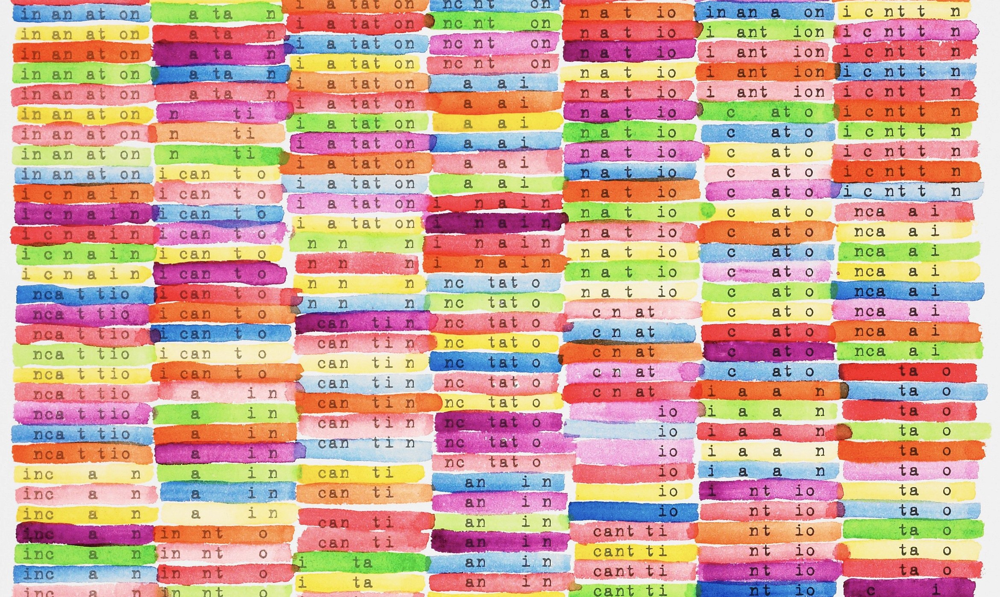
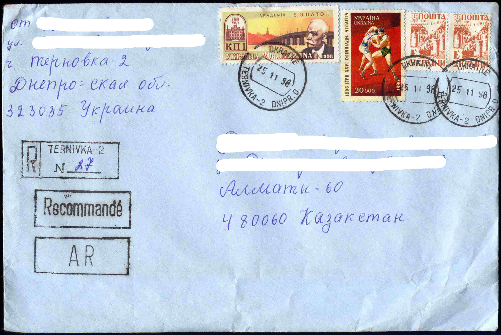
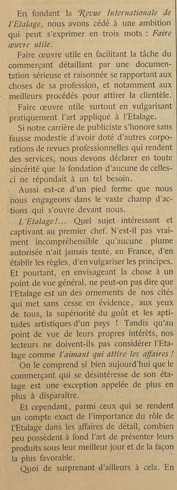
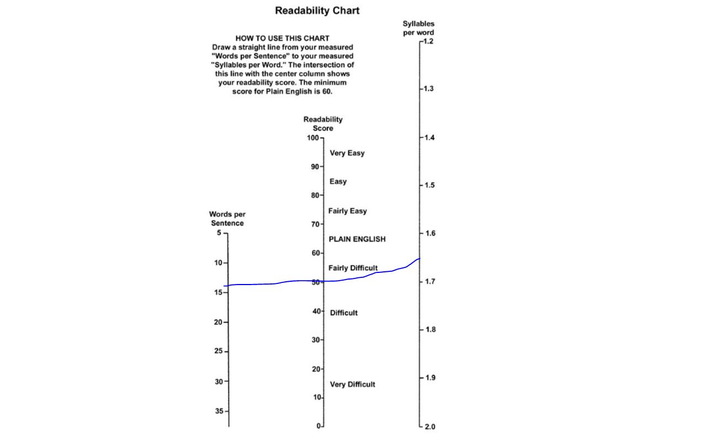

--- 
title: "NLP avec r et en français - un Manuel synthétique"
author: "Sophie Balech et Christophe Benavent et al"
date: "`r Sys.Date()`"
site: bookdown::bookdown_site
output: bookdown::gitbook
documentclass: book
bibliography: [book.bib, packages.bib]
biblio-style: apalike
link-citations: yes
github-repo: rstudio/bookdown-demo
description: "This is a minimal example of using the bookdown package to write a book. The output format for this example is bookdown::gitbook."
---

# Préface


^[Incantation for 6 voices Scott helmes, 2001. [Museum of Minessota](https://medium.com/minneapolis-institute-of-art/painting-a-picture-with-words-a0a3fef3cf63)]


L'eco système r s'est enrichi ces dernière années à grande vitesse dans le domaine du traitement du langage naturel, l'objet de ce manuel a pour but d'en donner une synthèse. Sa vocation est pratique même si on y laissera germer quelques considérations plus méthodologiques, voire épistémologiques. 
On ouvrira cependant chaque fois que c'est possibles aux questions théoriques et éthiques de ces méthodes. Leur réalisation computationnelle est le fruit souvent d'une longue histoire, au cours de laquelle les linguistes ont semé des idées essentielles qu'ont systématisé les informaticiens.

On soignera la bibliographie de manière synthétique pour en faire un état de l'art essentielet actualisée.

La rédaction de l'ouvrage est mené avec une règle de reproductibilité et de transparence, c'est le pourquoi le choix de ce support et des jeux de données associés. 

Il sera dynamique, modifié à mesure de nos cours, séminaires, ateliers et observations des lecteurs.

## Cours et séminaires

La liste des cours et séminaires où il sera présenté et utilisé. 

 * Colloque Marketing digital 2-3 septembre 2021
 * AFM decembre 2021
 * Ed Sorbonne - février 2022
 * Dauphine master 204 - octobre 2021
 * Master Siren - Dauphine - mai 2022
 * Toulouse
 * Lille master Data Science


## La structure du livre

L analyse NLP peut être analysée comme un processus qui va de la production jusqu'à la diffusion des analyses. Elle est aussi traversée par des évolutions profondes de méthodes qui ont complexifié au sens formel les modèles initiaux. Ce sont ces techniques que nous introduisons ici. 

Cependant, l'apprentissage automatique appliqué à des milliards de données submerge la statistique. Les modèles de langage distribués par les grands acteurs d gidital, comprennent des dizaines, voir des centaines de milliards de paramètres. On les évoquerons dans les derniers chapîtres.

Le plan suit une logique qui va du simple au très compliqué, et de l'acquisition des données, de leur traitement et leur modélisation, jusqu'à la propagation ...


 * acquisition des données : directe, api et scrapping
 * corpus dtm et cooccurence
 * AFC et typologie
 * l'annotation syntaxique et lexicale
 * analyse du sentiment et sa généralisation
 * word embedness
 * factorial models
 * Topic analysis
 * ML
 * deep learning
 * translation : parsceque qu'il faut traiter des corpus multi lingual et que la communication peut aussi etre multilinguales. 
 * génératives : parce que la prochaine étape c'est quand on appliquera ces méthode sur la productions textuelles des bots.

## Les jeux de données 

Au cours du développement, plusieurs cas pratiques - souvent réduit en volume pour rester exemplaires, seront employés. Les donées seront partagées.

En voici la présentation  systématique.

 * [Trump Twitter Archive](https://www.thetrumparchive.com/) : L'intégralité des tweets de Trump jusqu'à son banissement le 8 Janvier 2021.
 * Confinement Jour J
 * Citations : un recueil de citations littéraires pour de petits exemples et ponctuer le texte aride d'un peu de littérature et de poésie.
 * Trip advisor Polynésie, un extrait d'un corpus établi par Pierre Ghewy et Sebastien de l'UPF
 * Airbnb 
 * Covid
 * PMP
 * David Bowie : comp

disponibles dans le [repositery](https://benaventc.github.io/NLPBook/) avec le code du book. Les amendements et améliorations sont souhaitées et attendues. 

## Les ressources

Ce  _livre_ est écrit en **Markdown** [@allaire_rmarkdown_2021] et  avec le package **Bookdown** [@R-bookdown]

 * rmardown : c'est le langage de surface, celui qui nous permet de publier ce manuel.


Le code s'appuie très largement sur **tidyverse** et emploie largement les ressources de **ggplot** et **dplyr** . On recommande au lecteur de consulter les ouvrages suivants.  Une mention particulière doit être faite sur la question du traitement du texte, **stringr** est aussi un des outils fondamentaux. 

D'autres outils traverserons le manuels. Par exemples pour les tableaux, nous opterons la plus part du temps pour les soclution de flextable. 

On supposera que les lecteurs ont une connaissance satisfaisante de ces outils génériques, mais à chaque fois qu'on les introduira, on les expliquera.

 
 * ggplot : une image vaut mieux que mille mots, 
 * [dplyr]() est essentiel, c'est avec cet outil qu'on construit des pipeline de données. Le maitriser est une garantie d'efficacité.  
 * [stringr](https://stringr.tidyverse.org/articles/stringr.html) est un package ardu. Ils propose une multitude de fonctions pour traiter les chaînes de caractères. Son étude est recommandée de concert avec la connaissance des [regex](https://stringr.tidyverse.org/articles/regular-expressions.html). 
 * quand le temps s'en mêle, lubridate est indispensable. 
 

### Les packages 


Les packages seront introduits au fur et à mesure de leur première utilisation. On le signale par `#library(lib) `. En voici la liste complète.


```{r pack, echo = TRUE, message=FALSE, warning=FALSE}
knitr::opts_chunk$set(echo = TRUE, message=FALSE,warning=FALSE)

#boite à outils et viz
library(tidyverse) # inclut ggplot pour la viz, readr et 
library(readr)

#Vizualisation 
library(cowplot) #pour créer des graphiques composés
library(ggridges) # le joy division touch de ggplot
library(pheatmap)
library(flextable)

#networks
library(igraph) #le standard pour les représentations de réseaux
library(ggraph) #un complément compatible ggplot du précédent

# Accéder aux données
library(rtweet)  # une interface efficace pour interroger l'api de Twitter


# OCR et pdf
library(tesseract) #reconnaissance de caractère


# NLP
library(tokenizers)
library(quanteda)
library(quanteda.textstats)
library(quanteda.textplots)
library(udpipe) #annotation syntaxique
library(tidytext)
library(cleanNLP) #annotation syntaxique

##reconnaissance de langue
library(cld3)
library(textcat)

#Analyse du sentiment
library(syuzhet)            


#mise en page des tableaux
library(flextable) # 


#Statistiques et modèles
library(lme4)
library(jtools)
library(interactions)

#ML
library(caret)

#Template pour ggplot
theme_set(theme_bw())


#Palettes
library(colorspace) #pour les couleurs
library(viridis)
library(viridisLite)


#utilitaires
library(citr) # un outil interactif pour insérer des références 


# chapitre II
library(revtools) 
library(rvest)

```


## Disponibilité

L'ensemble du code est disponible [sur github](https://github.com/BenaventC/NLPBook). A ce stade, c'est encore embryonnaire. Les proches pourrons cependant y voir l'évolution du projet et de la [progression](https://benaventc.github.io/NLPBook/)

## conventions

Quelques conventions d'écriture du code r : 

 * On appele les dataframes de manière générale `df`, les tableaux intermédiaires sont appelé systématiquement `foo`
 * Gestion des palettes de couleurs
  ** une couleur :" royalblue"
  ** deux couleurs
  ** 3 à 7 couleurs
 * On emploie autant que possible le dialecte tidy.
 * Les chunks sont notés X, le chapitre, 01 à n, les jeux. 502 est le second chunk du chapitre 4.
 * On commente au maximum les lignes de code pour épargner le corps du texte et le rendre lisible


## A faire

todo list :

 * insérer un compteur google analytics ( voir https://stackoverflow.com/questions/41376989/how-to-include-google-analytics-in-an-rmarkdown-generated-github-page)
 * modifier le titre en haut à gauche
 * vérifier le système de références voir ( https://doc.isara.fr/tuto-zothero-5-bibtex-rmarkdown-zotero/)
 * Vérifier la publication en pdf
 * restructurer le plan
 

<!--chapter:end:index.Rmd-->

# Introduction {#intro}


Le texte connaît une double révolution. la première est celle de son système de production, il se produit désormais tant de textes que personne ne peut plus tous les lire, même en réduisant son effort à sa propre sphère d’intérêt et de compétence, la seconde est celle de sa lecture, c'est une lecture conditionnée et recommandée. 

La production primaire de textes voit son volume croître exponentiellement. Elle doit être comparée à des époques pas si éloignées ou le texte était copiés, puis imprimés. Ce qui était destiné à être reproduit était le résultats d'un processus long et exigeant qui permettait à un petit groupe de léttrés et d'imprimeur de produire l'essentiel de ce qui sera lu. La révolution digitale fait que quiconque via des interfaces simples peut confier sous forme d'écrit ses états d'âme.Elle se soumet ensuite à ceux qui en contrôlent les flux et en exploitent les contenus, qui les mettent en avant ou les écartent, définissant la composition de ce que chacun va lire. La diffusion de cette production suit des lois puissances, c'est ainsi que la révolution de la lecture est venue avec les moteurs de recherche, et les pratiques de curations (ref), c’est une lecture sélectionnée et digérée par les moteurs de recommandation. (ref). 

S’il ne fallait qu’un exemple on pourrait évoquer la transformation radicale de la littérature dite scientifique dont la production double presque tout les dix ans .http://blogs.nature.com/news/2014/05/global-scientific-output-doubles-every-nine-years.html

A cette production exponentiellement croissante s'ajoute un effort d'inventaire, des standards sont proposés, l’indexation a donné naissance à l’immatriculation de la moindre note, l’interopérabilité est de mise, le réseau des co-citations est maintenu en temps réel. Les scores qualifient autant les articles que leurs auteurs et les revues qui les accueillent. Le monde de la recherche, celui qui va vers l'inconnu est désormais totalement balisé et quantifié. Le volume est si grand que la production automatique de résumés, et de synthèses va être indispensable.

Le NLP ( en français le TAL) est au coeur de ces technologies, il se nourrit de plus en plus d'intelligence artificielle. Nous en verrons de nombreux exemples à tout les stades du traitement : identifier la langue, mesurer le sentiment, isoler des sujets, calculer une relation syntaxique.

Le NLP est aussi une nouvelle ressource pour les chercheurs en sciences sociales à la fois par les matériaux empiriques et les méthodes d'analyse. C'est une mouvemennt qui affecte toutes les shs. L'emballement de la production de texte génère une nouvelle matière d'étude pour le sociologues, les gestionnaires, les économistes, les psychologues.  

Si dans ce manuel, on choisit de présenter les différentes facettes de ce qui s'appelle TAl, NPL, Text Mining,  dans une approche procédurale qui suit les principales étapes du traitement des données. On rendra compte à chaque étape des techniques disponibles, et on illustre d’exemples. Nous suivrons ici une approche plus fidèle au processus de traitement des données, lequel peut connaître une stratégie inférentielle et exploratoire - quelles informations sont utiles au sein d’un corpus de texte -, tout aussi bien qu’une stratégie hypothético-déductive. Nous resterons agnostique sur cette question, restant délibérément à un niveau technique et procédural.


## Une réflexion ancienne et un nouveau champ méthodologique

On se doit pas se faire aveugler par l'éclat de la nouveauté, les techniques d'aujourd'hui dépendent d'idées semées depuis longtemps dans au moins deux champs disciplinaires : la linguistique et l'informatique. On peut en synthétiser l'idée avec ce mème et son annotation. Il expriment deux idées. La première est une tension du champs entre la langue comme structure et le langage comme capacité et usage.


Les pratiques et techniques que nous allons étudier ne tombent pas de mars mais résultent de plusieurs flux de pensées qui se croisent se confortent et amène l'énergie pour créer un nouveau bras dans le champs  étendu de l'étude de la langue et du langage. 

Penser la langue est un effort constant qui a commencé il y a fort longtemps, certainement avec les sophistes, et l'idée qu'en maniant le langage il est possible de convaincre. Les sophistes : plier le langage à ses intérêt est une première sciences du langage qui produit une connaissances des dispositifs les plus efficaces. Pas sur que cette discipline aie trouvé un chemin de vérité; mais elle reste commune et actuelle, c'est l'oeuvre de la publicité. La rhétorique n'est pas une discipline morte, elle se développe de manière concrète dans toute les agences publicitaires.

Donnons quelques points de repère en commençant par des définition, puis en évoquant trois idées essentielles qui vont prospérer avec le développement de la linguistique computationnelle et de l'intelligence artificielle. Ces trois idées se relatives aux principales branches de la linguistique : à savoir la syntaxe, la sémantique et la pragmatique. Nous serons silencieux sur la phonologie (étude de la formation des sons et de la phonétiques) dont l'importance est considérable quand il s'agit de traiter la production et les interactions orales. Pour ne donner qu'un exemple, la prosodie (le rythme données aux phrases) est un objet essentiel dans l'informatique affective. 


### Langue, langage et texte parole

Et c'ets sans doute par celà qu'il faut commencer. La langue c'est l'ensemble des règles formelles et moins formelles qui constituent une parole, ce qu'on se dit de l'un à l'autre ou de l'un à aux autres. Le langage est la capacité à produire cette parole. L'inscription de cette parole par l'écriture constitue le texte. Le miracle du passage de la parole au signe est celui du symbole.

Parmi les distinctions terminologiques proposées par Ferdinand de Saussure au début de siècle dernier, celles de langue, langage et de parole se sont révélées particulièrement pertinentes et elles sont toujours utilisées de nos jours.

Langage: faculté inhérente et universelle de l'humain de construire des langues (des codes) pour communiquer. (Leclerc 1989:15) Le langage réfère à des facultés psychologique permettant de communiquer à l’aide d’un système de communication quelconque. Le langage est inné.

Langue: système de communication conventionnel particulier. Par « système », il faut comprendre que ce n'est pas seulement une collection d'éléments mais bien un ensemble structuré composé d'éléments et de règles permettant de décrire un comportement régulier (pensez à la conjugaison de verbes en français par exemple). La langue est acquise.

Le langage et la langue s'opposent donc par le fait que l'un (la langue) est la manifestation d'une faculté propre à l'humain (le langage).

Parole: une des deux composantes du langage qui consiste en l'utilisation de la langue. La parole est en fait le résultat de l’utilisation de la langue et du langage, et constitue ce qui est produit lorsque l'on communique avec nos pairs.

Le texte : Il est la transcription de la parole,même si le plus souvent,  sa production est directe sans traduction du langage oral.

### Syntaxe et grammaire générative

Chomsky et sa grammaire générative. En dépit de leur très grande diversité. Le projet s'appuit sur l'idée qu'un nombre de règles finies doit produire une infinité d'ennoncés. Une grammaire est générative dans la mesure où elle possède cette propriété. L'analyse est ainsi tournée vers la compétence, et le linguiste s'interresse à l'idéal qu'un locuteur qui connaissant ces règles seraient en mesure de produit toute forme de discours. 

Observant que les enfants apprennent enracinant le phénomène linguistique dans la cortalisation du langage, il apporte une idée forte et structuraliste d'une équivalence des langues.
 

Tesnière et les arbres syntaxiques. 

les treebanks contemporains  s'inscrivent dans cette perspective et nourrissent les analyseurs ( parser) syntaxiques du langage naturel qui constituent désormais la première couche d'un traitement de données textuelles.


La grammaire générative a conduit la linguistique dans un tournant formel où la langue est étudiée indépendemment de ses locuteurs. On pourra méditer le pourquoi les algorithmes génératifs de deep learning contemporains (le fameux GPT3) peuvent former des  phrases syntaxiquement correcte mais absurde. 


### Sémantique : La conception distributionnelle

la tradition lexicologique

le lexique est affaire ancienne, le français est aidé par des expériences les fondamentales :  le littré,  l'académie française et les dictionnaires des éditeurs. pour étudier un lanage il faut se rapporter à des formes stables, les dictionnaires les fournissent et fournisse les normes pour les coder. 

Un moment clé a été de penser le signe, Saussure apporte une idée fondamentale que dans le symbole, le signe et le signifiant sont les deux faces d'une même monnaie, qu'il existe une relation entre l'artefact et l'idée. Qu'un signe particulier puisse signifier une idée. c'est un penseur de la correspondance.

Selon Saussure, la langue est le résultat d’une convention sociale transmise par la société à l'individu et sur laquelle ce dernier n'a qu'un rôle accessoire. Par opposition, la parole est l'utilisation personnelle de la langue (toutes les variantes personnelles possibles: style, rythme, syntaxe, prononciation, etc.).Le changement de la langue relève d'un individu mais son acceptation relève de la communauté et des institutions. ex.: le verbe « jouer » conjugué «jousent » est pour l'instant considéré comme une variante individuelle (parole), une exception, et il le demeurera tant qu'il ne sera pas accepté dans la communauté (les locuteurs du français dans ce cas-ci). Sa conception du signe répond à cette approche conventionnelle : la dualité du signe comme signifiant et signifié est opérée. 

Dans le traitement des données textuelle le signifié est le terme cible de l'analyse, pour en découvrir son signifié on se tourne vers son contexte : l'ensemble des signifiés. C'est une idée ancienne qu'a proposé Firth dans les années 30. [@firth_synopsis_1957] et l'idée distributionnelle. un mot trouve son sens dans ceux qui lui sont le plus associés. c'est le contexte qui donne le sens

L'idée de quantifier le langage n'est pas nouvelle  Zipf. Encore moins s'il faut compter les occurences et les cooccurences des mots.Un vaste mouvement s'est formé dans les années soixante autour de la lexicologiue stimulée par l'école française d'analyse de données. Le descendant de ce mouvement se retrouve dans l'excellent iramutek de l'équipe de toulouse, il a été précedé par le fameur Alceste.

Nous y consacrerons un chapitre plein sur le plan technique. Mais il est important de souligner que cette école française de l'analyse textuelle ne se limite pas au comptage. Un logiciel comme trope qui d'ailleurs ne connait aucun équivalent dans l'écosystème que nous allons explorer manifeste aussi cette inventivité. S'y exprime pleinement la logique distributionnelle. 
 
### Pragmatique les fonctions et acte du langage

Si la grammaire générative se tourne délibéremment vers la compétence et ignore la performance, c'est à dire la production d'énnoncés par les humains en situation d'interaction, un autre courrant de la linguistique s'est emparé de la question, le courrant pragmatique.

Le grand classique est la théorie des fonctions du language, qui sous-tendent la production du message, l'acte de parole,proposée par Jakobson. Inspiré par la cybernétique la structure de son modèle est celle d'un acte de communication. Jackobson identifie les éléments de l'évènement discursif (speech event) et les fonctions qui lui sont associée. Pour le paraphraser, un DESTINATEUR envoie un MESSAGE à un DESTINATEUR mais pour être compris il requiet un CONTEXTE dont les acteurs acteurs  de l'évenement discursif sont capables de se saisir et de verbaliser , d'un CODE au moins partiellement commun et d'un CONTACT, un canal physique et une connection psychologique. [@jakobson_linguistics_1981][àlire ici](https://pure.mpg.de/rest/items/item_2350615/component/file_2350614/content)

 * la fonction référentielle ou représentative (aussi dénommée sémiotique ou symbolique), où l'énoncé donne l'état des choses , où le message dénote un contexte ;J emploie aussi les termes de dénotatif ou cognitive.
 * la fonction expressive ( emotive), où le sujet exprime son attitude propre à l'égard de ce dont il parle ;
 * la fonction conative, lorsque l'énoncé vise à agir sur le destinataire; elle s'exprime grammaticalement par l'impératif ou le vocatif.
 * la fonction phatique,empruntée à Malinoswki où l'énoncé révèle les liens ou maintient les contacts entre le locuteur et l'interlocuteur ;
 * la fonction métalinguistique ou métacommunicative, qui fait référence au code linguistique lui-même ;qu'il soit théorisé ou internalisé par le locuteur comme la prose de Mr Jourdain. 
 * la fonction poétique, où l'énoncé est doté d'une valeur en tant que tel, valeur apportant un pouvoir créateur et dont Jakobson illustre avec l'exemple que la jeune fille qui a l'habitude de désigner Harry par "Horrible harry" sans pouvoir expliquer pourquoi il ne serait pas l'odieux, le dégoûtant, ou le terrible Harry alors que sans s'en rendre compte elle emploie une paronomasie/alliteration : la ressemblance des mots produit un effet poétique. 
 
John Langshaw Austin s'intéressant  à la fonction conative développe le concept d'acte de langage, introduisant l'idée fondamentale que les actes de langage (la production d'un énoncé) n'ont pas destinés à décrire le monde tel qu'il est mais à agir sur le monde par le bias du destinataire. Parler c'est aussi faire.  La théorie des actes de langage est d'abord une catégorisation des actes.  

La fonction illocutoire d'un acte de langage est, dans la théorie linguistique de John Langshaw Austin, le message convoyé par un énoncé au-delà de son sens immédiat, celui que traduit sa fonction locutoire. Par exemple, le fait, à table, de prononcer la phrase « Est-ce qu'il y a du sel ? » n'a pas, du seul fait de sa formulation, seulement pour fonction de s'informer sur la présence de sel dans la maison (ou dans le plat, contenu locutoire de l'énoncé) mais exprime plutôt que l'on voudrait saler son plat (fonction illocutoire) et se traduit généralement par le fait que l'un des convives réagit, par exemple en passant la salière au locuteur, ce qui est la fonction perlocutoire de l'énoncé1.
 *  Locutoire
 *  Illocutoire
 *  Perlocutoire C'est cette idée qui est au sousbassement de la théorie des actes de langages.


 * Genette et l'intertextualité, le palimpseste. c'est une question de sens, le sens d'un texte vient de ses prédecesseurs de ceux à qui ils se réfèrent. Les textes se parlent l'un l'autre,  et ce n'est pas dans leur contenu qu'on trouvera une vérité dans dans le rapport qu'ils établissent avec leur prédecesseur par l'appareil des notes et des bibliographies. 
 * Austin et l'idée que le langage n'est ^pas que communication mais performation . ce qu'on dirt agit sur le monde
  * La narrativité

### la linguistique computationnelle

le frottement de la linguistique et de l'informatique se produit à propos de questions pratiques. 

Les apports de la fouille de données


les nomenclatures

une convergence nécessaire

Le monde des bibliothèques et celui de la GED.


## Les facteurs de développement de l'usage en science sociale

Ces développements sont favorisés par un environnement fertile dont trois facteurs se renforcent mutuellement. Ils conduisent à l'élaboration de nouvelles méthodes.

 * la naissance de langue universelle
 * l'emergence vaste ensemble de données textuelle
 * la naissance d'une communauté épistémique, de pratique et

### Une lingua franca

Le premier est l’expansion de deux langages, proprement statistique pour r et plus généraliste pour Python. Le propre de ces langages est, prenons le cas de r, de permettre d’élaborer des fonctions, dont un ensemble cohérent pour réaliser certaines tâches peut être rassemblé dans une bibliothèque appelée package (et chargé par library(nomdupackage)). On dispose désormais de milliers de packages (17 788 sur le CRAN) destinés à résoudre un nombre incalculable de tâches. 


Coder une analyse revient ainsi à jouer avec un immense jeu de lego, dont de nombreuses pièces sont déjà pré-assemblées. D’un point de vue pratique, les lignes d’écriture sont fortement simplifiées permettant à un chercheur sans grande compétence de codage d’effectuer simplement des opérations complexes.  En retour, cette facilitation de l'analyse abonde le stock de solutions.


### La multiplication des sources de données.

Le troisième est la multiplication des sources de données et leur facilité d’accès. 

 * le contenu écrit des réseaux sociaux
 * les rapports d'activités des entreprises,
 * les compte-rendu archivé de réunion
 * Les avis des consommateurs sur les catalogues de produit
 * Les articles et les revues scientifiques
 * Même les livres


Les plus évidentes sont proposées par les bases d'articles de presse telles qu' presseurop ou factiva. Les bases de données bibliographiques sont dans la même veine particuièrement intéressante et pensée pour ces usages.


Les données privées, et en particulier celles des réseaux sociaux,  même si un péage doit être payé pour accéder aux APIs, popularisent le traitement de données massives. 

Les forums et sites d'avis de consommateurs sont pour les sociologues de la consommation et les specialiste du comportement de consommation une ressource directe et précieuses.

Le mouvement des données ouvertes (open data) proposent et facilitent l’accès à des milliers de corps de données :  grand débat.

 

### Une communauté

Le second facteur de développement , intimement lié au premier, est la constitution d’une large communauté de développeurs et d’utilisateurs qui se retrouvent aujourd’hui dans des plateformes diverses. Le savoir, autrement dit des codes commentés se trouvent dans une varété importante de lieux :

 * Des plateformes de dépots telle que Github qui rassemblent une trentaine de millions de developpeurs et datascientits.  
 * Des plateformes de Q&A (question et réponses) telles que [Stalk Over Flow](), 
 * Des tutoriaux de toute sortes
 * Des blogs ou des fédération de blog de blogs (BloggeR), 
 * Des revues (Journal of Statistical Software) et de bookdown. 

Des ressources abondantes sont ainsi disponibles et facilitent la formation des chercheurs et des data scientists et la résolution de leurs problèmes pratiques, quiconque n'arrive pas à résoudre un problème a une bonne chance de trouver la solution d'un autre, à un degré de circonstance près.  Elles sont d'autant plus utiles que certaines règles ou conventions s'imposent pour fluidifier l'échange.

La principale est celle de l'exemple reproductible.

La seconde est le maintien d'une éthique du partage qui encourage à partager le code, et dont une littérature importante étudie l'effet positif sur les performances économiques et la durabilité [rauter]. Les externalités de réseaux y sont fortes

Toutes les conditions sont réunies pour  engendrer une effervescence créative. Python ou r, sont dans cet univers en rapide expansion, les langues véhiculaires qui favorise une innovation constante. Les statistiques de github en témoigne : près de 50 millions d'utiliseurs, 128 millions de " repositories" et 23 millions de propriétaires.


voir aussi
https://towardsdatascience.com/githubs-path-to-128m-public-repositories-f6f656ab56b1


## De nouvelles méthodologies pour les sciences sociales

Pour les chercheurs en sciences sociales (et en premier lieu pour les chercheurs en gestion où toutes les sciences sociales se croisent) cette révolution textuelle offre de nouvelles opportunités d’obtenir et d’analyser des données solides pour vérifier ses hypothèses et mener l'enquête. Ce sont de nouveaux terrains, de nouvelles méthodes et un nouvel objet de recherche qui se dessine dans le foisonnement du champs.


### Nouveaux terrains : 

La multiplication des sources de données, associée à leur normalisation  rencontre une multiplication de techniques provenant de multiples disciplinaires et qui convergent dans un langage commun. . production abondante d’avis de consommateurs, de discours de dirigeants, de compte-rendus de conseils, d’articles techniques,la linguistique computationnelle, de la fouille de données, des moteurs de recommandation, de la traduction automatique, et des ressources nouvelles et précieuses pour traiter l’abondance des données

### Nouvelles méthodes : 

Un nouveau paradigme méthodologique se construit à la croisée de données abondantes et de techniques de traitement intelligentes. Il permet d’aller plus loin que l’analyse lexicale traditionnelle en incorporant des éléments syntaxiques, sémantiques, et pragmatiques, proposés par l’ensemble des outils des techniques de traitement du langage naturel. Il se dessine surtout une nouvelle approche méthodologique qui prend place entre l’analyse qualitative, et les traditionnelles enquêtes par questionnaires capables de traiter des corpus d’une taille inédite. 
Le travail de [@humphreys_automated_2018] en donne une première synthèse dans le cadre d’un processus qui s’articule autour des différentes phases d’une recherche : la formulation de la question de recherche, la définition des construits, la récolte des données, l’opérationnalisation des construits, et enfin l'interprétation, l’analyse et la validation des résultats obtenus. 
 
## Un nouvel objet : 

On pourrait croire qu'avec des données massives et des techniques "intelligente" on assiste à un retour du positivisme qui bénéficierait enfin des instruments de mesure et de calculs qui ont permis aux les chercheur plus proches de la matière des succès majeurs. Sans doute, l'administration de la preuve va être faciliter par ces techniques et encourager l'evidence based policy (REF) et résoudre en partie la crise de la réplication et de la reproductibilité. 

Mais à mesure que ce développe l'appareillage de méthode et de données, moins on peut supposer que l'observateur est neutre. Les téléscopes géants, les synchrotron, n'affecte ni les galaxies lointaines ni les atomes proches. Le propre des données que l'ont est amené à étudier est de résulter de la confrontation d'un système d'observation (certains préfèrent de parler de surveillance), et d'un agent qui a des buts, une connaissance, et des ressources. Le dispositif de mesure est en lui-même performatif. L'exemple le plus évident est celui des  systèmes de notation, qui sous prétexte de transparence donne la distribution des répondants précédents. L'agent qui va noter choisit la valeur en fonction d'une norme apparente - la note majoritaire- et de sa propre intention - se manifester ou se confondre à la foule. 
 
Pour se donner une idée plus précise de ce mouvement, examinons quelques publications récentes dans les champs qui nous concernent. 

### Sociologie et histoire

classes sociales avec word to vec  en sociologie [@kozlowski_geometry_2019].

L'article révolution française [PNAS)

On citera cependant jean-baptiste Coulmont et son obstination à étudier les entités nommées, prénoms et autres marqueurs culturels de l'identité et des classes.


 et au luxembourg
 

### Psychologie

Très tôt la psychogie s'est intéressée au langage, pas seulement comme produit des processus psychologiques, mais comme expression de ceux-ci. 

Dans le champs de la psychologie de l'éducation et avec une forte motivation positiviste, dès les années 60 s'est posée la question de la mesure de la difficulté d'un texte pour un niveau d'éducation donné. La mesure de la lisibilité des texte s'est développée profitant à d'autre secteurs tels que ceux de la propagande. Dans cette même perspective, la richesse lexicographique comme représentant les compétences a a son tour développé de nouvelles instrumentations. 

James W. Pennebaker a développé son approche à partir de l'étude des traumas; donnant une grande importance à la production discursive des patients. Sa contribution majeure est l'établissement d'un ensemble de dictionnaires destinés à mesurer des caractéristiques du discours. Un instrument qu'on présentera dans le chapitre 7 (à vérifier)[@tausczik_psychological_2010].

Son approche se poursuit en psychiatrie avec l'analyse des troubles du langage, et a connu un coup d'éclat avec la demonstration que l'analyse des messages sur les réseaux sociaux comme facebook permet de détecter des risques de dépression.[@eichstaedt_facebook_2018].


### Management

La finance et l'analyse du sentiment


Dans le champ du management, on trouvera des synthèses pour la recherche en éthique [@lock_quantitative_2015], en comportement du consommateur [@humphreys_automated_2018]  en management public [@anastasopoulos_computational_2017] ou en organisation [@kobayashi_text_2018] ,


### Economie

economie des brevets
intervention des institutions
mesure de l'innovation


## Des comptable à l'industrie de la langue


La situation nouvelle qui est la notre est que lorsque la parole disparaissait avec le vent, elle laisse désormais des traces et s'enregistre. L'ironie est qu'au titre de la protection de la vie privée, cet enregistrement systèmatique doit être mis à notre disposition. On a le choix : rien n'en faire, les détruire, les donner pour bénéficier de son potentiel de connaissance. Nous sommes passé de la parole au texte.  Si seule la prole de dieux et celle des champs étaient transcrites, c'est désormais aussi celle du vulgum. Si sa précision est incertaine, son volume a gagné de nombreuses échelles.

Cette matière ne s'organise plus dans les papyrus et autres manuscrits, ni même dans les livres sués par les callygraphieurs, elle s'incruste dans un édifice de plus en plus complexe d'interfaces textuelles et vocales. La parole est comme absorbée par les machines. Elle ne s'envolent plus avec le vent, elle sédimente dans les data center. Le langage a acquis une dimension matérielle qu'il n'a presque jamais connu. Il gagne de l'autonomie avec les systèmes génératifs : chat bot, transciption, traduction, résumés. 

l'histoire se définit son écriture. l'écriture est le produit d'une  société de procès-verbal, de comptabilité et ça se poursuit. Voilà  qui facilite le travail de l'historien, du sociologue et de l'économiste. 

Dans les années 90 s'est dessinée une société de l'information, sauvage jusqu' à Napters, et le rêve du peer to peer, elle s'est  socialisée dans les années 2000, platformisée dans les années 2010, généralisée pour la décennie qui nous concerne. Toute cette architecture s'appuie sur les données qu'on y injecte, et en premier le texte. la transcription de la parole, une recodification. Et des traitements très concentrés. 


## Conclusion

le point d'entrée de la technique est privilégié dans ce manuel. Mais on se donnera des espaces de réflexion, d'interrogation, des espaces epistémologiques (Comment étudier le langage par le langage ?) et anthropologique (quelle est l'origine et la spécificité du langage humain en dépit de ses innombrables variétés ?).


Une première parenthèse est expérientielle, c'est en faisant que nous avons découvert une autre écriture. L'expérience de ce livre, qu'on partage avec de nombreux utilisateurs de ces nouveaux outils, est celle d'une écriture programmatique, performative. Ecrire c'est faire, les meta-langage transforme la transcription de la parole en une nouvelle connaissance.On peut agir sur la parole, sur le texte, le tordre, le presser, le décoder . On peut lire les foules. 

Les langages tels que la linguistique les étudie sont verbaux, d'autres sont iconiques, architecturaux, graphiques, chorégraphiques, musicaux. Elles se rencontre dans le flux d'une parole qui associe le texte à l'image dans des rapports d'illustation ou de commentaire, jouant du contrepoint à travers les médias. 

par le texte, le sociologue, l'économiste ou le gestionnaire veulent coprendre la génèse et la détermination des choix. Etudions le texte. 

L'acte de parole se réalise dans un lieu à un moment avec des protagonistes, dans une atmosphère, avec une histoire, les mots qui s'en échappent ne sont que des traces, autant que des photographies. Ces données se sédimentent dans les grands bassins du cloud et dans les corpus constitués méthodiquement. 


<!--chapter:end:01-intro.Rmd-->

# Constitution du corpus

__Objectifs du chapitre : __ ** explorer différente techniques de collectes de données : exploitation de bases textuelles, méthodes de scrapping, APIS, extraction de document pdf, extration de texte dans des images, et une perspective oral avec les techniques de speech2 tex.**


La constitution d'un corpus est la première étape d'un projet NLP. Il se définit d'abord par la constitution d'une collection de textes dont la provenance est la nature peut être diverse. Dans ce chapitre on va examiner plusieurs techniques de collecte, et on conclue avec quelques réflexions que la questions de la constitution de l'échantillon.

 * L'exploitation de bases textuelles
 * Les méthodes de scrapping
 * Le recours aux APIs
 * La collection de document pas que textuels
 * Les sources orales

et on conclue avec quelques réflexions que la questions de la constitution de l'échantillon.


## L'exploitation de base de données textuelles

On commence par un exemple simple en utilisant la base [europresse](http://www.europresse.com/fr/). l'objectif est de constituer un fichier de références bibliographiques, exploitable via r. 

Dans europresse , nous avons fait une recherche sur les articles comprenant le terme " vaccination" dans la presse nationale françaises, constituées de 14 titres. On retient les 150 derniers articles au 16 Juillet 2021.

On utilise [revtools](https://revtools.net/data.html#importing-to-r) pour sa fonction d'importation des fichier *.RIS et de transformation en data frame, 

```{r 201, fig.cap='', out.width='80%',caption= "le traitement de la vaccination dans la presse nationale française", fig.asp=1, fig.align='center'}
library(revtools)


df <- read_bibliography(iconv("./data/20210719013820.ris"))

flextable(head(df,3))
df<-df%>%
  mutate(jour=substring(DA,1,2))

g22<-ggplot(df, aes(x=jour))+
  geom_bar()+labs(x=NULL,y="Fréquence")+
  geom_vline(xintercept=12, linetype="dashed", color = "red")+
  facet_grid(vars(journal))
g22

# screen_topics()


```


`revtools` n'est pas fait que pour importer des données au format bibliographique .ris, ou au format .bib, et de les transformer un tableau observations - variables ( bref, un dateframe). Il a des fonctions de visualisations rapides fort efficace. La plus spectaculaire est un outil de visualisation qui s'appuie sur deux modèles de détections de topics (ce sujet sera l'objet du chapitre 8), paramétrables de manière interactive en quelques minutes, et conçu avec `shiny`, le package star des graphes interactifs. 

C'est un super outils pour avoir un premier coup d'oeil sur les données, un plug in super pratique.  

On l'applique sur nos données.  L'allure de l'interface est la suivante.


L'interface n'étant pas programmatique, on exporte quelques images en jpeg (un bouton dans l'interface permet de faire celà sans effort) et on les récupère avec `cowplot`, le package qui permet d'assembler des graphes et que nous utiliserons systématiquement dans ce cours. 


```{r 202, fig.cap='', out.width='80%',caption= "Disctribution des topics et des document dans leur espace (ACP)", fig.asp=1, fig.align='center'}
p1 <- ggdraw() + draw_image("./images/topic_espace.png")
p2 <- ggdraw() + draw_image("./images/topic_topic.png")
p3 <- ggdraw() + draw_image("./images/topic1.png")
p4 <- ggdraw() + draw_image("./images/topic5.png")

plot_grid(p1, p2 , ncol=2)
```

Et pour illustrer les graphiques des termes les plus proches du topic 1 et du topic 5. L'un est relatif à l'actualité austrlienne, l'autre à l'actualité anglaise. 

```{r 203, fig.cap='', out.width='80%',caption= "La description des topic 1 et 5", fig.asp=1, fig.align='center'}

plot_grid(p3, p4 , ncol=1)

```
La méthode est sympa, rapide, sur le pouce, mais pas suffisante pour aller audelà et noatmment comparer les lignes éditoriales des deux titres que nous avons choisis. A ce stade de l'analyse c'est déjà beaucoup.


## Jouer avec les bases bibliographiques

Fulltext

https://books.ropensci.org/fulltext/data-sources.html


## Scrapping

Le scrapping correspond à un internet sauvage où la collecte d’information se traduit par une technique de chasseurs-cueilleurs, le glanage. c'est l’activité qui consiste à moissonner les informations disponibles sur le net en simulant et en automatisant la lecture par un navigateur ( on préfère l'expression des quebecois : des butinuers). 

Elle consiste à construire un robot capable de lire et d’enregistrer les informations disponibles sous forme html puis à les distribuer (parsing) dans des tableaux structurés, selon une stratégie d’exploration du web préalablement définie. En réalité le scrapping pose deux problèmes :

 * celui de la structure de recherche. C'est le problème que relève les spiders, des robots qui recherchent dans les pages des liens, et vont de proche en proche, de lien en lien, pour explorer un domaine.Ils peuvent être plus systématique et prendre avantage de l'organisation d'un site web pour enummérer les pages. 
 * celui de la collecte de l'information sur chacune des pages. Il s'appuie sur le principe que le langage html est un langage à balise où le contenu et le contenant sont clairement séparés. Par exemple,  dans le corps de texte d'une page on définira un titre par la balise <h1> dont l'instruction s'achève par la balise </h1>. On sépare ainsi clairement le contenu de la forme.

`<body>

  <h1>Un titre de niveau 1 (un gros titre)</h1>
    <p>Un paragraphe.</p>

    <h2>Un titre de niveau 2 (un sous titre)</h2>
      <p>Un paragraphe.</p>

      <h3>Un titre de niveau 3 (un sous-sous titre)</h3>
        <p>Etc.</p>

</body>
`

Ultérieurement on pourra définirs les propriété graphiques d'une balise par des CSS. par exemple avec ceci les paragraphes seront publiés en caractère bleu. 


`p{
    color: blue;
}
`

Ce qui nous intéresse n'est pas la décoration, mais le fait que les développeurs définissent des balises spécifiques pour chacun des éléments de leurs page web, et que si nous savons les repérer , nous avons le moyen de mieux lire le texte. Les balises sont la cible du scrapping

### rvest avec r


De nombreuses ressources sont disponibles, mais pour en rester à r , le package rvest permet de réaliser des extractions simples mais suffisantes pour de nombreux usages. 

une application rvest 

https://www.r-bloggers.com/2018/10/first-release-and-update-dates-of-r-packages-statistics/

le package rvest est générique

https://community.rstudio.com/t/scraping-messages-in-forum-using-rvest/27846/2

```{r 204, fig.cap='', out.width='80%', fig.asp=1, fig.align='center', fig.width=9}

library(rvest)

# Scrape thread titles, thread links, authors and number of views

start <- "https://uberzone.fr/threads/si-la-vaccination-devient-obligatoire-vous-feriez-vous-vacciner-ou-changeriez-vous-de-corps-de-metier.17425"

x<-c("/page-2", "/page-3", "/page-4")

for (val in x){
  url<-paste0(start,val)
  h <- read_html(url)

post <- h %>%
  html_nodes(".bbWrapper") %>%
  html_text()%>%
      str_replace_all(pattern = "\t|\r|\n", replacement = "")
post
#authors <- h %>%
#  html_nodes(".username--style2 ") %>%
#  html_text() %>%
#  str_replace_all(pattern = "\t|\r|\n", replacement = "")

# Create master dataset (and scrape messages in each thread in process)

master_data <- 
  tibble(post)
rds_name<-paste0("./data/df_",substr(val,2,6),".rds")
saveRDS(master_data,rds_name)
}

head(master_data)

```

### Des problèmes pratiques, juridiques et éthiques

La pratique du scrapping se heurte d'abord à une question technique. ce n'est pas un excercice facile, et il doit être confier à des spécialistes. Il se heurte aussi à différents problèmes d'ordre éthique et juridique. Si la pratique n'est pas interdite en tant que telle, elle se confronte à différents droits et principes éthiques

En termes pratiques, le scrapping crée des risques pour les sites :

 * Le risque de deny of service, c’est à dire de saturer ou de parasiter un système et de s’exposer à ses contre-mesures.
 * Il contribue à la complexification du web, et implique une consommation excessive de ressources energétiques.  

Et des risques pour la qualité dU recueil de données
 
 * Le risque d'information parcellaires, tronquées, inexactes qui résultent de ces contre-mesures. Les producteurs développent des stratégies moins naives. L'exemple des pages numérotée par ordre de production auxquels on substitue un nombre au hasard pour annihilier l'information temporelle.
 * le risque matériel de mal lire les informations, pour des raison d'encodage approximatifs.

En termes de droits même les conditions légales relèvent de différents droits : 

 * De la propriété intellectuelle, 
 * Du respect de la vie privée, 
 * Du droit de la concurrence qui sans l'interdire, condamne la copie laissant espérer qu'une transformation des données fasse qu'il y échappeR. 

Cependant des facilités et tolérances sont souvent accordées quand c’est dans un objectif de recherche et que des précautions minimales d’anonymisation ou de pseudonymisation sont prises, et que les règles de conservation et de destruction des données sont précisées. 
    
En termes éthiques

 * Un principe éthique essentiel dans la recherche, et ailleurs, et de ne pas nuire à la soci2té dans son ensemble, hors cette technique participe à la “robotisation” du web (plus de 50% du trafic résulterait de la circulation des spi.ders , scrapers, sniffers et autres bots, comme dans la forêt une éthique écologique revient à préveler le minimal nécessaire pour l'étude entreprise
 

## les API

Les API doivent être considérées comme la voie normale d'accès à l'information, du moins en droit. Elles relèvent du contrat. Le recours aux APIs est civilisé, ne serait-ce parce qu'on introduit une sorte d’étiquette, des règles de courtoisie, un système de reconnaissance réciproque et d’attribution de droits. 

Sur le plan méthodologique elles présentent d'avantage de donner aux requêtes un caractère reproductible , mêmes si les bases visées peuvent varier. Elles asurent une grande fiabilité des données.

L’utilisation d’API lève l'ambiguïté légale qui accompagne le scraping et peut ainsi paraître comme plus "civilisée". Elle nécessite naturellement que le gestionnaire de la base de données fournisse les moyens de s’identifier et de requêter, elle peut avoir l'inconvénient d’être coûteuse quand l’accès est payant, ce qui sera de plus en plus le cas.


### Un tour d'horizon des API

La plus part des grandes plateformes offrent des API plus ou moins ouvertes, examinons-en quelques une pour comprendre plus clairement leur intérêt méthodologique. On va se concentrer sur trois exemples : le firehose de tweeter, l'api de google maps, la Crunchbase.

Twitter n'est pas qu'un réseau social, c'est une gigantesque base de données qui enregistre les engagements et les humeurs de 500 millions d'humains à travers la planète et les centres d'intérêt. Elle permet potentiellement de saisir les opinions à différentes échelles géeographique et temporelle, y compris les plus locales et les plus courtes. Elle a le défaut de souffrir fortement de biais de sélection, le premier étant le biais d'engagement. Les passionnés d'un sujets parlent plus que les autres, une parôle mieux contrôlée. 

Le cas de Google maps est passionnant à plus d'un égard. le premier d'entre eux est que dans l'effort d'indicer chaque objet de la planête, la base de données devient un référentiel universel, plus qu'une représentation intéressée du monde. Quand l'utilisateur communs cherche un chemin optimal, l'analyste de donnée trouve un socle pour ordonner le monde.

La Crunchbase construite par le média Techcrunch repertorie les créations de start-up et les levées de fonds qu'elles ont obtenues. Elle recence les dirigeants, les acquisitions, décrit les business model. 

intégrité des bases de données, universalité des élément, interopérabilité, disponibilité

Les problèmes posés :

 * justesse , précision et représentativité. leur constitution n'est pas aléatoire, leurs couverture reste partielle. 
 * accessibilité, la privatisation du commun. Si pour le chercheur les APIS sont sur un plan de principe une merveille sur un plan plus social elle instaure des inégalités d'accès énormes aux données qui permettent de valoriser la connaissance. Ce mécanisme opère via deux canaux. Le premier est celui de la tarification qui ségrège les chercheurs en fonctions des ressources dont ils disposent. Le second passe par la couverture du champs, les données les plus précises et les plus denses se trouvent dans les régions les plus riches. 
 * des catégorisations peu délibérées
 
### un point de vue plus technique

https://www.dataquest.io/blog/r-api-tutorial/


### Un exemple avec Rtweet

https://cran.r-project.org/web/packages/rtweet/vignettes/intro.html


Plusieurs packages de r permettent d'interroger le firehose ( la bouche d'incendie!) de twitter.

https://www.rdocumentation.org/packages/rtweet/versions/0.7.0

L'authentification ne nécesssite par de clé API, il suffit d'avoir son compte twitter ouvert. Cependant la fonction lookup_coords requiert d'avoir une clé d'api ou google cloud map. Elle permet de selectionner sur un critère géographique. 

https://developer.twitter.com/en/docs/tutorials/getting-started-with-r-and-v2-of-the-twitter-api


```{r 205, fig.cap='', out.width='80%', fig.asp=1, fig.align='center', fig.width=9, eval=FALSE }
#une boucle pour multiplier les hashtag 

x<-c("#getaround","#Uber", "#heetch")

for (val in x) {
  tweets <- search_tweets(val,n=20000,retryonratelimit = TRUE)%>% #geocode = lookup_coords("france")
      mutate(search=val)
  write_rds(tweets,paste0("tweets_",substring(val,2),".rds"))
}

df_blablacar<-readRDS("./data/tweets_blablacar.rds")
df_uber<-readRDS("./data/tweets_uber.rds")
df_heetch<-readRDS("./data/tweets_heetch.rds")

df<-rbind(df_blablacar,df_uber )

ls(df_blablacar)

foo<-df %>% select(account_lang, geo_coords,country_code, country, account_lang,place_name)

```

On laisse le lecteur explorer les différentes fonctionnalités du package. On aime cependant celle-ci qui sample le flux courrant au taux annoncé de 1%. Voici l'extraction de ce qui se dit en france pendant 10 mn (600s). La procédure peut donner une sorte de benchmark auquel on peut comparer une recherche plus spécifique. 


```{r 206, fig.cap='', out.width='80%', fig.asp=1, fig.align='center', fig.width=9, eval=FALSE}


rt <- stream_tweets(lookup_coords("france"), timeout = 600)


```


## La gestion des documents

voir aussi 

https://cran.r-project.org/web/packages/fulltext/fulltext.pdf


### Extraire du texte des pdf

Le package [pdftools](https://ropensci.org/blog/2016/03/01/pdftools-and-jeroen/
) est parfaitement adapté à la tâche. Des fonctions simples extraient différents éléments du pdf :
 * les information relative au document pdf lui-même
 * La liste des polices employées
 * Les attachements
 * La table des matières ( si elle a été encodée)
 * et naturellement le texte dans un ordre de droite à gauche et de ligne à ligne, reconnaissant cependant les retrour chariot, et sauts de lignes.
 
 

Chaque page est contenue dans une ligne. 

```{r 207, fig.cap='', out.width='80%', fig.asp=1, fig.align='center', fig.width=9}
library(pdftools)

info <- pdf_info("./pdf/2021neoliberalismegouverner_Meunier_Esprit.pdf")
info

fonts <- pdf_fonts("./pdf/2021neoliberalismegouverner_Meunier_Esprit.pdf")

files <- pdf_attachments("./pdf/2021neoliberalismegouverner_Meunier_Esprit.pdf")

toc <- pdf_toc("./pdf/2021neoliberalismegouverner_Meunier_Esprit.pdf") #il n'y a pas de table des matière dans ce texte

text <- pdf_text("./pdf/2021neoliberalismegouverner_Meunier_Esprit.pdf")
cat(text[[1]]) # pour afficher le texte de la page 1


```


Il va falloir traiter ce texte en analysant précisément sa composition. Et en définissant une séquence d'opérations logiques qui permette un premier nettoyage du texte. Dans l'exemple on va de plus essayer de respecter la structure en paragraphe du texte.

 * Suprimer haut et bas de pages
 * Supprimer les sauts de ligne
 * Identifier les sauts de paragraphe
 * Enlever les notes de bas de page
 * Corriger l'hyphénation ()
 * regrouper les document en un seul bloc de texte
 * le splitter en autant de paragraphes. 

On va utiliser des fonctions de traitement de chaines de caractère avec Stringret le recours à l'art ( ici simple) des regex auxquels on consacre un développement dans le chapitres X. 


```{r 208, fig.cap='', out.width='80%', fig.asp=1, fig.align='center', fig.width=9}
tex<- as.data.frame(text)
tex[1,]
t_reg<-str_replace(tex$text,"[\\s+].*Meunier[\n]+", " ") # entete droite
## on selectionne tout bloc de texte qui commence par un nombre indéterminée de blanc qui s'achève par n'importe quel caractère répétés mais terimé par la séquence Meunier suivie de sauts de ligne.
t_reg<-str_replace(t_reg,"[\\s+].*gouverner[\n]+", " ") # entete gauche
t_reg<-str_replace_all(t_reg,"[\\s+].*2021[\n]", " ") # bas de page  gauche
t_reg<-str_replace_all(t_reg,"ESPRIT.*[\n]", " ") # bas de page droit

#on marque les paragraphes avec la chaine XXX pour les splitter dans un second temps


t_reg<-str_replace_all(t_reg,"\n\n\n", "XXX") 

# On supprime les saut de ligne en les remplaçant par un espace

t_reg<-str_replace_all(t_reg,"[\n]", " ")

#on enlève les notes de bas de page
t_reg<-str_replace_all(t_reg,"\\d\\s[\\-].*XXX", "XXX")

#on regroupe les pages

t<-paste(unlist(t(t_reg)), collapse=" ")


#on enlève les notes dans le texte

t<-str_replace_all(t,"[A-Z|a-z]+\\d\\s[\\-]", " ")

t<-str_replace_all(t,"\\d\\d\\s[\\-]", " ")

#hyphenation

t<-str_replace_all(t,"[A-Z|a-z]+[\\-]\\s", "")

#pour enlever les espaces excedentaires

t<-str_squish(t)
t

#On découpe en paragraphes
t<- str_split(t, "XXX",simplify = TRUE)
t2<-as.data.frame(t(t))

```


Plus les textes sont standardisés et plus simple est le processus d'importation des pdf. Si l'on souhaite aller plus loin on recommande par exemple https://ropensci.org/blog/2018/12/14/pdftools-20/ pour extraire un tableau. ( à développer en 4 ou 5 lignes avec des références)


### la numérisation et l'OCR

D'immenses archives sont numérisées, ce qui signifie qu'on en a prise une image. L'information est contenu dans les pixels, et l'enjeu est de reconnaitre parmis eux des formes caractéristiques : alphabet, ponctuation à travers de multiples variations. Les plus fortes sont celles manuscrites, mais l'écriture typographique est aussi très variables dans ses formes. C'est un enjeu industriel anciens. La reconnaissance optique des caractère a cependant fait d'immense progrès et atteint des niveau de performance élevé.

Le traitement des adresses a sans doute été le problème principal qui a stimulé les technologies de l'OCR. La qualité du matériaux est essentiel, et s'assurer que les expéditeurs choisissent un modèle conventiel et normé de rédaction de la l'adresse est une condition de leur succcès. La situation idéale ressemble à ceci.


La réalité ressemble souvent à celà




Dans un environnement en science sociale la situation est moins complexe, les documents analysés ne seront le plus souvent pas des documents mansuscrits ( sauf pour les médiévistes), mais le scan de document plus structurés. Par exemple les jpg


Une solution pour r est [tesseract](https://cran.r-project.org/web/packages/tesseract/vignettes/intro.html). C'est un package qui permet d'accéder au programme du même nom, développé à l'origine Chez Hewlett-Packard Laboratories entre 1985 et 1994, avec quelques modifications supplémentaires apportées en 1996 pour le portage sur Windows, et sur C en 1998.Tesseract a été mis en open Source par HP  En 2005. Et de 2006 à novembre 2018, Google a continué à le développer. Il s'appuie sur des réseaux neuronaux de type LSTM. C'est une petite mais puissante intelligence artificielle qui supporte plus d'une centaine de langues.

Testons-le sans attendre avec le texte suivant. Extrait du premier article du premier numéro de la revue " Etalages" Publiée en France de 1909 à 1938. L'image est un extrait du document numérisé fournit par la BNF.



https://gabriben.github.io/NLP.html#introduction


```{r 209, fig.cap='', out.width='80%', fig.asp=1, fig.align='center', fig.width=9}
#library(tesseract)
tesseract_download("fra") #pour télécharger le modèle de langage

t1<-Sys.time()
text <- tesseract::ocr("./images/N1_avril1909b.jpeg", engine = "fra")
t2<-Sys.time()
t<- t2-t1 #pour compter le temps de calcul
cat(text) #pour afficher le texte avec sa mise en page

#tesseract_info() #voir les langues disponibles
t
```

Pour améliorer la performance qui peut se mesurer au niveau des lettres mais doit surtout l'être au niveau des mots, deux stratégies sont possibles, la première de préprocessing, la seconde de postprocessing avec un mécanisme de détection et de correction d'erreur.  Le preprocessing consiste à traiter l'image en renforçant les contrastes , en éliminant le bruit, on en rend les pixels mieux digestes pour tesseract. C'est ce à quoi s'attache le pakage magick qui offre un bouquet de fonctions à cette fin. Nous laissons le lecteur le tester seul.

Le post-processing un introduire des mécanismes de correction d'erreurs au niveau des mots.Pour une idée de ce type de développement voir [Gabriel, Yadir, Xiaojie, Mingyu](https://gabriben.github.io/NLP.html)

Naturellement, un paramètre important est la vitesse de traitement des images. Dans un projet complet on peut être amener à traiter des centaines images en boucle. Dans notre exemple la durée est de ```t``` secondes, autrement dit 6 images à la minute ou 360 à l'heure...  


## Les contenus vocaux

La tradition méthodologique de la sociologie est celle de l'entretien, avec toute sorte d'acteur. Elle aboutit à la production de transcriptions, plus ou moins détaillées et précise. Mais des textes

On peut désormais enregistré des réaction par des interfaces vocales. le speech to text est de plus en plus efficace, voir l'API de google.

Il existe déja des packages sur r qui permettent d'accéder aux solutions de google langage qui necessite une clé d'API. 

https://cran.r-project.org/web/packages/googleLanguageR/vignettes/setup.html

## Echantillonner le texte

Un corpus reste un échantillon. Dans ce chapitre nous avons appris comment faire la cueillette dans les sources de textes et constituer matériellement un corpus.  Il reste à traiter la question de la représentativité. La collecte doit rester raisonnée.

Les unités de texte. Une unité de texte : un chaine de caractère intégrée dans un document. Celui ci peut être un livre un article, une note, une transcription, 

 * Un document
 * Un ou des auteurs du document
 * Une date
 * Un endroit
 * Un contexte : les unités précedente, et subséquentes. 

Unités de production et de reception, Un texte est produit et puis il est lu, peut-être.Analyser le texte peut se faire dans deux perspectives, celle de la production et celle de la réception. Les corpus doivent être construit en fonction de ce critère. 

Examiner la question de l'engagement dans ce cadre est essentiel, certains acteurs sur un sujet donnée sont amenés à parler plus que les autres et développent un surcroit de voix. la question du biais de selection

Un corpus est un ensemble de documents.  Ils peuvent être courts, les tweets, pas trop long - abstract articles court - long ( article de recherche, ou très long (livres).

La collecte peut se faire d'abord sur des matériaux primaires, numérisés sous forme d'images, et dans lesquels en analysant les pixels on peut reconnaitre un texte. 


## Conclusion

Dans ce chapitre nous aurons égratigné des sujets techniques de constitution de corpus en envisageant différents moyens d'acccès

 * Scrapping
 * API
 * Pdf
 * texte dans les images
 * une ouverture à l'oral
 
 On soulignera la technicité
 
 On observera l'étendue des domaines à exploiter.
 
 
# Visualiser et réduire le corpus


## Explorer le corpus
 
 (attention, c'est un chapitre qui doit être par la suite détaché)
 
Avant de procéder aux analyses du corpus, il est souvent utile de le représenter. On va utiliser le package Corpora explore à cette fin. Il permet de préparer un corpus et de le visualiser de manière interactive avec la génération d'une app shiny. Malheuresuement nous ne savons pas rendre compte de la dynamique de l'outil. On peut naviguer aisement dans l'ensemble de texte.

On va utiliser une collection de donnée préparée avec Manel Benzarafa de l'Université paris Nanterre, et qui comprend l'intégralité des résumés, auteurs etc.. relatifs aux articles publiés dans PMP. Une base bibliographique intégrale. 1025 articles la compose.

```{r 212, fig.cap='', out.width='80%', fig.asp=1, fig.align='center', fig.width=9}
library(readr)
#install.packages("corporaexplorer")
library(corporaexplorer)


library(readr)
PMP <- read_csv("data/PMPLast.csv")

PMP<-PMP %>% 
  select(Key, Author, Title, Issue, 3, 11)
PMP<-PMP%>% rename(Text=6, Annee=5) %>% 
  filter(Text!="Null" & !is.na(Annee))


corpus <- prepare_data(PMP,
    date_based_corpus =FALSE,
    grouping_variable = "Annee",                # change grouping variable
 within_group_identifier = "Title",
 columns_doc_info =
        colnames(df)[1:4],
 tile_length_range = c(2, 10),
    use_matrix = FALSE
)
#explore(corpus)


```

Dans la photo d'écran suivante, on teste les termes " politique" et "management". Chaque tuile ( tile) représente un des 1025 abstracts qui composent le corpus. Les couleurs correspondent à la fréquence des deux termes. 


<!--chapter:end:02-constitution-de-corpus.Rmd-->

# Préparation des données

Avant de se lancer dans l'analyse, il est nécessaire de préparer le texte, de le pré-traiter. Son format fondamental est celui d'une chaine de caractères, sans signification particulière mais composé à partir d'un alphbat, c'un jeux de signes déterminés et démobralement. 1/0 pour lelangage bianre, AGCP pour l'adan, 26 caractère de base pour l'alphabet, sans compter les accents.  

Ces variations sont l'objet de convention en informatique. et de certaines opérations. 


traiter du texte c'est avant tout disposer d'opérateurs pour manipuler ces éléments élémentaire.  la base est d'avoir des outils pour les manipuler.

Le langage avant d'être signifiant est signifié, littéralement produit comme une chaine de signes qui dans l'usage suit certaine convention. Par exemple la satisfaction peut s'exprimé par mmmm, une forte satisfaction par un mmmmmmmmmmmmmmmmmmmmm. Pour distinguer les significations, il faut d'abord compter. les mmm sont sans doute courants car conventionnels (ce mot est à deux doigts d'être incorporé au dictionnaire de l'Académie Française, s'il n'était qu'une onomatopée), les "mmmmmmmmmmmmmmmmmmmmm" sont sans doute beaucoups plus rares. De plus on trouvera des "hum" des "hummm", des 'mmmmhummmm". On comprend qu'à la nuance de l'intensité que le locuteur veut exprimer, toute ces morphologies se rapportent à une même idée. 

Comment le rammener à une même formes est une question essentielle même si elle semble excessivement technique.


## Manipuler des chaines de caractères

Il faut donc traiter le texte, avant même de s'engager dans des modèles compliqués. Il faut savoir traiter des chaines de caractères pour en réduire la diversité, et en produire des chaines grammaticalement exacte. C'est un travail d'artisan, celui des des imprimeurs et de leurs coorecteur. Et en particulier d'un métier celui du [compositeur](http://www.textesrares.com/dupon/d376.htm), ou ouvrier de la casse,  qui distribue des caractères de plomb en séquences dans des casiers de bois. 

[cmpositeur]("./data/compositeur.jpg")

L'artisan n'avait pas de choix, la précision était essentielle pour éviter la coquille. Le texte moderne, numérique, est l'objet de plus d'aller et retours. Les mots qu'on pianotent sont corrigés avant même d'être frappés. Les gestes techniques sont différents mais s'articulent sur une même idée : la langue écrite, du moins les langues alphabétiques sont des chaines de caractères dont la formation suit des règles fluctuantes à travers l'histoire mais contraignante à chaque moments. Les conventiosn peuvent changer, mais dans son temps elle s'imposent définitivement. Personne n'écrirait "deffert", pour dire "dessert". Et pourtant la graphie du s était un f jusqu'au XVI ème siècle (trouver la source)!
https://www.cairn.info/revue-la-linguistique-2003-1-page-3.htm

De nombreuses ressources sont disponibles pour traiter ces chaines de caractères.

On utilisera surtout [Stringer](https://stringr.tidyverse.org/) qui est est un des composants essentiels de tidyverse. D'autres packages sont équivalents : stringi par exemple. 


### Les opérations sur les chaînes de caractères


 * mettre en minuscule. L'alphabet se présente au moins en deux versions : des majuscules et des minuscules, il est souvent nécessaire de réduire le texte à une seule casse pour en réduire la variété, sauf si les majuscules signalent une information spécifique et socialement conventionnelle. Un mot qui débute par une majuscule signale un nom commun, désormais conceptualisé comme une entité nommée appartenant à différentes catégories : noms de lieux, noms de personnes, noms d'organisation ...ou l'expression d'un sentiment, au sein des chats, la majuscule en série signale un niveau de langage "loud", un cri , une engueulade, la véhémence.  
 * rechercher une chaine de caractères;
 * remplacer une chaine de caractères
 * extraire une chaine de caractère d'un emplacement à l'autre
 * supprimer une chaine de caractères. Les nombres, 
 * concaténer des chaines de caractères. Le texte peut être divisés en unités. Un paragraphe par exemple, ou un titre.  
 
Si la manipulation deslaquelle ? vaccin ?

### La technique des expressions régulières (regex)

Il ne suffit pas de chercher une chaine de caractère particulière, il faut souvent saisir un ensemble de variations qui suivent un motif determiné et qui répond à une sorte de loi générale.

Par exemple si je veux retrouvrer dans un corpus l'ensemble des mots relatif au monde de l'hôpital, nous chercherions aussi le mot "hopital". Nombreux seront les locuteur qui omeetent l'accent circonflexe. Une formule pour trouver ces deux varietés serait d'utiliser un opérateur, "(), pour définir une option . soit l'un soit l'autre :
h(ô,o)pital

Une expression régulière est un masque qui permet d'identifier des formes principales et leurs variétés. Il s'appuit sur une codification dont quelques éléments clés permettent de se donner une bonne idée de la logique générale

  * le ^, indique que la forme commence par le caractère qui suit "^A"
  * le . signifie n'importe quel caractère. le regex "^a." signifiera ainsi n'importe quelle chaine de caractère qui commence par a est est suivi de n'importe quel caractère.
  
  * le * la répétition indéfinie du caractère . 

D'un point de vue linguistique les regex travaillent sur la morphologie et ses variations, indépendemment des règles de grammaires mais profitant de leur régularité. 

Les mots sont généralement composés d'une racine, de suffixe et de préfixe qui contiennent les flexions grammaticales et sémantiques.

des exemples :

 * la négation : visible et in-visible. 
 * la conjugaison : aime et aim-ât
 * la numération : fraise et fraise-s
 * le genre : épicier et épicière-s. 
 


### Un fondement profond et ancien

Le langage des regex a répondu d'abord aux besoin des informaticiens, et s'appuie sur une construction mathématique sophistiquée : les automatates finis
https://swtch.com/~rsc/regexp/regexp1.html don t un des contributeurs essentiels à été 

doi.org/10.1145/363347.363387 Ken Thompson

fondateur de Grepl

a method for locating specific character strings embedded in character text is described and an implementation of this method in the form of a compiler is discussed. The compiler accepts a regular expression as source language and produces an IBM 7094 program as object language. The object program then accepts the text to be searched as input and produces a signal every time an embedded string in the text matches the given regular expression. Examples, problems, and solutions are also presented.

https://swtch.com/~rsc/regexp/regexp1.html

### Des applications très pratiques

et à ceux qui face à des questions de métier, par exemple les professionnel de marketing direct ou des services postaux, ont été amené à traiter de jeux de données textuels limités tel qu'une adresse postale. 

 * dectecter une entité nommée : la majuscule

 * détecter une adresse

 * détecter une date

 * détecter un compte

 * détecter une url


## Nettoyer le texte


 * enlever les mentions
 * enlever les url
 * enlever ou recoder les emojis
 * enlever la ponctuation
 * enlever les nombres
 

## Corriger le texte

Si certains corpus sont par les conditions de leur production presque parfait du point de vue grammatical et lexical, c'est le cas en principe des articles de presse et des documents officiels, d'autres qui s'appuient sur une langue vernaculaire on des graphies plus incertaines et des syntaxes approximatives. Dans un tiers des cas le mot " opinion" s'orthographie "opignons". Chaque mot du lexique s'évanouit dans des morphologies  nombreuses et approximatives. 

C'est un obstacle à l'analyse car la variété morphologique est aléatoire. 

plusieurs stratégies sont possibles. La première est de corriger le texte notamment en employant des outils de corrections efficaces. 

### La correction orthographique automatique

voir hunspell

https://cran.r-project.org/web/packages/hunspell/vignettes/intro.html#Custom_Dictionaries


### Analyse ciblée par les regex

Une application des regex est l'analyse ciblée d'un certain nombre de termes. LA corection est partielle mais couvre les cibles essentielles

exemple des gestes barières dans le flux twitter

## Identifier les sources

Les acteurs :

- Des professionnels de la politiques et les institutions qu'ils dirigent
- Journaliste et professionnels de la communication
- Experts et universitaires
- les marques et leur community manager
- les bots
- les trolls
- les activistes
- les acteurs de la vie politique


### Identifier la langue

Dans l'analyse des contenus sociaux, les textes viennent de sources multiples et confuses. Elles peuvent être aisément multilingue. Analyser un corpus d'entretien, une collection de discours, pose peu la questions des locuteurs car ils sont bien identifiés. Ce n'est pas le cas dans les réseaux sociaux où les buts sont multiples et plus ou moins avoués. Les corpus peuvent être multi-langues. Par exemple, dans les corpus d'avis d'hôtes sur Airbnb, les avis sont formulés dans une large variété de langues. Il va falloir en tenir compte et une tâche préliminaire sera de détecter les langues pour séparer les corpus.

Le package `textcat` offre une solution basée sur la fréquence des ngrams (des suites de 2, 3, ... n motsqu'on étudiera dans le Chapitre 4) et qui compare la distribution du texte ciblé avec celles des distributions typiques des langues. 

(insérer le schema)


Google propose un algo plus sophistiqué : [cld3](https://github.com/google/cld3),  car fondé sur un réseau de neurones assez profond. 

Comparons les. On utilise un jeu de donnée Airbnb à Bruxelles (été 2020), ville qui accueillant les institutions européennnes est une des plus cosmopolite qui soit avec des fonctionnaires venant de toute l'Europe, s'exprimant dans une large variété de langue, sans compter les représentations des autres pays du monde, publiques et privées. 

En terme de durée de calcul, la différence en temps de calcul est faramineuse :  7 secondes contre 7 minutes, ce qui s'explique car texcat s'appuyant sur la distribution des ngrammes doit les calculer pour les 36000 observations que nous avons retenues. 

```{r 301, fig.cap='', out.width='80%', fig.asp=1, fig.align='center'}
BXL2021 <- read_csv("./data/reviewsBXL2021.csv")
BXL2021$Year<- as.numeric(format(as.Date(BXL2021$date, format="%Y-%m-%d"),"%Y"))

BXL2021<- BXL2021 %>% filter(Year>2019) # on filtre sur la période de confinement

#library(cld3)

t1<-Sys.time()

cld3<-as.data.frame(detect_language(BXL2021$comments))%>%rename(cld3=1)
t2<-Sys.time()

t_cld3<-t2-t1 #on calcule la durée de l'opération en faisant la différence du temps de départ et d'arrivée

#library(textcat)
t1<-Sys.time()
textcat<-textcat(BXL2021$comments)
t2<-Sys.time()
t_texcat<-t2-t1
foo<-cbind(cld3, textcat)

```

Examinons les résultats et la distribution des langues identifiées par les deux systèmes. Si l'ordre est respecté, des différences s'observent, `cld3` identifie du chinois qui ne fait pas partie du répertoire de texcat. 


```{r 302, fig.cap='', out.width='80%', fig.asp=1, fig.align='center'}

g1<-foo%>%mutate(n=1)%>%group_by(textcat)%>%summarise(n=sum(n))%>%
  ggplot(aes(x=reorder(textcat,n), y=n))+geom_bar(stat="identity")+coord_flip()+scale_y_log10()

g2<-foo%>%mutate(n=1)%>%
  group_by(cld3)%>%
  summarise(n=sum(n))%>%
  ggplot(aes(x=reorder(cld3,n), y=n))+ geom_bar(stat="identity")+coord_flip()+scale_y_log10()

plot_grid(g1, g2, labels = c('Texcat','Cld3'), label_size = 12)
```

Examions maintenant la convergence des méthodes en représentant la répartition du résultat d'un système dans les langue de l'autre. Si la convergence est parfaite 1000% des textes classé en Français par Textact devrait se retrouver dans 100% de ces textes classé par cld3 et réciproquement.

```{r 303, fig.cap='', out.width='80%', fig.asp=1, fig.align='center', fig.width=9}

foo1 <-foo %>% mutate(n=1)%>%group_by(textcat) %>%summarise(n=sum(n))
foo1<-foo%>% left_join(foo1) %>% filter(n>10)

table<-table(foo1$cld3,foo1$textcat)
foo1<-as.data.frame(prop.table(table,2))


ggplot(foo1, aes(reorder(Var2, Freq),Var1)) + 
  geom_tile(aes(fill = Freq)) + 
  scale_fill_gradient(low = "White",high = "Blue")+
  theme_bw()+ theme(axis.text.x=element_text(angle = 45, hjust =1))+coord_flip()


foo1 <-foo %>% mutate(n=1)%>%group_by(cld3) %>%summarise(n=sum(n))
foo1<-foo%>% left_join(foo1)%>%filter(n>10)

table<-table(foo1$cld3,foo1$textcat)
foo1<-as.data.frame(prop.table(table,1))

ggplot(foo1, aes(reorder(Var1, Freq),Var2)) + 
  geom_tile(aes(fill = Freq, label=Freq)) + 
  scale_fill_gradient(low = "White",high = "Red")+
  theme_bw()+ theme(axis.text.x=element_text(angle = 45, hjust =1))+coord_flip()
```

```{r 304, fig.cap='', out.width='80%', fig.asp=1, fig.align='center', fig.width=9}


table2<-as.data.frame(table) %>%
  mutate(Freq=log10(Freq+1))  %>% 
  pivot_wider(names_from = Var1, values_from = Freq) %>%
  column_to_rownames( var = "Var2")
pheatmap(table2 , color = inferno(10))

chi2<- chisq.test(table)
chi2<- as.data.frame(chi2$residual)

table2<-chi2 %>% mutate(Freq=Freq^2)%>%
  pivot_wider(names_from = Var1, values_from = Freq) %>%
  column_to_rownames( var = "Var2")
pheatmap(table2 , color = inferno(20, direction=1))

```

### Identifier les plagiats et réutilisations

Dans la définition du corpus il peut être utile de se concentrer sur les contenus originaux 


Une autre question est de detection les contenus riginaux des contenu réutilisés ou carrément plagiés.

https://github.com/ropensci/textreuse

https://journal.r-project.org/archive/2020/RJ-2020-017/index.html


### Identifier les fakes

https://github.com/sherylWM/Fake-News-Detection-using-Twitter


### Identifier les trolls


http://golovchenko.github.io/tutorials/snatrolls

### Identifier les bots

botometer
botchecks

pour un benchmark

https://rpubs.com/xil865/528096


detecter les fakes https://blogs.rstudio.com/ai/posts/2020-08-18-deepfake/


<!--chapter:end:03-preparation-des-donnees.Rmd-->

# Une première analyse quantitative

Une première manière d'aborder un texte ou un corpus est volumétrique. Quel volume de texte? Quelle longueur ? Combien de mots ? quelles variations? A cette fin on utilise le cas des tweets de Donald Trump. Des premiers aux derniers, jusqu'au moment de son banissement en Janvier 2021, après sa défaite aux élections présidentielles. Chargeons le fichier de données. 

```{r 101}

df <- read_csv("./data/TrumpTwitterArchive01-08-2021.csv")
nrow<-nrow(df) #nombre de ligne
ncol<-ncol(df) #nombre de colonne

```

## Comptons les mots

Il y `r nrow` tweets et `r ncol` variables. On peut vouloir compter le nombre de mots. A cette fin on emploie une fonction de stringr :  `str_count`. (On reviendra sur la question de la manipulation des chaines de caractères dans un chapitre ad hoc)


```{r 1, fig.cap='Distribution du nombre de mots par post', out.width='80%', fig.asp=.75, fig.align='center'}

df$nb_mots<-str_count(df$text, " ")+1 # l'astuce : compter les espaces et ajouter 1, pour compter les mots
sum_mots<-sum(df$nb_mots)             #ON COMPTE LE NOMBRE DE MOTS
ggplot(df, aes(x=nb_mots))+
  geom_histogram(fill="deepskyblue3")+
  labs(title=paste0("Nombre total de mots du corpus : ",sum_mots), x="Nombre de mots par post", y="Fréquence")

```

La bimodalité provient surement du changement de taille maximum effectué en septembre 2017, le passage de 180 caractères max à 280. On peut le vérifier en examinant cette même distribution - par les courbes de densité - pour chacune des années, avec cette technique rendue fameuse par la pochette de l'album de Joy Division : un graphique en crêtes (ridges plot) avec [ggridges](https://cran.r-project.org/web/packages/ggridges/vignettes/introduction.html).

Le résultat remarquable est que si Trump dans un premier temps exploite cette nouvel fonctionnalité, il en revient avec un phrasé de 20 mots en moyenne, gardant cependant à l'occasion d'autre contenu en 50 mots environ.


```{r 2, fig.cap=' Evolution de la distribution du nombre de mots', out.width='80%', fig.asp=.75, fig.align='center'}

df$Year<-format(df$date, format = "%Y") #on extrait l'année de la date
foo<- df %>% 
  filter(Year!="2021")

  ggplot(foo,aes(x = nb_mots, y = Year, group = Year)) +
  geom_density_ridges(scale = 3, fill="peachpuff")+
  theme_ridges() +
  scale_x_continuous(limits = c(1, 70), expand = c(0, 0)) +
  coord_cartesian(clip = "off")+labs(x="Nombre de mots par post", y=NULL)
```

## la production dans le temps

Concluons en examinant le nombre de tweets produit au cours du temps.

La fonction `ts_plot` employée viens de `rtweet` que nous avons employée au chapitre 2. Elle emploie ggplot, et permet de représenter les évolutions selon différentes échelles de temps. On se rapplera qu'après une carrrière immobilière menée dans les casinos, le golf et les hôtels, l'appétit médiatique de trump s'est réalisé dans the apprenctice, de 2004 à 2015. C'est un pro de la TV, il a une formation de popstar. Il sera élu en Décembre 2016 pour prendre le pouvoir en Janvier. 

```{r 3, fig.cap='Evolution de la production mensuelle des tweets de Trump', out.width='80%', fig.asp=.75, fig.align='center'}

## plot time series of tweets
ts_plot( foo, "1 month", color="darkblue", size=1.1) + 
  theme(plot.title = element_text(face = "bold")) + 
  labs( x = NULL, y = "Nombre de tweets par mois",title = "Fréquence des posts twitters Donald Trump")+
  scale_x_datetime(date_breaks = "1 year", labels = scales::label_date_short())

#raf : labeliser avec les dates clés
```


## Lisibilité et complexité lexicale

Pour aller un peu plus loin - nous savons désormais que trump aime une forme courte en 21 mots, et que son expérience de twtitter est longue, on peut s'intéresser à des paramètres clés relatifs aux conditions de la reception: les textes sont-ils aisés à lire ? sont-ils sophistiqués ?

Introduisons deux quantifications utiles du texte : la lisibilité et la complexité lexicale. Ce sont des classiques, les critères initiaux de l'analyse quantitative du texte. Ils sont toujours utiles. 

### Les indices de lisibilité

La lisibilité est une notion aussi ancienne que sa mesure (par exemple @coleman_computer_1975). Elle répond à la question du degré de maitrise requis pour lire un texte en s'appyant sur les caractéristique objective du texte plutôt que sur sa perception. Il s'agissait  donc d'évaluer la complexité d'un texte. Deux critères principaux sont généralement considérés : la complexité des mots capturée par le nombre moyen de syllabes par mot, et la complexité des phrases mesurée par le nombre de mots. 

Le nombre d'indicateurs est considérable et le package compagnon de quanteda , `[quanteda.textstats](https://quanteda.io/reference/textstat_readability.html)` , en fournit des dizaines. Dans l'exemple suivant, on se contente d'un grand classique, le plus ancien, l'indice de Flesch [@flesch_new_1948] et de ses constituants: le nombre moyen de syllabes par mot et le nombre moyen de mots par phrase.  

```{r 404, fig.cap='Evolution de la lisibilité moyenne des tweets de Trump', out.width='80%', fig.asp=.75, fig.align='center'}

foo<-df %>% filter(isRetweet==FALSE) # on ne prend pas en compte les RT

readability<-textstat_readability(foo$text, measure = c("Flesch","meanSentenceLength", "meanWordSyllables"),
                                  min_sentence_length = 3,max_sentence_length = 1000) #la fonction de calcul de lisibilité

foo<-cbind(foo,readability[,2:4])
foo1<-foo %>% 
  group_by(Year) %>%
  summarise(Flesch=mean(Flesch, na.rm=TRUE), 
            SentenceLength= mean(meanSentenceLength, na.rm=TRUE),
            WordSyllables= mean(meanWordSyllables, na.rm=TRUE)) %>%
  gather(variable, value, -Year)

ggplot(foo1,aes(x=Year, y=value, group=variable))+
  geom_line(size=1.2, aes(color=variable), stat="identity")+
  facet_wrap(vars(variable), scale="free", ncol=1)+
  labs(title = "Evolution de la lisibilité des tweets de Trump", x=NULL, y=NULL)
```

Pour aider le lecteur à donner un sens, voici l'abaque proposée par [Flesch](http://www.appstate.edu/~steelekm/classes/psy2664/Flesch.htm) lui-même. 




On peut aussi prendre pour références les éléments suivants: "All Plain English examples in this book score at least 60. Here are the scores of some reading materials I've tested. These are average scores of random samples."

Comics                      92
Consumer ads in magazines   82
Reader's Digest             65
Time                        52
Wall Street Journal         43
Harvard Business Review     43
Harvard Law Review          32
Auto insurance policy       10

Trump ne parait pas être sa caricature, non niveau de lisibilité correspond à la Licence. Il est moins simple que le Reader's Digest mais plus compliqué à lire que la Harvard Business Review !  

### Les indices de complexité lexicale

La complexité lexicale rend compte de la diversité du vocabulaire, elle consiste à rapporter le nombre de mot uniques sur le nombre total de mots. La difficulté est que la taille des corpus joue fortement sur cette mesure et que lorsque cette taille est hétérogène, l'indicateur marque plus cette variété que les variations de complexité lexicale.[@tweedie_how_1998] 

Dans notre univers trumpesque, ce n'est pas trop sensible, d'autant plus que nous allons moyenner les tweets par période.Notons au passage que si nous moyennons la diversité lexicale de chaque tweet, une autre approche pourrait être de concatener l'ensemble des tweets d'une période (un jour, une semaine) pour approcher cette variable à une autre échelle, qui couvre l'ensemble des sujets d'intérêt de trump, que les tweets fractionnent nécessairement. Ce qui en en question dans la mise en pratique n'est pas seulement la question du choix de l'indice mais aussi la définition de l'unité de calcul. La diversité lexicale concerne sans doute plus le discours que la phrase. 

On poursuite avec quanteda https://quanteda.io/reference/textstat_lexdiv.html

On choisit de ne travailler sur deux des multiples indicateurs disponibles : 

 * le CTTR de caroll qui rapporte le nombre de mots distincts ( V) sur le nombre de mots exprimés. Avec ce critère la diversité maximale est obtenue quand le nombre de mot différents est égal au nombre de mots exprimés. 

$$
CTTR = \frac{V}{\sqrt{2N}}
$$

 * le Mass supposé être moins sensible à la longueur des textes. (voir Torruella et Capsada 2013)

$$
M = \frac{log(n) - log(t)}{log² (n)}
$$


Pour la mise en oeuvre on passe par quanteda. 

( attention un pb de log dans le calcul)

```{r 4, fig.cap='Evolution de la lisibilité moyenne des tweets de Trump', out.width='80%', fig.asp=.75, fig.align='center'}

#la fonction de calcul de diversité
lexdiv<-tokens(foo$text) %>% 
  textstat_lexdiv(foo$text, measure = c("CTTR", "Maas"),remove_numbers = TRUE,
  remove_punct = TRUE,
  remove_symbols = FALSE,
  remove_hyphens = TRUE) 

#On combine les données et on aggrège sur l'année
foo<-cbind(foo,lexdiv[,2])
foo1<-foo %>% 
  group_by(Year) %>%
  summarise(CTTR=mean(CTTR, na.rm=TRUE),
            Maas=mean(Maas)) %>%
  gather(variable, value, -Year)

ggplot(foo1,aes(x=Year, y=value, group=variable))+
  geom_line(size=1.2, aes(color=variable), stat="identity")+
  facet_wrap(vars(variable), scale="free", ncol=1)+
  labs(title = "Evolution de la diversité lexicale des tweets de Trump", x=NULL, y=NULL)
```

## Comptons les mots

Il est temps de compter les mots, de s'en faire une idée

deux outils : nuages et lollyplot

### Le nuages de mot

le cas influenceurs pourrait être bien pour illustrer

### Des lollyplot

la notion de densité, quelle échelle? 

## Le cas de sources multiples

le cas de trump est passionnant car il donne toute la production d'un individu au cours du temps, mais le plus souvent les corpus sont constitués de sources multiples dont les niveaux d'engagement sont très variables. Un petit nombre publie beaucoup, et la majorité ne fait rien.

### la mesure de la concentration des producteur

les vieilles courbes de lorenz

### La mesure de la concentration des termes

Zipf distribution


## Conclusion

Nous aurons appris à 

 * Compter le nombre de documents et leurs longueurs
 * Mesurer la complexité du langage
 * Mesurer la diversité de son vocabulaire.
 * A évaluer la concentration des sources
 * A se donner une première idée de la lexicographie
 

Ces mesures n'ont ne sens que si elles peuvent être l'objet de comparaison :

 * De manière interne la comparaison se fait dans dans le temps et à travers des segments. On s'intéresse moins au niveau, qu'aux différences de niveaux.
 * De manière externe elle requiert un étalonnage. Comparer par rapport au français courant, à un niveau de langue soutenu, ou relâché. L'étalonnage revient à caractériser des types de corpus : presses, écriture savante, réseaux sociaux, publications officielles etc. On ne peut que souaiter que de telles comparaisons systèmatiques soient engagées et compilées pour donner des points de repère précis quand on étudie un corpus particulier. 
 
 Elles participent à un premier niveau d'analyse du texte, en surface, visant à apprécier la dynamique de sa production, à établir les échelles d'analyses, à repérer les éléments structurels.
 


<!--chapter:end:04-Analyse-quantitative-du-corpus.Rmd-->

# Tokenisation {#token}

## _Objectifs du chapitre_

* Découper un texte en _tokens_
* Visualiser les n-grammes du texte
* Identifier les n-grammes pertinents et les transformer en _tokens_

## Les outils

* Jeu de données : une citation de Max Weber et le corpus des commentaires laissés sur TripAdvisor concernant les hôtels polynésiens.
* Packages utilisés : [`tokenizer`](https://cran.r-project.org/web/packages/tokenizers/vignettes/introduction-to-tokenizers.html) ; [`quanteda`](https://quanteda.io) ; ['stopwords'](https://github.com/quanteda/stopwords)

## Introduction

L'étape intiale de toute analyse textuelle est de découper le texte en unités d'analyse, les _tokens_, ce qui transforme le texte écrit pour la compréhension humaine en données interprétables par l'ordinateur. Les _tokens_ utilisés peuvent varier selon les objectifs de l'analyse et la nature du corpus, la granularité peut être plus ou moins fine. Les _tokens_ peuvent ainsi être :
 
 * des lettres : c'est l'unité insécable
 * des syllabes : ça permet de s'intéresser aux phonèmes
 * des mots : il s'agit du niveau le plus évident et le plus courant, que l'on privilégiera tout au long de ce livre
 * des phrases : c'est l'unité de langage, lui correpond un argument, une proposition ; l'usage du point suivi d'un espace et d'une majuscule est assez général pour les identifier
 * des paragraphes : c'est une unité plus générale, qui souvent développe une idée
 * des sections, des chapitres, ou des livres : selon la nature des documents, cela permet de découper le corpus en sous-unités.

Les _tokenizers_ sont les outils indispensables à cette tâche. Dans cet ouvrage, nous nous concentrons sur l'étude des mots. Lors de cette étude, un certain nombre de mots apparaissent de nombreuses fois, pour permettre de donner du sens au langage humain, mais ils ne portent pas en eux d'informations particulièrement pertinentes pour l'analyse : ce sont les _stopwords_, qu'il conviendra souvent d'éliminer.

Les n-grammes, quant à eux, représentent des suites de n _tokens_. Un unigramme est donc équivalent à un _token_, un bigramme est une suite de deux _tokens_, etc. L'identification des n-grammes permet de détecter des suites de _tokens_ qui reviennent plus souvent que leur probabilité d'occurrences. Si l'on se concentre sur les mots, nous sommes alors face à une unité sémantique, comme on le comprend facilement avec le bigramme 'Assemblée Nationale'.

## Tokeniser un corpus

### Les lettres

Commençons par un exemple simple, à l'aide d'une courte citation de Max Weber. On choisit les lettres pour unité de découpe, et l'on utilise le package 'tokenizer'. Automatiquement, 'tokenizer' met le texte en minuscule et élimine la ponctuation

```{r 501, fig.cap='Distribution du nombre de lettres', out.width='80%', fig.asp=.75, fig.align='center'}
#Les données
MaxWeber <- paste0("Bureaucratie: le moyen le plus rationnel que l’on connaisse pour exercer un contrôle impératif sur des êtres humains.")

#On tokenise, plus on transforme en dataframe le résultat.
toc_maxweber<-tokenize_characters(MaxWeber)%>%
        as.data.frame()%>%
        rename(tokens=1)
#On compte pour chaque token sa fréquence d'apparition
foo<-toc_maxweber %>%mutate(n=1) %>% 
        group_by(tokens)%>% 
        summarise(n=sum(n))%>%filter(n>0)
#On représente par un diagramme en barre cette distribution des occuences d'apparition, en classant les tokens par fréquence
ggplot(foo, aes(x=reorder(tokens,n), y=n))+
               geom_bar(stat="identity", fill="royalblue")+
        annotate("text", x=10,y=10, label=paste("nombre de tokens =", nrow(toc_maxweber)))+
               coord_flip()+labs(title = "Fréquence des tokens, unité = lettres", x="tokens", y="nombre d'occurences", caption =" 'Bureaucratie: le moyen le plus rationnel que l’on connaisse pour exercer un contrôle impératif sur des êtres humains.' ")
```

### Les mots


On refait la même opération, mais avec un texte complété. Il y a bien moins de mots que de lettres !

```{r 502, fig.cap='Distribution du nombre de mots', out.width='80%', fig.asp=.75, fig.align='center'}
#Les données

MaxWeber <- paste0("Bureaucratie: le moyen le plus rationnel que l’on connaisse pour exercer un contrôle impératif sur des êtres humains. La bureaucratie est une forme d'organisation générale caractérisée par la prépondérance des règles et de procédures qui sont appliquées de façon impersonnelle par des agents spécialisés. Ces agents appliquent les règles sans discuter des objectifs ou des raisons qui les fondent. Ils doivent faire preuve de neutralité et oublier leurs propres intérêts personnels au profit de l’intérêt général.")

#On tokenise, plus on transforme en dataframe le résultat.
toc_maxweber<-tokenize_words(MaxWeber)%>%
        as.data.frame()%>%
        rename(tokens=1)

#On compte pour chaque token sa fréquence d'apparition
foo<-toc_maxweber %>%mutate(n=1) %>% 
        group_by(tokens)%>% 
        summarise(n=sum(n))

#On représente par un diagramme en barre cette distribution des occurrences, en classant les tokens par fréquence
ggplot(foo, aes(x=reorder(tokens,n), y=n))+
               geom_bar(stat="identity", fill="royalblue")+
        annotate("text", x=10,y=4, label=paste("nombre de tokens =", nrow(toc_maxweber)))+
               coord_flip()+labs(title = "Fréquence des tokens, unité = mots", x="tokens", y="nombre d'occurences", caption =" 'Bureaucratie: le moyen le plus rationnel que l’on connaisse pour exercer un contrôle impératif sur des êtres humains.' ")
```

On constate que les deux mots les plus fréquents de cette citation sont un article indéfini et une préposition. Ces mots sont souvent superflus pour les analyses menées, il convient alors de les supprimer. C'est ce qu'on fait par la suite, en utilisant le package 'stopwords' qui comprend des listes de stopwords dans différentes langues.


```{r 503, fig.cap='Distribution du nombre de mots, sans les stopwords', out.width='80%', fig.asp=.75, fig.align='center'}

#On tokenise et on enlève les stopwords, puis on transforme en dataframe le résultat.
toc_maxweber<-tokenize_words(MaxWeber, stopwords = stopwords("fr"))%>%
        as.data.frame()%>%
        rename(tokens=1)

#On compte pour chaque token sa fréquence d'apparition
foo<-toc_maxweber %>%mutate(n=1) %>% 
        group_by(tokens)%>% 
        summarise(n=sum(n))%>%filter(n>0)

#On représente par un diagramme en barre cette distribution des occurrences, en classant les tokens par fréquence
ggplot(foo, aes(x=reorder(tokens,n), y=n))+
               geom_bar(stat="identity", fill="royalblue")+
        annotate("text", x=10,y=1.5, label=paste("nombre de tokens =", nrow(toc_maxweber)))+
               coord_flip()+labs(title = "Fréquence des tokens, unité = mots, stopwords éliminés", x="tokens", y="nombre d'occurences", caption =" 'Bureaucratie: le moyen le plus rationnel que l’on connaisse pour exercer un contrôle impératif sur des êtres humains.' ")
```

On peut également constater que certains mots sont proches, par exemple les deux derniers sur le graphiques précédents qui sont des déclinaisons du verbe appliquer. Il peut alors être pertinent de regrouper ces différentes formes verbales (comme un mot au singulier et au pluriel, au féminin et au masculin, ou conjugué sous différentes formes), pour faciliter l'analyse. C'est ce qu'on fait avec les opérations de _stemming_ ou de lemmatisation, présentées au chapitre \@ref(annot).

### Les phrases

On reproduit les mêmes opérations, mais cette fois sur les phrases de l'exemple précédent.

```{r 504}
tokenize_sentences(MaxWeber)%>%as.data.frame()%>%rename(tokens=1)%>%flextable(cwidth = 5)

```

## N-grammes

Les n-grammes sont des séquences de n _tokens_, généralement consécutifs. Voici tout de suite un exemple sur les lettres^[Le principe de 'textcat' est fondée sur ces n-grammes de lettre. Chaque langue se caractérise par une distribution particulière des n-grammes. Pour décider de l'appartenance d'un texte à une langue, si on dispose des profils de distribution, on compare la distribution des n-grammes du texte à ces références. On peut ainsi calculer une distance et attribuer le texte à la langue dont il est le plus proche.], allant de bigramme au trigramme :


```{r 505, fig.cap='Bigrammes et trigrammes de lettres', out.width='80%', fig.asp=.75, fig.align='center'}
toc_maxweber<-tokenize_character_shingles(MaxWeber,n=3, n_min=2) %>%
        as.data.frame()%>%rename(tokens=1)
flextable(head(toc_maxweber, n=20))

foo<-toc_maxweber %>%mutate(n=1) %>% 
        group_by(tokens)%>% 
        summarise(n=sum(n))%>%filter(n>3)

ggplot(foo, aes(x=reorder(tokens,n), y=n))+
               geom_bar(stat="identity", fill="royalblue")+annotate("text", x=5,y=11, label=paste("nombre de tokens =", nrow(toc_maxweber)))+
               coord_flip()+labs(title = "Bigrammes et trigrammes des lettres", x="n-gramme", y="nombre d'occurences")

```


On peut faire la même chose sur les mots, en éliminant les _stopwords_ :


```{r 506 }
toc_maxweber<-tokenize_ngrams(MaxWeber,n=3, n_min=2, stopwords = stopwords('fr')) %>%
        as.data.frame()%>%rename(tokens=1)
qflextable(head(toc_maxweber, n=19))

```

On peut également s'intéresser aux n-grammes non directement consécutifs mais séparés par k _tokens_ :

```{r 507 }
toc_maxweber<-tokenize_skip_ngrams(MaxWeber,n=3, n_min=2, k=2, stopwords = stopwords('fr')) %>%
        as.data.frame()%>%rename(tokens=1)
qflextable(head(toc_maxweber, n=19))

```
Dans cet exemple, aucun n-gramme n'est répété, mais c'est rarement le cas avec des corpus plus importants. Dans ce cas, une forte répétition de n-grammes est un indice d'une unité sémantique composée de plusieurs _tokens_ que l'on peut alors regrouper en un seul et même _token_. C'est ce que l'on verra dans la section suivante, avec l'utilisation de 'quanteda'.

### Propriétés statistiques des n-grammes

Sur la d'un base d'un corpus important on peut calculer les probabilité d'apparitions d'un n-gramme. C'est une ressource que fournit Google
 avec son [Books Ngram Viewer](https://books.google.com/ngrams/).
 
 
[Processus de markov](https://fr.wikipedia.org/wiki/N-gramme)

application à la correction


## Choisir des n-grammes pertinents

Dans ce livre l'unité principales d'analyse restera le mot. Mais nous savons, au moins intuitivement que certaines combinaisons de mots représentent des expressions qui ont la valeur d'un mot, une valeur sémantique, par exemple, l'expression "Assemblée Nationale". Ces deux mots réunis constituent un syntagme, une unité de sens. La question qui se pose est alors de savoir comment les identifier dans le flot des n-grammes ? 

La technique est simple : si deux mots se retrouvent dans un ordre donné plus fréquemment que ce que le produit de leurs probabilités d'apparition laisse espérer, c'est qu'ils constituent une expression. On peut imaginer faire un test du chi² pour décider si un couple de mots constitue une unité sémantique ou non. 

Le package quanteda propose une bonne solution à ce problème avec la fonction collocation.

### Créer les _tokens_ avec 'quanteda'

À partir du corpus des commentaires de TripAdvisor concernant les hôtels de Polynésie Française, on crée un objet de format _token_, dans lequel on a enlevé les _stopwords_. Mais pour que les n-grammes très fréquents restent des syntagmes signifiants, on laisse apparent les positions des _stopwords_, avec l'option 'padding= TRUE'.

```{r 508, fig.cap='Mots les plus fréquents du corpus', out.width='80%', fig.asp=.75, fig.align='center'}
#les données
AvisTripadvisor<-read_rds("data/AvisTripadvisor.rds")
#création du corpus
corpus<-corpus(AvisTripadvisor,docid_field = "ID",text_field = "Commetaire")
head(corpus)
#transformation en objet token
tok<-tokens(corpus,remove_punct = TRUE, remove_symbols=TRUE, remove_numbers=TRUE)
head(tok)
#enlever les stopwords
tok<-tokens_remove(tok,stopwords('fr'),padding=TRUE)
head(tok)


#on transforme en document-features matrix pour des représentations graphiques
dfm<-dfm(tok,remove_padding=TRUE)
head(dfm)
#un nuage de mots rapide
textplot_wordcloud(dfm, max_words = 200, color = rev(RColorBrewer::brewer.pal(6, "RdBu")))

```

### Identifier les noms propres

On cherche ici à identifier les noms propres présents dans le corpus.

```{r 509}
#on sélectionne les mots commençant par une majuscule
toks_cap <- tokens_select(tok, 
                               pattern = "^[A-Z]",
                               valuetype = "regex",
                               case_insensitive = FALSE, 
                               padding = TRUE)

#on cherche les collocations
tstat_col_cap <- textstat_collocations(toks_cap, min_count = 3, tolower = FALSE)
flextable(head(as.data.frame(tstat_col_cap)))

```

### Composer des _tokens_ à partir d'expressions multi-mots
Dans ce corpus, les noms propres correspondent aux noms des îles et des hôtels, et aux prénoms composés. La valeur du lambda montre la force de l'association entre les mots, on retiendra d'une manière générale un lambda au moins supérieur à 3 pour remplacer les _tokens_ d'origine par leurs n-grammes.

```{r 510, fig.cap='Mots les plus fréquents du corpus', out.width='80%', fig.asp=.75, fig.align='center'}
toks_comp <- tokens_compound(tok, pattern = tstat_col_cap[tstat_col_cap$z > 3], 
                             case_insensitive = FALSE)

head(toks_comp)


dfm<-dfm(toks_comp, remove_padding=TRUE)
textplot_wordcloud(dfm, max_words = 200, color = rev(RColorBrewer::brewer.pal(6, "RdBu")))

```

### Identifier les autres concepts

Dans ce corpus, on peut aussi s'attendre à voir apparaître d'autres expressions multi-mots qui représentent des concepts, telles que "petit déjeuner".

```{r 511}
col<-textstat_collocations(toks_comp, min_count = 10)

flextable(head(as.data.frame(col)))

```
Au vue de la diversité des collocations, on choisit un lambda supérieur à 7 pour retenir les concepts les plus pertinents.

```{r 512, fig.cap='Mots les plus fréquents du corpus', out.width='80%', fig.asp=.75, fig.align='center'}
toks_comp <- tokens_compound(tok, pattern = col[col$z > 7])

head(toks_comp)


dfm<-dfm(toks_comp, remove_padding=TRUE)
textplot_wordcloud(dfm, max_words = 200, color = rev(RColorBrewer::brewer.pal(6, "RdBu")))


```
## Conclusion

Dans ce chapitre, nous avons vu comment découper un corpus en unités, les _tokens_. Nous avons abordé le sujet des n-grammes, et vu comment composer des _tokens_ à partir de concepts multi-mots, identifiés par des n-grammes adjacents.

<!--chapter:end:05-tokenisation.Rmd-->

# Annotations lexicales et syntaxiques {#annot}

Pour aller au-delà de l'analyse du seul lexique et de l'analyse de la cooccurence des termes à travers les textes, comme le font les méthodes de typologie et d'analyse factorielle des correspondance depuis longtemps, il est néçessaire d'analyser le texte en tenant compte de ses propriétés syntaxiques. Depuis une dizaine d'années, des outils puissants, les annotateurs, sont proposés de manière accessible.

Les plus connus sont Spacy, Stanford NLP et désormais UDpipe.

Dans l'environnement r différentes ressources sont disponibles : Quanteda, clean_nlp, Udpipe, ...

Ils sont disponibles désormais dans de nombreuses langues même si la richesse et la précision obtenues varient d'une langue à l'autres

Ils s'appuient sur des corpus plus ou moins étendus et spécialisés d'annotations manuelle : les Treebanks.

Ils réalisent souvent plusieurs tâches dont les principales sont les suivantes :

- Tokeniser
- Lemmatiser
- Identifier les parts of speech
- Identifier les dépendances syntaxiques
- Identifier les entités nommées. 
- identifier les co-reférence


## Tokenization


### Les niveaux de tokenisation

Un token est une unité d'analyse dont la granularité est plus ou moins fine

 * Le paragraphe est sans l'unité l'unité la plus générale, quand un texte est correctement rédigé, un paragraphe développe une idée.
 * La phrase est l'unité de langage, lui correpond un argument, une proposition. L'usage du point suivi d'un espace est assez général pour les identifier. C'est l'objet de tokenizers qui feront mieux en analysant le contexte de la phrase pour décider plus précisément si le point sépare bien deux phrase distinctes. Cette unité de phrase elle essentielle.
 * Le mot est la fois le niveau le plus évident et le plus courant.
 * On peut aussi souhaiter extraire d'un mot les suffixe et préfixe 
 * On peut pour certains problème descendre au niveau de la syllabe et donc du phonème. 
 * La lettre reste l'unité insécable. 
 
### Un exemple en tidytext

## Stemmatisation,  lemmatisation et synonymisation

Les mots prennent des formes variées, il peut être intéressant dans certains cas de réduire cette variété et ne considérer que l'idée des mots. Deux techniques sont disponibles

### la stemmatisation

c'est un

### la lemmatisation

Un lemme est un mot racine, sans inflexions de genre, de nombre ou de conjugaison. C'est généralement celui qu'on trouve dans les dictionnaire.

### Synonymisation

le cas de wordnet et l'invention des synset

synonymes, antonymes, hipponyne, hyperonymes.....

https://cran.r-project.org/web/packages/wordnet/vignettes/wordnet.pdf


## Part of Speech (POS)

Dans une phrase les mots n'on pas la même valeur. Certains sont des nombres propres, ils se réfèrent à ce que nous venons de voir, c'est à dire des entitées nommées, d'autres désignent des catégories d'objet. Ce sont les noms communs qui se rapportent à des catégories de choses. Un marteau - si j'en avais un - peut être n'importe quel marteau, la masse qui casse la pierre, ou ce petit marteau qui me permet d'enfoncer un clou dans le cadre du tableau. 

Des typologies universelles ont été construites, elles recouvrent des typologies plus spécifiques à certaines langues. Les désinences du latin ont par exemple disparu du français. Cette forme est spécifiques au latin, on la retrouvera en allemand. La notion de morphosntaxique désigne présisément que les variations de formes des mots dépendent d'une règle syntaxique. Prenons le verbe, et sa forme,  "être", dont la forme au passé simple est "était". La forme des mots change, mais l'idée reste.

Une catégorisation en 17 éléments est proposée. En voici les [éléments et les définitions](https://universaldependencies.org/u/pos/)

Un petit exemple avec le package `UDpipe`. 

```{r 71, fig.cap='p', out.width='80%', fig.asp=.75, fig.align='center'}

library(udpipe)
fr <- udpipe_download_model(language = "french")
udmodel_french <- udpipe_load_model(file = "french-gsd-ud-2.5-191206.udpipe")
Citations <- read_csv("./data/Citations.csv")

Flaubert<-Citations %>%
  filter(doc==1)

UD <- udpipe_annotate(udmodel_french, x=Flaubert$text)
x <- as.data.frame(UD)
foo<-x %>% 
  select(doc_id,paragraph_id, sentence_id, token_id,token,lemma,head_token_id, upos,feats)%>%filter(sentence_id==1)
flextable(foo)

```


Les trois première colonnes identifient le document, les phrases et les mots. Des lemmes sont proposées. La colonne UPOS donne les part of Speech universel.


## Dépendances syntaxiques

C'est à [Lucien Tesnière](https://www.ac-sciences-lettres-montpellier.fr/academie_edition/fichiers_conf/VERDELHAN-BOURGADE-2020.pdf) que l'on doit l'idée de la grammaire de la dépendance qui est au coeur du NLP moderne. L'idée est de déterminer au niveau de la phrase les relations entre ses termes de manière hierarchisée selon un principe de gouvernant à subordonné. 

@verdelhan-bourgade_lucien_2020 résume son analyse de manière précise et concise :

 * "Tous les mots n’ont pas le même statut. Les mots pleins, qui « expriment directement la pensée » (p. 59), relèvent de quatre catégories structurales : les substantifs (notés par O), les adjectifs (A), les verbes (I), les adverbes (E). Les mots dits vides (souvent désigné de manière pratique par les stopwords aujourdh'ui) précisent le sens des autres, ou servent à marquer des relations.La connexion établit la relation entre mot régissant et mot subordonné. Lorsqu’un régissant commande un subordonné, cela constitue un nœud, qui peut se faire à partir d’une des quatre espèces de mots pleins".
 
 Il en donne l’exemple suivant : « Très souvent mon vieil ami chante cette fort jolie chanson à ma fille » où l'on peut repèrer:
 
- un nœud verbal, central, qui commande des actants (ami, chanson, fille) et des circonstants (souvent). La valence est « le nombre de crochets par lesquels un verbe peut attraper des actants », à peu près équivalente à « voix ».
- les nœud substantivaux (ami, chanson, fille), qui commandent des compléments (mon, vieil, cette, jolie, ma)
- le nœud adjectival (jolie) qui commande ici le subordonné ‘fort’
- le nœud adverbial, très' étant subordonné à ‘souvent’.  "


### Arbre syntaxique

L'arbre syntaxique est obtenue en analysant les relations entre les termes. Nous poursuivons avec UPpipe, l'annovation précédente a déjà fait le travail. A chaque mot deux informations sont associée : la première est l'index du mot auxquel il se rapporte, la seconde est la nature de la relation.

Onn utilise ici une fonction écrite par (bnosac](http://www.bnosac.be/index.php/blog/93-dependency-parsing-with-udpipe) pour donner une représentation graphique de l'arbre.

```{r 72, fig.cap='arbre de dépendance', out.width='80%', fig.asp=.75, fig.align='center'}

plot_annotation <- function(x, size = 3){
  stopifnot(is.data.frame(x) & all(c("doc_id","paragraph_id", "sentence_id", "token_id","token","lemma","head_token_id", "upos","feats", "dep_rel") %in% colnames(x)))
  x <- x[!is.na(x$head_token_id), ]
  x <- x[x$sentence_id %in% min(x$sentence_id), ]
  edges <- x[x$head_token_id != 0, c("token_id", "head_token_id", "dep_rel")]
  edges$label <- edges$dep_rel
  g <- graph_from_data_frame(edges,
                             vertices = x[, c("token_id", "token", "lemma", "upos", "xpos", "feats")],
                             directed = TRUE)
  ggraph(g, layout = "linear") +
    geom_edge_arc(ggplot2::aes(label = dep_rel, vjust = -0.20),
                  arrow = grid::arrow(length = unit(4, 'mm'), ends = "last", type = "closed"),
                  end_cap = ggraph::label_rect("wordswordswords"),
                  label_colour = "red", check_overlap = TRUE, label_size = size) +
    geom_node_label(ggplot2::aes(label = token), col = "darkgreen", size = size, fontface = "bold") +
    geom_node_text(ggplot2::aes(label = upos), nudge_y = -0.35, size = size)  +
    labs(title = "Tokenisation, PoS & dependency relations")
}

plot_annotation(x, size = 3)

```

### Vers des application plus générale

Dans la phrase precédente on note que funèbre est l'adjectif de journée. On peut être tenté de retrouver ces relations qui caractérisent des choses (les "nouns" ou noms choses) à des adjectifs. On souhaite faire une liste de ces paires.

L'exemple va être court : un poème de Maupassant
 
```{r 73, fig.cap='p', out.width='80%', fig.asp=.75, fig.align='center'}

Maupassant<-Citations %>%
  dplyr::filter(doc==2)

UD <- udpipe_annotate(udmodel_french, x=Maupassant$text)
foo <- as.data.frame(UD)
foo<- foo %>% select(paragraph_id,sentence_id, token_id,lemma,upos,head_token_id,dep_rel)%>%
  mutate(key1=paste0(paragraph_id,sentence_id, token_id),key2=paste0(paragraph_id,sentence_id, head_token_id) )

```


On va donc construires un tableau lemme_cible x lemmes_associés, les premiers risqueront d'êtres les noms communs, les seconds leurs adjectifs. 

```{r 74}
# selection de la relation.
res <- foo %>% filter(dep_rel == "amod")
#on y joint les dependences
dep<-res %>% left_join(foo, by = c("key2" = "key1"))

#on construit la tables des relations lemmes cibles -adjectifs
table<-as.data.frame.matrix(table(dep$lemma.x, dep$lemma.y)) 
#table$n<-rowSums(table)
#table$adj<-rownames(table)
#row.names(table) <- table$adj

```

le tableau obtenu est en fait la structure d'un graphe bipartite. la représentation passe par un  de `igraph` avec pour paramètres importants : 
* Taille des arcs (edge) : est proportionnelle à la force du lien ( nombre de relations)
* Taille des noeud : proportiennel au rangs du noeud.
* Couleur et forme des noeuds : lemme et lemme cible. 
* Un algorithme de force de @fruchterman_graph_1991 est employé pour représenter les positions relatives des mots et minimiser les superpositions.
 
Dessiner le réseau

```{r 75, fig.width=8, fig.height=7, caption ="Réseaux sémantiques"}
bg <-graph_from_incidence_matrix(table, weighted=TRUE)
summary(bg)

#E(bg)$weight# See the vertex attributes 
#V(bg)$type 
#V(bg)$name

# Plot the network
shape = ifelse(V(bg)$type, "circle", "square") # assign shape by node type
col = ifelse(V(bg)$type, "peachpuff", "darkolivegreen1") # assign color by node type
plot(bg, vertex.shape = shape, vertex.label.cex=.9,vertex.label.color="black",vertex.color = col,edge.color="azure2",vertex.frame.color=col, vertex.size=0.5*igraph::degree(bg),layout=layout_with_fr,edge.width=1*E(bg)$weight,edge.curved=0.5)
```

 
## reconnaissance d'entités nommées

En français courant les entités nommées correspondent largement à l'idée de noms propres. Un nom propre à une entité. Une chose qui est est indépendemment des catégories qui peuvent l'étiqueter. John Dupont, né le 19 février 1898 à Glasgow et abattu à Verdun  le 8 août 1917, est un personnage unique. John Dupont ne désigne par une catégorie, mais bien une personne singulière. La designation peut cependant être ambigüe, il y a un "Paris, Texas.", et un Paris sur Seine. La morphologie ne ressout pas l'ambiguité.

les entités nommées appartiennent à différentes catégories d'objets : des noms de lieux, des noms de personnes, des noms de marques, des acronymes d'organisation, 

Elles ne représentent jamais une catégorie mais une unité singulière.

https://cran.r-project.org/web/packages/nametagger/nametagger.pdf


## co-reférence


<!--chapter:end:06-Annotation-syntaxique.Rmd-->

# Analyse du sentiment

liu ping est le fondateur de l'analyse du sentiment et dès 2012 en donne une synthèse complète [@liu_sentiment_2012] . Depuis des développement considérables ont été apportée par des méthodes de deep learning, et notamment les modèles transformer et renouvvelent consirablement le domaine. On restra ici à un niveau classique ou compositionnel.

On travaillera sur un corpus d'avis trip advisor, sur la période avant co

```{r 61, echo=TRUE}
df<-readRDS("./data/AvisTripadvisor.rds")
```

## Un exemple avec syuzhet

On utilise le package [syuzhet](https://www.rdocumentation.org/packages/syuzhet/versions/1.0.4) et en particulier le dictionnaire  "nrc" developpé et traduit par @mohammad_crowdsourcing_2013 ( Index Feel)

Le même outil fournit un autre systéme d'annotation qui compte les mentions d'éléments positifs ou négatifs, ainsi que d'émotions définies sur la base de l'inventaire de @plutchik_psychoevolutionary_1982 on utilise simplement la fonction `get_nrc_sentiment`, en précisant le dictionnaire adéquat. L'échelle comprend en fait deux éléments : les 8 émotion de base *au sens de pluchik, et deux indicateurs de polarité.
L'opérationnalisation réalisée par @mohammad_crowdsourcing_2013 s'inscrit dans une tradition de la recherche en marketing, se souvenir de @havlena_varieties_1986 et de @westbrook_dimensionality_1991.


```{r 62, echo=TRUE}
library(syuzhet)             #analyse du sentimeent

#paramétres
method <- "nrc"
lang <- "french"
phrase<-as.character(paste0(df$Titre," ",df$Commetaire))
#extraction

emotions <- get_nrc_sentiment(phrase,language = "french")
polarity<-subset(emotions,select=c(positive, negative))
df<-cbind(df,polarity)

```

On s'intéresse surtout aux mentions positives et négatives (les émotions c'est pour plus tard. (la mesure permet ainsi une dissymétrie des deux polarités, il y a le bien, le mal, le mal et le bien, mais aussi si qui n'est ni mal ni bien). 
Les textes étant inégaux en taille on va ramener l'indicateur de polarité au nombre de caractéres (sur une base de 500 c) de chaque contribution. En effet l'algo compte les valence et leur intensité est proportionnel à la longueur du texte. Ce qui est clairement démontré par la seconde figure. 

A partir de ces deux mesures,  4 indicateurs peuvent étre construits
 *  Positivité : nombre de termes positifs pour 500 signes.
 *  Négativitivé : nombre de termes négatifs pour 500 signes.
 *  Valence : rapport du nombre de termes positifs sur les négatifs.
 *  Expressivité : nombre de termes positifs et négatifs.
le dernier graphe nous apprend que les jugements plutôt positifs sont aussi les plus expressifs. La "froideur" des avis les plus négatifs refléte-t-elle une crainte de la désaprobation sociale. C'est une piste de recherche à poursuivre, on pourrait s'attendre à ce que les avis les plus négatifs surgissent plus facilement si la densité des négatives est plus importante et observer une sorte d'autocorrélation.

```{r 63}

G1<-ggplot(df, aes(x=positive))+geom_histogram(binwidth = 1, fill="darkred")+theme_minimal()
G1
G2<-ggplot(df, aes(x=negative))+geom_histogram(binwidth = 1,fill="Royalblue")+theme_minimal()
G2

```


### Valence et expression

la linguistique donne aux mots une valence : elle peut être positive (bonheur), négative (malheur) ou neutre ( tranquité).

C'est un régime ternaire. Chaque mot d'une phrase est neutre, positif ou négatif. 

On peut doser les effets

On a des dictionnaires

```{r 64}
df$text<-as.character(paste0(df$Titre," ",df$Commetaire))
df$WC<-str_count(df$text, "\\S+")

df$positivity<-(df$positive)/(df$WC)
df$negativity<-(df$negative)/(df$WC)
df$valence<-df$positivity-df$negativity
df$expressivity<-df$positivity+df$negativity

G11<-ggplot(df, aes(x=valence,y=expressivity ))+geom_point(color="grey")+geom_smooth(method = "gam", formula = y ~ s(x, bs = "cs"))+theme_minimal()
G12<-ggplot(df, aes(x=negativity,y=positivity ))+geom_point(color="grey")+geom_smooth(method = "gam", formula = y ~ s(x, bs = "cs"))+theme_minimal()
G13<-ggplot(df, aes(x=negativity,y= expressivity))+geom_point(color="grey")+geom_smooth(method = "gam", formula = y ~ s(x, bs = "cs"))+theme_minimal()
G14<-ggplot(df, aes(x=positivity,y= expressivity))+geom_point(color="grey")+geom_smooth(method = "gam", formula = y ~ s(x, bs = "cs"))+theme_minimal()

plot_grid(G11, G12, G13,G14, labels = c('A', 'B', 'C','D'))

```


## La généralisation par le Liwc

Le liwc vient de l'idée simple d'un psychiatre qui a souhaité faire des diagnoistics de trauma craniens à partir des entretiens menés avec lmes patients atteints. [@tausczik_psychological_2010]

Le LIWC permet d'obtenir d'autres indicateurs du sentiment, une partie des 80 indicateurs proposés est relatif à des dimensions topicales dont trois groupes vont retenir notre attention dans la mesure où ils décrivent une partie de l'expérience relatée dans les commentaires. 
* La sensorialité ( voir, entendre, sentir)
* L'orientation temporelle ( passé, présent, futur)
* les émotions négatives (tristesse, colére, )

La procédure pour extraire ces notions est fort simple . On utilise l'infrasturure de quanteda et une version francophone du dictionnaire [@piolat_version_2011]

```{r 65, fig.width=8, fig.height=4.5, caption =""}
# the devtools package needs to be installed for this to work
#devtools::install_github("kbenoit/quanteda.dictionaries")
library(cleanNLP)
library("quanteda.dictionaries")
dict_liwc_french <- dictionary(file = "FrenchLIWCDictionary.dic",
                             format = "LIWC")
test<-liwcalike(df$Commetaire,dictionary = dict_liwc_french)
df<-cbind(df,test)
```


## Encore d'autres généralisations

L'approche par dictionnaire s'est déplacée vers l'identification d'autre catégorie

 * les valeurs morales
 
 
## construire son propre dictionnaire


faire des listes de lmots


<!--chapter:end:07-Analyse-du-sentiment.Rmd-->

# Le retour des méthodes factorielles

D'un point de vue historique l'analyse factorielle est une idées de psychologue. D'ailleur un des meilleurs packages jamais développé est sans doute psych

L'école française a choisit l'ACP, et ses dérivée appliquées à des données de comptage comme l'AFCM.

Ces méthodes s'appuient sur des techniques de décomposition de matrice, et vise à réduire leur rang. Le problèmes qu'elle cherchent à résoudre est de réduire l'espace d'information. 


## Retour sur l'ACP

L'ACP a été longtemps la méthode reine, elle est toujours fréquemmment utilisées.Elle vise à un but simple : représenter un ensemble de donnée comportant k variable à un petit nombre de combinaisons de ces variables qui représentent une grandes part de l'information.

Historiquement elle a été développée pour analyser des matrices de corrélations multiples où X est une matrice de n individus et k variables ou mesure. Dans le domain textuel ce tableau correspond au dtm où les individus sont les documents et les colonnes les termes.  

$\Sigma=X*X^\top$

L'idée principale est de trouver des combinaisons linéaires des variables qui capture succéssivement une part maximale de la variance. La solution à ce problème revient à décomposer cette matrice en fonction d'un matrice de poids qui est determinée comme la matrice des valeur propre de $\Sigma$.

$\Sigma=F*V*F^\top$


https://fr.wikipedia.org/wiki/Jean-Paul_Benz%C3%A9cri

https://www.math3ma.com/blog/understanding-entanglement-with-svd

X=FSF

## SVD

quelle différence avec PCA

https://stats.stackexchange.com/questions/134282/relationship-between-svd-and-pca-how-to-use-svd-to-perform-pca

## LSA


## NLM


<!--chapter:end:08-ACP-AFC.Rmd-->

# Le retour des méthodes factorielles

D'un point de vue historique l'analyse factorielle est une idées de psychologue. D'ailleur un des meilleurs packages jamais développé est sans doute psych

L'école française a choisit l'ACP, et ses dérivée appliquées à des données de comptage comme l'AFCM.

Ces méthodes s'appuient sur des techniques de décomposition de matrice, et vise à réduire leur rang. Le problèmes qu'elle cherchent à résoudre est de réduire l'espace d'information. 


## Retour sur l'ACP

L'ACP a été longtemps la méthode reine, elle est toujours fréquemmment utilisées.Elle vise à un but simple : représenter un ensemble de donnée comportant k variable à un petit nombre de combinaisons de ces variables qui représentent une grandes part de l'information.

Historiquement elle a été développée pour analyser des matrices de corrélations multiples où X est une matrice de n individus et k variables ou mesure. Dans le domain textuel ce tableau correspond au dtm où les individus sont les documents et les colonnes les termes.  

$\Sigma=X*X^\top$

L'idée principale est de trouver des combinaisons linéaires des variables qui capture succéssivement une part maximale de la variance. La solution à ce problème revient à décomposer cette matrice en fonction d'un matrice de poids qui est determinée comme la matrice des valeur propre de $\Sigma$.

$\Sigma=F*V*F^\top$


https://fr.wikipedia.org/wiki/Jean-Paul_Benz%C3%A9cri

https://www.math3ma.com/blog/understanding-entanglement-with-svd

X=FSF

## SVD

quelle différence avec PCA

https://stats.stackexchange.com/questions/134282/relationship-between-svd-and-pca-how-to-use-svd-to-perform-pca

## LSA


## NLM


<!--chapter:end:09-LSA-NMF.Rmd-->

# Vectorisation du corpus


## Word2vec


### vectorisation pipe

### closest2

### map with tsne


## paragraph2vec


## l'avenir des modèles pré-entrainés


<!--chapter:end:10-Vectorisation.Rmd-->

# Topic  Analysis


## LDA

### le modèle de blei

### implementation avec wor2vec

### Représentation graphique

### La 


## STM

###

###


<!--chapter:end:11-Topic-analysis.Rmd-->

# Machine learning with text

## simples models


### Naives bayes

### elastic net

### RF

## art of featuring

utiliser les plongements


<!--chapter:end:12-ML-with-text.Rmd-->

# Deep Learning

Pour l'utilisateur en sciences sociales même si le deep learning est accessible dans un environnement r, et nous examinerons les possibilités offerte par kera, constuire son modèle de langage est sans doute hors de portée. Il s'agira donc le plus souvent d'employer des modèles pré-entrainés, et éventuellement de les réentrainer sur nos coprus de données.


## L'environnement keras

l'interface de r pour [Keras](https://keras.rstudio.com/)


### Les fonctions principales

 * cpu et gpu
 * 

### Un premier exemple

lequel?

### Un deuxième exemple

Lequel?


## Les architectures du texte : RNN, LTSM, Transformer et reformer

Les évolutions de ces 10 dernières années se caractèreisent par la recherche d'architectures qui prennent en comptent la structure du texte : il y a un ordre séquentiel : les mots font sens quand on les lis ou les entends après une succision d'ordre mots dont on connait les règles de composition. 


### rnn

Il était logique que les rnn soient la première architecture qui a rendu des résultats intéressants. Leur acaractère autorégressif

### ltsm

Les ltsm on apportant une amélioration en prenant en compte des coorélations immédiates mais aussi plus lointaine dans le régl&age de l'oubli et de la mémoire


### transformer

L'innovation des transformer, fondée sur des modèles a trou.....


### reformer

Les reformer étendent l'échelle des corrélations possibles. Parfois ce qui donne le sens d'un texte après 500 mots est peut _être le premier, même si nous ne l'ons pas perçu, il devient le contexte de la chute par exemple.

exemple?


## Les cas d'applications remarquables

### Detection d'intention

quand la théorie des actes de langages rencontre l'informatique

### détection de toxicité des contenus


### la detection des trolls

### détection des sophismes et autres fallacies

la lutte anti fake

### La détection du sarcasme et de l'ironie


### L'extraction d'argumennts
triplet 


<!--chapter:end:13-deep-Learning-with-text.Rmd-->

# Modèles génératifs

## simples models


### Naives bayes

### elastic net

### RF

## art of featuring

utiliser les plongements


<!--chapter:end:14-Generative-model.Rmd-->

# Translation

## simples models


### Naives bayes

### elastic net

### RF

## art of featuring

utiliser les plongements


<!--chapter:end:15-Translation.Rmd-->

# Annexes : quelques problèmes très techniques

## La question de l'encodage

Le lecteur sera soumis très rapidement au problème compliqué et agaçant de l'encodage des données. 


## Jouer avec les formats de données

Le modèle excell appartient au passé
### json
Le jason et la logique des liste
### xml
l'xml triomphant

### des formats exotiques

ris et bib pour la biblio


## Adopter des formats "propres" (tidy)


## Les limites du calcul

Certaines opérations sont couteuse en calcul, notamment l'annotation.


calculer les temps de calculs


parralélisation

optimisation


<!--chapter:end:16-Annexes.Rmd-->

`r if (knitr:::is_html_output()) '
# References {-}
'`

<!--chapter:end:17-References.Rmd-->

