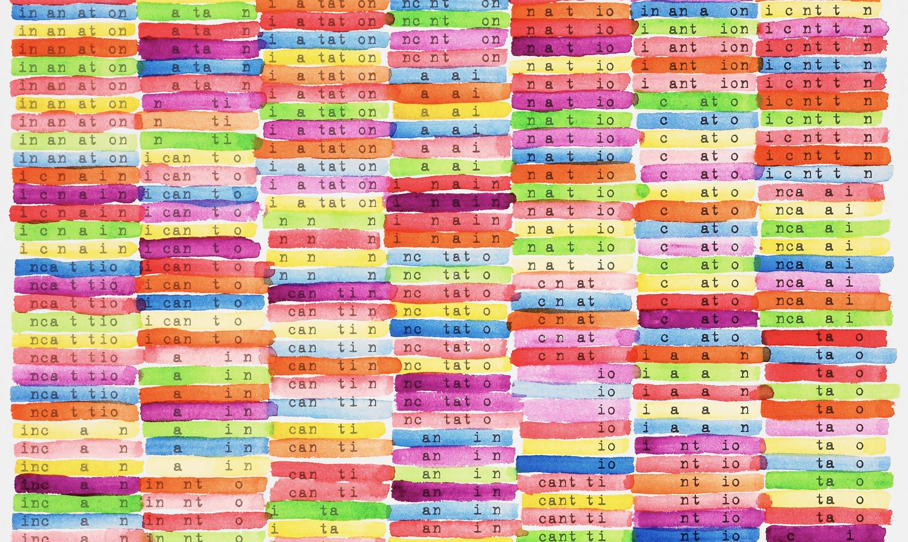

--- 
title: "NLP avec r et en français - un Manuel synthétique"
author: "Sophie Balech et Christophe Benavent et al"
date: "`r Sys.Date()`"
site: bookdown::bookdown_site
output: bookdown::gitbook
documentclass: book
bibliography: [book.bib, packages.bib]
biblio-style: apalike
link-citations: yes
github-repo: rstudio/bookdown-demo
description: " Un manuel pratique de NLP en français"
---

# Préambule


^[Incantation for 6 voices Scott helmes, 2001. [Museum of Minessota](https://medium.com/minneapolis-institute-of-art/painting-a-picture-with-words-a0a3fef3cf63)]


L'eco système r s'est enrichi ces dernière années à grande vitesse dans le domaine du traitement du langage naturel, l'objet de ce manuel a pour but d'en donner une synthèse. 

Sa vocation est pratique même si on y laissera germer quelques considérations plus méthodologiques, voire épistémologiques. On ouvrira cependant chaque fois que c'est possibls aux questions théoriques et éthiques de ces méthodes. Leur réalisation computationnelle est le fruit souvent d'une longue histoire, au cours de laquelle les linguistes ont semé des idées essentielles qu'ont systématisées les informaticiens.

On soignera la bibliographie de manière synthétique pour en faire un état de l'art essentiel et actualisée.

La rédaction de l'ouvrage est mené avec une règle de reproductibilité et de transparence, c'est le pourquoi le choix de ce support et des jeux de données associés. Il sera dynamique, modifié à mesure de nos cours, séminaires, ateliers et observations des lecteurs.

## Cours et séminaires

La liste des cours et séminaires où il sera présenté et utilisé en 2021-2022.

 * Colloque Marketing digital 2-3 septembre 2021 _ "NLP : un panorama"
 * AFM 1er Décembre 2021  : 
 * Ecole doctorale de gestion à la Sorbonne - février 2022, "NLP pour la recherche en gestion"
 * Dauphine master 204 - cours  " Analyse textuelle", Novembre 2021
 * Master Siren - Dauphine - mai 2022
 * Lille Master Data Science


## La structure du livre

L analyse NLP peut être analysée comme un processus qui va de la production jusqu'à la diffusion des analyses. Elle est aussi traversée par des évolutions profondes de méthodes qui ont complexifié au sens formel les modèles initiaux. Ce sont ces techniques que nous introduisons ici. 

Cependant, l'apprentissage automatique appliqué à des milliards de données submerge la statistique. Les modèles de langage distribués par les grands acteurs d gidital, comprennent des dizaines, voir des centaines de milliards de paramètres. On les évoquerons dans les derniers chapîtres.

Le plan suit une logique qui va du simple au très compliqué, et de l'acquisition des données, de leur traitement et leur modélisation, jusqu'à la propagation ...


 * Acquisition des données : directe, api et scrapping
 * Corpus dtm et cooccurence
 * AFC et typologie
 * l'annotation syntaxique et lexicale
 * analyse du sentiment et sa généralisation
 * Word embedness
 * Factorial models
 * Topic analysis
 * ML classique
 * deep learning et transformer
 * méthodes génératives : parce que la prochaine étape c'est quand on appliquera ces méthode sur la productions textuelles des bots.

## Les jeux de données 

Au cours du développement, plusieurs cas pratiques - souvent réduit en volume pour rester exemplaires, seront employés. Les donées seront partagées.

En voici la présentation  systématique.

 * [Trump Twitter Archive](https://www.thetrumparchive.com/) : L'intégralité des tweets de Trump jusqu'à son banissement le 8 Janvier 2021.
 * Confinement Jour J
 * Citations : un recueil de citations littéraires pour de petits exemples et ponctuer le texte aride d'un peu de littérature et de poésie.
 * Trip advisor Polynésie, un extrait d'un corpus établi par Pierre Ghewy et Sebastien de l'UPF
 * Airbnb 
 * Covid
 * PMP
 * David Bowie : comp
 * Appli de fitness
 * Langages / Julien

L'ensemble des codes et données sont disponibles dans le [repositery NLP Book](https://benaventc.github.io/NLPBook/) pour la reproductibilités). Les amendements et améliorations sont souhaitées et attendues. 

## Les ressources

Ce  _livre_ est écrit en **Markdown** [@allaire_rmarkdown_2021] et  avec le package **Bookdown** [@R-bookdown]

Le code s'appuie très largement sur **tidyverse** et emploie largement les ressources de **ggplot** et **dplyr** . On recommande au lecteur de consulter les ouvrages suivants.  Une mention particulière doit être faite sur la question du traitement du texte, **stringr** est aussi un des outils fondamentaux. 

D'autres outils traverserons le manuels. Par exemples pour les tableaux, nous opterons la plus part du temps pour les solution de flextable. 

On supposera que les lecteurs ont une connaissance satisfaisante de ces outils génériques, mais à chaque fois qu'on les introduira, on les expliquera.

 
 * [dplyr]() est essentiel, c'est avec cet outil qu'on construit des pipeline de données. Le maitriser est une garantie d'efficacité.  
 * [stringr](https://stringr.tidyverse.org/articles/stringr.html) est un package ardu. Ils propose une multitude de fonctions pour traiter les chaînes de caractères. Son étude est recommandée de concert avec la connaissance des [regex](https://stringr.tidyverse.org/articles/regular-expressions.html). 
 * quand le temps s'en mêle, lubridate est indispensable. 
 

### Les packages 


Les packages seront introduits au fur et à mesure de leur première utilisation. On le signale par `#library(lib) `. En voici la liste complète.


```{r pack, echo = TRUE, message=FALSE, warning=FALSE}
knitr::opts_chunk$set(echo = TRUE, message=FALSE,warning=FALSE)

#boite à outils et viz
library(tidyverse) # inclut ggplot pour la viz, readr et 
library(readr)

#Vizualisation souvent en développement de ggplot ( inclus dans tidyverse)
library(cowplot) #pour créer des graphiques composés
library(ggridges) # le joy division touch de ggplot
library(pheatmap)
library(flextable)

#networks
library(igraph) #le standard pour les représentations de réseaux
library(ggraph) #un complément compatible ggplot du précédent

# Accéder aux données
library(rtweet)  # une interface efficace pour interroger l'api de Twitter
library(revtools) #acces aux bases bibliographiques
library(rvest) #pour le scrapping

# OCR et pdf
library(tesseract) #reconnaissance de caractère
library(pdftools)

# Analyse de donnée
library(FactoMineR)
library(factoextra)

# NLP
library(tokenizers)
library(quanteda)
library(quanteda.textmodels)
library(quanteda.textplots)
library(quanteda.textstats)
library(udpipe) #annotation syntaxique
library(tidytext) #lda glove et autres
library(cleanNLP) #annotation syntaxique
library(ade4)
library(ExPosition)
library(Biobase)
library(BiocManager)
library(NMF)

##reconnaissance de langue
library(cld3)
library(textcat)

#Analyse du sentiment
library(syuzhet)            

#mise en page des tableaux
library(flextable) # 

#Statistiques et modèles
library(lme4)
library(jtools)
library(interactions)
library("corrplot")

#ML
library(caret)
library(vip)
library(plotROC)
library(MLeval)


#Palettes
library(colorspace) #pour les couleurs
library(viridis)
library(viridisLite)

#utilitaires
library(citr) # un outil interactif pour insérer des références 
library(doParallel)


#Template pour ggplot
theme_set(theme_bw())


```


## Disponibilité

L'ensemble du code est disponible [sur github](https://github.com/BenaventC/NLPBook).

Sous licence creative common

citation. 

